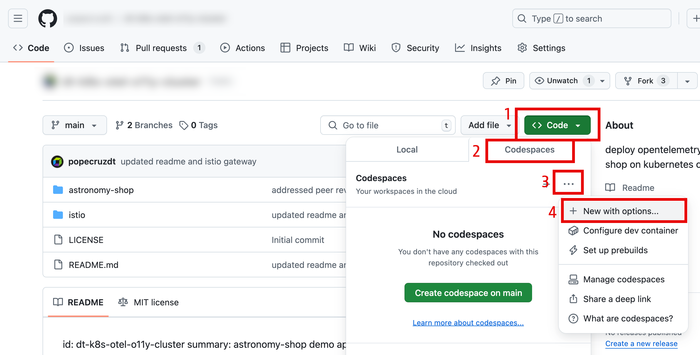
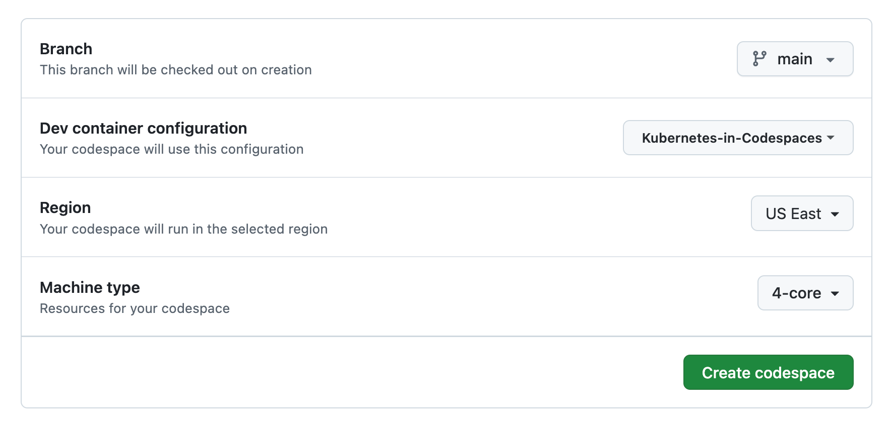
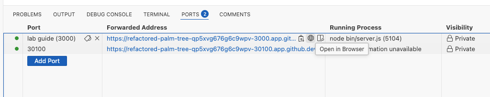
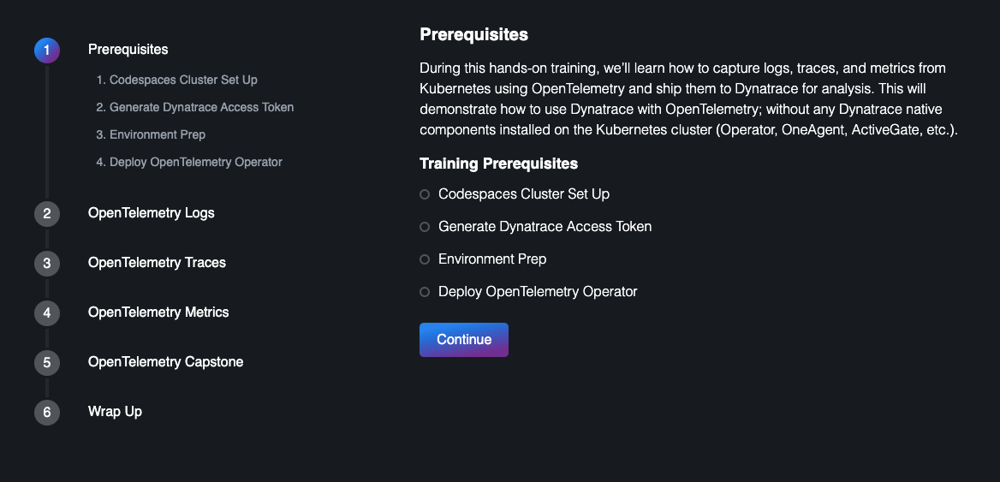

id: enablement-kubernetes-opentelemetry-openpipeline\
summary: opentelemetry log processing with dynatrace openpipeline\
author: Tony Pope-Cruz

# Enablement Kubernetes OpenTelemetry OpenPipeline

During this hands-on training, we’ll learn how to capture logs from Kubernetes using OpenTelemetry and ship them to Dynatrace for analysis.  This will demonstrate how to use Dynatrace with OpenTelemetry; without any Dynatrace native components installed on the Kubernetes cluster (Operator, OneAgent, ActiveGate, etc.).  We'll then utilize Dynatrace OpenPipeline to process OpenTelemetry logs at ingest, in order to make them easier to analyze and leverage.  The OpenTelemetry Collector logs are output mixed JSON/console format, making them difficult to use by default.  With OpenPipeline, the logs will be processed at ingest, to manipulate fields, extract metrics, and raise alert events in case of any issues.

Lab tasks:
1. Ingest Kubernetes logs using OpenTelemetry Collector
1. Deploy OpenTelemetry Collector for logs, traces, and metrics
1. Parse OpenTelemetry Collector logs using DQL in a Notebook, giving you flexibility at query time
1. Parse OpenTelemetry Collector logs at ingest using Dynatrace OpenPipeline, giving you simplicity at query time
1. Query and visualize logs and metrics in Dynatrace using DQL

<!-- -------------------------->
## Technical Specification 
Duration: 2 minutes

#### Technologies Used
- [Dynatrace](https://www.dynatrace.com/trial)
- [Kubernetes Kind](https://kind.sigs.k8s.io/)
  - tested on Kind tag 0.27.0
- [Cert Manager](https://cert-manager.io/) - *prerequisite for OpenTelemetry Operator
  - tested on cert-manager v1.14.4
- [OpenTelemetry Operator](https://opentelemetry.io/docs/platforms/kubernetes/operator/)
  - tested on v0.103.0 (June 2024)
- [OpenTelemetry Collector - Dynatrace Distro](https://docs.dynatrace.com/docs/extend-dynatrace/opentelemetry/collector/deployment)
  - tested on v0.25.0 (March 2025)
- [OpenTelemetry Collector - Contrib Distro](https://github.com/open-telemetry/opentelemetry-collector-contrib/releases/tag/v0.103.0)
  - tested on v0.121.0 (March 2025)
- [OpenTelemetry AstronomyShop Helm Chart](https://opentelemetry.io/docs/platforms/kubernetes/helm/demo/)
  - tested on v0.31.0 (June 2024)

#### Reference Architecture


[OpenTelemetry Astronomy Shop Demo Architecture](https://opentelemetry.io/docs/demo/architecture/)

#### Prerequisites
- GitHub Account
- Dynatrace SaaS environment powered by Grail and AppEngine
  - This lab assumes you have full administrator privileges to your Dynatrace environment, as this is for training

<!-- -------------------------->
## Launching Lab Guide Locally (optional)
Duration: 2 minutes

Install `git` locally [Git](https://git-scm.com/downloads)

Clone the repo:
```sh
git clone https://github.com/dynatrace-wwse/enablement-kubernetes-opentelemetry-openpipeline.git 
```

Install Node if not already installed:
[Download Node.js](https://nodejs.org/en/download/package-manager)

Navigate to the lab-guide directory:
```sh
cd enablement-kubernetes-opentelemetry-openpipeline/lab-guide
```

Generate the lab guide content
```sh
node bin/generator.js
```

Launch the lab guide as a Node.js server. The following command will pipe out the std error and std output and send it to /dev/null in a separate thread and with nohup it is immune to hangups:
```sh
nohup node bin/server.js > /dev/null 2>&1 &
```

The lab guide will be available at http://localhost:3000/

<!-- -------------------------->
## Codespaces Cluster Set Up
Duration: 5 minutes

### Create Codespaces Instance

Navigate to the Github repository `enablement-kubernetes-opentelemetry-openpipeline`.

Click on `Code`.  Click on `Codespaces`.  Click on `New with options`.



Choose the Branch `main`.  Choose the Dev Container Configuration `Kubernetes in Codespaces`.

Choose a Region near your Dynatrace tenant.

Choose Machine Type `4-core`.



Allow the Codespace instance to fully initialize.  It is not ready yet.


The Codespace instance will run the post initialization scripts.


When the Codespace instance is idle, validate the `astronomy-shop` pods are running.

Command:
```sh
kubectl get pods -n astronomy-shop
```


### Store the Base Directory as Variable

The base directory of the repository is needed when navigating the repository during the lab.  Store the base directory in the variable `base_dir` using the `pwd` command.

Command:
```sh
export base_dir=$(pwd)
```

Echo the `base_dir` variable.

Command:
```sh
echo $base_dir
```

Sample Output:
> /workspaces/enablement-kubernetes-opentelemetry-openpipeline

### Launching Lab Guide within Codespaces Instance

Move into the lab-guide directory

Command:
```sh
cd lab-guide
```

Generate the lab guide content

Command:
```sh
node bin/generator.js
```

Launch the lab guide as a Node.js server

Command:
```sh
nohup node bin/server.js > /dev/null 2>&1 &
```

Open the lab guide in your browser from the Codespaces instance exposed ports





Use the lab guide to move through the hands-on exercises.

#### Linux Command Info

Here's a summary of what was just done with Linux commands.

The following command will pipe out the std error and std output and send it to /dev/null in a separate thread and with nohup it is immune to hangups. This frees up your terminal to continue doing other tasks, by running it in the background.

```sh
nohup node bin/server.js > /dev/null 2>&1 &
```

Once finished, if you want to bring the server back to the foreground type:

```sh
❯ jobs
[1]  + running    nohup node bin/server.js > /dev/null 2>&1
```

This will show the jobs running in the background listed with numbers. To bring it back type fg with the index number, like this:

```sh
fg %1
```

Then cancel it with CTRL + C.  This will kill the node server and stop the lab guide.

