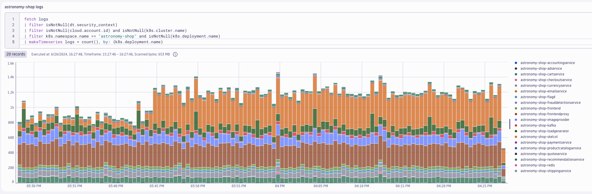
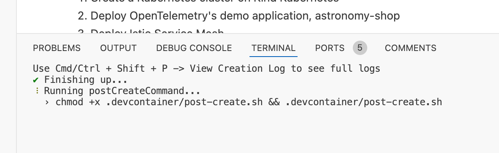
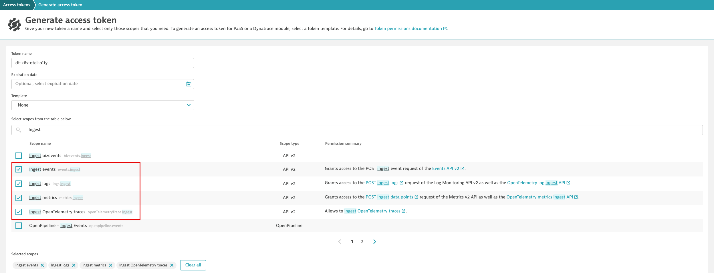
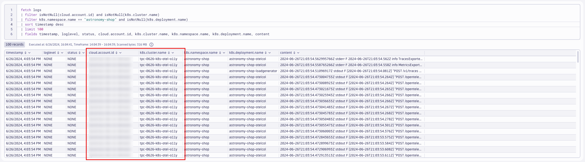
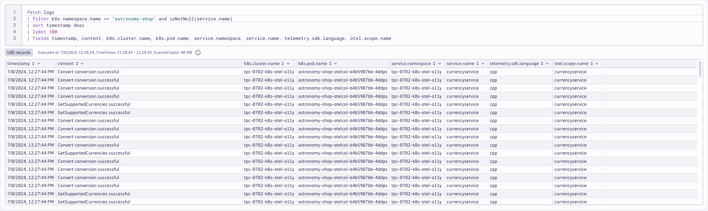

id: dt-k8s-otel-o11y-logs
summary: dynatrace log ingest for kubernetes using opentelemetry collector
author: Tony Pope-Cruz

# Kubernetes Log Ingest with OpenTelemetry & Dynatrace
<!-- ------------------------ -->
## Overview 
Total Duration: 20 minutes

### What You’ll Learn Today
In this lab we'll utilize the OpenTelemetry Collector deployed as a DaemonSet (Node Agent) to collect pod/container logs from a Kubernetes cluster and ship them to Dynatrace.  Additionally, we'll deploy the OpenTelemetry Collector as a Deployment (Gateway) to watch Kubernetes Events from the Cluster and ship them to Dynatrace.

Lab tasks:
1. Deploy OpenTelemetry Collector as a DaemonSet
2. Deploy OpenTelemetry Collector as a Deployment
3. Configure OpenTelemetry Collector service pipeline for log enrichment
4. Query and visualize logs in Dynatrace using DQL



<!-- -------------------------->
## Technical Specification 
Duration: 2

#### Technologies Used
- [Dynatrace](https://www.dynatrace.com/trial)
- [Kind Kubernetes](https://kind.sigs.k8s.io/)
  - tested on Kind v0.24.0
- [OpenTelemetry Demo astronomy-shop](https://opentelemetry.io/docs/demo/)
  - tested on release 1.10.0, helm chart release 0.31.0
- [Istio](https://istio.io/latest/docs/)
  - tested on v1.22.1
- [OpenTelemetry Collector - Dynatrace Distro](https://docs.dynatrace.com/docs/extend-dynatrace/opentelemetry/collector/deployment)
  - tested on v0.8.0
- [OpenTelemetry Collector - Contrib Distro](https://github.com/open-telemetry/opentelemetry-collector-contrib/releases/tag/v0.103.0)
  - tested on v0.103.0

#### Reference Architecture
TODO

#### Prerequisites


<!-- -------------------------->
## Setup
Duration: 18

### Launching Lab Guide Locally

Clone the repo:
```sh
git clone --single-branch --branch code-spaces https://github.com/dynatrace-wwse/enablement-kubernetes-opentelemetry/tree/main/lab-modules/dt-k8s-otel-o11y-logs.git
```

Move into the lab guide directory:
```sh
cd dt-k8s-otel-o11y-logs/lab-guide
```

Run the generator command:
```sh
node bin/generator.js
```

Run the server command:
```sh
node bin/server.js
```

Open the URL in your browser:
```text
http://localhost:3000
```

### Prerequisites

#### Codespaces Cluster Set Up
Create a new instance or use an existing instance of the `dt-k8s-otel-o11y-cluster` Codespaces.

[dt-k8s-otel-o11y-cluster](https://github.com/dynatrace-wwse/enablement-kubernetes-opentelemetry/tree/main/lab-modules/dt-k8s-otel-o11y-cluster/tree/code-spaces)

Navigate to the Github repository.  Click on `Code`.  Click on `Codespaces`.  Click on `New with options`.


Choose the Branch `code-spaces`.  Choose the Dev Container Configuration `Kubernetes in Codespaces`.

Choose a Region near your Dynatrace tenant.

Choose Machine Type `4-core`.


Allow the Codespace instance to fully initialize.  It is not ready yet.


The Codespace instance will run the post initialization scripts.



When the Codespace instance is idle, validate the `astronomy-shop` pods are running.

Command:
```sh
kubectl get pods -n astronomy-shop
```


#### Generate Dynatrace Access Token
Generate a new API access token with the following scopes:
```
Ingest events
Ingest logs
Ingest metrics
Ingest OpenTelemetry traces
```
[See Related Dynatrace API Token Creation Documentation](https://docs.dynatrace.com/docs/dynatrace-api/basics/dynatrace-api-authentication#create-token)


#### Import Notebook into Dynatrace
[Notebook](/dt-k8s-otel-o11y-logs_dt_notebook.json)

#### Define workshop user variables
In your Github Codespaces Terminal:
```
DT_ENDPOINT=https://{your-environment-id}.live.dynatrace.com/api/v2/otlp
DT_API_TOKEN={your-api-token}
NAME=<INITIALS>-k8s-otel-o11y
```

#### Clone the `code-spaces` branch to your Codespaces instance
Command:
```sh
git clone --single-branch --branch code-spaces https://github.com/dynatrace-wwse/enablement-kubernetes-opentelemetry/tree/main/lab-modules/dt-k8s-otel-o11y-logs.git
```

#### Move into the base directory
Command:
```sh
cd dt-k8s-otel-o11y-logs
```

### OpenTelemetry Collector - Dynatrace Distro
https://docs.dynatrace.com/docs/extend-dynatrace/opentelemetry/collector/deployment

#### Create `dynatrace` namespace

The OpenTelemetry Collectors will belong to the `dynatrace` namespace.  Collectors can be run in any namespace, including `default`.

Command:
```sh
kubectl create namespace dynatrace
```
Sample output:
> namespace/dynatrace created

#### Create `dynatrace-otelcol-dt-api-credentials` secret

The secret holds the API endpoint and API token that OpenTelemetry data will be sent to.

Command:
```sh
kubectl create secret generic dynatrace-otelcol-dt-api-credentials --from-literal=DT_ENDPOINT=$DT_ENDPOINT --from-literal=DT_API_TOKEN=$DT_API_TOKEN -n dynatrace
```
Sample output:
> secret/dynatrace-otelcol-dt-api-credentials created

#### Deploy `cert-manager`, pre-requisite for `opentelemetry-operator`
https://cert-manager.io/docs/installation/

The OpenTelemetry Operator cannot be deployed to the cluster without Cert Manager.

Command:
```sh
kubectl apply -f opentelemetry/cert-manager.yaml
```
Sample output:
> namespace/cert-manager created\
> customresourcedefinition.apiextensions.k8s.io/certificaterequests.cert-manager.io created\
> customresourcedefinition.apiextensions.k8s.io/certificates.cert-manager.io created\
> ...\
> validatingwebhookconfiguration.admissionregistration.k8s.io/cert-manager-webhook created

Wait 30-60 seconds for cert-manager to finish initializing before continuing.

#### Deploy `opentelemetry-operator`

The OpenTelemetry Operator will deploy and manage the custom resource `OpenTelemetryCollector` deployed on the cluster.

Command:
```sh
kubectl apply -f opentelemetry/opentelemetry-operator.yaml
```
Sample output:
> namespace/opentelemetry-operator-system created\
> customresourcedefinition.apiextensions.k8s.io/instrumentations.opentelemetry.io created\
> customresourcedefinition.apiextensions.k8s.io/opampbridges.opentelemetry.io created\
> ...\
> validatingwebhookconfiguration.admissionregistration.k8s.io/opentelemetry-operator-validating-webhook-configuration configured

Wait 30-60 seconds for opentelemetry-operator-controller-manager to finish initializing before continuing.

Validate that the OpenTelemetry Operator components are running.

Command:
```sh
kubectl get pods -n opentelemetry-operator-system
```
Sample output:
| NAME                             | READY | STATUS  | RESTARTS | AGE |
|----------------------------------|-------|---------|----------|-----|
| opentelemetry-operator-controller-manager-5d746dbd64-rf9st   | 2/2   | Running | 0        | 1m  |

#### Deploy OpenTelemetry Collector - Dynatrace Distro - Daemonset (Node Agent)
https://docs.dynatrace.com/docs/extend-dynatrace/opentelemetry/collector/deployment#tabgroup--dynatrace-docs--agent

Pod (and container) logs are written to the filesystem of the Node where the pod is running.  Therefore the Collector must be deployed as a Daemonset to read the log files on the local Node.

```yaml
---
apiVersion: opentelemetry.io/v1alpha1
kind: OpenTelemetryCollector
metadata:
  name: dynatrace-logs
  namespace: dynatrace
spec:
  envFrom:
  - secretRef:
      name: dynatrace-otelcol-dt-api-credentials
  mode: "daemonset"
  image: "ghcr.io/dynatrace/dynatrace-otel-collector/dynatrace-otel-collector:latest"
```
Command:
```sh
kubectl apply -f opentelemetry/collector/logs/otel-collector-logs-crd-01.yaml
```
Sample output:
> opentelemetrycollector.opentelemetry.io/dynatrace-logs created

##### Validate running pod(s)
Command:
```sh
kubectl get pods -n dynatrace
```
Sample output:
| NAME                             | READY | STATUS  | RESTARTS | AGE |
|----------------------------------|-------|---------|----------|-----|
| dynatrace-logs-collector-8q8tz   | 1/1   | Running | 0        | 1m  |

##### `filelog` receiver
https://opentelemetry.io/docs/kubernetes/collector/components/#filelog-receiver

The Filelog Receiver tails and parses logs from files. Although it’s not a Kubernetes-specific receiver, it is still the de facto solution for collecting any logs from Kubernetes.  Logs from the Kubernetes Node's filesystem will be read from the Collector running on that Node.  This is why the Collector is deployed as a Daemonset and not a Deployment (or Sidecar).

The Filelog Receiver is composed of Operators that are chained together to process a log. Each Operator performs a simple responsibility, such as parsing a timestamp or JSON. Configuring a Filelog Receiver is not trivial.  Refer to the documentation for details.

```yaml
config: |
    receivers:
      filelog:
        ...
    service:
      pipelines:
        logs:
          receivers: [filelog]
          processors: [batch]
          exporters: [otlphttp/dynatrace]
```

##### Query logs in Dynatrace
DQL:
```sql
fetch logs
| filter isNotNull(log.file.path) and isNotNull(log)
| sort timestamp desc
| limit 100
| fields timestamp, loglevel, status, k8s.namespace.name, k8s.pod.name, k8s.container.name, content, log.file.path
```
Result:\


##### Add Kubernetes Attributes with the `k8sattributes` Processor

The Kubernetes Attributes Processor automatically discovers Kubernetes pods, extracts their metadata, and adds the extracted metadata to spans, metrics, and logs as resource attributes.

The Kubernetes Attributes Processor is one of the most important components for a collector running in Kubernetes. Any collector receiving application data should use it. Because it adds Kubernetes context to your telemetry, the Kubernetes Attributes Processor lets you correlate your application’s traces, metrics, and logs signals with your Kubernetes telemetry, such as pod metrics and traces.

##### Create `clusterrole` with read access to Kubernetes objects

Since the processor uses the Kubernetes API, it needs the correct permission to work correctly. For most use cases, you should give the service account running the collector the following permissions via a ClusterRole.

```yaml
---
apiVersion: rbac.authorization.k8s.io/v1
kind: ClusterRole
metadata:
  name: otel-collector-k8s-clusterrole-logs
rules:
- apiGroups: [""]
  resources: ["pods", "namespaces", "nodes"]
  verbs: ["get", "watch", "list"]
- apiGroups: ["apps"]
  resources: ["replicasets"]
  verbs: ["get", "list", "watch"]
- apiGroups: ["extensions"]
  resources: ["replicasets"]
  verbs: ["get", "list", "watch"]
```
Command:
```sh
kubectl apply -f opentelemetry/rbac/otel-collector-k8s-clusterrole-logs.yaml
```
Sample output:
> clusterrole.rbac.authorization.k8s.io/otel-collector-k8s-clusterrole-logs created

##### Create `clusterrolebinding` for OpenTelemetry Collector service account
```yaml
---
apiVersion: rbac.authorization.k8s.io/v1
kind: ClusterRoleBinding
metadata:
  name: otel-collector-k8s-clusterrole-logs-crb
subjects:
- kind: ServiceAccount
  name: dynatrace-logs-collector
  namespace: dynatrace
roleRef:
  kind: ClusterRole
  name: otel-collector-k8s-clusterrole-logs
  apiGroup: rbac.authorization.k8s.io
```
Command:
```sh
kubectl apply -f opentelemetry/rbac/otel-collector-k8s-clusterrole-logs-crb.yaml
```
Sample output:
> clusterrolebinding.rbac.authorization.k8s.io/otel-collector-k8s-clusterrole-logs-crb created

##### Add `k8sattributes` processor
https://opentelemetry.io/docs/kubernetes/collector/components/#kubernetes-attributes-processor

The `k8sattributes` processor will query metadata from the cluster about the k8s objects.  The Collector will then marry this metadata to the telemetry.

```yaml
k8sattributes:
    auth_type: "serviceAccount"
    passthrough: false
        filter:
        node_from_env_var: KUBE_NODE_NAME
    extract:
        metadata:
            - k8s.namespace.name
            - k8s.deployment.name
            - k8s.daemonset.name
            - k8s.job.name
            - k8s.cronjob.name
            - k8s.replicaset.name
            - k8s.statefulset.name
            - k8s.pod.name
            - k8s.pod.uid
            - k8s.node.name
            - k8s.container.name
            - container.id
            - container.image.name
            - container.image.tag
        labels:
        - tag_name: app.label.component
            key: app.kubernetes.io/component
            from: pod
    pod_association:
        - sources:
            - from: resource_attribute
              name: k8s.pod.uid
        - sources:
            - from: resource_attribute
              name: k8s.pod.name
        - sources:
            - from: resource_attribute
              name: k8s.pod.ip
        - sources:
            - from: connection
```
Command:
```sh
kubectl apply -f opentelemetry/collector/logs/otel-collector-logs-crd-02.yaml
```
Sample output:
> opentelemetrycollector.opentelemetry.io/dynatrace-logs configured

##### Validate running pod(s)
Command:
```sh
kubectl get pods -n dynatrace
```
Sample output:
| NAME                             | READY | STATUS  | RESTARTS | AGE |
|----------------------------------|-------|---------|----------|-----|
| dynatrace-logs-collector-dns4x   | 1/1   | Running | 0        | 1m  |

##### Query logs in Dynatrace
DQL:
```sql
fetch logs
| filter k8s.namespace.name == "astronomy-shop" and isNotNull(k8s.deployment.name)
| sort timestamp desc
| limit 100
| fields timestamp, loglevel, status, k8s.namespace.name, k8s.deployment.name, k8s.pod.name, k8s.container.name, app.label.component, content
```
Result:\


##### Add `resourcedetection` processor (gcp)
https://github.com/open-telemetry/opentelemetry-collector-contrib/blob/main/processor/resourcedetectionprocessor/README.md#gcp-metadata

The resource detection processor can be used to detect resource information from the host, in a format that conforms to the OpenTelemetry resource semantic conventions, and append or override the resource value in telemetry data with this information.  Detectors are available for AWS, Azure, GCP, and several other platforms; see the documentation for more details.

This processor is a great plugin for adding attributes such as `cloud.account.id` and `k8s.cluster.name` to the telemetry.

```yaml
processors:
  resourcedetection/gcp:
    detectors: [env, gcp]
    timeout: 2s
    override: false
```

**note:** for this lab, the Kind cluster does not have cloud metadata to collect.  These values will be spoofed for the purposes of this lab.
```yaml
resource/kind:
  attributes:
  - key: cloud.account.id
    value: dt-k8s-o11y-account
    action: insert
  - key: k8s.cluster.name
    value: dt-k8s-o11y-kind
    action: insert
```

Command:
```sh
kubectl apply -f opentelemetry/collector/logs/otel-collector-logs-crd-03.yaml
```
Sample output:
> opentelemetrycollector.opentelemetry.io/dynatrace-logs configured

##### Validate running pod(s)
Command:
```sh
kubectl get pods -n dynatrace
```
Sample output:
| NAME                             | READY | STATUS  | RESTARTS | AGE |
|----------------------------------|-------|---------|----------|-----|
| dynatrace-logs-collector-fbtk5   | 1/1   | Running | 0        | 1m  |

##### Query logs in Dynatrace
DQL:
```sql
fetch logs
| filter isNotNull(cloud.account.id) and isNotNull(k8s.cluster.name)
| filter k8s.namespace.name == "astronomy-shop" and isNotNull(k8s.deployment.name)
| sort timestamp desc
| limit 100
| fields timestamp, loglevel, status, cloud.account.id, k8s.cluster.name, k8s.namespace.name, k8s.deployment.name, content
```
Result:\

** In a real world scenario, `cloud.account.id` may be considered sensitive data; blurred for this reason.

##### Add `resource` processor (attributes)
https://github.com/open-telemetry/opentelemetry-collector-contrib/tree/main/processor/resourceprocessor

The `resource` processor allows us to directly add, remove, or change resource attributes on the telemetry.  View the documentation for more details.

We will use this processor to make the follow changes to our telemetry:
* `k8s.pod.ip` values in our log data are either the same or invalid; delete the useless attribute
* `telemetry.sdk.name` set to `opentelemetry` will allow us to easily identify logs captured through OpenTelemetry
* `dynatrace.otel.collector` is a non-standardized attribute that we made up to help us identify which Collector captured this data
* `dt.security_context` is a Dynatrace specific attribute that we use to manage user permissions to the telemetry
    * This could also be set using OpenPipeline, but this puts control of this attribute's value at the app/infra layer (optionally)

```yaml
processors:
    resource:
        attributes:
        - key: k8s.pod.ip
          action: delete
        - key: telemetry.sdk.name
          value: opentelemetry
          action: insert
        - key: dynatrace.otel.collector
          value: dynatrace-logs
          action: insert
        - key: dt.security_context
          from_attribute: k8s.cluster.name
          action: insert
```
Command:
```sh
kubectl apply -f opentelemetry/collector/logs/otel-collector-logs-crd-04.yaml
```
Sample output:
> opentelemetrycollector.opentelemetry.io/dynatrace-logs configured

##### Validate running pod(s)
Command:
```sh
kubectl get pods -n dynatrace
```
Sample output:
| NAME                             | READY | STATUS  | RESTARTS | AGE |
|----------------------------------|-------|---------|----------|-----|
| dynatrace-logs-collector-xx6km   | 1/1   | Running | 0        | 1m  |

##### Query logs in Dynatrace
DQL:
```sql
fetch logs
| filter isNotNull(dt.security_context)
| filter isNotNull(cloud.account.id) and isNotNull(k8s.cluster.name)
| filter k8s.namespace.name == "astronomy-shop" and isNotNull(k8s.deployment.name)
| sort timestamp desc
| limit 100
| fields timestamp, loglevel, status, dt.security_context, dynatrace.otel.collector, cloud.account.id, k8s.cluster.name, k8s.namespace.name, k8s.deployment.name, content
```
Result:\


### Export OpenTelemetry data from `astronomy-shop` to OpenTelemetry Collector - Dynatrace Distro

The `astronomy-shop` demo application has the OpenTelemetry agents and SDKs already instrumented.  These agents and SDKs are generating logs (traces and metrics too) that are being exported to a Collector running within the `astronomy-shop` namespace bundled into the application deployment.  We want these logs to be shipped to Dynatrace as well.

##### `otlp` receiver
https://github.com/open-telemetry/opentelemetry-collector/tree/main/receiver/otlpreceiver

Adding the `otlp` receiver allows us to receive telemetry from otel exporters, such as agents and other collectors.
```yaml
config: |
    receivers:
      otlp:
        protocols:
          grpc:
            endpoint: 0.0.0.0:4317
          http:
            endpoint: 0.0.0.0:4318
    service:
      pipelines:
        logs:
          receivers: [otlp]
          processors: [batch]
          exporters: [otlphttp/dynatrace]
```

Command:
```sh
kubectl apply -f opentelemetry/collector/logs/otel-collector-logs-crd-05.yaml
```
Sample output:
> opentelemetrycollector.opentelemetry.io/dynatrace-logs configured

##### Validate running pod(s)
Command:
```sh
kubectl get pods -n dynatrace
```
Sample output:
| NAME                             | READY | STATUS  | RESTARTS | AGE |
|----------------------------------|-------|---------|----------|-----|
| dynatrace-logs-collector-gu0rm   | 1/1   | Running | 0        | 1m  |

#### Customize astronomy-shop helm values

OpenTelemetry data created by agents and SDKs should include `service.name` and `service.namespace` attributes.  We will make the `service.namespace` unique to our deployment using our `NAME` environment variable declared earlier, using a `sed` command on the Helm chart's `values.yaml` file.

```yaml
default:
  # List of environment variables applied to all components
  env:
    - name: OTEL_SERVICE_NAME
      valueFrom:
        fieldRef:
          apiVersion: v1
          fieldPath: "metadata.labels['app.kubernetes.io/component']"
    - name: OTEL_COLLECTOR_NAME
      value: '{{ include "otel-demo.name" . }}-otelcol'
    - name: OTEL_EXPORTER_OTLP_METRICS_TEMPORALITY_PREFERENCE
      value: cumulative
    - name: OTEL_RESOURCE_ATTRIBUTES
      value: 'service.name=$(OTEL_SERVICE_NAME),service.namespace=NAME_TO_REPLACE,service.version={{ .Chart.AppVersion }}'
```
> service.namespace=NAME_TO_REPLACE\
> service.namespace=INITIALS-k8s-otel-o11y

Command:
```sh
sed -i "s,NAME_TO_REPLACE,$NAME," astronomy-shop/collector-values.yaml
```

#### Update `astronomy-shop` OpenTelemetry Collector export endpoint via helm

Our `collector-values.yaml` contains new configurations for the application so that the `astronomy-shop` Collector includes exporters that ship to the Collectors deployed in the `dynatrace` namespace.

```yaml
exporters:
  # Dynatrace OTel Collectors
  otlphttp/dttraces:
    endpoint: http://dynatrace-traces-collector.dynatrace.svc.cluster.local:4318
  otlphttp/dtlogs:
    endpoint: http://dynatrace-logs-collector.dynatrace.svc.cluster.local:4318
  otlphttp/dtmetrics:
    endpoint: http://dynatrace-metrics-cluster-collector.dynatrace.svc.cluster.local:4318
```

Command:
```sh
helm upgrade astronomy-shop open-telemetry/opentelemetry-demo --values astronomy-shop/collector-values.yaml --namespace astronomy-shop --version "0.31.0"
```
Sample output:
> NAME: astronomy-shop\
> LAST DEPLOYED: Thu Jun 27 20:58:38 2024\
> NAMESPACE: astronomy-shop\
> STATUS: deployed\
> REVISION: 2

##### Query logs in Dynatrace
DQL:
```sql
fetch logs
| filter k8s.namespace.name == "astronomy-shop" and isNotNull(service.name)
| sort timestamp desc
| limit 100
| fields timestamp, content, k8s.cluster.name, k8s.pod.name, service.namespace, service.name, telemetry.sdk.language, otel.scope.name
```
Result:\


### Collect Kubernetes Events from Cluster API

The Kubernetes Objects receiver collects, either by pulling or watching, objects from the Kubernetes API server. The most common use case for this receiver is watching Kubernetes events, but it can be used to collect any type of Kubernetes object.

##### Add `k8sobjects` receiver to collect Kubernetes events as logs
https://opentelemetry.io/docs/kubernetes/collector/components/#kubernetes-objects-receiver

Our goal is to capture any events related to the `astronomy-shop` and `dynatrace` namespaces.

```yaml
receivers:
  k8sobjects/events:
    auth_type: serviceAccount
    objects:
      - name: events
        mode: watch
        namespaces: [astronomy-shop,dynatrace]
```

The `k8sobjects` receiver is only available on the Contrib Distro of the OpenTelemetry Collector.  Therefore we must deploy a new Collector using the `contrib` image.

#### Create `clusterrole` with read access to Kubernetes events

Since the processor uses the Kubernetes API, it needs the correct permission to work correctly. Since service accounts are the only authentication option you must give the service account the proper access. For any object you want to collect you need to ensure the name is added to the cluster role. 

```yaml
---
apiVersion: rbac.authorization.k8s.io/v1
kind: ClusterRole
metadata:
  name: otel-collector-k8s-clusterrole-events
rules:
- apiGroups: [""]
  resources: ["events"]
  verbs: ["get", "watch", "list"]
```
Command:
```sh
kubectl apply -f opentelemetry/rbac/otel-collector-k8s-clusterrole-events.yaml
```
Sample output:
> clusterrole.rbac.authorization.k8s.io/otel-collector-k8s-clusterrole-events created

#### Create `clusterrolebinding` for OpenTelemetry Collector service account
```yaml
---
apiVersion: rbac.authorization.k8s.io/v1
kind: ClusterRoleBinding
metadata:
  name: otel-collector-k8s-clusterrole-events-crb
subjects:
- kind: ServiceAccount
  name: dynatrace-events-collector
  namespace: dynatrace
roleRef:
  kind: ClusterRole
  name: otel-collector-k8s-clusterrole-events
  apiGroup: rbac.authorization.k8s.io
```
Command:
```sh
kubectl apply -f opentelemetry/rbac/otel-collector-k8s-clusterrole-events-crb.yaml
```
Sample output:
> clusterrolebinding.rbac.authorization.k8s.io/otel-collector-k8s-clusterrole-events-crb created

#### Deploy OpenTelemetry Collector - Contrib Distro - Deployment (Gateway)
https://github.com/open-telemetry/opentelemetry-operator

Since the receiver gathers telemetry for the cluster as a whole, only one instance of the receiver is needed across the cluster in order to collect all the data.

```yaml
---
apiVersion: opentelemetry.io/v1alpha1
kind: OpenTelemetryCollector
metadata:
  name: dynatrace-events
  namespace: dynatrace
spec:
  envFrom:
  - secretRef:
      name: dynatrace-otelcol-dt-api-credentials
  mode: "deployment"
  image: "otel/opentelemetry-collector-contrib:0.103.0"
```
Command:
```sh
kubectl apply -f opentelemetry/collector/events/otel-collector-events-crd-01.yaml
```
Sample output:
> opentelemetrycollector.opentelemetry.io/dynatrace-events created

##### Validate running pod(s)
Command:
```sh
kubectl get pods -n dynatrace
```
Sample output:
| NAME                             | READY | STATUS  | RESTARTS | AGE |
|----------------------------------|-------|---------|----------|-----|
| dynatrace-events-collector-559d5b9d77-rb26d   | 1/1   | Running | 0        | 1m  |

##### Generate events using deployment scale command
https://kubernetes.io/docs/reference/kubectl/generated/kubectl_scale/

We can generate new Kubernetes events related to the `astronomy-shop` namespace by scaling a deployment up and then scaling it back down.

Command:
```sh
kubectl scale deployment astronomy-shop-imageprovider -n astronomy-shop --replicas=2
```
Sample output:
> deployment.apps/astronomy-shop-imageprovider scaled

Command:
```sh
kubectl scale deployment astronomy-shop-imageprovider -n astronomy-shop --replicas=1
```
Sample output:
> deployment.apps/astronomy-shop-imageprovider scaled

##### Query logs in Dynatrace
DQL:
```sql
fetch logs
| filter dynatrace.otel.collector == "dynatrace-events" and event.domain == "k8s" and k8s.resource.name == "events"
| filter object.metadata.namespace == "astronomy-shop"
| sort timestamp desc
| limit 100
| fields timestamp, k8s.cluster.name, {object.metadata.namespace, alias: k8s.namespace.name}, object.message, object.reason, event.name
```
Result:\


<!-- -------------------------->
## Wrap Up

### What You Learned Today 
By completing this lab, you've successfully deployed the OpenTelemetry Collector to collect logs, enrich log attributes for better context, and ship those logs to Dynatrace for analysis.
- The OpenTelemetry Collector was deployed as a DaemonSet, behaving as an Agent running on each Node
- The Dynatrace Distro of OpenTelemetry Collector includes supported modules needed to ship logs to Dynatrace
  - The `filelog` receiver scrapes logs from the Node filesystem and parses the contents
  - The `otlp` receiver receives logs that are exported from agents, SDKs, and other Collectors
  - The `k8sattributes` processor enriches the logs with Kubernetes attributes
  - The `resourcedetection` processor enriches the logs with cloud and cluster attributes
  - The `resource` processor enriches the logs with custom (resource) attributes
- The Community Contrib Distro of OpenTelemetry Collector includes modules needed to ship events to Dynatrace
  - The `k8sobjects` receiver watches for Kubernetes events (and other resources) on the cluster
- Dynatrace DQL (via Notebooks) allows you to perform powerful queries and analysis of the log data

<!-- ------------------------ -->
### Supplemental Material
N/A
