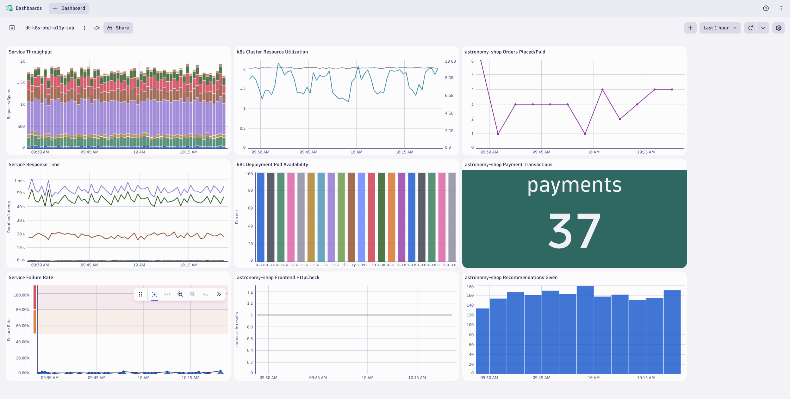

--8<-- "snippets/send-bizevent/3-codespaces.js"

## Create Codespace

Click to open Codespaces for this lab repository:

[](https://codespaces.new/dynatrace-wwse/enablement-kubernetes-opentelemetry-openpipeline){target="_blank"}

!!! tip "Codespace Configuration"
    - Branch
        - select the **main** branch
    - Dev container configuration
        - select **Enablement on codespaces template**
    - Machine type
        - select **4-core**
    - Region
        - select any region, preferably one closest to your Dynatrace tenant

### Wait for Codespace
We know your time is very valuable. This codespace takes around 7-10 minutes to be fully operational. A local Kubernetes ([kind](https://kind.sigs.k8s.io/){target="_blank"}) cluster monitored by Dynatrace will be configured and in it a sample application, Astronomy Shop, will be deployed. To make your experience better, we are also installing and configuring tools like:

**k9s kubectl helm node jq python3 gh**

## Explore Codespace (optional)

Your Codespace has now deployed the following resources:

- A local Kubernetes ([kind](https://kind.sigs.k8s.io/){target="_blank"}) cluster monitored by Dynatrace, with some pre-deployed apps that will be used later in the demo.

- After a couple of minutes, you'll see this screen in your codespaces terminal. It contains the links to the locally exposed labguide and the UI of the application which we will be doing our hands-on training with.

Sample output:


### Tips & Tricks

We want to boost your learning and try to make your experience as smooth as possible with Dynatrace trainings. Your Codespaces have a couple of convenience features added. 

### Show the greeting
In the terminal, there are functions loaded for your convenience. By creating a new Terminal the Greeting will be shown that includes the links to the exposed apps, the Github  pages, the Github Repository, the Dynatrace Tenant that is bound to this devcontainer and some of the tools installed.

You can create a new Terminal directly in VSCode, type `zsh` or call the function `printGreeting` and that will print the greeting with the most relevant information.

### Navigating in your local Kubernetes
The client `kubectl` and `k9s`are configured so you can navigate in your local Kubernetes like butter. 


### Exposing the apps to the public
The apps MKdocs and Astronomy Shop are being exposed in the devcontainer to your localhost. If you want to make the endpoints public accesible, just go to the ports section in VsCode, right click on them and change the visibility to public.

## Troubleshooting

### Astronomy Shop

If you encounter problems with the Astronomy Shop app deployed in the `astronomy-shop` namespace, recycle the pods and expose the app.

Recycle pods:
```sh
kubectl delete pods -n astronomy-shop --field-selector="status.phase=Running"
```

Expose app:
```sh
exposeAstronomyShop
```

## OpenTelemetry Capstone

!!! tip "Capstone Module"
    What is a **Capstone**? A hands-on, culminating learning experience where participants apply the knowledge and skills they've gained throughout a course or program to solve a real-world problem, create a project, or present a comprehensive solution.

In this module we'll utilize multiple OpenTelemetry Collectors to collect application traces/spans, log records, and metric data points generated by OpenTelemetry, from a Kubernetes cluster and ship them to Dynatrace.  This is a capstone lab that utilizes the concepts of the previous Kubernetes OpenTelemetry labs.

**Goals:**

1. Deploy 4 OpenTelemetry Collectors
2. Configure OpenTelemetry Collector service pipeline for data enrichment
3. Analyze metrics, traces, and logs in Dynatrace

Define workshop user variables

!!! tip "Sprint Environment"
    Are you using a Sprint environment for your Dynatrace tenant?  If so, then use `export DT_ENDPOINT=https://{your-environment-id}.sprint.dynatracelabs.com/api/v2/otlp` instead of the `live` version below.

In your Github Codespaces Terminal:
```
export DT_ENDPOINT=https://{your-environment-id}.live.dynatrace.com/api/v2/otlp
export DT_API_TOKEN={your-api-token}
export NAME=<INITIALS>-k8s-otel-o11y
```

Move into the lab module directory

Command:

```sh
cd $BASE_DIR/lab-modules/opentelemetry-capstone
```

Deploy OpenTelemetry Capstone

Command:

```sh
deployOpenTelemetryCapstone
```

Validate the OpenTelemetry data using the Astronomy Shop Dashboard.



[Download astronomy-shop Dashboard](https://github.com/dynatrace-wwse/enablement-kubernetes-opentelemetry-openpipeline/blob/main/lab-modules/opentelemetry-capstone/opentelemetry-cap_dt_dashboard.json){target=_blank}

## Continue

<div class="grid cards" markdown>
- [Continue to Dynatrace Buckets:octicons-arrow-right-24:](4-dynatrace-buckets.md)
</div>
