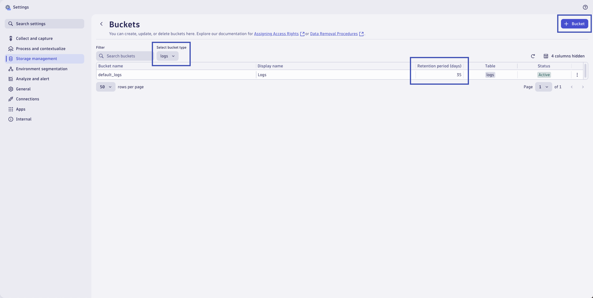
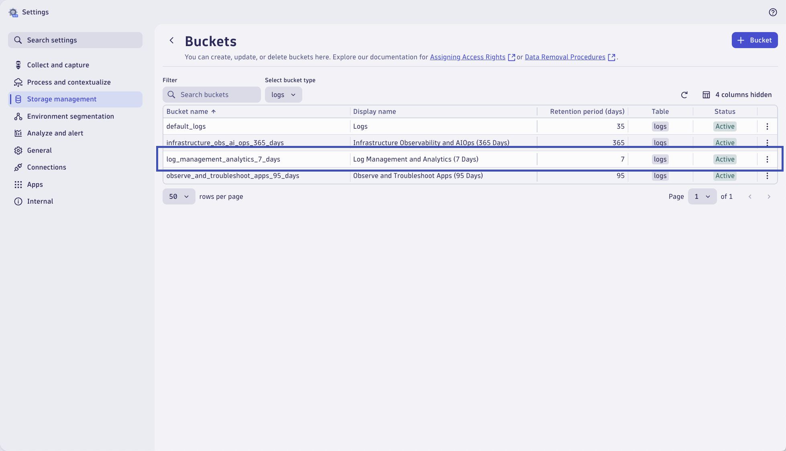

# Dynatrace Buckets (Storage Management)
--8<-- "snippets/send-bizevent/6-dynatrace-buckets.js"

In this module we'll create Grail storage Buckets to manage log data.  By default, all logs are stored in a default logs bucket in Grail - that retains log data for 35 days.  We can create custom buckets with different retention periods to solve for our log management and analytics use cases.

You can create a bucket tailored to your needs. Grail buckets behave like folders in a file system and are designed for records that should be handled together. For example, you might need to store together:

* Data with the same retention period
* Data that needs to be queried/analyzed together
* Data that needs to be deleted at the same time

Defining buckets can improve query performance by reducing query execution time and the scope of data read. Finally, having your data stored in a bucket streamlines your permission management because you can easily provide a user group or single users with access to needed data.

<div class="grid cards" markdown>
- [Learn More:octicons-arrow-right-24:](https://docs.dynatrace.com/docs/discover-dynatrace/platform/grail/data-model#custom-grail-buckets){target=_blank}
</div>

**Goals:**

1. View existing buckets within Grail storage management
2. Create new custom buckets for log data

## View Buckets

In your Dynatrace tenant, use the **Search** function (`cmd + k` / `ctrl + k`) and search for `bucket`.  Click to open `Bucket storage management` under the **Settings** category.


This will open the `Settings` app and the **Buckets** list under the **Storage management** menu.  Here you can view all existing buckets, including the default buckets and custom buckets.  Each bucket has a retention period (in days) and belongs to a specific table, where the table is a specific data type.


Change the `Select bucket type` dropdown to filter on `logs` buckets only.  Locate the `default_logs` bucket and notice the retention period of **35 days**.  By default, all logs are stored in this bucket and will be retained for 35 days.



## Create Buckets

### 95 Day Retention

Click on the `+ Bucket` button to add a new bucket.  This bucket will store the application logs we want to retain for a longer duration, 95 days.

Configure the new bucket as follows:

Bucket name:
```text
observe_and_troubleshoot_apps_95_days
```

Display name:
```text
Observe and Troubleshoot Apps (95 Days)
```

Retention period (in days):
```text
95
```

Bucket table type:
```text
logs
```

Click on `Create` to add the new bucket.


!!! tip "Logs License Model"
    If your DPS subscription includes both [logs license models](https://docs.dynatrace.com/docs/license/log-management){target=_blank} (Usage based and Retain with Included Queries) you will have the option to configure which license model will be used by logs queried from this bucket.  For this lab module, select **Usage based**.
    

It will take a minute or two for the new bucket to be generated.  Refresh the page until the bucket **Status** is `Active`.


Creating a new bucket has no effect on data storage in Grail.  Logs will continue to be stored in the existing buckets, including the default bucket.  We will use Dynatrace OpenPipeline in upcoming lab modules to assign log data to the new bucket.

### 365 Day Retention

Click on the `+ Bucket` button to add a new bucket.  This bucket will store the infrastructure logs that we are required to keep (theoretically) for an entire year.

Configure the new bucket as follows:

Bucket name:
```text
infrastructure_obs_ai_ops_365_days
```

Display name:
```text
Infrastructure Observability and AIOps (365 Days)
```

Retention period (in days):
```text
365
```

Bucket table type:
```text
logs
```

Click on `Create` to add the new bucket.


It will take a minute or two for the new bucket to be generated.  Refresh the page until the bucket **Status** is `Active`.


Creating a new bucket has no effect on data storage in Grail.  Logs will continue to be stored in the existing buckets, including the default bucket.  We will use Dynatrace OpenPipeline in upcoming lab modules to assign log data to the new bucket.

### 7 Day Retention

Click on the `+ Bucket` button to add a new bucket.  This bucket will store the various logs that we don't need to keep very long and can purge after a week.

Configure the new bucket as follows:

Bucket name:
```text
log_management_analytics_7_days
```

Display name:
```text
Log Management and Analytics (7 Days)
```

Retention period (in days):
```text
7
```

Bucket table type:
```text
logs
```

Click on `Create` to add the new bucket.


It will take a minute or two for the new bucket to be generated.  Refresh the page until the bucket **Status** is `Active`.



Creating a new bucket has no effect on data storage in Grail.  Logs will continue to be stored in the existing buckets, including the default bucket.  We will use Dynatrace OpenPipeline in upcoming lab modules to assign log data to the new bucket.

## Wrap Up

**What You Learned Today**

By completing this module, you've successfully created custom buckets for Grail storage management.

- Custom Logs Buckets
    * Logs for the `Observe and Troubleshoot Apps` use case, retained for **95 Days**
    * Logs for the `Infrastructure Observability and AIOps` use case, retained for **365 Days**
    * Logs for the `Log Management and Analytics` use case, retained for **7 Days**

These retention periods were chosen arbitrarily for this lab, your retention periods in the real-world will vary.

## Continue

<div class="grid cards" markdown>
- [Continue to Configuring OpenPipeline for Astronomy Shop logs:octicons-arrow-right-24:](5-dynatrace-openpipeline-astronomy-shop-logs.md)
</div>