# Dynatrace OpenPipeline - Astronomy Shop Logs
--8<-- "snippets/send-bizevent/7-dynatrace-openpipeline-astronomy-shop-logs.js"

In this module we'll utilize Dynatrace OpenPipeline to process `astronomy-shop` application logs at ingest, in order to make them easier to analyze and leverage.  The logs will be ingested by OpenTelemetry Collector, deployed on Kubernetes as part of the previous module.  With OpenPipeline, the logs will be processed at ingest, to manipulate fields, extract metrics, and raise alert events in case of any issues.

The OpenTelemetry Collector deployed as a Daemonset is collecting Pod logs from the Node's filesystem and shipping them to Dynatrace.  The application Pods from the Astronomy Shop application have been instrumented with the OpenTelemetry SDK.  The OpenTelemetry SDK is configured to ship logs (,traces, and metrics) to Dynatrace via the OpenTelemetry Collector deployed as a Deployment (Gateway).  Due to the differences in how these logs are collected, they do not contain the same metadata.  While these logs contain a lot of useful information, they are missing valuable fields/attributes that will make them easier to analyze in context.  These logs can be enriched at ingest, using OpenPipeline.  Additionally, OpenPipeline allows us to process fields, extract new data types, manage permissions, and modify storage retention.

**Goals:**

* Add OpenTelemetry service name and namespace
* Enrich SDK logs with additional Kubernetes metadata
* Apply Dynatrace technology bundle (Java)
* Extract data: Payment transaction business event
* Extract metrics: Payment transaction amount
* Storage retention with bucket assignment


OpenPipeline is an architectural component of Dynatrace SaaS.  It resides between the Dynatrace SaaS tenant and [Grail](https://docs.dynatrace.com/docs/discover-dynatrace/platform/grail/dynatrace-grail) data lakehouse.  Logs (,traces, metrics, events, and more) are sent to the Dynatrace SaaS tenant and route through OpenPipeline where they are enriched, transformed, and contextualized prior to being stored in Grail.

<div class="grid cards" markdown>
- [Learn More:octicons-arrow-right-24:](https://docs.dynatrace.com/docs/discover-dynatrace/platform/openpipeline/concepts/data-flow){target=_blank}
</div>

## Query Logs

Query and discover the Astronomy Shop logs as they are ingested and stored in Dynatrace.  Use Dynatrace Query Language (DQL) to transform the logs at query time and prepare for Dynatrace OpenPipeline configuration.

**Import Notebook into Dynatrace**

[Download Astronomy Shop Logs Notebook](https://github.com/dynatrace-wwse/enablement-kubernetes-opentelemetry-openpipeline/blob/main/assets/dynatrace/notebooks/astronomy-shop-logs.json){target=_blank}

**Astronomy Shop Logs - Ondemand Processing at Query Time (Notebook)**

In OpenTelemetry, `service.name` and `service.namespace` are used to provide meaningful context about the services generating telemetry data:

`service.name`: This is the logical name of the service. It should be the same for all instances of a horizontally scaled service. For example, if you have a shopping cart service, you might name it shoppingcart.

`service.namespace`: This is used to group related services together. It helps distinguish a group of services that logically belong to the same system or team. For example, you might use Shop as the namespace for all services related to an online store.

These attributes help in organizing and identifying telemetry data, making it easier to monitor and troubleshoot services within a complex system.

The logs originating from the OpenTelemetry SDK contain both the `service.name` and `service.namespace`.  However, the Pod logs which contain stdout and stderr messages from the containers - do not.  In order to make it easier to analyze the log files and unify the telemetry, the `service.name` and `service.namespace` attributes should be added to the Pod logs with Dynatrace OpenPipeline.

### OpenTelemetry Service Name

Query the `astronomy-shop` logs filtered on `isNull(service.name)`.

DQL: Before OpenPipeline and DQL Transformation
```sql
fetch logs
| filter matchesValue(k8s.namespace.name,"astronomy-shop") and matchesValue(telemetry.sdk.name,"opentelemetry")
| filter isNull(service.name) and isNotNull(app.label.component) and matchesValue(k8s.namespace.name,"astronomy-shop")
| filterOut matchesValue(k8s.container.name,"istio-proxy")
| sort timestamp desc
| limit 25
| fields timestamp, k8s.namespace.name, k8s.deployment.name, k8s.container.name, app.label.component, service.name, service.namespace
```

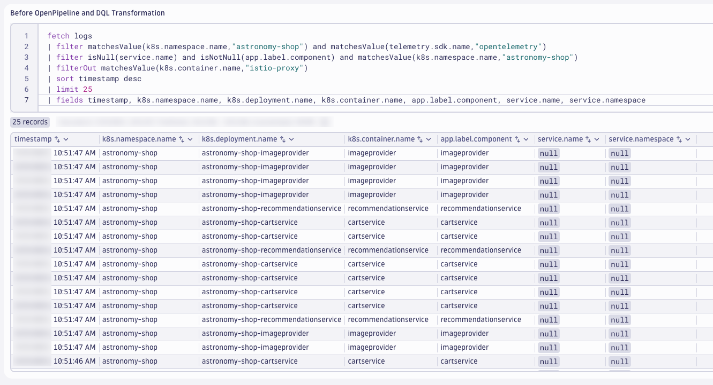

The value for `service.name` can be obtained from multiple different fields, but based on the application configuration - it is best to use the value from `app.label.component`.

Use DQL to transform the logs and apply the `service.name` value.

DQL: After DQL Transformation
```sql
fetch logs
| filter matchesValue(k8s.namespace.name,"astronomy-shop") and matchesValue(telemetry.sdk.name,"opentelemetry")
| filter isNotNull(app.label.component) and matchesValue(k8s.namespace.name,"astronomy-shop")
| filterOut matchesValue(k8s.container.name,"istio-proxy")
| sort timestamp desc
| limit 25
| fieldsAdd service.name = app.label.component
| fields timestamp, k8s.namespace.name, k8s.deployment.name, k8s.container.name, app.label.component, service.name, service.namespace
```

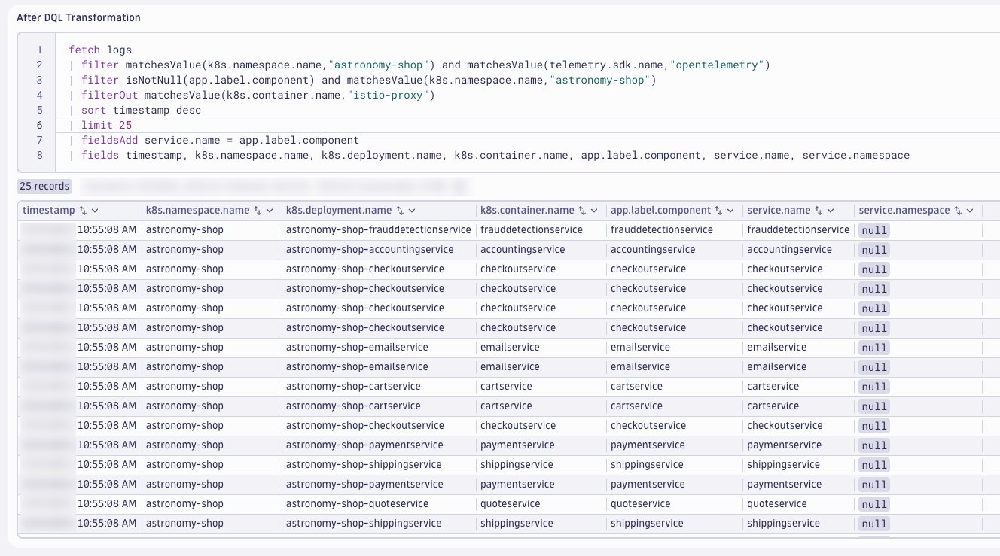

This modifies the log attributes at query time and helps us identify the processing rules for Dynatrace OpenPipeline.  We'll validate the results after OpenPipeline, later.

### OpenTelemetry Service Namespace

Query the `astronomy-shop` logs filtered on `isNull(service.namespace)`.

DQL: Before OpenPipeline and DQL Transformation
```sql
fetch logs
| filter isNull(service.namespace) and isNull(service.name) and isNotNull(app.annotation.service.namespace) and matchesValue(k8s.namespace.name,"astronomy-shop")
| filterOut matchesValue(k8s.container.name,"istio-proxy")
| sort timestamp desc
| limit 25
| fieldsAdd service.name = app.label.component
| fields timestamp, k8s.namespace.name, k8s.deployment.name, k8s.container.name, app.label.component, app.annotation.service.namespace, service.name, service.namespace
```

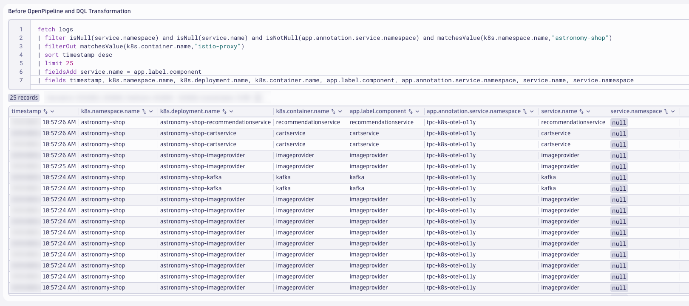

The Pods have been annotated with the service namespace.  The `k8sattributes` processor has been configured to add this annotation as an attribute, called `app.annotation.service.namespace`.  This field can be used to populate the `service.namespace`.

Use DQL to transform the logs and apply the `service.namespace` value.

DQL: After DQL Transformation
```sql
fetch logs
| filter isNull(service.namespace) and isNull(service.name) and isNotNull(app.annotation.service.namespace) and matchesValue(k8s.namespace.name,"astronomy-shop")
| filterOut matchesValue(k8s.container.name,"istio-proxy")
| sort timestamp desc
| limit 25
| fieldsAdd service.name = app.label.component
| fieldsAdd service.namespace = app.annotation.service.namespace
| fields timestamp, k8s.namespace.name, k8s.deployment.name, k8s.container.name, app.label.component, app.annotation.service.namespace, service.name, service.namespace
```

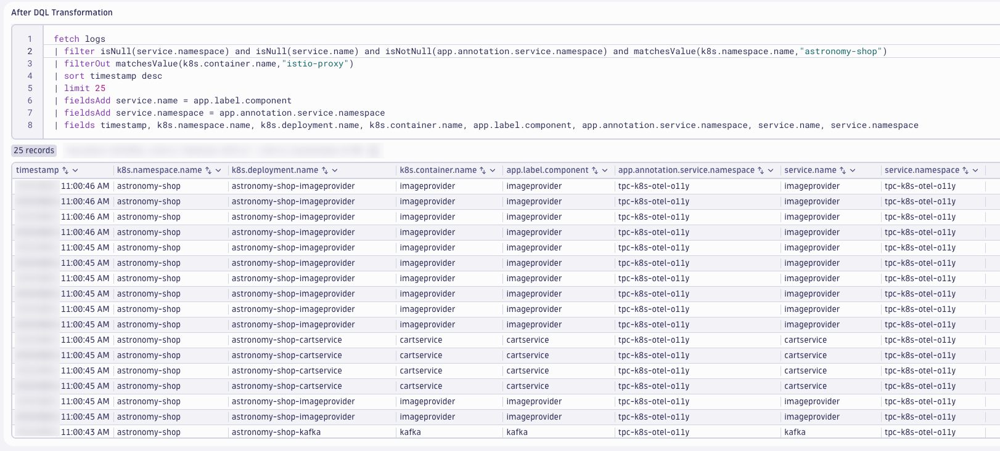

This modifies the log attributes at query time and helps us identify the processing rules for Dynatrace OpenPipeline.  We'll validate the results after OpenPipeline, later.

### OpenTelemetry SDK Logs

The logs generated and exported by the OpenTelemetry SDK are missing Kubernetes attributes, or in some cases have the wrong values set.  The OpenTelemetry SDK, unless specifically configured otherwise, is not aware of the Kubernetes context in which of the application runs.  As a result, when the OpenTelemetry Collector that's embedded in `astronomy-shop` sends the logs to the Dynatrace OpenTelemetry Collector via OTLP, the Kubernetes attributes are populated with the Kubernetes context of the `astronomy-shop-otelcol` workload.  This makes these attributes unreliable when analyzing logs.  In order to make it easier to analyze the log files and unify the telemetry, the Kubernetes attributes should be correct for the SDK logs with Dynatrace OpenPipeline.

Query the `astronomy-shop` logs filtered on `telemetry.sdk.language` and `astronomy-shop-otelcol`.

DQL: Before OpenPipeline and DQL Transformation
```sql
fetch logs
| filter isNotNull(telemetry.sdk.language) and matchesValue(k8s.deployment.name,"astronomy-shop-otelcol") and isNotNull(service.name) and matchesValue(k8s.namespace.name,"astronomy-shop")
| sort timestamp desc
| limit 25
| fields timestamp, service.name, telemetry.sdk.language, k8s.namespace.name, k8s.deployment.name, k8s.pod.name, k8s.pod.uid, k8s.replicaset.name, k8s.node.name
```

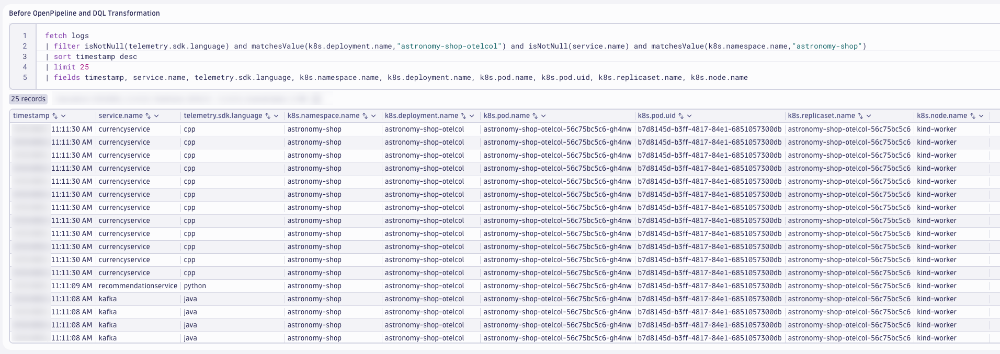

!!! warning "Potentially Resolved"
    It is possible that in your environment this mapping of log data to the `astronomy-shop-otelcol` deployment is resolved.  If that is the case, then the query will not return any results.  **That is OK**.  We will still build out the OpenPipeline solution.

The `k8s.namespace.name` is correct, however the `k8s.deployment.name`, `k8s.pod.name`, `k8s.pod.uid`, `k8s.replicaset.name`, and `k8s.node.name` are incorrect.  Since the `k8s.deployment.name` is based on the `service.name`, this field can be used to correct the `k8s.deployment.name` value.  The other values can be set to `null` in order to avoid confusion with the `astronomy-shop-otelcol` workload.

Use DQL to transform the logs and set the `k8s.deployment.name` value while clearing the other fields.

DQL: After DQL Transformation
```sql
fetch logs
| filter isNotNull(telemetry.sdk.language) and matchesValue(k8s.deployment.name,"astronomy-shop-otelcol") and isNotNull(service.name) and matchesValue(k8s.namespace.name,"astronomy-shop")
| sort timestamp desc
| limit 25
| fieldsAdd k8s.deployment.name = concat("astronomy-shop-",service.name)
| fieldsAdd k8s.container.name = service.name
| fieldsAdd app.label.name = concat("astronomy-shop-",service.name)
| fieldsAdd app.label.component = service.name
| fieldsRemove k8s.pod.name, k8s.pod.uid, k8s.replicaset.name, k8s.node.name
| fields timestamp, service.name, telemetry.sdk.language, k8s.namespace.name, k8s.deployment.name, k8s.container.name, app.label.name, app.label.component
```

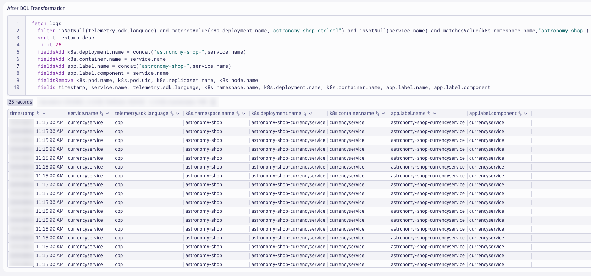

This modifies the log attributes at query time and helps us identify the processing rules for Dynatrace OpenPipeline.  We'll validate the results after OpenPipeline, later.

### Java Technology Bundle

Many applications written in a specific programming language will utilize known logging frameworks that have standard patterns, fields, and syntax for log messages.  For Java, these include frameworks such as Log4j, Logback, java.util.logging, etc.  Dynatrace OpenPipeline has a wide variety of Technology Processor Bundles, which can be easily added to a Pipeline to help format, clean up, and optimize logs for analysis.

The Java technology processor bundle can be applied to the `astronomy-shop` logs that we know are originating from Java applications.

Query the `astronomy-shop` logs filtered on `telemetry.sdk.language` or the `astronomy-shop-adservice` Java app.

DQL: Before OpenPipeline and DQL Transformation
```sql
fetch logs
| filter (matchesValue(telemetry.sdk.language,"java", caseSensitive: false) or matchesValue(k8s.deployment.name,"astronomy-shop-adservice", caseSensitive:false)) and matchesValue(k8s.namespace.name,"astronomy-shop")
| filter matchesValue(k8s.deployment.name,"astronomy-shop-adservice", caseSensitive:false) or matchesValue(k8s.deployment.name,"astronomy-shop-kafka", caseSensitive:false)
| sort timestamp desc
| limit 15
| append [fetch logs
          | filter matchesValue(telemetry.sdk.language,"java", caseSensitive: false)
          | fieldsAdd k8s.deployment.name = concat(k8s.namespace.name,"-",service.name)
          | sort timestamp desc
          | limit 15]
| sort timestamp desc
| fields timestamp, k8s.namespace.name, k8s.deployment.name, telemetry.sdk.language, content
```


These are the logs that will be modified using the Java technology processor bundle within OpenPipeline.  We'll validate the results after OpenPipeline, later.

### PaymentService Transactions

Most (if not all) applications and microservices drive business processes and outcomes.  Details about the execution of these business processes is often written out to the logs by the application.  Dynatrace OpenPipeline is able to extract this business-relevant information as a business event (bizevent).

[Log to Business Event Documentation](https://docs.dynatrace.com/docs/shortlink/ba-business-events-capturing#logs){target=_blank}

DQL is fast and powerful, allowing us to query log files and summarize the data to generate timeseries for dashboards, alerts, AI-driven forecasting and more.  While it's handy to generate timeseries metric data from logs when we didn't know we would need it, it's better to generate timeseries metric data from logs at ingest for the use cases that we know ahead of time.  Dynatrace OpenPipeline is able to extract metric data from logs on ingest.

[Log to Metric Documentation](https://docs.dynatrace.com/docs/shortlink/openpipeline-log-processing){target=_blank}

The `paymentservice` component of `astronomy-shop` generates a log record every time it processes a payment transaction successfully.  This information is nested within a `JSON` structured log record, including the transactionId, amount, cardType, and currencyCode.  By parsing these relevant logs for the fields we need, Dynatrace OpenPipeline can be used to generate a payment transaction business event and a payment transaction amount metric on log record ingest.

Query the `astronomy-shop` logs filtered on the `paymentservice` logs with a `trace_id` attribute.

DQL: Before OpenPipeline and DQL Transformation
```sql
fetch logs
| filter matchesValue(k8s.namespace.name,"astronomy-shop") and matchesValue(k8s.container.name,"paymentservice") and isNotNull(trace_id)
| sort timestamp desc
| limit 25
| fields timestamp, content, k8s.container.name, trace_id
```

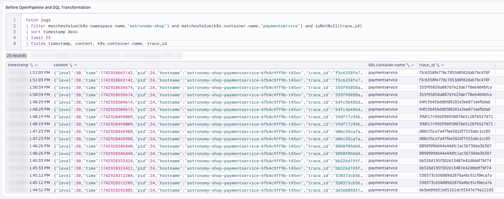

The `content` field is structured `JSON`.  The parse command can be used to parse the JSON content and add the fields we need for our use case.

```json
{
  "level": "30",
  "time": "1742928663142",
  "pid": "24",
  "hostname": "astronomy-shop-paymentservice-6fb4c9ff9b-t45xn",
  "trace_id": "f3c6358fe776c7053d0fd2dab7bc470f",
  "span_id": "880430306f41a648",
  "trace_flags": "01",
  "transactionId": "c54b6b4c-ebf1-4191-af21-5f583d0d0c87",
  "cardType": "visa",
  "lastFourDigits": "5647",
  "amount": {
    "units": {
      "low": "37548",
      "high": "0",
      "unsigned": false
    },
    "nanos": "749999995",
    "currencyCode": "USD"
  },
  "msg": "Transaction complete."
}
```

Use DQL to transform the logs and parse the payment fields from the JSON content.

DQL: After DQL Transformation
```sql
fetch logs
| filter matchesValue(k8s.namespace.name,"astronomy-shop") and matchesValue(k8s.container.name,"paymentservice") and isNotNull(trace_id)
| sort timestamp desc
| limit 25
| fields timestamp, content, k8s.container.name, trace_id
| parse content, "JSON:json_content"
| fieldsAdd app.payment.msg = json_content[`msg`]
| filter app.payment.msg == "Transaction complete."
| fieldsAdd app.payment.cardType = json_content[`cardType`]
| fieldsAdd app.payment.amount = json_content[`amount`][`units`][`low`]
| fieldsAdd app.payment.currencyCode = json_content[`amount`][`currencyCode`]
| fieldsAdd app.payment.transactionId = json_content[`transactionId`]
| fieldsRemove json_content
```


This modifies the log attributes at query time and helps us identify the processing rules for Dynatrace OpenPipeline.  We'll validate the results after OpenPipeline, *next*.

## Configure OpenPipeline

Configure Dynatrace OpenPipeline for Astronomy Shop logs.

!!! tip "View Images"
    If the images are too small and the text is difficult to read, right-click and open the image in a new tab.

!!! tip "Save Often"
    Consider saving your pipeline configuration often to avoid losing any changes.

In your Dynatrace tenant, launch the (new) `Settings` app.  From the `Process and contextualize` menu, click on `OpenPipeline`.

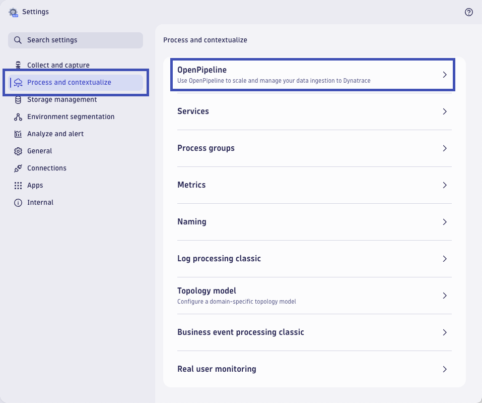

!!! tip "OpenPipeline App"
    Depending on your Dynatrace tenant version, you may need to use the **OpenPipeline** app instead.

Begin by selecting `Logs` from the menu of telemetry types.  Then choose `Pipelines`.  Click on `+ Pipeline` to add a new pipeline.


Name the new pipeline, `Astronomy Shop OpenTelemetry Logs`.  Click on the `Processing` tab to begin adding `Processor` rules.

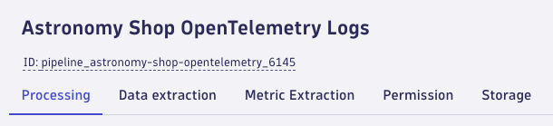

### OpenTelemetry Service Name

Add a processor to set the OpenTelemetry Service Name.  Click on `+ Processor` to add a new processor.

Type:
```text
DQL
```

Name:
```text
OpenTelemetry Service Name
```

Matching condition:
```text
isNull(service.name) and isNotNull(app.label.component) and matchesValue(k8s.namespace.name,"astronomy-shop")
```

Processor definition:
```text
fieldsAdd service.name = app.label.component
```


### OpenTelemetry Service Namespace

Add a processor to set the OpenTelemetry Service Namespace.  Click on `+ Processor` to add a new processor.

Type:
```text
DQL
```

Name:
```text
OpenTelemetry Service Namespace
```

Matching condition:
```text
isNull(service.namespace) and isNotNull(service.name) and isNotNull(app.annotation.service.namespace) and matchesValue(k8s.namespace.name,"astronomy-shop")
```

Processor definition:
```text
fieldsAdd service.namespace = app.annotation.service.namespace
```

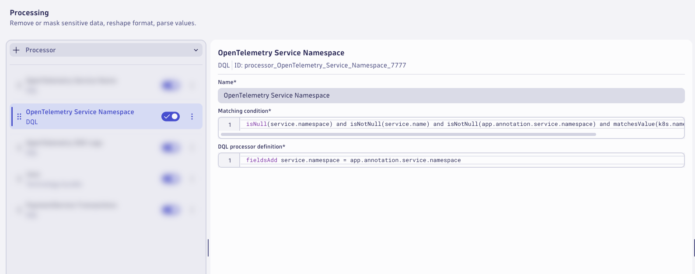

### OpenTelemetry SDK Logs

Add a processor to transform the OpenTelemetry SDK Logs.  Click on `+ Processor` to add a new processor.

Type:
```text
DQL
```

Name:
```text
OpenTelemetry SDK Logs
```

Matching condition:
```text
isNotNull(telemetry.sdk.language) and matchesValue(k8s.deployment.name,"astronomy-shop-otelcol") and isNotNull(service.name) and matchesValue(k8s.namespace.name,"astronomy-shop")
```

Processor definition:
```text
fieldsAdd k8s.deployment.name = concat("astronomy-shop-",service.name)
| fieldsAdd k8s.container.name = service.name
| fieldsAdd app.label.name = concat("astronomy-shop-",service.name)
| fieldsAdd app.label.component = service.name
| fieldsRemove k8s.pod.name, k8s.pod.uid, k8s.replicaset.name, k8s.node.name
```

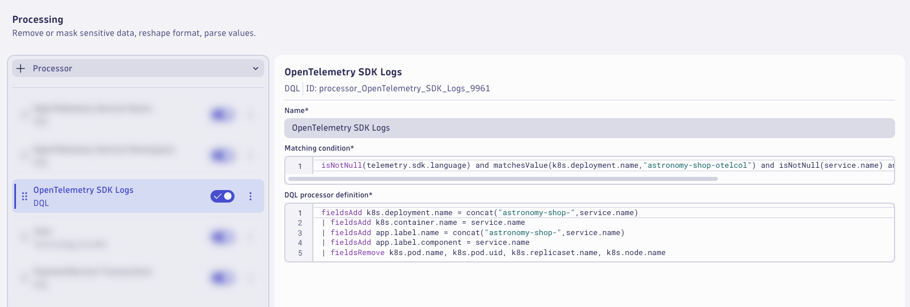

### Java Technology Bundle

Add a processor to enrich the Java logs using the Java Technology Bundle.  Click on `+ Processor` to add a new processor.

Type:
```text
Technology Bundle > Java
```

Matching condition:
```text
(matchesValue(telemetry.sdk.language,"java", caseSensitive: false) or matchesValue(k8s.deployment.name,"astronomy-shop-adservice", caseSensitive:false)) and matchesValue(k8s.namespace.name,"astronomy-shop")
```


### PaymentService Transactions

Add a processor to parse the PaymentService Transaction logs.  Click on `+ Processor` to add a new processor.

Type:
```text
DQL
```

Name:
```text
PaymentService Transactions
```

Matching condition:
```text
matchesValue(service.name,"paymentservice") and matchesValue(k8s.container.name,"paymentservice") and isNotNull(trace_id)
```

Processor definition:
```text
parse content, "JSON:json_content"
| fieldsAdd app.payment.msg = json_content[`msg`]
| fieldsAdd app.payment.cardType = json_content[`cardType`]
| fieldsAdd app.payment.amount = json_content[`amount`][`units`][`low`]
| fieldsAdd app.payment.currencyCode = json_content[`amount`][`currencyCode`]
| fieldsAdd app.payment.transactionId = json_content[`transactionId`]
| fieldsRemove json_content
```

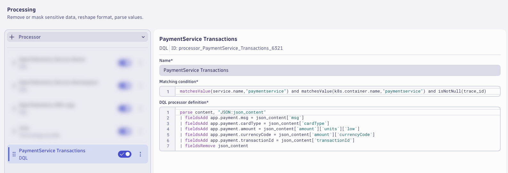

!!! tip "Save Often"
    Consider saving your pipeline configuration often to avoid losing any changes.

### PaymentService Transaction BizEvent

Switch to the `Data extraction` tab.

Add a processor to extract a `Business Event`.  Click on `+ Processor` to add a new processor.

Type:
```text
Business Event
```

Name:
```text
PaymentService Transaction
```

Matching condition:
```text
matchesValue(k8s.container.name,"paymentservice") and isNotNull(app.payment.cardType) and isNotNull(app.payment.amount) and isNotNull(app.payment.currencyCode) and isNotNull(app.payment.transactionId)
```

Event type:
```text
Static String : astronomy-shop.app.payment.complete
```

Event provider:
```text
Static String: astronomy-shop.opentelemetry
```

Field Extraction:

| Fields                   |
|--------------------------|
| app.payment.msg          |
| app.payment.cardType     |
| app.payment.amount       |
| app.payment.currencyCode |
| app.payment.transactionId|
| log.file.path            |
| trace_id                 |
| span_id                  |
| service.namespace        |
| service.name             |
| k8s.namespace.name       |
| k8s.container.name       |
| k8s.pod.name             |
| k8s.pod.uid              |


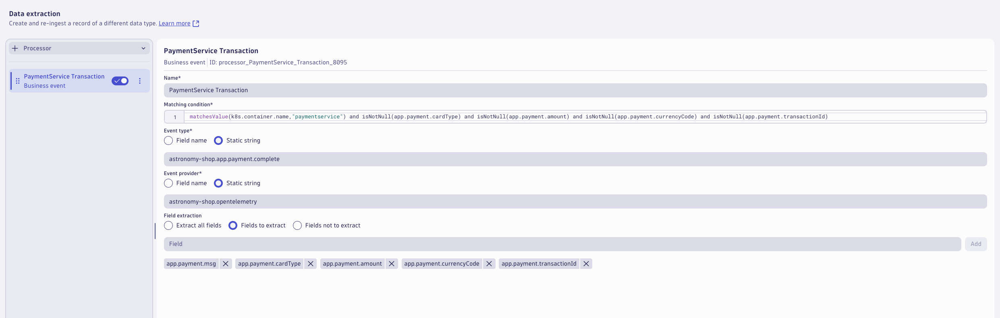

!!! tip "Save Often"
    Consider saving your pipeline configuration often to avoid losing any changes.

### PaymentService Transaction Metric

Switch to the `Metric Extraction` tab.

Add a processor to set extract a metric from the PaymentService Transaction logs.  Click on `+ Processor` to add a new processor.

Type:
```text
Value metric
```

Name:
```text
PaymentService Transaction
```

Matching condition:
```text
matchesValue(k8s.container.name,"paymentservice") and isNotNull(app.payment.cardType) and isNotNull(app.payment.amount) and isNotNull(app.payment.currencyCode) and isNotNull(app.payment.transactionId)
```

Field extraction:
```text
app.payment.amount
```

Metric key:
```text
otel.astronomy-shop.app.payment.amount
```

Dimensions:

| Field                    | Dimension     |
|--------------------------|---------------|
| app.payment.cardType     | cardType      |
| app.payment.currencyCode | currencyCode  |


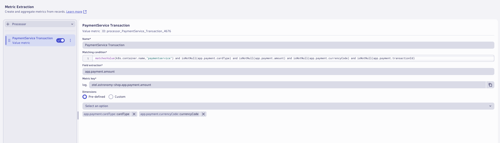

!!! tip "Consider Saving"
    Consider saving your pipeline configuration often to avoid losing any changes.

### Storage

Switch to the `Storage` tab.

Add a processor to set the bucket assignment.  Click on `+ Processor` to add a new  **Bucket Assignment** processor.

Name:
```text
Observe and Troubleshoot Apps Bucket
```

Matching condition:
```text
matchesValue(status,"INFO") or matchesValue(status,"WARN") or matchesValue(status,"ERROR")
```

Storage:
```text
Observe and Troubleshoot Apps (95 Days)
```

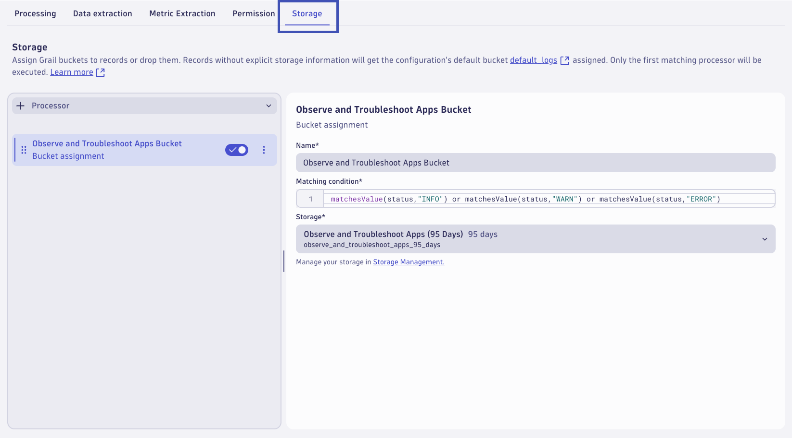

This will result in Astronomy Shop logs with `INFO`, `WARN`, or `ERROR` status values and matching this pipeline to be stored for 95 days in this bucket.

Add a processor to set the bucket assignment.  Click on `+ Processor` to add a new  **Bucket Assignment** processor.

Name:
```text
Log Management and Analytics Bucket
```

Matching condition:
```text
matchesValue(status,"NONE")
```

Storage:
```text
Log Management and Analytics (7 Days)
```

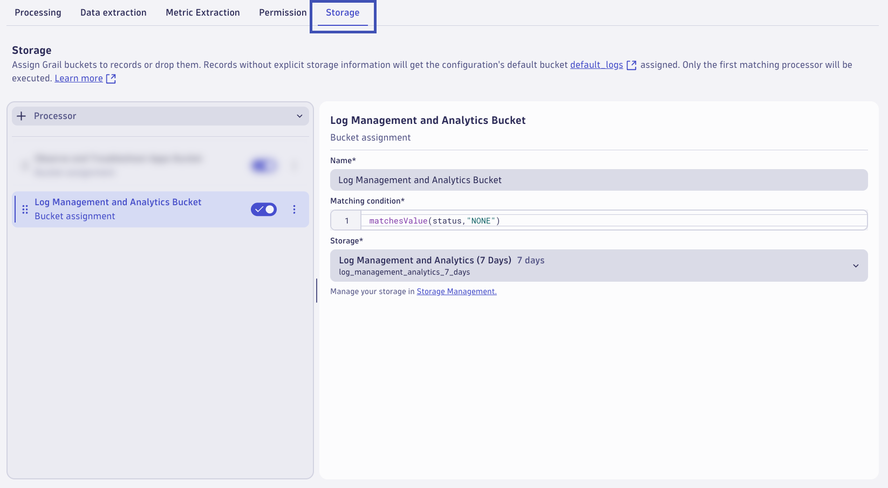

This will result in Astronomy Shop logs with `NONE` status values and matching this pipeline to be stored for 7 days in this bucket.

The pipeline is now configured, click on `Save` to save the pipeline configuration.

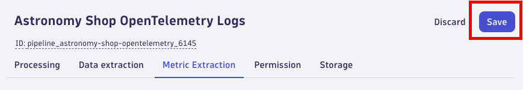

### Dynamic Route 

A pipeline will not have any effect unless logs are configured to be routed to the pipeline.  With dynamic routing, data is routed based on a matching condition. The matching condition is a DQL query that defines the data set you want to route.

Click on `Dynamic Routing` to configure a route to the target pipeline.  Click on `+ Dynamic Route` to add a new route.

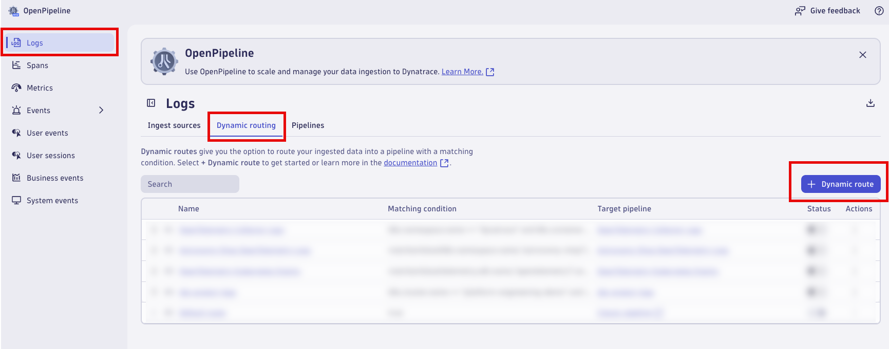

Configure the `Dynamic Route` to use the `Astronomy Shop OpenTelemetry Logs` pipeline.

Name:
```text
Astronomy Shop OpenTelemetry Logs
```

Matching condition:
```text
matchesValue(k8s.namespace.name,"astronomy-shop") and matchesValue(telemetry.sdk.name,"opentelemetry") and isNull(event.domain)
```

Pipeline:
```text
Astronomy Shop OpenTelemetry Logs
```

Click `Add` to add the route.


Validate that the route is enabled in the `Status` column.  Click on `Save` to save the dynamic route table configuration.


Allow `astronomy-shop` to generate new log data that will be routed through the new pipeline (3-5 minutes).

## Analyze Results

Analyze the Astronomy Shop logs after Dynatrace OpenPipeline processing.

### Analyze the results in Dynatrace (Notebook)

Use the Notebook from earlier to analyze the results.

**OpenTelemetry Service Name**

Query the `astronomy-shop` logs filtered on `isNotNull(service.name)` to analyze with `OpenTelemetry Service Name`.

DQL: After OpenPipeline
```sql
fetch logs
| filter matchesValue(k8s.namespace.name,"astronomy-shop") and matchesValue(telemetry.sdk.name,"opentelemetry")
| filter isNotNull(service.name) and isNotNull(app.label.component) and matchesValue(k8s.namespace.name,"astronomy-shop")
| filterOut matchesValue(k8s.container.name,"istio-proxy")
| sort timestamp desc
| limit 25
| fields timestamp, k8s.namespace.name, k8s.deployment.name, k8s.container.name, app.label.component, service.name, service.namespace
```


**OpenTelemetry Service Namespace**

Query the `astronomy-shop` logs filtered on `isNotNull(service.namespace)` to analyze with `OpenTelemetry Service Namespace`.

DQL: After OpenPipeline
```sql
fetch logs
| filter isNotNull(service.namespace) and isNotNull(service.name) and isNotNull(app.annotation.service.namespace) and matchesValue(k8s.namespace.name,"astronomy-shop")
| filterOut matchesValue(k8s.container.name,"istio-proxy")
| sort timestamp desc
| limit 25
| fields timestamp, k8s.namespace.name, k8s.deployment.name, k8s.container.name, app.label.component, app.annotation.service.namespace, service.name, service.namespace
```


**OpenTelemetry SDK Logs**

Query the `astronomy-shop` logs filtered on `telemetry.sdk.language` to analyze with `OpenTelemetry SDK Logs`.

DQL: After OpenPipeline
```sql
fetch logs
| filter isNotNull(telemetry.sdk.language) and isNotNull(service.name) and matchesValue(k8s.namespace.name,"astronomy-shop")
| sort timestamp desc
| limit 25
| fields timestamp, service.name, telemetry.sdk.language, k8s.namespace.name, k8s.deployment.name, k8s.container.name, app.label.name, app.label.component, k8s.pod.name, k8s.pod.uid, k8s.replicaset.name, k8s.node.name
```

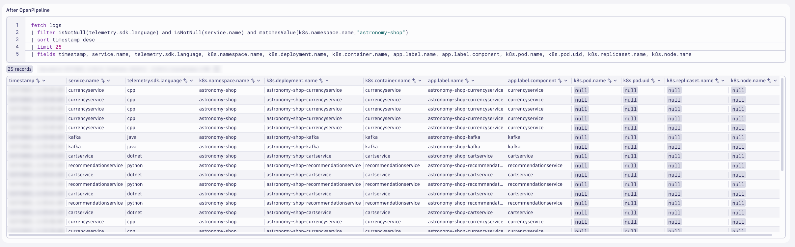

**Java Technology Bundle**

Query the `astronomy-shop` logs filtered on `telemetry.sdk.language == "java"` to analyze with `Java Technology Bundle` logs.

DQL: After OpenPipeline
```sql
fetch logs
| filter (matchesValue(telemetry.sdk.language,"java", caseSensitive: false) or matchesValue(k8s.deployment.name,"astronomy-shop-adservice", caseSensitive:false)) and matchesValue(k8s.namespace.name,"astronomy-shop")
| filterOut matchesValue(k8s.container.name,"istio-proxy")
| sort timestamp desc
| limit 50
```

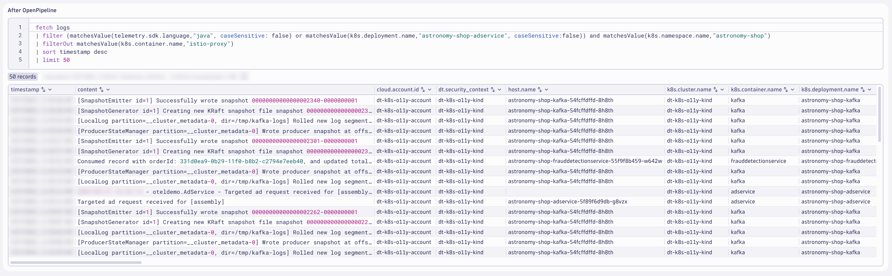

You likely won't notice anything different about these logs.  This exercise was meant to show you how to use the technology bundles.

**PaymentService Transactions**

Query the `astronomy-shop` logs filtered on `service.name == "paymentservice"` to analyze with `PaymentService` logs.

DQL: After OpenPipeline
```sql
fetch logs
| filter matchesValue(k8s.namespace.name,"astronomy-shop") and isNotNull(service.name)
| filterOut event.domain == "k8s"
| filter matchesValue(service.name,"paymentservice") and matchesValue(k8s.container.name,"paymentservice") and isNotNull(trace_id)
| sort timestamp desc
| limit 25
| fields timestamp, content, k8s.container.name, trace_id, app.payment.msg, app.payment.cardType, app.payment.amount, app.payment.currencyCode, app.payment.transactionId
```


Query the `PaymentService` Business Events.

DQL: PaymentService Transaction Business Events
```sql
fetch bizevents
| filter matchesValue(event.type,"astronomy-shop.app.payment.complete")
| sort timestamp desc
| limit 10
```


Query the `PaymentService` Metric.

DQL: PaymentService Transaction Extracted Metric
```sql
timeseries sum(`otel.astronomy-shop.app.payment.amount`), by: { currencyCode, cardType }
| fieldsAdd value.A = arrayAvg(`sum(\`otel.astronomy-shop.app.payment.amount\`)`)
```


### Business Data in Context

Extracting business data from logs has many benefits.  By generating a bizevent with OpenPipeline, the business data becomes immediately accessible for analysis, forensics, trending, and alerting - business observability.  Business events can be configured with retention times exceeding what you might choose for log retention.  Most importantly, bizevents enable business data to be captured in full context of topology, applications, infrastructure, and observability signals.  Let's explore the value of business data in context.

**Business Data**

In this example, the payment transaction details are captured on the extracted bizevent.  We can query and analyze the business data to measure business KPI and business outcomes.

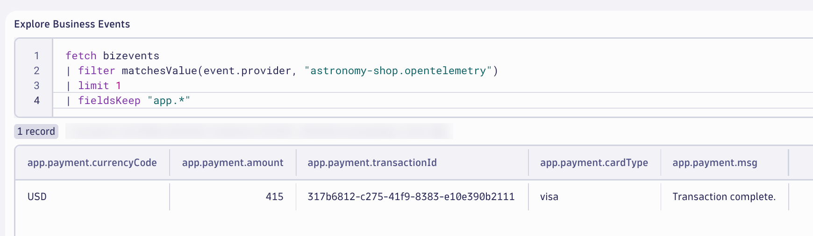

**Business Data in Kubernetes Context**

By including the Kubernetes attributes on the bizevent, this allows us to understand the topology and infrastructure that drives the business outcomes related to these payments.  Any anomalies that may occur impacting business KPIs or infrastructure health will be directly correlated, in context.

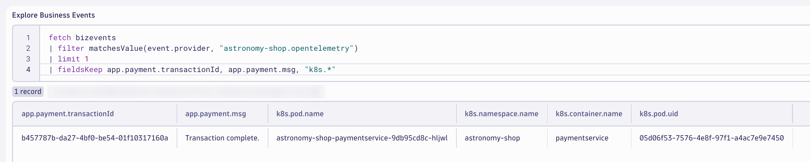

**Business Data in Log Context**

By including a small subset of log attributes on the bizevent, this allows us to analyze diagnostic logs surrounding the payment transaction.

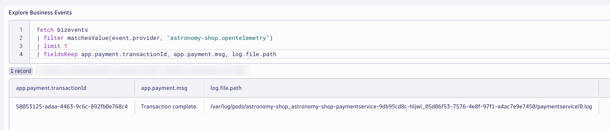

We can quickly drill down into the logs, including the surrounding logs, for each of the payment transaction bizevents.

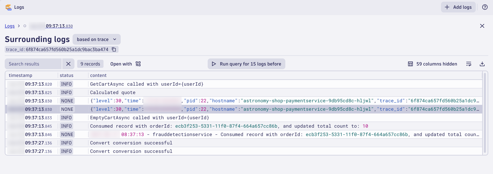

**Business Data in Trace Context**

By including the distributed tracing attributes on the bizevent, this allows us to analyze the distributed traces and spans for the payment transaction.


We can quickly drill down into the distributed trace to see everything that happened end-to-end for the payment transaction, including upstream/downstream dependencies, input parameters, and code-level details.

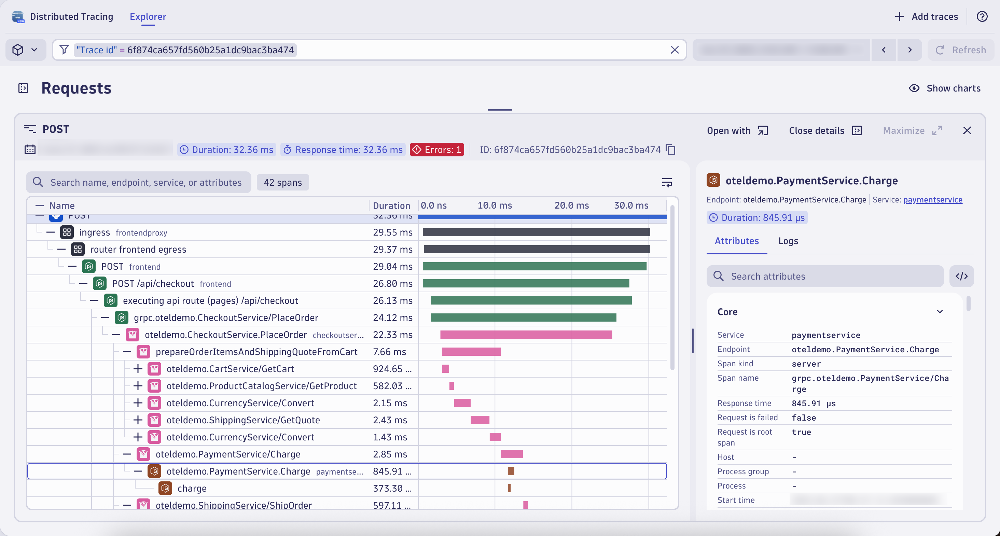

Dynatrace enables you to understand the health of business outcomes and business processes and directly tie their health to the underlying applications and infrastructure that make them possible - even with OpenTelemetry.

## Wrap Up

**What You Learned Today**

By completing this module, you've successfully set up Dynatrace OpenPipeline pipelines to process the Astronomy Shop logs at ingest.

- Astronomy Shop logs
    * Add OpenTelemetry service name and namespace fields to unify telemetry signals and enable out-of-the-box analysis
    * Enrich SDK logs with additional Kubernetes metadata to unify telemetry signals and analyze Kubernetes context
    * Apply Dynatrace technology bundle (Java) to transform logs based on known Java standards and frameworks
    * Extract data: Payment transaction business event to measure business outcomes and link them to system health
    * Extract metrics: Payment transaction amount to measure business KPIs and link them to system health
    * Routed logs to a specific bucket in Grail based on retention period needs
    * Analyzed business data in context of topology, applications, infrastructure, and observability signals

## Continue

<div class="grid cards" markdown>
- [Continue to Cleanup:octicons-arrow-right-24:](cleanup.md)
</div>
