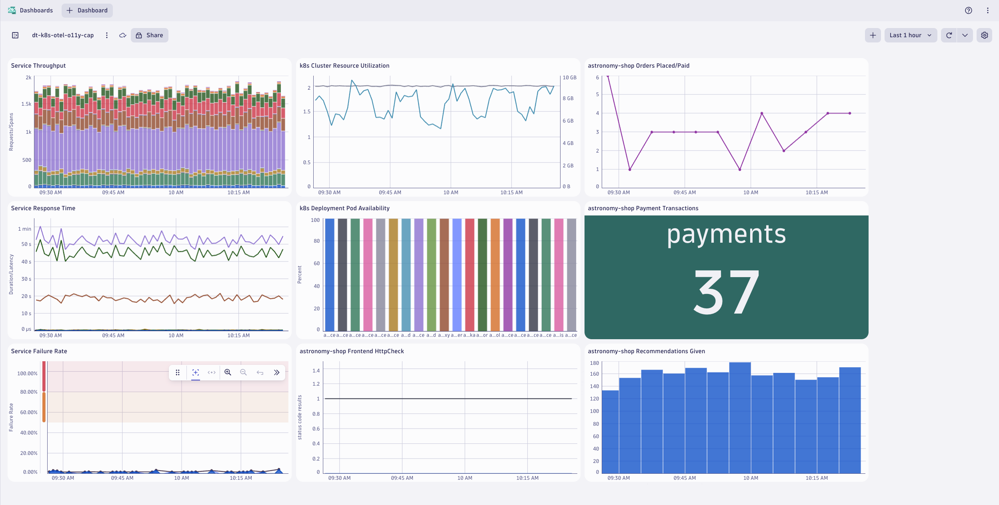

# OpenTelemetry Capstone
--8<-- "snippets/send-bizevent/5-opentelemetry-capstone.js"

In this module we'll utilize multiple OpenTelemetry Collectors to collect application traces/spans, log records, and metric data points generated by OpenTelemetry, from a Kubernetes cluster and ship them to Dynatrace.  This is a capstone lab that utilizes the concepts of the previous Kubernetes OpenTelemetry labs.

**Goals:**

1. Deploy 4 OpenTelemetry Collectors
2. Configure OpenTelemetry Collector service pipeline for data enrichment
3. Analyze metrics, traces, and logs in Dynatrace

## Prerequisites

**Import Dashboards into Dynatrace**


[Download astronomy-shop Dashboard](https://github.com/dynatrace-wwse/enablement-kubernetes-opentelemetry-openpipeline/blob/main/assets/dynatrace/dashboards/opentelemetry-capstone-astronomy-shop.json){target=_blank}


[Download Collector Health Dashboard](https://github.com/dynatrace-wwse/enablement-kubernetes-opentelemetry-openpipeline/blob/main/assets/dynatrace/dashboards/opentelemetry-collector-health.json){target=_blank}

Define workshop user variables

In your Github Codespaces Terminal:
```
export DT_ENDPOINT=https://{your-environment-id}.live.dynatrace.com/api/v2/otlp
export DT_API_TOKEN={your-api-token}
export NAME=<INITIALS>-k8s-otel-o11y
```

Move into the lab module directory

Command:

```sh
cd $BASE_DIR/lab-modules/opentelemetry-capstone
```

!!! tip "Automate Capstone Deployment"
    If you've already completed the capstone deployment before, you can automate the deployment using the function provided `deployOpenTelemetryCapstone` in your terminal shell.

Clean Up Previous Deployments

Delete `dynatrace` namespace and all previous Collector deployments

Command:
```sh
kubectl delete ns dynatrace
```

Create `dynatrace` namespace

Command:
```sh
kubectl create namespace dynatrace
```

Sample output:
> namespace/dynatrace created

Create `dynatrace-otelcol-dt-api-credentials` secret

The secret holds the API endpoint and API token that OpenTelemetry data will be sent to.

Command:
```sh
kubectl create secret generic dynatrace-otelcol-dt-api-credentials --from-literal=DT_ENDPOINT=$DT_ENDPOINT --from-literal=DT_API_TOKEN=$DT_API_TOKEN -n dynatrace
```

Sample output:
> secret/dynatrace-otelcol-dt-api-credentials created

Deploy `cert-manager`, pre-requisite for `opentelemetry-operator`

[Cert Manager Documentation](https://cert-manager.io/docs/installation/){target=_blank}

Command:
```sh
kubectl apply -f opentelemetry/cert-manager.yaml
```

Sample output:
> namespace/cert-manager created\
> customresourcedefinition.apiextensions.k8s.io/certificaterequests.cert-manager.io created\
> customresourcedefinition.apiextensions.k8s.io/certificates.cert-manager.io created\
> ...\
> validatingwebhookconfiguration.admissionregistration.k8s.io/cert-manager-webhook created

Wait 30-60 seconds for cert-manager to finish initializing before continuing.

Validate that the Cert Manager components are running.

Command:
```sh
kubectl get pods -n cert-manager
```

Sample output:

| NAME                                       | READY | STATUS  | RESTARTS | AGE |
|--------------------------------------------|-------|---------|----------|-----|
| cert-manager-5f7b5dbfbc-fkpzv              | 1/1   | Running | 0        | 1m  |
| cert-manager-cainjector-7d5b44bb96-kqz7f   | 1/1   | Running | 0        | 1m  |
| cert-manager-webhook-69459b8974-tsmbq      | 1/1   | Running | 0        | 1m  |

## OpenTelemetry Operator and Role Based Access

Deploy `opentelemetry-operator`

The OpenTelemetry Operator will deploy and manage the custom resource `OpenTelemetryCollector` deployed on the cluster.

Command:
```sh
kubectl apply -f opentelemetry/opentelemetry-operator.yaml
```

Sample output:
> namespace/opentelemetry-operator-system created\
> customresourcedefinition.apiextensions.k8s.io/instrumentations.opentelemetry.io created\
> customresourcedefinition.apiextensions.k8s.io/opampbridges.opentelemetry.io created\
> ...\
> validatingwebhookconfiguration.admissionregistration.k8s.io/opentelemetry-operator-validating-webhook-configuration configured

Wait 30-60 seconds for opentelemetry-operator-controller-manager to finish initializing before continuing.

Validate that the OpenTelemetry Operator components are running.

Command:
```sh
kubectl get pods -n opentelemetry-operator-system
```

Sample output:

| NAME                             | READY | STATUS  | RESTARTS | AGE |
|----------------------------------|-------|---------|----------|-----|
| opentelemetry-operator-controller-manager-5d746dbd64-rf9st   | 2/2   | Running | 0        | 1m  |

Create `clusterrole` with read access to Kubernetes objects

```yaml
---
apiVersion: rbac.authorization.k8s.io/v1
kind: ClusterRole
metadata:
  name: otel-collector-k8s-clusterrole
rules:
  - apiGroups: ['']
    resources: ['events', 'namespaces', 'namespaces/status', 'nodes', 'nodes/spec', 'nodes/stats', 'nodes/proxy', 'pods', 'pods/status', 'replicationcontrollers', 'replicationcontrollers/status', 'resourcequotas', 'services']
    verbs: ['get', 'list', 'watch']
  - apiGroups: ['apps']
    resources: ['daemonsets', 'deployments', 'replicasets', 'statefulsets']
    verbs: ['get', 'list', 'watch']
  - apiGroups: ['extensions']
    resources: ['daemonsets', 'deployments', 'replicasets']
    verbs: ['get', 'list', 'watch']
  - apiGroups: ['batch']
    resources: ['jobs', 'cronjobs']
    verbs: ['get', 'list', 'watch']
  - apiGroups: ['autoscaling']
    resources: ['horizontalpodautoscalers']
    verbs: ['get', 'list', 'watch']
```

Command:
```sh
kubectl apply -f opentelemetry/rbac/otel-collector-k8s-clusterrole.yaml
```

Sample output:
> clusterrole.rbac.authorization.k8s.io/otel-collector-k8s-clusterrole created

Create `clusterrolebinding` for OpenTelemetry Collector service accounts

```yaml
---
apiVersion: rbac.authorization.k8s.io/v1
kind: ClusterRoleBinding
metadata:
  name: otel-collector-k8s-clusterrole-crb
subjects:
- kind: ServiceAccount
  name: dynatrace-deployment-collector
  namespace: dynatrace
- kind: ServiceAccount
  name: dynatrace-daemonset-collector
  namespace: dynatrace
- kind: ServiceAccount
  name: contrib-deployment-collector
  namespace: dynatrace
- kind: ServiceAccount
  name: contrib-daemonset-collector
  namespace: dynatrace
roleRef:
  kind: ClusterRole
  name: otel-collector-k8s-clusterrole
  apiGroup: rbac.authorization.k8s.io
```

Command:
```sh
kubectl apply -f opentelemetry/rbac/otel-collector-k8s-clusterrole-crb.yaml
```

Sample output:
> clusterrolebinding.rbac.authorization.k8s.io/otel-collector-k8s-clusterrole-crb created

## Dynatrace Deployment Collector

Receivers:
`otlp`, `prometheus`

| MODULE        | DT DEPLOY | DT DAEMON | CON DEPLOY | CON DAEMON |
|---------------|-----------|-----------|------------|------------|
| otlp          | - [x]     | - [ ]     | - [x]      | - [ ]      |
| prometheus    | - [x]     | - [x]     | - [x]      | - [x]      |
| filelog       | - [ ]     | - [x]     | - [ ]      | - [ ]      |
| kubeletstats  | - [ ]     | - [ ]     | - [ ]      | - [x]      |
| k8s_cluster   | - [ ]     | - [ ]     | - [x]      | - [ ]      |
| k8sobjects    | - [ ]     | - [ ]     | - [x]      | - [ ]      |

Deploy OpenTelemetry Collector CRD

[Deployment Documentation](https://docs.dynatrace.com/docs/extend-dynatrace/opentelemetry/collector/deployment#tabgroup--dynatrace-docs--gateway){target=_blank}

```yaml
---
apiVersion: opentelemetry.io/v1beta1
kind: OpenTelemetryCollector
metadata:
  name: dynatrace-deployment
  namespace: dynatrace
spec:
  envFrom:
  - secretRef:
      name: dynatrace-otelcol-dt-api-credentials
  mode: "deployment"
  image: "ghcr.io/dynatrace/dynatrace-otel-collector/dynatrace-otel-collector:latest"
```

Command:
```sh
kubectl apply -f opentelemetry/collector/dynatrace/otel-collector-dynatrace-deployment-crd.yaml
```

Sample output:
> opentelemetrycollector.opentelemetry.io/dynatrace-deployment created

Validate running pod(s)

Command:
```sh
kubectl get pods -n dynatrace
```

Sample output:

| NAME                                       | READY | STATUS  | RESTARTS | AGE |
|--------------------------------------------|-------|---------|----------|-----|
| dynatrace-deployment-collector-796546fbd6-kqflf | 1/1   | Running | 0        | 1m  |

## Dynatrace Daemonset Collector

Receivers:
`filelog`, `prometheus`

| MODULE        | DT DEPLOY | DT DAEMON | CON DEPLOY | CON DAEMON |
|---------------|-----------|-----------|------------|------------|
| otlp          | - [x]     | - [ ]     | - [x]      | - [ ]      |
| prometheus    | - [x]     | - [x]     | - [x]      | - [x]      |
| filelog       | - [ ]     | - [x]     | - [ ]      | - [ ]      |
| kubeletstats  | - [ ]     | - [ ]     | - [ ]      | - [x]      |
| k8s_cluster   | - [ ]     | - [ ]     | - [x]      | - [ ]      |
| k8sobjects    | - [ ]     | - [ ]     | - [x]      | - [ ]      |

Deploy OpenTelemetry Collector CRD

[Daemonset Documentation](https://docs.dynatrace.com/docs/extend-dynatrace/opentelemetry/collector/deployment#tabgroup--dynatrace-docs--agent){target=_blank}

```yaml
---
apiVersion: opentelemetry.io/v1beta1
kind: OpenTelemetryCollector
metadata:
  name: dynatrace-daemonset
  namespace: dynatrace
spec:
  envFrom:
  - secretRef:
      name: dynatrace-otelcol-dt-api-credentials
  mode: "daemonset"
  image: "ghcr.io/dynatrace/dynatrace-otel-collector/dynatrace-otel-collector:latest"
```

Command:
```sh
kubectl apply -f opentelemetry/collector/dynatrace/otel-collector-dynatrace-daemonset-crd.yaml
```

Sample output:
> opentelemetrycollector.opentelemetry.io/dynatrace-daemonset created

Validate running pod(s)

Command:
```sh
kubectl get pods -n dynatrace
```

Sample output:

| NAME                                       | READY | STATUS  | RESTARTS | AGE |
|--------------------------------------------|-------|---------|----------|-----|
| dynatrace-daemonset-collector-h69pz | 1/1   | Running | 0        | 1m  |

## Contrib Deployment Collector

Receivers:
`otlp`, `prometheus`, `k8s_cluster`, `k8sobjects`

| MODULE        | DT DEPLOY | DT DAEMON | CON DEPLOY | CON DAEMON |
|---------------|-----------|-----------|------------|------------|
| otlp          | - [x]     | - [ ]     | - [x]      | - [ ]      |
| prometheus    | - [x]     | - [x]     | - [x]      | - [x]      |
| filelog       | - [ ]     | - [x]     | - [ ]      | - [ ]      |
| kubeletstats  | - [ ]     | - [ ]     | - [ ]      | - [x]      |
| k8s_cluster   | - [ ]     | - [ ]     | - [x]      | - [ ]      |
| k8sobjects    | - [ ]     | - [ ]     | - [x]      | - [ ]      |

Deploy OpenTelemetry Collector CRD

```yaml
---
apiVersion: opentelemetry.io/v1beta1
kind: OpenTelemetryCollector
metadata:
  name: contrib-deployment
  namespace: dynatrace
spec:
  envFrom:
  - secretRef:
      name: dynatrace-otelcol-dt-api-credentials
  mode: "deployment"
  image: "otel/opentelemetry-collector-contrib:0.103.0"
```

Command:
```sh
kubectl apply -f opentelemetry/collector/contrib/otel-collector-contrib-deployment-crd.yaml
```

Sample output:
> opentelemetrycollector.opentelemetry.io/contrib-deployment created

Validate running pod(s)

Command:
```sh
kubectl get pods -n dynatrace
```

Sample output:

| NAME                                       | READY | STATUS  | RESTARTS | AGE |
|--------------------------------------------|-------|---------|----------|-----|
| contrib-deployment-collector-74dfc4d9f4-s97k6 | 1/1   | Running | 0        | 1m  |

## Contrib Daemonset Collector

Receivers:
`prometheus`, `kubeletstats`

| MODULE        | DT DEPLOY | DT DAEMON | CON DEPLOY | CON DAEMON |
|---------------|-----------|-----------|------------|------------|
| otlp          | - [x]     | - [ ]     | - [x]      | - [ ]      |
| prometheus    | - [x]     | - [x]     | - [x]      | - [x]      |
| filelog       | - [ ]     | - [x]     | - [ ]      | - [ ]      |
| kubeletstats  | - [ ]     | - [ ]     | - [ ]      | - [x]      |
| k8s_cluster   | - [ ]     | - [ ]     | - [x]      | - [ ]      |
| k8sobjects    | - [ ]     | - [ ]     | - [x]      | - [ ]      |

Deploy OpenTelemetry Collector CRD

```yaml
---
apiVersion: opentelemetry.io/v1beta1
kind: OpenTelemetryCollector
metadata:
  name: contrib-daemonset
  namespace: dynatrace
spec:
  envFrom:
  - secretRef:
      name: dynatrace-otelcol-dt-api-credentials
  mode: "daemonset"
  image: "otel/opentelemetry-collector-contrib:0.103.0"
```

Command:
```sh
kubectl apply -f opentelemetry/collector/contrib/otel-collector-contrib-daemonset-crd.yaml
```

Sample output:
> opentelemetrycollector.opentelemetry.io/contrib-daemonset created

Validate running pod(s)

Command:
```sh
kubectl get pods -n dynatrace
```

Sample output:

| NAME                                       | READY | STATUS  | RESTARTS | AGE |
|--------------------------------------------|-------|---------|----------|-----|
| contrib-daemonset-collector-d92tw | 1/1   | Running | 0        | 1m  |

## Configure Astronomy Shop OTLP Export

The `astronomy-shop` application includes an embedded OpenTelemetry Collector.  It needs to be configured to export signals via OTLP to the Dynatrace Deployment Collector.

Our Helm chart values manifest contains the following configuration:

```yaml
config:
    receivers:
      otlp:
        protocols:
          http:
            # Since this collector needs to receive data from the web, enable cors for all origins
            # `allowed_origins` can be refined for your deployment domain
            cors:
              allowed_origins:
                - "http://*"
                - "https://*"
      httpcheck/frontendproxy:
        targets:
          - endpoint: 'http://{{ include "otel-demo.name" . }}-frontendproxy:8080'

    exporters:
      # Dynatrace OTel Collector
      otlphttp/dynatrace:
        endpoint: http://dynatrace-deployment-collector.dynatrace.svc.cluster.local:4318

    processors:
      resource:
        attributes:
        - key: service.instance.id
          from_attribute: k8s.pod.uid
          action: insert

    connectors:
      spanmetrics: {}

    service:
      pipelines:
        traces:
          receivers: [otlp]
          processors: [memory_limiter, resource, batch]
          exporters: [spanmetrics, otlphttp/dynatrace]
        metrics:
          receivers: [httpcheck/frontendproxy, otlp, spanmetrics]
          processors: [memory_limiter, resource, batch]
          exporters: [otlphttp/dynatrace]
        logs:
          processors: [memory_limiter, resource, batch]
          exporters: [otlphttp/dynatrace]
```

Customize `astronomy-shop` helm values:

```yaml
default:
  # List of environment variables applied to all components
  env:
    - name: OTEL_SERVICE_NAME
      valueFrom:
        fieldRef:
          apiVersion: v1
          fieldPath: "metadata.labels['app.kubernetes.io/component']"
    - name: OTEL_COLLECTOR_NAME
      value: '{{ include "otel-demo.name" . }}-otelcol'
    - name: OTEL_EXPORTER_OTLP_METRICS_TEMPORALITY_PREFERENCE
      value: cumulative
    - name: OTEL_RESOURCE_ATTRIBUTES
      value: 'service.name=$(OTEL_SERVICE_NAME),service.namespace=NAME_TO_REPLACE,service.version={{ .Chart.AppVersion }}'
```

Pattern to replace:
```text
service.namespace=NAME_TO_REPLACE
```

Command:
```sh
sed -i "s,NAME_TO_REPLACE,$NAME," astronomy-shop/collector-values.yaml
```

Update `astronomy-shop` OpenTelemetry Collector export endpoint via helm

Command:
```sh
helm upgrade astronomy-shop open-telemetry/opentelemetry-demo --values astronomy-shop/collector-values.yaml --namespace astronomy-shop --version "0.31.0"
```

Sample output:
> NAME: astronomy-shop
> LAST DEPLOYED: Thu Jun 27 20:58:38 2024
> NAMESPACE: astronomy-shop
> STATUS: deployed
> REVISION: 2

## Validate and Analyze Data in Dynatrace

Validate the OpenTelemetry data using the Astronomy Shop Dashboard.


[Download astronomy-shop Dashboard](https://github.com/dynatrace-wwse/enablement-kubernetes-opentelemetry-openpipeline/blob/main/lab-modules/opentelemetry-capstone/opentelemetry-cap_dt_dashboard.json){target=_blank}

## Wrap Up

**What You Learned Today**

By completing this module, you've successfully deployed the OpenTelemetry Collector to collect metrics, traces, and logs from Kubernetes and ship them to Dynatrace for analysis.

- The Dynatrace Distro of OpenTelemetry Collector includes supported modules needed to ship telemetry to Dynatrace
    - The `otlp` receiver receives metrics, traces, and logs from OpenTelemetry exporters via gRPC/HTTP
    - The `filelog` receiver scrapes logs from the Node filesystem and parses the contents
    - The `prometheus` receiver scrapes metric data exposed by Pod Prometheus endpoints
- The Contrib Distro of OpenTelemetry Collector includes additional modules needed to ship telemetry to Dynatrace
    - The `kubeletstats` receiver scrapes metrics from the local kubelet on the Node
    - The `k8s_cluster` receiver queries the Kubernetes cluster API to retrieve metrics
    - The `k8sobjects` receiver watches for Kubernetes events (and other resources) on the cluster
- Dynatrace allows you to perform powerful queries and analysis of the telemetry data

## Continue

<div class="grid cards" markdown>
- [Continue to Configure Dynatrace Buckets (Storage Management):octicons-arrow-right-24:](6-dynatrace-buckets.md)
</div>
