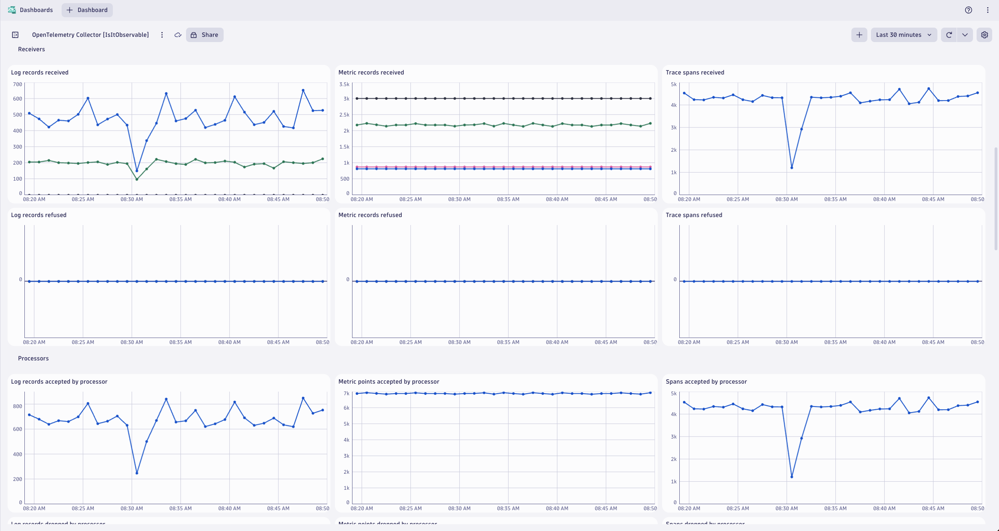

# OpenTelemetry Capstone
--8<-- "snippets/send-bizevent/5-opentelemetry-capstone.js"

## What You’ll Learn Today
In this lab we'll utilize multiple OpenTelemetry Collectors to collect application traces/spans, log records, and metric data points generated by OpenTelemetry, from a Kubernetes cluster and ship them to Dynatrace.  This is a capstone lab that utilizes the concepts of the previous Kubernetes OpenTelemetry labs.

Lab tasks:
1. Deploy 4 OpenTelemetry Collectors
2. Configure OpenTelemetry Collector service pipeline for data enrichment
3. Analyze metrics, traces, and logs in Dynatrace
4. Observe OpenTelemetry Collector health in Dynatrace

## Prerequisites

### Import Dashboards into Dynatrace


[astronomy-shop dashboard](https://github.com/dynatrace-wwse/enablement-kubernetes-opentelemetry-openpipeline/blob/main/assets/dynatrace/dashboards/opentelemetry-capstone-astronomy-shop.json)


[collector health dashboard](https://github.com/dynatrace-wwse/enablement-kubernetes-opentelemetry-openpipeline/blob/main/assets/dynatrace/dashboards/opentelemetry-collector-health.json)

### Define workshop user variables
In your Github Codespaces Terminal:
```
export DT_ENDPOINT=https://{your-environment-id}.live.dynatrace.com/api/v2/otlp
export DT_API_TOKEN={your-api-token}
export NAME=<INITIALS>-k8s-otel-o11y
```

### Move into the lab module directory
Command:
```sh
cd $base_dir/lab-modules/opentelemetry-capstone
```

### Clean Up Previous Deployments
Delete `dynatrace` namespace and all previous Collector deployments

Command:
```sh
kubectl delete ns dynatrace
```

### Create `dynatrace` namespace
Command:
```sh
kubectl create namespace dynatrace
```
Sample output:
> namespace/dynatrace created

### Create `dynatrace-otelcol-dt-api-credentials` secret

The secret holds the API endpoint and API token that OpenTelemetry data will be sent to.

Command:
```sh
kubectl create secret generic dynatrace-otelcol-dt-api-credentials --from-literal=DT_ENDPOINT=$DT_ENDPOINT --from-literal=DT_API_TOKEN=$DT_API_TOKEN -n dynatrace
```
Sample output:
> secret/dynatrace-otelcol-dt-api-credentials created

### Deploy `cert-manager`, pre-requisite for `opentelemetry-operator`
[Cert Manager](https://cert-manager.io/docs/installation/)

Command:
```sh
kubectl apply -f opentelemetry/cert-manager.yaml
```
Sample output:
> namespace/cert-manager created\
> customresourcedefinition.apiextensions.k8s.io/certificaterequests.cert-manager.io created\
> customresourcedefinition.apiextensions.k8s.io/certificates.cert-manager.io created\
> ...\
> validatingwebhookconfiguration.admissionregistration.k8s.io/cert-manager-webhook created

Wait 30-60 seconds for cert-manager to finish initializing before continuing.

Validate that the Cert Manager components are running.

Command:
```sh
kubectl get pods -n cert-manager
```
Sample output:
| NAME                                       | READY | STATUS  | RESTARTS | AGE |
|--------------------------------------------|-------|---------|----------|-----|
| cert-manager-5f7b5dbfbc-fkpzv              | 1/1   | Running | 0        | 1m  |
| cert-manager-cainjector-7d5b44bb96-kqz7f   | 1/1   | Running | 0        | 1m  |
| cert-manager-webhook-69459b8974-tsmbq      | 1/1   | Running | 0        | 1m  |

### Deploy `opentelemetry-operator`

The OpenTelemetry Operator will deploy and manage the custom resource `OpenTelemetryCollector` deployed on the cluster.

Command:
```sh
kubectl apply -f opentelemetry/opentelemetry-operator.yaml
```
Sample output:
> namespace/opentelemetry-operator-system created\
> customresourcedefinition.apiextensions.k8s.io/instrumentations.opentelemetry.io created\
> customresourcedefinition.apiextensions.k8s.io/opampbridges.opentelemetry.io created\
> ...\
> validatingwebhookconfiguration.admissionregistration.k8s.io/opentelemetry-operator-validating-webhook-configuration configured

Wait 30-60 seconds for opentelemetry-operator-controller-manager to finish initializing before continuing.

Validate that the OpenTelemetry Operator components are running.

Command:
```sh
kubectl get pods -n opentelemetry-operator-system
```
Sample output:
| NAME                             | READY | STATUS  | RESTARTS | AGE |
|----------------------------------|-------|---------|----------|-----|
| opentelemetry-operator-controller-manager-5d746dbd64-rf9st   | 2/2   | Running | 0        | 1m  |

### Create `clusterrole` with read access to Kubernetes objects
```yaml
---
apiVersion: rbac.authorization.k8s.io/v1
kind: ClusterRole
metadata:
  name: otel-collector-k8s-clusterrole
rules:
  - apiGroups: ['']
    resources: ['events', 'namespaces', 'namespaces/status', 'nodes', 'nodes/spec', 'nodes/stats', 'nodes/proxy', 'pods', 'pods/status', 'replicationcontrollers', 'replicationcontrollers/status', 'resourcequotas', 'services']
    verbs: ['get', 'list', 'watch']
  - apiGroups: ['apps']
    resources: ['daemonsets', 'deployments', 'replicasets', 'statefulsets']
    verbs: ['get', 'list', 'watch']
  - apiGroups: ['extensions']
    resources: ['daemonsets', 'deployments', 'replicasets']
    verbs: ['get', 'list', 'watch']
  - apiGroups: ['batch']
    resources: ['jobs', 'cronjobs']
    verbs: ['get', 'list', 'watch']
  - apiGroups: ['autoscaling']
    resources: ['horizontalpodautoscalers']
    verbs: ['get', 'list', 'watch']
```
Command:
```sh
kubectl apply -f opentelemetry/rbac/otel-collector-k8s-clusterrole.yaml
```
Sample output:
> clusterrole.rbac.authorization.k8s.io/otel-collector-k8s-clusterrole created

### Create `clusterrolebinding` for OpenTelemetry Collector service accounts
```yaml
---
apiVersion: rbac.authorization.k8s.io/v1
kind: ClusterRoleBinding
metadata:
  name: otel-collector-k8s-clusterrole-crb
subjects:
- kind: ServiceAccount
  name: dynatrace-deployment-collector
  namespace: dynatrace
- kind: ServiceAccount
  name: dynatrace-daemonset-collector
  namespace: dynatrace
- kind: ServiceAccount
  name: contrib-deployment-collector
  namespace: dynatrace
- kind: ServiceAccount
  name: contrib-daemonset-collector
  namespace: dynatrace
roleRef:
  kind: ClusterRole
  name: otel-collector-k8s-clusterrole
  apiGroup: rbac.authorization.k8s.io
```
Command:
```sh
kubectl apply -f opentelemetry/rbac/otel-collector-k8s-clusterrole-crb.yaml
```
Sample output:
> clusterrolebinding.rbac.authorization.k8s.io/otel-collector-k8s-clusterrole-crb created

## Dynatrace Deployment Collector

### OpenTelemetry Collector - Dynatrace Distro (Deployment)
[OpenTelemetry Collector](https://docs.dynatrace.com/docs/extend-dynatrace/opentelemetry/collector/deployment)

Receivers:
`otlp`, `prometheus`

| MODULE        | DT DEPLOY | DT DAEMON | CON DEPLOY | CON DAEMON |
|---------------|-----------|-----------|------------|------------|
| otlp          | - [x]     | - [ ]     | - [x]      | - [ ]      |
| prometheus    | - [x]     | - [x]     | - [x]      | - [x]      |
| filelog       | - [ ]     | - [x]     | - [ ]      | - [ ]      |
| kubeletstats  | - [ ]     | - [ ]     | - [ ]      | - [x]      |
| k8s_cluster   | - [ ]     | - [ ]     | - [x]      | - [ ]      |
| k8sobjects    | - [ ]     | - [ ]     | - [x]      | - [ ]      |

### Deploy Collector

### Deploy OpenTelemetry Collector CRD
[Deployment](https://docs.dynatrace.com/docs/extend-dynatrace/opentelemetry/collector/deployment#tabgroup--dynatrace-docs--gateway)
```yaml
---
apiVersion: opentelemetry.io/v1beta1
kind: OpenTelemetryCollector
metadata:
  name: dynatrace-deployment
  namespace: dynatrace
spec:
  envFrom:
  - secretRef:
      name: dynatrace-otelcol-dt-api-credentials
  mode: "deployment"
  image: "ghcr.io/dynatrace/dynatrace-otel-collector/dynatrace-otel-collector:latest"
```
Command:
```sh
kubectl apply -f opentelemetry/collector/dynatrace/otel-collector-dynatrace-deployment-crd.yaml
```
Sample output:
> opentelemetrycollector.opentelemetry.io/dynatrace-deployment created

### Validate running pod(s)
Command:
```sh
kubectl get pods -n dynatrace
```
Sample output:
| NAME                                       | READY | STATUS  | RESTARTS | AGE |
|--------------------------------------------|-------|---------|----------|-----|
| dynatrace-deployment-collector-796546fbd6-kqflf | 1/1   | Running | 0        | 1m  |

## Dynatrace Daemonset Collector

### OpenTelemetry Collector - Dynatrace Distro (Daemonset)
[OpenTelemetry Collector](https://docs.dynatrace.com/docs/extend-dynatrace/opentelemetry/collector/deployment)

Receivers:
`filelog`, `prometheus`

| MODULE        | DT DEPLOY | DT DAEMON | CON DEPLOY | CON DAEMON |
|---------------|-----------|-----------|------------|------------|
| otlp          | - [x]     | - [ ]     | - [x]      | - [ ]      |
| prometheus    | - [x]     | - [x]     | - [x]      | - [x]      |
| filelog       | - [ ]     | - [x]     | - [ ]      | - [ ]      |
| kubeletstats  | - [ ]     | - [ ]     | - [ ]      | - [x]      |
| k8s_cluster   | - [ ]     | - [ ]     | - [x]      | - [ ]      |
| k8sobjects    | - [ ]     | - [ ]     | - [x]      | - [ ]      |

### Deploy Collector

### Deploy OpenTelemetry Collector CRD
[Daemonset](https://docs.dynatrace.com/docs/extend-dynatrace/opentelemetry/collector/deployment#tabgroup--dynatrace-docs--agent)
```yaml
---
apiVersion: opentelemetry.io/v1beta1
kind: OpenTelemetryCollector
metadata:
  name: dynatrace-daemonset
  namespace: dynatrace
spec:
  envFrom:
  - secretRef:
      name: dynatrace-otelcol-dt-api-credentials
  mode: "daemonset"
  image: "ghcr.io/dynatrace/dynatrace-otel-collector/dynatrace-otel-collector:latest"
```
Command:
```sh
kubectl apply -f opentelemetry/collector/dynatrace/otel-collector-dynatrace-daemonset-crd.yaml
```
Sample output:
> opentelemetrycollector.opentelemetry.io/dynatrace-daemonset created

### Validate running pod(s)
Command:
```sh
kubectl get pods -n dynatrace
```
Sample output:
| NAME                                       | READY | STATUS  | RESTARTS | AGE |
|--------------------------------------------|-------|---------|----------|-----|
| dynatrace-daemonset-collector-h69pz | 1/1   | Running | 0        | 1m  |

## Contrib Deployment Collector

### OpenTelemetry Collector - Contrib Distro (Deployment)
[OpenTelemetry Collector](https://docs.dynatrace.com/docs/extend-dynatrace/opentelemetry/collector/deployment)

Receivers:
`otlp`, `prometheus`, `k8s_cluster`, `k8sobjects`

| MODULE        | DT DEPLOY | DT DAEMON | CON DEPLOY | CON DAEMON |
|---------------|-----------|-----------|------------|------------|
| otlp          | - [x]     | - [ ]     | - [x]      | - [ ]      |
| prometheus    | - [x]     | - [x]     | - [x]      | - [x]      |
| filelog       | - [ ]     | - [x]     | - [ ]      | - [ ]      |
| kubeletstats  | - [ ]     | - [ ]     | - [ ]      | - [x]      |
| k8s_cluster   | - [ ]     | - [ ]     | - [x]      | - [ ]      |
| k8sobjects    | - [ ]     | - [ ]     | - [x]      | - [ ]      |

### Deploy Collector

### Deploy OpenTelemetry Collector CRD
[Operator](https://opentelemetry.io/docs/kubernetes/operator/)
```yaml
---
apiVersion: opentelemetry.io/v1beta1
kind: OpenTelemetryCollector
metadata:
  name: contrib-deployment
  namespace: dynatrace
spec:
  envFrom:
  - secretRef:
      name: dynatrace-otelcol-dt-api-credentials
  mode: "deployment"
  image: "otel/opentelemetry-collector-contrib:0.103.0"
```
Command:
```sh
kubectl apply -f opentelemetry/collector/contrib/otel-collector-contrib-deployment-crd.yaml
```
Sample output:
> opentelemetrycollector.opentelemetry.io/contrib-deployment created

### Validate running pod(s)
Command:
```sh
kubectl get pods -n dynatrace
```
Sample output:
| NAME                                       | READY | STATUS  | RESTARTS | AGE |
|--------------------------------------------|-------|---------|----------|-----|
| contrib-deployment-collector-74dfc4d9f4-s97k6 | 1/1   | Running | 0        | 1m  |

## Contrib Daemonset Collector

### OpenTelemetry Collector - Contrib Distro (Daemonset)
[OpenTelemetry Collector](https://docs.dynatrace.com/docs/extend-dynatrace/opentelemetry/collector/deployment)

Receivers:
`prometheus`, `kubeletstats`

| MODULE        | DT DEPLOY | DT DAEMON | CON DEPLOY | CON DAEMON |
|---------------|-----------|-----------|------------|------------|
| otlp          | - [x]     | - [ ]     | - [x]      | - [ ]      |
| prometheus    | - [x]     | - [x]     | - [x]      | - [x]      |
| filelog       | - [ ]     | - [x]     | - [ ]      | - [ ]      |
| kubeletstats  | - [ ]     | - [ ]     | - [ ]      | - [x]      |
| k8s_cluster   | - [ ]     | - [ ]     | - [x]      | - [ ]      |
| k8sobjects    | - [ ]     | - [ ]     | - [x]      | - [ ]      |

### Deploy Collector

### Deploy OpenTelemetry Collector CRD
[Operator](https://opentelemetry.io/docs/kubernetes/operator/)
```yaml
---
apiVersion: opentelemetry.io/v1beta1
kind: OpenTelemetryCollector
metadata:
  name: contrib-daemonset
  namespace: dynatrace
spec:
  envFrom:
  - secretRef:
      name: dynatrace-otelcol-dt-api-credentials
  mode: "daemonset"
  image: "otel/opentelemetry-collector-contrib:0.103.0"
```
Command:
```sh
kubectl apply -f opentelemetry/collector/contrib/otel-collector-contrib-daemonset-crd.yaml
```
Sample output:
> opentelemetrycollector.opentelemetry.io/contrib-daemonset created

### Validate running pod(s)
Command:
```sh
kubectl get pods -n dynatrace
```
Sample output:
| NAME                                       | READY | STATUS  | RESTARTS | AGE |
|--------------------------------------------|-------|---------|----------|-----|
| contrib-daemonset-collector-d92tw | 1/1   | Running | 0        | 1m  |

## Export to OTLP Receiver

```yaml
config:
    receivers:
      otlp:
        protocols:
          http:
            # Since this collector needs to receive data from the web, enable cors for all origins
            # `allowed_origins` can be refined for your deployment domain
            cors:
              allowed_origins:
                - "http://*"
                - "https://*"
      httpcheck/frontendproxy:
        targets:
          - endpoint: 'http://{{ include "otel-demo.name" . }}-frontendproxy:8080'

    exporters:
      # Dynatrace OTel Collector
      otlphttp/dynatrace:
        endpoint: http://dynatrace-deployment-collector.dynatrace.svc.cluster.local:4318

    processors:
      resource:
        attributes:
        - key: service.instance.id
          from_attribute: k8s.pod.uid
          action: insert

    connectors:
      spanmetrics: {}

    service:
      pipelines:
        traces:
          receivers: [otlp]
          processors: [memory_limiter, resource, batch]
          exporters: [spanmetrics, otlphttp/dynatrace]
        metrics:
          receivers: [httpcheck/frontendproxy, otlp, spanmetrics]
          processors: [memory_limiter, resource, batch]
          exporters: [otlphttp/dynatrace]
        logs:
          processors: [memory_limiter, resource, batch]
          exporters: [otlphttp/dynatrace]
```

### Export OpenTelemetry data from `astronomy-shop` to OpenTelemetry Collector - Dynatrace Distro (Deployment)

### Customize astronomy-shop helm values
```yaml
default:
  # List of environment variables applied to all components
  env:
    - name: OTEL_SERVICE_NAME
      valueFrom:
        fieldRef:
          apiVersion: v1
          fieldPath: "metadata.labels['app.kubernetes.io/component']"
    - name: OTEL_COLLECTOR_NAME
      value: '{{ include "otel-demo.name" . }}-otelcol'
    - name: OTEL_EXPORTER_OTLP_METRICS_TEMPORALITY_PREFERENCE
      value: cumulative
    - name: OTEL_RESOURCE_ATTRIBUTES
      value: 'service.name=$(OTEL_SERVICE_NAME),service.namespace=NAME_TO_REPLACE,service.version={{ .Chart.AppVersion }}'
```
`service.namespace=NAME_TO_REPLACE`

> service.namespace=INITIALS-k8s-otel-o11y

Command:
```sh
sed -i "s,NAME_TO_REPLACE,$NAME," astronomy-shop/collector-values.yaml
```

### Update `astronomy-shop` OpenTelemetry Collector export endpoint via helm
Command:
```sh
helm upgrade astronomy-shop open-telemetry/opentelemetry-demo --values astronomy-shop/collector-values.yaml --namespace astronomy-shop --version "0.31.0"
```
Sample output:
> NAME: astronomy-shop\
> LAST DEPLOYED: Thu Jun 27 20:58:38 2024\
> NAMESPACE: astronomy-shop\
> STATUS: deployed\
> REVISION: 2

### Analyze Data in Dynatrace

### Analyze metrics, traces, and logs in Dynatrace dashboard

[astronomy-shop dashboard](https://github.com/dynatrace-wwse/enablement-kubernetes-opentelemetry-openpipeline/blob/main/lab-modules/opentelemetry-capstone/opentelemetry-cap_dt_dashboard.json)

## OpenTelemetry Collector Health

### Observe OpenTelemetry Collector health in Dynatrace
[Internal Telemetry](https://opentelemetry.io/docs/collector/internal-telemetry/)

* Add `dynatrace.otel.collector` to Dynatrace's metric attribute allow list
* Enable OpenTelemetry Collector health metrics (Prometheus)
* Modify OpenTelemetry Collector health metrics for Dynatrace support
* View OpenTelemetry Collector health metrics in Dynatrace

### Add `dynatrace.otel.collector` to Dynatrace's metric attribute allow list
By default, the metric attribute `dynatrace.otel.collector` is dropped by Dynatrace.  Add it to the allow list in your Dynatrace tenant:

[OpenTelemetry Metrics Configuration in Dynatrace](https://docs.dynatrace.com/docs/extend-dynatrace/opentelemetry/getting-started/metrics/configuration)


### Enable OpenTelemetry Collector health metrics (Prometheus)

*the following configurations have already been applied to the Collector manifests*

Enable metric generation for Collector CRD:
```yaml
---
apiVersion: opentelemetry.io/v1beta1
kind: OpenTelemetryCollector
metadata:
  namespace: dynatrace
spec:
  observability:
    metrics:
      enableMetrics: true
```

Enable publishing of metric generation to Prometheus endpoint:
```yaml
---
apiVersion: opentelemetry.io/v1beta1
kind: OpenTelemetryCollector
metadata:
  namespace: dynatrace
spec:
  env:
    - name: MY_POD_IP
      valueFrom:
        fieldRef:
          apiVersion: v1
          fieldPath: status.podIP
  config:
    receivers:

    processors:

    exporters:

    service:
      telemetry:
        metrics:
          level: "normal"
          address: ${MY_POD_IP}:8888
```

Enable scraping of metrics from Prometheus endpoint:
```yaml
---
apiVersion: opentelemetry.io/v1beta1
kind: OpenTelemetryCollector
metadata:
  namespace: dynatrace
spec:
  config:
    receivers:
      prometheus:
        config:
          scrape_configs:
          - job_name: opentelemetry-collector
            scrape_interval: 30s
            static_configs:
            - targets:
              - ${MY_POD_IP}:8888

    processors:
      batch:

    exporters:
      otlphttp/dynatrace:

    service:
      pipelines:
        metrics:
          receivers: [prometheus]
          processors: [batch]
          exporters: [otlphttp/dynatrace]
```

### Modify OpenTelemetry Collector health metrics for Dynatrace support
Specific metric types are supported by Dynatrace:
[Ingest OpenTelemetry Metrics](https://docs.dynatrace.com/docs/shortlink/otel-getstarted-metrics-ingest)

Convert unsupported cumulative sum metric types to delta type for Dynatrace support:
```yaml
processors:
  cumulativetodelta: {}
service:
  pipelines:
  metrics:
    receivers: [prometheus]
    processors: [cumulativetodelta,batch]
    exporters: [otlphttp/dynatrace]
```

#### Histogram support
Histograms are supported starting Dynatrace version 1.300.

Filter out (remove) unsupported histogram metric types for Dynatrace support (optional):
```yaml
processors:
  filter/histogram:
    error_mode: ignore
    metrics:
      metric:
      - 'type == METRIC_DATA_TYPE_HISTOGRAM'

service:
  pipelines:
  metrics:
    receivers: [prometheus]
    processors: [filter/histogram,batch]
    exporters: [otlphttp/dynatrace]
```

### View OpenTelemetry Collector health metrics in Dynatrace
Prometheus metrics from the OpenTelemetry Collector have the `otelcol_` prefix and can be found in the Dynatrace metric browser:


Example dashboard for OpenTelemetry Collector health has been created by the `IsItObservable` team:


[YouTube Video](https://youtu.be/Qxt3XAMJNhA?si=LY_37zRJC8hCTpjX&t=2630)

## Wrap Up

### What You Learned Today 
By completing this lab, you've successfully deployed the OpenTelemetry Collector to collect metrics, traces, and logs from Kubernetes and ship them to Dynatrace for analysis.
- The Dynatrace Distro of OpenTelemetry Collector includes supported modules needed to ship telemetry to Dynatrace
    - The `otlp` receiver receives metrics, traces, and logs from OpenTelemetry exporters via gRPC/HTTP
    - The `filelog` receiver scrapes logs from the Node filesystem and parses the contents
    - The `prometheus` receiver scrapes metric data exposed by Pod Prometheus endpoints
- The Contrib Distro of OpenTelemetry Collector includes additional modules needed to ship telemetry to Dynatrace
    - The `kubeletstats` receiver scrapes metrics from the local kubelet on the Node
    - The `k8s_cluster` receiver queries the Kubernetes cluster API to retrieve metrics
    - The `k8sobjects` receiver watches for Kubernetes events (and other resources) on the cluster
- Dynatrace allows you to perform powerful queries and analysis of the telemetry data
- Observing the health of the OpenTelemetry Collectors and data pipeline is critical
    - The OpenTelemetry Collector exposes self-monitoring metrics in Prometheus format

## Continue

<div class="grid cards" markdown>
- [Continue to :octicons-arrow-right-24:](6-dynatrace-openpipeline.md)
</div>
