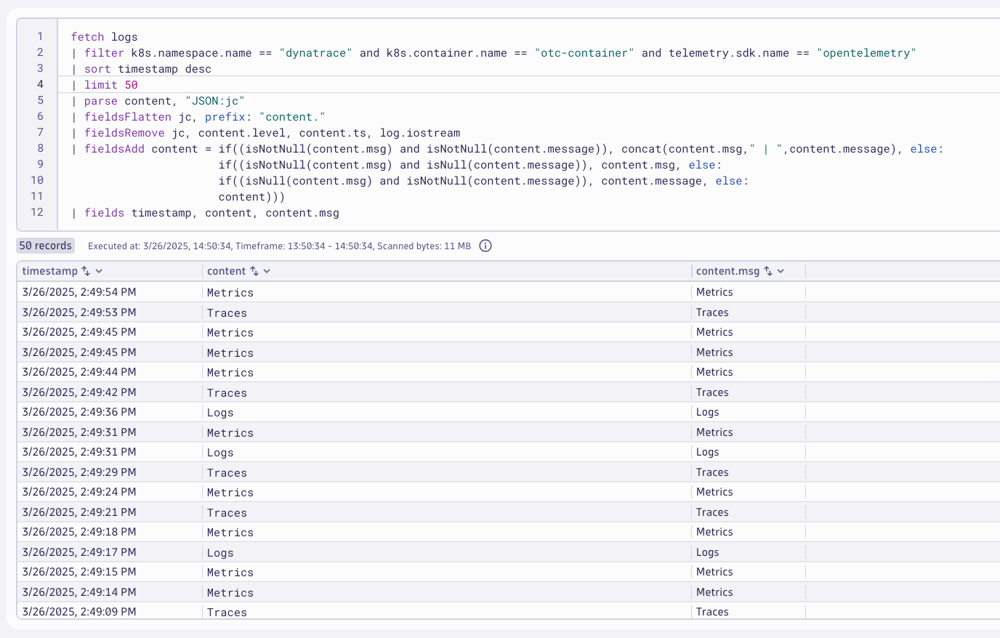
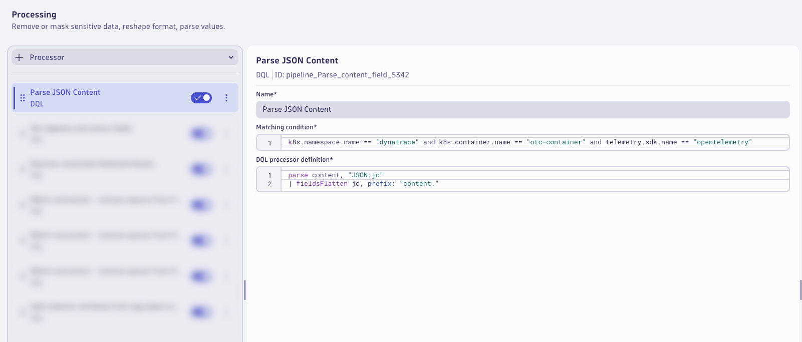
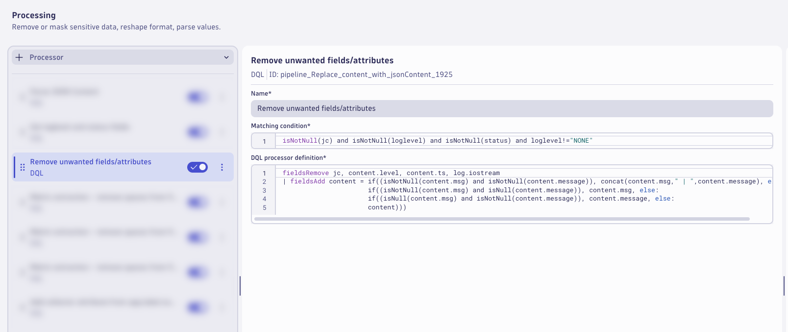
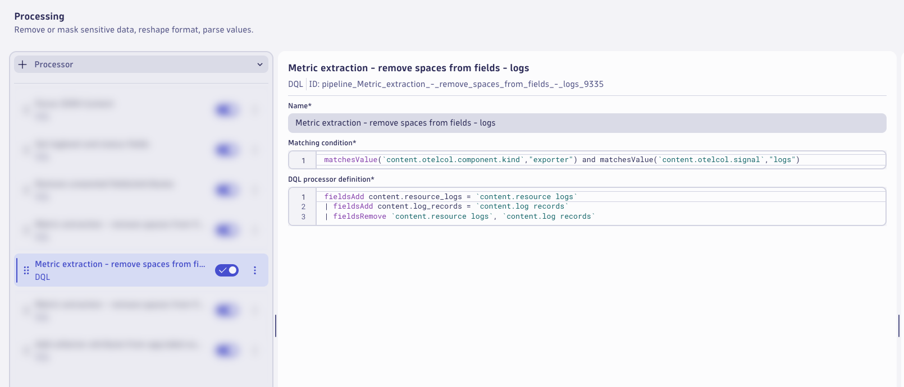
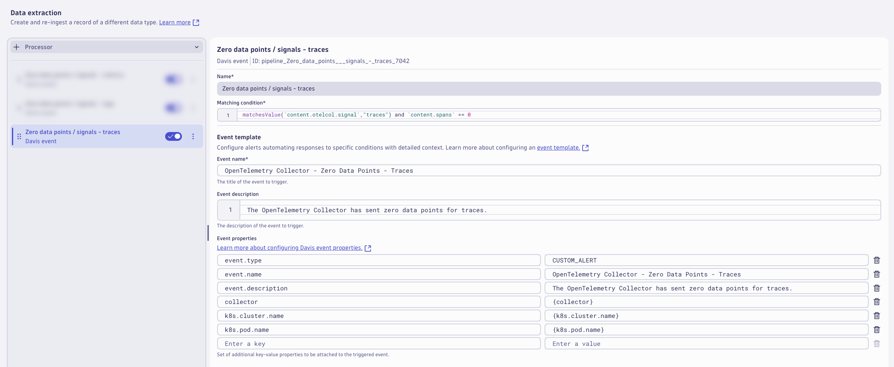
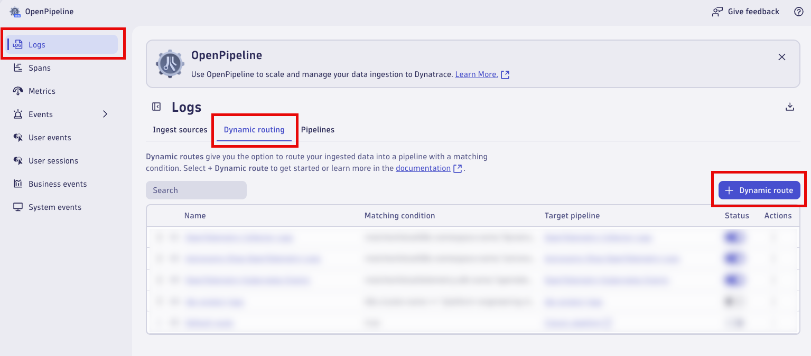
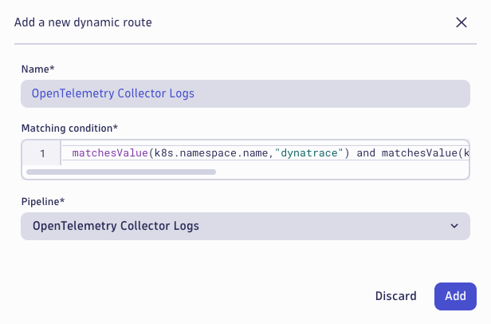

# Dynatrace OpenPipeline - Collector Logs
--8<-- "snippets/send-bizevent/6-dynatrace-openpipeline-collector-logs.js"

In this module we'll utilize Dynatrace OpenPipeline to process OpenTelemetry Collector logs at ingest, in order to make them easier to analyze and leverage.  The logs will be ingested by OpenTelemetry Collector, deployed on Kubernetes as part of the previous module.  The OpenTelemetry Collector logs are output mixed JSON/console format, making them difficult to use by default.  With OpenPipeline, the logs will be processed at ingest, to manipulate fields, extract metrics, and raise alert events in case of any issues.

**Goals:**

* Parse JSON content
* Set loglevel and status
* Remove unwanted fields/attributes
* Extract metrics: successful data points
* Extract metrics: dropped data points
* Alert: zero data points


[Dynatrace OpenPipeline](https://docs.dynatrace.com/docs/discover-dynatrace/platform/openpipeline/concepts/data-flow)

OpenPipeline is an architectural component of Dynatrace SaaS.  It resides between the Dynatrace SaaS tenant and [Grail](https://docs.dynatrace.com/docs/discover-dynatrace/platform/grail/dynatrace-grail) data lakehouse.  Logs (,traces, metrics, events, and more) are sent to the Dynatrace SaaS tenant and route through OpenPipeline where they are enriched, transformed, and contextualized prior to being stored in Grail.

## Query Logs

Query and discover the OpenTelemetry Collector logs as they are ingested and stored in Dynatrace.  Use Dynatrace Query Language (DQL) to transform the logs at query time and prepare for Dynatrace OpenPipeline configuration.

**Import Notebook into Dynatrace**

[OpenTelemetry Collector Logs](https://github.com/dynatrace-wwse/enablement-kubernetes-opentelemetry-openpipeline/blob/main/assets/dynatrace/notebooks/opentelemetry-collector-logs.json)

**OpenTelemetry Collector Logs - Ondemand Processing at Query Time (Notebook)**

The OpenTelemetry Collector can be configured to output JSON structured logs as internal telemetry.  Dynatrace DQL can be used to filter, process, and analyze this log data to ensure reliability of the OpenTelemetry data pipeline.

Query logs in Dynatrace

DQL:
```sql
fetch logs
| filter k8s.namespace.name == "dynatrace" and k8s.container.name == "otc-container" and telemetry.sdk.name == "opentelemetry"
| sort timestamp desc
| limit 50
```

Result:


### Parse JSON Content

[Parse Command](https://docs.dynatrace.com/docs/platform/grail/dynatrace-query-language/commands/extraction-and-parsing-commands#parse)

Parses a record field and puts the result(s) into one or more fields as specified in the pattern.  The parse command works in combination with the Dynatrace Pattern Language for parsing strings.

[Parse JSON Object](https://docs.dynatrace.com/docs/platform/grail/dynatrace-pattern-language/log-processing-json-object)

There are several ways how to control parsing elements from a JSON object. The easiest is to use the JSON matcher without any parameters. It will enumerate all elements, transform them into Log processing data type from their defined type in JSON and returns a variant_object with parsed elements.

The `content` field contains JSON structured details that can be parsed to better analyze relevant fields. The structured content can then be flattened for easier analysis.

[FieldsFlatten Command](https://docs.dynatrace.com/docs/platform/grail/dynatrace-query-language/commands/structuring-commands#fieldsFlatten)

Sample:
```json
{
  "level": "info",
  "ts": "2025-12-31T19:36:45.773Z",
  "msg": "Logs",
  "otelcol.component.id": "debug",
  "otelcol.component.kind": "Exporter",
  "otelcol.signal": "logs",
  "resource logs": "131",
  "log records": "800"
}
```

Query logs in Dynatrace

DQL:
```sql
fetch logs
| filter k8s.namespace.name == "dynatrace" and k8s.container.name == "otc-container" and telemetry.sdk.name == "opentelemetry"
| sort timestamp desc
| limit 50
| parse content, "JSON:jc"
| fieldsFlatten jc, prefix: "content."
| fieldsKeep timestamp, app.label.name, content, jc, "content.*"
```

Result:


### Set `loglevel` and `status` fields

[Selection and Modification](https://docs.dynatrace.com/docs/platform/grail/dynatrace-query-language/commands/selection-and-modification-commands)

The `fieldsAdd` command evaluates an expression and appends or replaces a field.

The JSON structure contains a field `level` that can be used to set the `loglevel` field.  It must be uppercase.

* loglevel possible values are: NONE, TRACE, DEBUG, NOTICE, INFO, WARN, SEVERE, ERROR, CRITICAL, ALERT, FATAL, EMERGENCY
* status field possible values are: ERROR, WARN, INFO, NONE

The `if` conditional function allows you to set a value based on a conditional expression.  Since the `status` field depends on the `loglevel` field, a nested `if` expression can be used.

[If Function](https://docs.dynatrace.com/docs/platform/grail/dynatrace-query-language/functions/conditional-functions#if)

Query logs in Dynatrace

DQL:
```sql
fetch logs
| filter k8s.namespace.name == "dynatrace" and k8s.container.name == "otc-container" and telemetry.sdk.name == "opentelemetry"
| sort timestamp desc
| limit 50
| parse content, "JSON:jc"
| fieldsFlatten jc, prefix: "content."
| fieldsAdd loglevel = upper(content.level)
| fieldsAdd status = if(loglevel=="INFO","INFO",else: // most likely first
                     if(loglevel=="WARN","WARN",else: // second most likely second
                     if(loglevel=="ERROR","ERROR", else: // third most likely third
                     if(loglevel=="NONE","NONE",else: // fourth most likely fourth
                     if(loglevel=="TRACE","INFO",else:
                     if(loglevel=="DEBUG","INFO",else:
                     if(loglevel=="NOTICE","INFO",else:
                     if(loglevel=="SEVERE","ERROR",else:
                     if(loglevel=="CRITICAL","ERROR",else:
                     if(loglevel=="ALERT","ERROR",else:
                     if(loglevel=="FATAL","ERROR",else:
                     if(loglevel=="EMERGENCY","ERROR",else:
                     "NONE"))))))))))))
| fields timestamp, loglevel, status, content, content.level
```

Result:


### Remove unwanted fields/attributes

The `fieldsRemove` command will remove selected fields.

[FieldsRemove Command](https://docs.dynatrace.com/docs/platform/grail/dynatrace-query-language/commands/selection-and-modification-commands#fieldsRemove)

After parsing and flattening the JSON structured content, the original fields should be removed.  Fields that don't add value should be removed at the source, but if they are not, they can be removed with DQL.

Every log record should ideally have a content field, as it is expected.  The `content` field can be updated with values from other fields, such as `content.msg` and `content.message`.

Query logs in Dynatrace

DQL:
```sql
fetch logs
| filter k8s.namespace.name == "dynatrace" and k8s.container.name == "otc-container" and telemetry.sdk.name == "opentelemetry"
| sort timestamp desc
| limit 50
| parse content, "JSON:jc"
| fieldsFlatten jc, prefix: "content."
| fieldsRemove jc, content.level, content.ts, log.iostream
| fieldsAdd content = if((isNotNull(content.msg) and isNotNull(content.message)), concat(content.msg," | ",content.message), else:
                      if((isNotNull(content.msg) and isNull(content.message)), content.msg, else:
                      if((isNull(content.msg) and isNotNull(content.message)), content.message, else:
                      content)))
| fields timestamp, content, content.msg
```

Result:



### Extract Successful Data Points Metric

The `summarize` command enables you to aggregate records to compute results based on counts, attribute values, and more.

[Summarize Command](https://docs.dynatrace.com/docs/platform/grail/dynatrace-query-language/commands/aggregation-commands#summarize)

The JSON structured content contains several fields that indicate the number of successful data points / signals sent by the exporter.

* logs: resource logs, log records
* metrics: resource metrics, metrics, data points
* traces: resource spans, spans

Query logs in Dynatrace

DQL:
```sql
fetch logs
| filter k8s.namespace.name == "dynatrace" and k8s.container.name == "otc-container" and telemetry.sdk.name == "opentelemetry"
| sort timestamp desc
| parse content, "JSON:jc"
| fieldsFlatten jc, prefix: "content."
| filter matchesValue(`content.otelcol.component.kind`,"Exporter")
| fieldsRemove content, jc, content.level, content.ts, log.iostream
| summarize {
              resource_metrics = sum(`content.resource metrics`),
              metrics = sum(`content.metrics`),
              data_points = sum(`content.data points`),
              resource_spans = sum(`content.resource spans`),
              spans = sum(`content.spans`),
              resource_logs = sum(`content.resource logs`),
              log_records = sum(`content.log records`)
              }, by: { signal = `content.otelcol.signal`, exporter = `content.otelcol.component.id`, collector = app.label.name, k8s.cluster.name}
```

Result:


### Extract Dropped Data Points Metric

The JSON structured content contains several fields that indicate the number of dropped data points / signals sent by the exporter.

* dropped items
* signal
* (exporter) name
* collector

Query logs in Dynatrace

DQL:
```sql
fetch logs
| filter k8s.namespace.name == "dynatrace" and k8s.container.name == "otc-container" and telemetry.sdk.name == "opentelemetry"
| sort timestamp desc
| parse content, "JSON:jc"
| fieldsFlatten jc, prefix: "content."
| filter matchesValue(`content.otelcol.component.kind`,"exporter")
| filter matchesValue(`content.level`,"error") and isNotNull(`content.dropped_items`)
| summarize dropped_items = sum(`content.dropped_items`), by: {signal = `content.otelcol.signal`, collector = app.label.name, component = `content.otelcol.component.id`}
```

Result:


You likely won't have any data matching your query as you shouldn't have data drops.  You can force data drops by toggling your Dynatrace API Access Token off for a couple minutes and then turning it back on.


### Alert on Zero Data Points

It would be unexpected that the collector exporter doesn't send any data points or signals.  We could alert on this unexpected behavior.

The field `content.otelcol.signal` will indicate the type of data point or signal.  The fields `content.log records`, `content.data points`, and `content.spans` will indicate the number of signals sent.  If the value is `0`, that is unexpected.

Query logs in Dynatrace

DQL:
```sql
fetch logs
| filter k8s.namespace.name == "dynatrace" and k8s.container.name == "otc-container" and telemetry.sdk.name == "opentelemetry"
| sort timestamp desc
| limit 100
| parse content, "JSON:jc"
| fieldsFlatten jc, prefix: "content."
| filter matchesValue(`content.otelcol.component.kind`,"exporter")
| summarize {
              logs = countIf(matchesValue(`content.otelcol.signal`,"logs") and matchesValue(toString(`content.log records`),"0")),
              metrics = countIf(matchesValue(`content.otelcol.signal`,"metrics") and matchesValue(toString(`content.data points`),"0")),
              traces = countIf(matchesValue(`content.otelcol.signal`,"traces") and matchesValue(toString(`content.spans`),"0"))
            }, by: {signal = `content.otelcol.signal`, collector = app.label.name}
```

Result:


**DQL in Notebooks Summary**

DQL gives you the power to filter, parse, summarize, and analyze log data quickly and on the fly.  This is great for use cases where the format of your log data is unexpected.  However, when you know the format of your log data and you know how you will want to use that log data in the future, you'll want that data to be parsed and presented a certain way during ingest.  OpenPipeline provides the capabilites needed to accomplish this.

## Configure OpenPipeline

Configure Dynatrace OpenPipeline for OpenTelemetry Collector logs.

!!! tip "View Images"
    If the images are too small and the text is difficult to read, right-click and open the image in a new tab.

!!! tip "Save Often"
    Consider saving your pipeline configuration often to avoid losing any changes.

In your Dynatrace tenant, launch the OpenPipeline app.  Begin by selecting `Logs` from the left-hand menu of telemetry types.  Then choose `Pipelines`.  Click on `+ Pipeline` to add a new pipeline.


Name the new pipeline, `OpenTelemetry Collector Logs`.  Click on the `Processing` tab to begin adding `Processor` rules.


### Parse JSON Content

Add a processor to parse the JSON structured content field.  Click on `+ Processor` to add a new processor.

Name:
```text
Parse JSON Content
```

Matching condition:
```text
k8s.namespace.name == "dynatrace" and k8s.container.name == "otc-container" and telemetry.sdk.name == "opentelemetry"
```

Processor definition:
```text
parse content, "JSON:jc"
| fieldsFlatten jc, prefix: "content."
```



### Loglevel and Status

Add a processor to set the loglevel and status fields.  Click on `+ Processor` to add a new processor.

Name:
```text
Set loglevel and status fields
```

Matching condition:
```text
isNotNull(`content.level`)
```

Processor definition:
```text
fieldsAdd loglevel = upper(content.level)
| fieldsAdd status = if(loglevel=="INFO","INFO",else: // most likely first
                     if(loglevel=="WARN","WARN",else: // second most likely second
                     if(loglevel=="ERROR","ERROR", else: // third most likely third
                     if(loglevel=="NONE","NONE",else: // fourth most likely fourth
                     if(loglevel=="TRACE","INFO",else:
                     if(loglevel=="DEBUG","INFO",else:
                     if(loglevel=="NOTICE","INFO",else:
                     if(loglevel=="SEVERE","ERROR",else:
                     if(loglevel=="CRITICAL","ERROR",else:
                     if(loglevel=="ALERT","ERROR",else:
                     if(loglevel=="FATAL","ERROR",else:
                     if(loglevel=="EMERGENCY","ERROR",else:
                     "NONE"))))))))))))
```


### Remove Fields

Add a processor to remove the extra and unwanted fields.  Click on `+ Processor` to add a new processor.

Name:
```text
Remove unwanted fields/attributes
```

Matching condition:
```text
isNotNull(jc) and isNotNull(loglevel) and isNotNull(status) and loglevel!="NONE"
```

DQL processor definition
```text
fieldsRemove jc, content.level, content.ts, log.iostream
| fieldsAdd content = if((isNotNull(content.msg) and isNotNull(content.message)), concat(content.msg," | ",content.message), else:
                      if((isNotNull(content.msg) and isNull(content.message)), content.msg, else:
                      if((isNull(content.msg) and isNotNull(content.message)), content.message, else:
                      content)))
```



### Remove Spaces from Metrics Fields

Add a processor to remove the spaces from the metrics fields.  Click on `+ Processor` to add a new processor.

Name:
```text
Metric extraction - remove spaces from fields - metrics
```

Matching condition:
```text
matchesValue(`content.otelcol.component.kind`,"exporter") and matchesValue(`content.otelcol.signal`,"metrics")
```

DQL processor definition
```text
fieldsAdd content.resource_metrics = `content.resource metrics`
| fieldsAdd content.data_points = `content.data points`
| fieldsRemove `content.resource metrics`, `content.data points`
```


### Remove Spaces from Logs Fields

Add a processor to remove the spaces from the logs fields.  Click on `+ Processor` to add a new processor.

Name:
```text
Metric extraction - remove spaces from fields - logs
```

Matching condition:
```text
matchesValue(`content.otelcol.component.kind`,"exporter") and matchesValue(`content.otelcol.signal`,"logs")
```

DQL processor definition
```text
fieldsAdd content.resource_logs = `content.resource logs`
| fieldsAdd content.log_records = `content.log records`
| fieldsRemove `content.resource logs`, `content.log records`
```



### Remove Spaces from Traces Fields

Add a processor to remove the spaces from the traces fields.  Click on `+ Processor` to add a new processor.

Name:
```text
Metric extraction - remove spaces from fields - traces
```

Matching condition:
```text
matchesValue(`content.otelcol.component.kind`,"exporter") and matchesValue(`content.otelcol.signal`,"traces")
```

DQL processor definition
```text
fieldsAdd content.resource_spans = `content.resource spans`
| fieldsRemove `content.resource spans`
```


### Collector Attribute

Add a processor to add the collector attribute from the app.label.name field.  Click on `+ Processor` to add a new processor.

Name:
```text
Add collector attribute from app.label.name
```

Matching condition:
```text
isNotNull(app.label.name)
```

DQL processor definition
```text
fieldsAdd collector = app.label.name
```


!!! tip "Consider Saving"
    Consider saving your pipeline configuration often to avoid losing any changes.

### Zero Data Points for Metrics

Switch to the `Data extraction` tab.

Add a processor to extract a `Davis Event`.  Click on `+ Processor` to add a new processor.

Name:
```text
Zero data points / signals - metrics
```

Matching condition:
```text
matchesValue(`content.otelcol.signal`,"metrics") and `content.data_points` == 0
```

Event Name:
```text
OpenTelemetry Collector - Zero Data Points - Metrics
```

Event description:
```text
The OpenTelemetry Collector has sent zero data points for metrics.
```

Additional event properties:

| Property             | Value               |
|----------------------|---------------------|
| collector            | {collector}         |
| k8s.cluster.name     | {k8s.cluster.name}  |
| k8s.pod.name         | {k8s.pod.name}      |


### Zero Data Points for Logs

Add a processor to extract a `Davis Event`.  Click on `+ Processor` to add a new processor.

Name:
```text
Zero data points / signals - logs
```

Matching condition:
```text
matchesValue(`content.otelcol.signal`,"logs") and `content.log_records` == 0
```

Event Name:
```text
OpenTelemetry Collector - Zero Data Points - Logs
```

Event description:
```text
The OpenTelemetry Collector has sent zero data points for logs.
```

Additional event properties:

| Property             | Value               |
|----------------------|---------------------|
| collector            | {collector}         |
| k8s.cluster.name     | {k8s.cluster.name}  |
| k8s.pod.name         | {k8s.pod.name}      |


### Zero Data Points for Traces

Add a processor to extract a `Davis Event`.  Click on `+ Processor` to add a new processor.

Name:
```text
Zero data points / signals - traces
```

Matching condition:
```text
matchesValue(`content.otelcol.signal`,"traces") and `content.spans` == 0
```

Event Name:
```text
OpenTelemetry Collector - Zero Data Points - Traces
```

Event description:
```text
The OpenTelemetry Collector has sent zero data points for traces.
```

Additional event properties:

| Property             | Value               |
|----------------------|---------------------|
| collector            | {collector}         |
| k8s.cluster.name     | {k8s.cluster.name}  |
| k8s.pod.name         | {k8s.pod.name}      |



!!! tip "Consider Saving"
    Consider saving your pipeline configuration often to avoid losing any changes.

### Successful Data Points for Metrics 

Switch to the `Metric Extraction` tab.

Add a processor to extract a metric for successful metric data points from the exporter logs.  Click on `+ Processor` to add a new processor.

Name:
```text
Successful data points - metrics
```

Matching condition:
```text
matchesValue(`content.otelcol.component.kind`,"exporter") and matchesValue(`content.otelcol.signal`,"metrics")
```

Field Extraction:
```text
content.data_points
```

Metric Key:
```text
otelcol_exporter_sent_metric_data_points
```

Dimensions:

| Dimension            |
|----------------------|
| collector            |
| k8s.cluster.name     |
| k8s.pod.name         |


### Successful Data Points for Logs

Add a processor to extract a metric for successful log data points from the exporter logs.  Click on `+ Processor` to add a new processor.

Name:
```text
Successful data points - logs
```

Matching condition:
```text
matchesValue(`content.otelcol.component.kind`,"exporter") and matchesValue(`content.otelcol.signal`,"logs")
```

Field Extraction:
```text
content.log_records
```

Metric Key:
```text
otelcol_exporter_sent_log_records
```

Dimensions:

| Dimension            |
|----------------------|
| collector            |
| k8s.cluster.name     |
| k8s.pod.name         |


### Successful Data Points for Traces

Add a processor to extract a metric for successful trace data points from the exporter logs.  Click on `+ Processor` to add a new processor.

Name:
```text
Successful data points - traces
```

Matching condition:
```text
matchesValue(`content.otelcol.component.kind`,"exporter") and matchesValue(`content.otelcol.signal`,"traces")
```

Field Extraction:
```text
content.spans
```

Metric Key:
```text
otelcol_exporter_sent_trace_spans
```

Dimensions:

| Dimension            |
|----------------------|
| collector            |
| k8s.cluster.name     |
| k8s.pod.name         |


### Dropped Data Points

Add a processor to extract a metric for dropped data points from the exporter logs.  Click on `+ Processor` to add a new processor.

Name:
```text
Dropped data points
```

Matching condition:
```text
matchesValue(`content.otelcol.component.kind`,"exporter") and isNotNull(`content.dropped_items`) and isNotNull(`content.otelcol.signal`)
```

Field Extraction:
```text
content.dropped_data_points
```

Metric Key:
```text
otelcol_exporter_dropped_data_points_by_data_type
```

Dimensions:

| Dimension            |
|----------------------|
| collector            |
| k8s.cluster.name     |
| k8s.pod.name         |


The pipeline is now configured, click on `Save` to save the pipeline configuration.


### Dynamic Route

A pipeline will not have any effect unless logs are configured to be routed to the pipeline.  With dynamic routing, data is routed based on a matching condition. The matching condition is a DQL query that defines the data set you want to route.

Click on `Dynamic Routing` to configure a route to the target pipeline.  Click on `+ Dynamic Route` to add a new route.



Configure the `Dynamic Route` to use the `OpenTelemetry Collector Logs` pipeline.

Name:
```text
OpenTelemetry Collector Logs
```

Matching condition:
```text
matchesValue(k8s.namespace.name,"dynatrace") and matchesValue(k8s.container.name,"otc-container") and matchesValue(telemetry.sdk.name,"opentelemetry")
```

Pipeline:
```text
OpenTelemetry Collector Logs
```

Click `Add` to add the route.



Validate that the route is enabled in the `Status` column.  Click on `Save` to save the dynamic route table configuration.


Allow `dynatrace` OpenTelemetry Collectors to generate new log data that will be routed through the new pipeline (3-5 minutes).

## Analyze Results

Analyze the OpenTelemetry Collector logs after Dynatrace OpenPipeline processing.

### Analyze the results in Dynatrace (Notebook)

Query the OpenTelemetry Collector logs that have been processed by Dynatrace OpenPipeline.

DQL: OpenPipeline Processing Results
```sql
fetch logs
| filter k8s.namespace.name == "dynatrace" and k8s.container.name == "otc-container" and telemetry.sdk.name == "opentelemetry"
| fieldsRemove cloud.account.id // removed for data privacy and security reasons only
| sort timestamp desc
| limit 50
| fieldsKeep timestamp, collector, k8s.cluster.name, loglevel, status, "content.*", content
```

Result:


The logs are now parsed at ingest into a format that simplifies our queries and makes them easier to use, especially for users that don't work with these log sources or Dynatrace DQL on a regular basis.

Query the new log metric extracted by Dynatrace OpenPipeline, using the `timeseries` command.

DQL: Extracted metrics: successful data points / signals
```sql
timeseries { logs = sum(log.otelcol_exporter_sent_log_records) }, by: {k8s.cluster.name, collector}
```

Result:


By extracting the metric(s) at ingest time, the data points are stored long term and can easily be used in dashboards, anomaly detection, and automations.

[Metric Extraction](https://docs.dynatrace.com/docs/platform/openpipeline/use-cases/tutorial-log-processing-pipeline)

Query the new dropped data points / signals metric extracted by Dynatrace OpenPipeline, using the `timeseries` command.

DQL: Extracted metrics: dropped data points / signals
```sql
timeseries { dropped_items = sum(log.otelcol_exporter_dropped_items_by_signal, default: 0) }, by: {k8s.cluster.name, collector, signal}
```

Result:


You likely won't have any data matching your query as you shouldn't have data drops.  You can force data drops by toggling your Dynatrace API Access Token off for a couple minutes and then turning it back on.


### OpenTelemetry Collector Dashboard

Import Dashboard into Dynatrace

[OpenTelemetry Collector Dashboard](https://github.com/dynatrace-wwse/enablement-kubernetes-opentelemetry-openpipeline/blob/main/assets/dynatrace/dashboards/opentelemetry-collector-health-openpipeline.json)

Explore the OpenTelemetry Collector [IsItObservable] - OpenPipeline Dashboard that you imported.


## Wrap Up

**What You Learned Today**

By completing this module, you've successfully set up Dynatrace OpenPipeline pipelines to process the OpenTelemetry logs at ingest.

- OpenTelemetry Collector logs
    * Parse JSON structured content field to easily filter, aggregate, and analyze on nested fields
    * Set loglevel and status fields to easily identify errors with the OpenTelemetry Collector
    * Remove unwanted fields/attributes to reduce log bloat and optimize queries
    * Extract metrics: successful data points to track OpenTelemetry Collector health and reduce heavy log queries
    * Extract metrics: dropped data points to track OpenTelemetry Collector health and reduce heavy log queries
    * Alert: zero data points to be alerted on OpenTelemetry Collector health issues

## Continue

<div class="grid cards" markdown>
- [Continue to Configuring OpenPipeline for Astronomy Shop logs:octicons-arrow-right-24:](7-dynatrace-openpipeline-astronomy-shop-logs.md)
</div>
