# Dynatrace OpenPipeline
--8<-- "snippets/send-bizevent/6-dynatrace-openpipeline.js"

## Dynatrace OpenPipeline
In this lab we'll utilize Dynatrace OpenPipeline to process OpenTelemetry logs at ingest, in order to make them easier to analyze and leverage.  The logs will be ingested by OpenTelemetry Collector, deployed on Kubernetes as part of the previous lab.  The OpenTelemetry Collector logs are output mixed JSON/console format, making them difficult to use by default.  With OpenPipeline, the logs will be processed at ingest, to manipulate fields, extract metrics, and raise alert events in case of any issues.

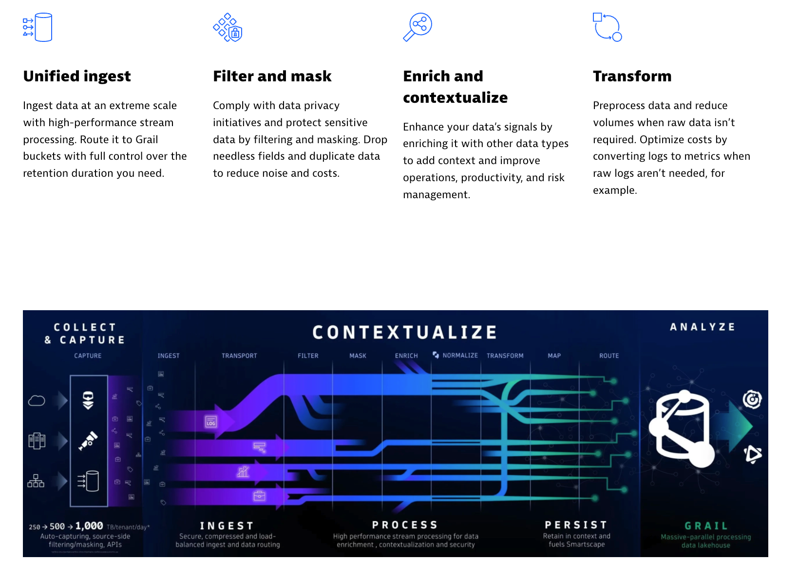

[Dynatrace OpenPipeline](https://docs.dynatrace.com/docs/discover-dynatrace/platform/openpipeline/concepts/data-flow)

OpenPipeline is an architectural component of Dynatrace SaaS.  It resides between the Dynatrace SaaS tenant and [Grail](https://docs.dynatrace.com/docs/discover-dynatrace/platform/grail/dynatrace-grail) data lakehouse.  Logs (,traces, metrics, events, and more) are sent to the Dynatrace SaaS tenant and route through OpenPipeline where they are enriched, transformed, and contextualized prior to being stored in Grail.

Lab tasks:
1. Process OpenTelemetry Collector internal telemetry logs with OpenPipeline
1. Process Astronomy Shop logs with OpenPipeline
1. Process Kubernetes Events logs with OpenPipeline

## OpenTelemetry Collector Logs - Query
Query and discover the OpenTelemetry Collector logs as they are ingested and stored in Dynatrace.  Use Dynatrace Query Language (DQL) to transform the logs at query time and prepare for Dynatrace OpenPipeline configuration.

### Import Notebook into Dynatrace
[OpenTelemetry Collector Logs](https://github.com/dynatrace-wwse/enablement-kubernetes-opentelemetry-openpipeline/blob/main/assets/dynatrace/notebooks/opentelemetry-collector-logs.json)

### OpenTelemetry Collector Logs - Ondemand Processing at Query Time (Notebook)

The OpenTelemetry Collector can be configured to output JSON structured logs as internal telemetry.  Dynatrace DQL can be used to filter, process, and analyze this log data to ensure reliability of the OpenTelemetry data pipeline.

By default, OpenTelemetry Collector logs are output mixed JSON/console format, making them difficult to use.

### Goals:
* Parse JSON content
* Set loglevel and status
* Remove unwanted fields/attributes
* Extract metrics: successful data points
* Extract metrics: dropped data points
* Alert: zero data points

### Query logs in Dynatrace
DQL:
```sql
fetch logs
| filter k8s.namespace.name == "dynatrace" and k8s.container.name == "otc-container" and telemetry.sdk.name == "opentelemetry"
| sort timestamp desc
| limit 50
```
Result:


### Parse JSON Content
[Parse Command](https://docs.dynatrace.com/docs/platform/grail/dynatrace-query-language/commands/extraction-and-parsing-commands#parse)

Parses a record field and puts the result(s) into one or more fields as specified in the pattern.  The parse command works in combination with the Dynatrace Pattern Language for parsing strings.

[Parse JSON Object](https://docs.dynatrace.com/docs/platform/grail/dynatrace-pattern-language/log-processing-json-object)

There are several ways how to control parsing elements from a JSON object. The easiest is to use the JSON matcher without any parameters. It will enumerate all elements, transform them into Log processing data type from their defined type in JSON and returns a variant_object with parsed elements.

The `content` field contains JSON structured details that can be parsed to better analyze relevant fields. The structured content can then be flattened for easier analysis.

[FieldsFlatten Command](https://docs.dynatrace.com/docs/platform/grail/dynatrace-query-language/commands/structuring-commands#fieldsFlatten)

Sample:
```json
{
  "level": "info",
  "ts": "2025-12-31T19:36:45.773Z",
  "msg": "Logs",
  "otelcol.component.id": "debug",
  "otelcol.component.kind": "Exporter",
  "otelcol.signal": "logs",
  "resource logs": "131",
  "log records": "800"
}
```

### Query logs in Dynatrace
DQL:
```sql
fetch logs
| filter k8s.namespace.name == "dynatrace" and k8s.container.name == "otc-container" and telemetry.sdk.name == "opentelemetry"
| sort timestamp desc
| limit 50
| parse content, "JSON:jc"
| fieldsFlatten jc, prefix: "content."
| fieldsKeep timestamp, app.label.name, content, jc, "content.*"
```
Result:

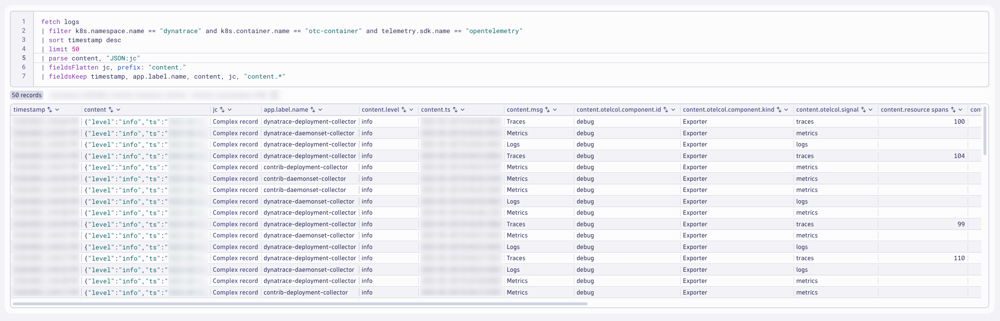

### Set `loglevel` and `status` fields
[Selection and Modification](https://docs.dynatrace.com/docs/platform/grail/dynatrace-query-language/commands/selection-and-modification-commands)

The `fieldsAdd` command evaluates an expression and appends or replaces a field.

The JSON structure contains a field `level` that can be used to set the `loglevel` field.  It must be uppercase.

* loglevel possible values are: NONE, TRACE, DEBUG, NOTICE, INFO, WARN, SEVERE, ERROR, CRITICAL, ALERT, FATAL, EMERGENCY
* status field possible values are: ERROR, WARN, INFO, NONE

The `if` conditional function allows you to set a value based on a conditional expression.  Since the `status` field depends on the `loglevel` field, a nested `if` expression can be used.

[If Function](https://docs.dynatrace.com/docs/platform/grail/dynatrace-query-language/functions/conditional-functions#if)

### Query logs in Dynatrace
DQL:
```sql
fetch logs
| filter k8s.namespace.name == "dynatrace" and k8s.container.name == "otc-container" and telemetry.sdk.name == "opentelemetry"
| sort timestamp desc
| limit 50
| parse content, "JSON:jc"
| fieldsFlatten jc, prefix: "content."
| fieldsAdd loglevel = upper(content.level)
| fieldsAdd status = if(loglevel=="INFO","INFO",else: // most likely first
                     if(loglevel=="WARN","WARN",else: // second most likely second
                     if(loglevel=="ERROR","ERROR", else: // third most likely third
                     if(loglevel=="NONE","NONE",else: // fourth most likely fourth
                     if(loglevel=="TRACE","INFO",else:
                     if(loglevel=="DEBUG","INFO",else:
                     if(loglevel=="NOTICE","INFO",else:
                     if(loglevel=="SEVERE","ERROR",else:
                     if(loglevel=="CRITICAL","ERROR",else:
                     if(loglevel=="ALERT","ERROR",else:
                     if(loglevel=="FATAL","ERROR",else:
                     if(loglevel=="EMERGENCY","ERROR",else:
                     "NONE"))))))))))))
| fields timestamp, loglevel, status, content, content.level
```
Result:


### Remove unwanted fields/attributes

The `fieldsRemove` command will remove selected fields.

[FieldsRemove Command](https://docs.dynatrace.com/docs/platform/grail/dynatrace-query-language/commands/selection-and-modification-commands#fieldsRemove)

After parsing and flattening the JSON structured content, the original fields should be removed.  Fields that don't add value should be removed at the source, but if they are not, they can be removed with DQL.

Every log record should ideally have a content field, as it is expected.  The `content` field can be updated with values from other fields, such as `content.msg` and `content.message`.

### Query logs in Dynatrace
DQL:
```sql
fetch logs
| filter k8s.namespace.name == "dynatrace" and k8s.container.name == "otc-container" and telemetry.sdk.name == "opentelemetry"
| sort timestamp desc
| limit 50
| parse content, "JSON:jc"
| fieldsFlatten jc, prefix: "content."
| fieldsRemove jc, content.level, content.ts, log.iostream
| fieldsAdd content = if((isNotNull(content.msg) and isNotNull(content.message)), concat(content.msg," | ",content.message), else:
                      if((isNotNull(content.msg) and isNull(content.message)), content.msg, else:
                      if((isNull(content.msg) and isNotNull(content.message)), content.message, else:
                      content)))
| fields timestamp, content, content.msg
```
Result:

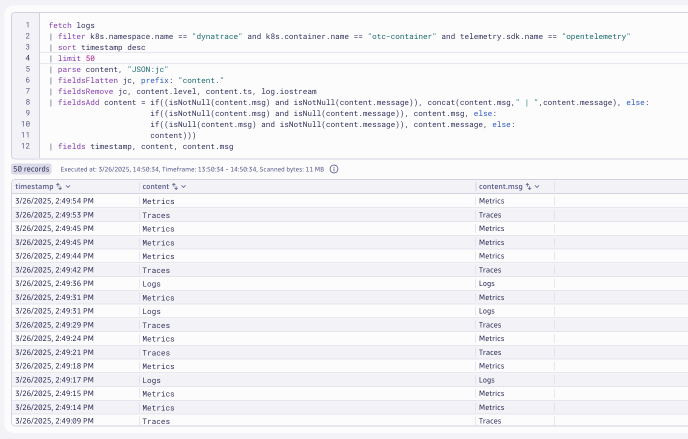

### Extract metrics: successful data points / signals

The `summarize` command enables you to aggregate records to compute results based on counts, attribute values, and more.

[Summarize Command](https://docs.dynatrace.com/docs/platform/grail/dynatrace-query-language/commands/aggregation-commands#summarize)

The JSON structured content contains several fields that indicate the number of successful data points / signals sent by the exporter.
* logs: resource logs, log records
* metrics: resource metrics, metrics, data points
* traces: resource spans, spans

### Query logs in Dynatrace
DQL:
```sql
fetch logs
| filter k8s.namespace.name == "dynatrace" and k8s.container.name == "otc-container" and telemetry.sdk.name == "opentelemetry"
| sort timestamp desc
| parse content, "JSON:jc"
| fieldsFlatten jc, prefix: "content."
| filter matchesValue(`content.otelcol.component.kind`,"Exporter")
| fieldsRemove content, jc, content.level, content.ts, log.iostream
| summarize {
              resource_metrics = sum(`content.resource metrics`),
              metrics = sum(`content.metrics`),
              data_points = sum(`content.data points`),
              resource_spans = sum(`content.resource spans`),
              spans = sum(`content.spans`),
              resource_logs = sum(`content.resource logs`),
              log_records = sum(`content.log records`)
              }, by: { signal = `content.otelcol.signal`, exporter = `content.otelcol.component.id`, collector = app.label.name, k8s.cluster.name}
```
Result:


### Extract metrics: dropped data points / signals

The JSON structured content contains several fields that indicate the number of dropped data points / signals sent by the exporter.
* dropped items
* signal
* (exporter) name
* collector

### Query logs in Dynatrace
DQL:
```sql
fetch logs
| filter k8s.namespace.name == "dynatrace" and k8s.container.name == "otc-container" and telemetry.sdk.name == "opentelemetry"
| sort timestamp desc
| parse content, "JSON:jc"
| fieldsFlatten jc, prefix: "content."
| filter matchesValue(`content.otelcol.component.kind`,"exporter")
| filter matchesValue(`content.level`,"error") and isNotNull(`content.dropped_items`)
| summarize dropped_items = sum(`content.dropped_items`), by: {signal = `content.otelcol.signal`, collector = app.label.name, component = `content.otelcol.component.id`}
```
Result:


You likely won't have any data matching your query as you shouldn't have data drops.  You can force data drops by toggling your Dynatrace API Access Token off for a couple minutes and then turning it back on.


### Alert: zero data points / signals

It would be unexpected that the collector exporter doesn't send any data points or signals.  We could alert on this unexpected behavior.

The field `content.otelcol.signal` will indicate the type of data point or signal.  The fields `content.log records`, `content.data points`, and `content.spans` will indicate the number of signals sent.  If the value is `0`, that is unexpected.

### Query logs in Dynatrace
DQL:
```sql
fetch logs
| filter k8s.namespace.name == "dynatrace" and k8s.container.name == "otc-container" and telemetry.sdk.name == "opentelemetry"
| sort timestamp desc
| limit 100
| parse content, "JSON:jc"
| fieldsFlatten jc, prefix: "content."
| filter matchesValue(`content.otelcol.component.kind`,"exporter")
| summarize {
              logs = countIf(matchesValue(`content.otelcol.signal`,"logs") and matchesValue(toString(`content.log records`),"0")),
              metrics = countIf(matchesValue(`content.otelcol.signal`,"metrics") and matchesValue(toString(`content.data points`),"0")),
              traces = countIf(matchesValue(`content.otelcol.signal`,"traces") and matchesValue(toString(`content.spans`),"0"))
            }, by: {signal = `content.otelcol.signal`, collector = app.label.name}
```
Result:


### DQL in Notebooks Summary

DQL gives you the power to filter, parse, summarize, and analyze log data quickly and on the fly.  This is great for use cases where the format of your log data is unexpected.  However, when you know the format of your log data and you know how you will want to use that log data in the future, you'll want that data to be parsed and presented a certain way during ingest.  OpenPipeline provides the capabilites needed to accomplish this.

## OpenTelemetry Collector Logs - OpenPipeline
Configure Dynatrace OpenPipeline for OpenTelemetry Collector logs.

### Create and Configure Dynatrace OpenPipeline

> ⚠️ If the images are too small and the text is difficult to read, right-click and open the image in a new tab.

> ⚠️ Consider saving your pipeline configuration often to avoid losing any changes.

In your Dynatrace tenant, launch the OpenPipeline app.  Begin by selecting `Logs` from the left-hand menu of telemetry types.  Then choose `Pipelines`.  Click on `+ Pipeline` to add a new pipeline.


Name the new pipeline, `OpenTelemetry Collector Logs`.  Click on the `Processing` tab to begin adding `Processor` rules.

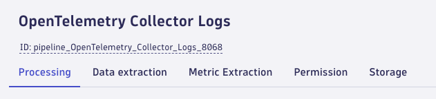

### Parse JSON Content

Add a processor to parse the JSON structured content field.  Click on `+ Processor` to add a new processor.

Name:
```text
Parse JSON Content
```

Matching condition:
```text
k8s.namespace.name == "dynatrace" and k8s.container.name == "otc-container" and telemetry.sdk.name == "opentelemetry"
```

Processor definition:
```text
parse content, "JSON:jc"
| fieldsFlatten jc, prefix: "content."
```


### Loglevel and Status

Add a processor to set the loglevel and status fields.  Click on `+ Processor` to add a new processor.

Name:
```text
Set loglevel and status fields
```

Matching condition:
```text
isNotNull(`content.level`)
```

Processor definition:
```text
fieldsAdd loglevel = upper(content.level)
| fieldsAdd status = if(loglevel=="INFO","INFO",else: // most likely first
                     if(loglevel=="WARN","WARN",else: // second most likely second
                     if(loglevel=="ERROR","ERROR", else: // third most likely third
                     if(loglevel=="NONE","NONE",else: // fourth most likely fourth
                     if(loglevel=="TRACE","INFO",else:
                     if(loglevel=="DEBUG","INFO",else:
                     if(loglevel=="NOTICE","INFO",else:
                     if(loglevel=="SEVERE","ERROR",else:
                     if(loglevel=="CRITICAL","ERROR",else:
                     if(loglevel=="ALERT","ERROR",else:
                     if(loglevel=="FATAL","ERROR",else:
                     if(loglevel=="EMERGENCY","ERROR",else:
                     "NONE"))))))))))))
```

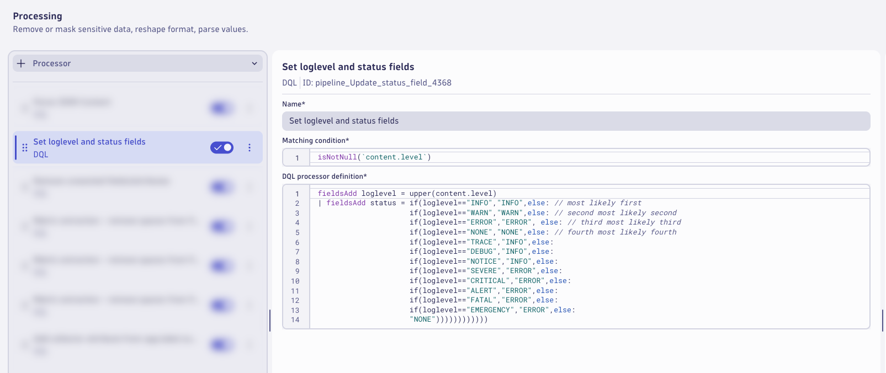

### Remove Fields

Add a processor to remove the extra and unwanted fields.  Click on `+ Processor` to add a new processor.

Name:
```text
Remove unwanted fields/attributes
```

Matching condition:
```text
isNotNull(jc) and isNotNull(loglevel) and isNotNull(status) and loglevel!="NONE"
```

DQL processor definition
```text
fieldsRemove jc, content.level, content.ts, log.iostream
| fieldsAdd content = if((isNotNull(content.msg) and isNotNull(content.message)), concat(content.msg," | ",content.message), else:
                      if((isNotNull(content.msg) and isNull(content.message)), content.msg, else:
                      if((isNull(content.msg) and isNotNull(content.message)), content.message, else:
                      content)))
```

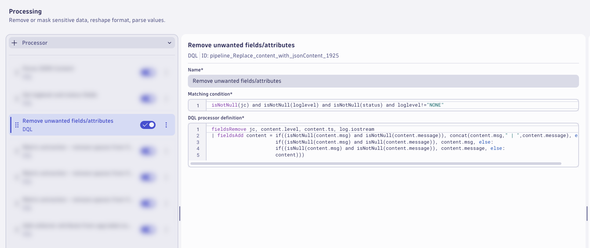

### Remove Spaces from Metrics Fields

Add a processor to remove the spaces from the metrics fields.  Click on `+ Processor` to add a new processor.

Name:
```text
Metric extraction - remove spaces from fields - metrics
```

Matching condition:
```text
matchesValue(`content.otelcol.component.kind`,"exporter") and matchesValue(`content.otelcol.signal`,"metrics")
```

DQL processor definition
```text
fieldsAdd content.resource_metrics = `content.resource metrics`
| fieldsAdd content.data_points = `content.data points`
| fieldsRemove `content.resource metrics`, `content.data points`
```


### Remove Spaces from Logs Fields

Add a processor to remove the spaces from the logs fields.  Click on `+ Processor` to add a new processor.

Name:
```text
Metric extraction - remove spaces from fields - logs
```

Matching condition:
```text
matchesValue(`content.otelcol.component.kind`,"exporter") and matchesValue(`content.otelcol.signal`,"logs")
```

DQL processor definition
```text
fieldsAdd content.resource_logs = `content.resource logs`
| fieldsAdd content.log_records = `content.log records`
| fieldsRemove `content.resource logs`, `content.log records`
```


### Remove Spaces from Traces Fields

Add a processor to remove the spaces from the traces fields.  Click on `+ Processor` to add a new processor.

Name:
```text
Metric extraction - remove spaces from fields - traces
```

Matching condition:
```text
matchesValue(`content.otelcol.component.kind`,"exporter") and matchesValue(`content.otelcol.signal`,"traces")
```

DQL processor definition
```text
fieldsAdd content.resource_spans = `content.resource spans`
| fieldsRemove `content.resource spans`
```


### Collector Attribute

Add a processor to add the collector attribute from the app.label.name field.  Click on `+ Processor` to add a new processor.

Name:
```text
Add collector attribute from app.label.name
```

Matching condition:
```text
isNotNull(app.label.name)
```

DQL processor definition
```text
fieldsAdd collector = app.label.name
```


> ⚠️ Consider saving your pipeline configuration often to avoid losing any changes.

### Zero Data Points for Metrics

Switch to the `Data extraction` tab.

Add a processor to extract a `Davis Event`.  Click on `+ Processor` to add a new processor.

Name:
```text
Zero data points / signals - metrics
```

Matching condition:
```text
matchesValue(`content.otelcol.signal`,"metrics") and `content.data_points` == 0
```

Event Name:
```text
OpenTelemetry Collector - Zero Data Points - Metrics
```

Event description:
```text
The OpenTelemetry Collector has sent zero data points for metrics.
```

Additional event properties:
| Property             | Value               |
|----------------------|---------------------|
| collector            | {collector}         |
| k8s.cluster.name     | {k8s.cluster.name}  |
| k8s.pod.name         | {k8s.pod.name}      |


### Zero Data Points for Logs

Add a processor to extract a `Davis Event`.  Click on `+ Processor` to add a new processor.

Name:
```text
Zero data points / signals - logs
```

Matching condition:
```text
matchesValue(`content.otelcol.signal`,"logs") and `content.log_records` == 0
```

Event Name:
```text
OpenTelemetry Collector - Zero Data Points - Logs
```

Event description:
```text
The OpenTelemetry Collector has sent zero data points for logs.
```

Additional event properties:
| Property             | Value               |
|----------------------|---------------------|
| collector            | {collector}         |
| k8s.cluster.name     | {k8s.cluster.name}  |
| k8s.pod.name         | {k8s.pod.name}      |

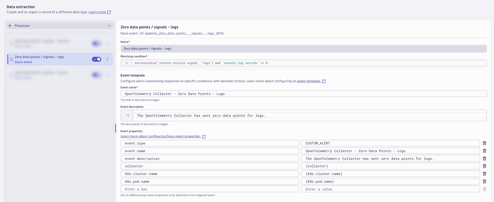

### Zero Data Points for Traces

Add a processor to extract a `Davis Event`.  Click on `+ Processor` to add a new processor.

Name:
```text
Zero data points / signals - traces
```

Matching condition:
```text
matchesValue(`content.otelcol.signal`,"traces") and `content.spans` == 0
```

Event Name:
```text
OpenTelemetry Collector - Zero Data Points - Traces
```

Event description:
```text
The OpenTelemetry Collector has sent zero data points for traces.
```

Additional event properties:
| Property             | Value               |
|----------------------|---------------------|
| collector            | {collector}         |
| k8s.cluster.name     | {k8s.cluster.name}  |
| k8s.pod.name         | {k8s.pod.name}      |


### Successful Data Points for Metrics 

Switch to the `Metric Extraction` tab.

Add a processor to extract a metric for successful metric data points from the exporter logs.  Click on `+ Processor` to add a new processor.

Name:
```text
Successful data points - metrics
```

Matching condition:
```text
matchesValue(`content.otelcol.component.kind`,"exporter") and matchesValue(`content.otelcol.signal`,"metrics")
```

Field Extraction:
```text
content.data_points
```

Metric Key:
```text
otelcol_exporter_sent_metric_data_points
```

Dimensions:
| Dimension            |
|----------------------|
| collector            |
| k8s.cluster.name     |
| k8s.pod.name         |

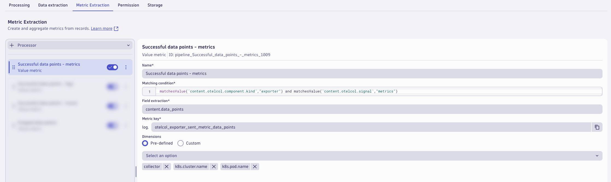

### Successful Data Points for Logs

Add a processor to extract a metric for successful log data points from the exporter logs.  Click on `+ Processor` to add a new processor.

Name:
```text
Successful data points - logs
```

Matching condition:
```text
matchesValue(`content.otelcol.component.kind`,"exporter") and matchesValue(`content.otelcol.signal`,"logs")
```

Field Extraction:
```text
content.log_records
```

Metric Key:
```text
otelcol_exporter_sent_log_records
```

Dimensions:
| Dimension            |
|----------------------|
| collector            |
| k8s.cluster.name     |
| k8s.pod.name         |


### Successful Data Points for Traces

Add a processor to extract a metric for successful trace data points from the exporter logs.  Click on `+ Processor` to add a new processor.

Name:
```text
Successful data points - traces
```

Matching condition:
```text
matchesValue(`content.otelcol.component.kind`,"exporter") and matchesValue(`content.otelcol.signal`,"traces")
```

Field Extraction:
```text
content.spans
```

Metric Key:
```text
otelcol_exporter_sent_trace_spans
```

Dimensions:
| Dimension            |
|----------------------|
| collector            |
| k8s.cluster.name     |
| k8s.pod.name         |

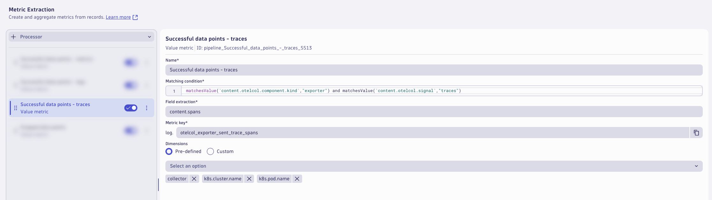

### Dropped Data Points

Add a processor to extract a metric for dropped data points from the exporter logs.  Click on `+ Processor` to add a new processor.

Name:
```text
Dropped data points
```

Matching condition:
```text
matchesValue(`content.otelcol.component.kind`,"exporter") and isNotNull(`content.dropped_items`) and isNotNull(`content.otelcol.signal`)
```

Field Extraction:
```text
content.dropped_data_points
```

Metric Key:
```text
otelcol_exporter_dropped_data_points_by_data_type
```

Dimensions:
| Dimension            |
|----------------------|
| collector            |
| k8s.cluster.name     |
| k8s.pod.name         |


The pipeline is now configured, click on `Save` to save the pipeline configuration.


### Dynamic Route

A pipeline will not have any effect unless logs are configured to be routed to the pipeline.  With dynamic routing, data is routed based on a matching condition. The matching condition is a DQL query that defines the data set you want to route.

Click on `Dynamic Routing` to configure a route to the target pipeline.  Click on `+ Dynamic Route` to add a new route.

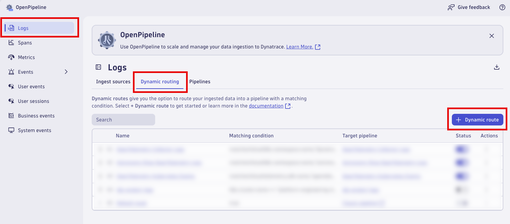

Configure the `Dynamic Route` to use the `OpenTelemetry Collector Logs` pipeline.

Name:
```text
OpenTelemetry Collector Logs
```

Matching condition:
```text
matchesValue(k8s.namespace.name,"dynatrace") and matchesValue(k8s.container.name,"otc-container") and matchesValue(telemetry.sdk.name,"opentelemetry")
```

Pipeline:
```text
OpenTelemetry Collector Logs
```

Click `Add` to add the route.

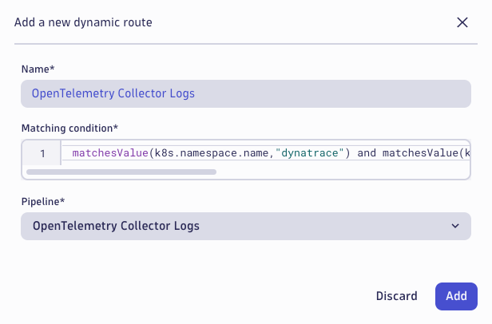

Validate that the route is enabled in the `Status` column.  Click on `Save` to save the dynamic route table configuration.

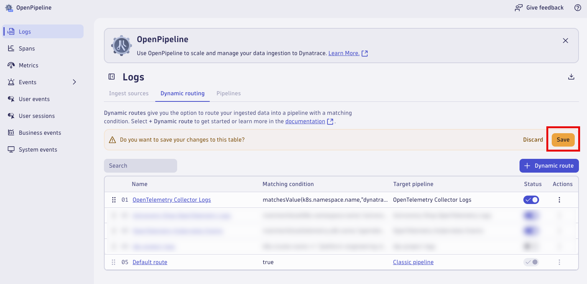

Allow `dynatrace` OpenTelemetry Collectors to generate new log data that will be routed through the new pipeline (3-5 minutes).

## OpenTelemetry Collector Logs - Analyze
Analyze the OpenTelemetry Collector logs after Dynatrace OpenPipeline processing.

### Analyze the results in Dynatrace (Notebook)

Query the OpenTelemetry Collector logs that have been processed by Dynatrace OpenPipeline.

DQL: OpenPipeline Processing Results
```sql
fetch logs
| filter k8s.namespace.name == "dynatrace" and k8s.container.name == "otc-container" and telemetry.sdk.name == "opentelemetry"
| fieldsRemove cloud.account.id // removed for data privacy and security reasons only
| sort timestamp desc
| limit 50
| fieldsKeep timestamp, collector, k8s.cluster.name, loglevel, status, "content.*", content
```

Result:

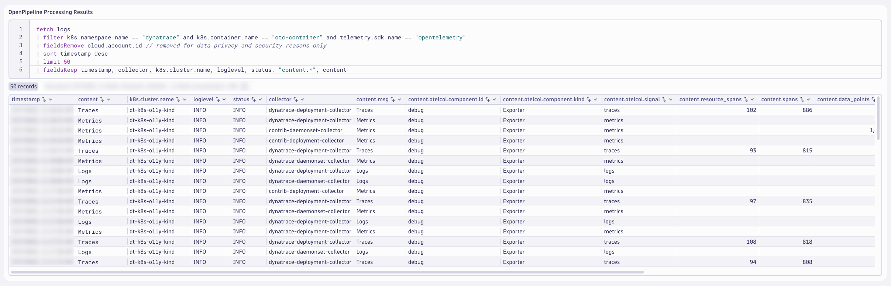

The logs are now parsed at ingest into a format that simplifies our queries and makes them easier to use, especially for users that don't work with these log sources or Dynatrace DQL on a regular basis.

Query the new log metric extracted by Dynatrace OpenPipeline, using the `timeseries` command.

DQL: Extracted metrics: successful data points / signals
```sql
timeseries { logs = sum(log.otelcol_exporter_sent_log_records) }, by: {k8s.cluster.name, collector}
```

Result:


By extracting the metric(s) at ingest time, the data points are stored long term and can easily be used in dashboards, anomaly detection, and automations.

[Metric Extraction](https://docs.dynatrace.com/docs/platform/openpipeline/use-cases/tutorial-log-processing-pipeline)

Query the new dropped data points / signals metric extracted by Dynatrace OpenPipeline, using the `timeseries` command.

DQL: Extracted metrics: dropped data points / signals
```sql
timeseries { dropped_items = sum(log.otelcol_exporter_dropped_items_by_signal, default: 0) }, by: {k8s.cluster.name, collector, signal}
```

Result:

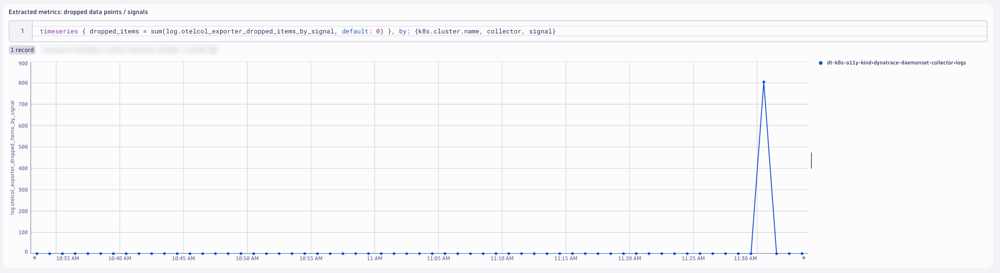

You likely won't have any data matching your query as you shouldn't have data drops.  You can force data drops by toggling your Dynatrace API Access Token off for a couple minutes and then turning it back on.


### Import Dashboard into Dynatrace
[OpenTelemetry Collector Dashboard](https://github.com/dynatrace-wwse/enablement-kubernetes-opentelemetry-openpipeline/blob/main/assets/dynatrace/dashboards/opentelemetry-collector-health-openpipeline.json)

### OpenTelemetry Collector Dashboard

Explore the OpenTelemetry Collector [IsItObservable] - OpenPipeline Dashboard that you imported earlier.


## Astronomy Shop Logs - Query
Query and discover the Astronomy Shop logs as they are ingested and stored in Dynatrace.  Use Dynatrace Query Language (DQL) to transform the logs at query time and prepare for Dynatrace OpenPipeline configuration.

### Import Notebook into Dynatrace
[Astronomy Shop Logs](https://github.com/dynatrace-wwse/enablement-kubernetes-opentelemetry-openpipeline/blob/main/assets/dynatrace/notebooks/astronomy-shop-logs.json)

### Astronomy Shop Logs - Ondemand Processing at Query Time (Notebook)

The OpenTelemetry Collector deployed as a Daemonset is collecting Pod logs from the Node's filesystem and shipping them to Dynatrace.  The application Pods from the Astronomy Shop application have been instrumented with the OpenTelemetry SDK.  The OpenTelemetry SDK is configured to ship logs (,traces, and metrics) to Dynatrace via the OpenTelemetry Collector deployed as a Deployment (Gateway).  Due to the differences in how these logs are collected, they do not contain the same metadata.  While these logs contain a lot of useful information, they are missing valuable fields/attributes that will make them easier to analyze in context.  These logs can be enriched at ingest, using OpenPipeline.  Additionally, OpenPipeline allows us to process fields, extract new data types, manage permissions, and modify storage retention.

### Goals:
* Add OpenTelemetry service name and namespace
* Enrich SDK logs with additional Kubernetes metadata
* Apply Dynatrace technology bundle (Java)
* Extract data: Payment transaction business event
* Extract metrics: Payment transaction amount

### Add OpenTelemetry Service Name and Namespace
In OpenTelemetry, `service.name` and `service.namespace` are used to provide meaningful context about the services generating telemetry data:

`service.name`: This is the logical name of the service. It should be the same for all instances of a horizontally scaled service. For example, if you have a shopping cart service, you might name it shoppingcart.

`service.namespace`: This is used to group related services together. It helps distinguish a group of services that logically belong to the same system or team. For example, you might use Shop as the namespace for all services related to an online store.

These attributes help in organizing and identifying telemetry data, making it easier to monitor and troubleshoot services within a complex system.

The logs originating from the OpenTelemetry SDK contain both the `service.name` and `service.namespace`.  However, the Pod logs which contain stdout and stderr messages from the containers - do not.  In order to make it easier to analyze the log files and unify the telemetry, the `service.name` and `service.namespace` attributes should be added to the Pod logs with Dynatrace OpenPipeline.

### OpenTelemetry Service Name

Query the `astronomy-shop` logs fitered on `isNull(service.name)`.

DQL: Before OpenPipeline and DQL Transformation
```sql
fetch logs
| filter matchesValue(k8s.namespace.name,"astronomy-shop") and matchesValue(telemetry.sdk.name,"opentelemetry")
| filter isNull(service.name) and isNotNull(app.label.component) and matchesValue(k8s.namespace.name,"astronomy-shop")
| filterOut matchesValue(k8s.container.name,"istio-proxy")
| sort timestamp desc
| limit 25
| fields timestamp, k8s.namespace.name, k8s.deployment.name, k8s.container.name, app.label.component, service.name, service.namespace
```

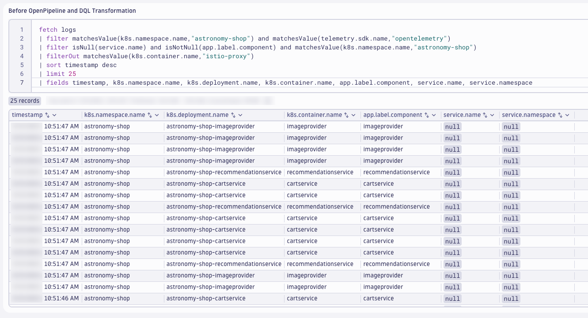

The value for `service.name` can be obtained from multiple different fields, but based on the application configuration - it is best to use the value from `app.label.component`.

Use DQL to transform the logs and apply the `service.name` value.

DQL: After DQL Transformation
```sql
fetch logs
| filter matchesValue(k8s.namespace.name,"astronomy-shop") and matchesValue(telemetry.sdk.name,"opentelemetry")
| filter isNotNull(app.label.component) and matchesValue(k8s.namespace.name,"astronomy-shop")
| filterOut matchesValue(k8s.container.name,"istio-proxy")
| sort timestamp desc
| limit 25
| fieldsAdd service.name = app.label.component
| fields timestamp, k8s.namespace.name, k8s.deployment.name, k8s.container.name, app.label.component, service.name, service.namespace
```

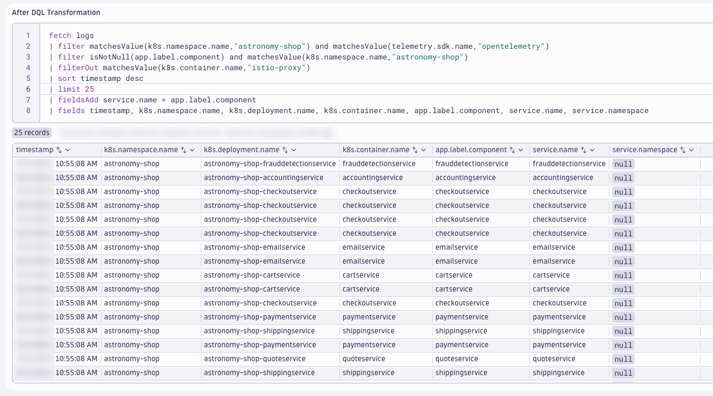

This modifies the log attributes at query time and helps us identify the processing rules for Dynatrace OpenPipeline.  We'll validate the results after OpenPipeline, later.

### OpenTelemetry Service Namespace

Query the `astronomy-shop` logs fitered on `isNull(service.namespace)`.

DQL: Before OpenPipeline and DQL Transformation
```sql
fetch logs
| filter isNull(service.namespace) and isNull(service.name) and isNotNull(app.annotation.service.namespace) and matchesValue(k8s.namespace.name,"astronomy-shop")
| filterOut matchesValue(k8s.container.name,"istio-proxy")
| sort timestamp desc
| limit 25
| fieldsAdd service.name = app.label.component
| fields timestamp, k8s.namespace.name, k8s.deployment.name, k8s.container.name, app.label.component, app.annotation.service.namespace, service.name, service.namespace
```

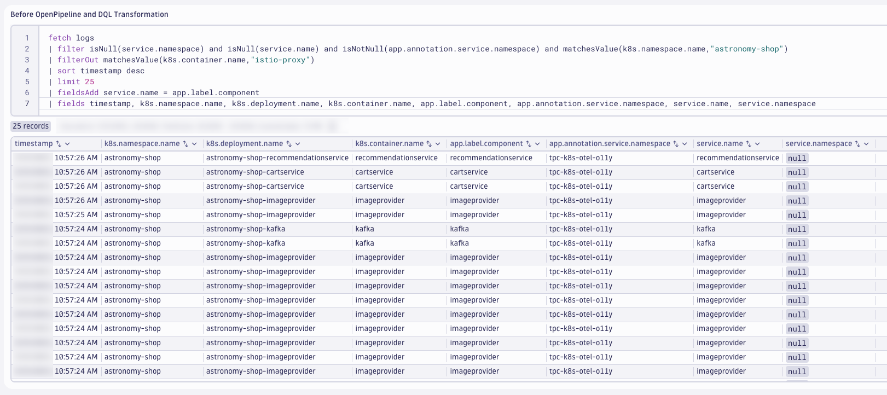

The Pods have been annotated with the service namespace.  The `k8sattributes` processor has been configured to add this annotation as an attribute, called `app.annotation.service.namespace`.  This field can be used to populate the `service.namespace`.

Use DQL to transform the logs and apply the `service.namespace` value.

DQL: After DQL Transformation
```sql
fetch logs
| filter isNull(service.namespace) and isNull(service.name) and isNotNull(app.annotation.service.namespace) and matchesValue(k8s.namespace.name,"astronomy-shop")
| filterOut matchesValue(k8s.container.name,"istio-proxy")
| sort timestamp desc
| limit 25
| fieldsAdd service.name = app.label.component
| fieldsAdd service.namespace = app.annotation.service.namespace
| fields timestamp, k8s.namespace.name, k8s.deployment.name, k8s.container.name, app.label.component, app.annotation.service.namespace, service.name, service.namespace
```

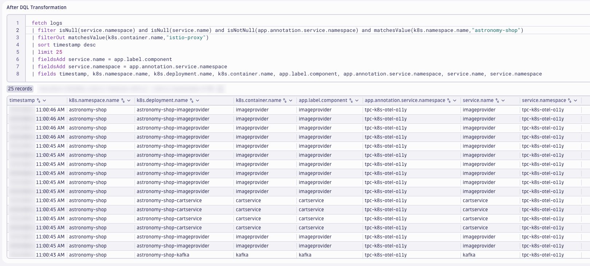

This modifies the log attributes at query time and helps us identify the processing rules for Dynatrace OpenPipeline.  We'll validate the results after OpenPipeline, later.

### OpenTelemetry SDK Logs

The logs generated and exported by the OpenTelemetry SDK are missing Kubernetes attributes, or in some cases have the wrong values set.  The OpenTelemetry SDK, unless specifically configured otherwise, is not aware of the Kubernetes context in which of the application runs.  As a result, when the OpenTelemetry Collector that's embedded in `astronomy-shop` sends the logs to the Dynatrace OpenTelemtry Collector via OTLP, the Kubernetes attributes are populated with the Kubernetes context of the `astronomy-shop-otelcol` workload.  This makes these attributes unreliable when analyzing logs.  In order to make it easier to analyze the log files and unify the telemetry, the Kubernetes attributes should be correct for the SDK logs with Dynatrace OpenPipeline.

Query the `astronomy-shop` logs filtered on `telemetry.sdk.language` and `astronomy-shop-otelcol`.

DQL: Before OpenPipeline and DQL Transformation
```sql
fetch logs
| filter isNotNull(telemetry.sdk.language) and matchesValue(k8s.deployment.name,"astronomy-shop-otelcol") and isNotNull(service.name) and matchesValue(k8s.namespace.name,"astronomy-shop")
| sort timestamp desc
| limit 25
| fields timestamp, service.name, telemetry.sdk.language, k8s.namespace.name, k8s.deployment.name, k8s.pod.name, k8s.pod.uid, k8s.replicaset.name, k8s.node.name
```

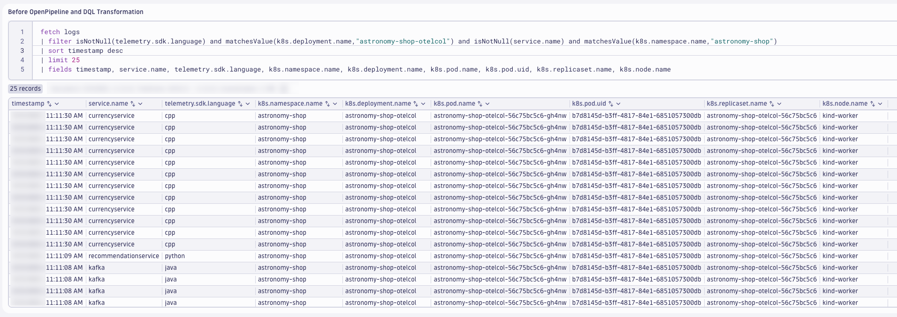

The `k8s.namespace.name` is correct, however the `k8s.deployment.name`, `k8s.pod.name`, `k8s.pod.uid`, `k8s.replicaset.name`, and `k8s.node.name` are incorrect.  Since the `k8s.deployment.name` is based on the `service.name`, this field can be used to correct the `k8s.deployment.name` value.  The other values can be set to `null` in order to avoid confusion with the `astronomy-shop-otelcol` workload.

Use DQL to transform the logs and set the `k8s.deployment.name` value while clearing the other fields.

DQL: After DQL Transformation
```sql
fetch logs
| filter isNotNull(telemetry.sdk.language) and matchesValue(k8s.deployment.name,"astronomy-shop-otelcol") and isNotNull(service.name) and matchesValue(k8s.namespace.name,"astronomy-shop")
| sort timestamp desc
| limit 25
| fieldsAdd k8s.deployment.name = concat("astronomy-shop-",service.name)
| fieldsAdd k8s.container.name = service.name
| fieldsAdd app.label.name = concat("astronomy-shop-",service.name)
| fieldsAdd app.label.component = service.name
| fieldsRemove k8s.pod.name, k8s.pod.uid, k8s.replicaset.name, k8s.node.name
| fields timestamp, service.name, telemetry.sdk.language, k8s.namespace.name, k8s.deployment.name, k8s.container.name, app.label.name, app.label.component
```

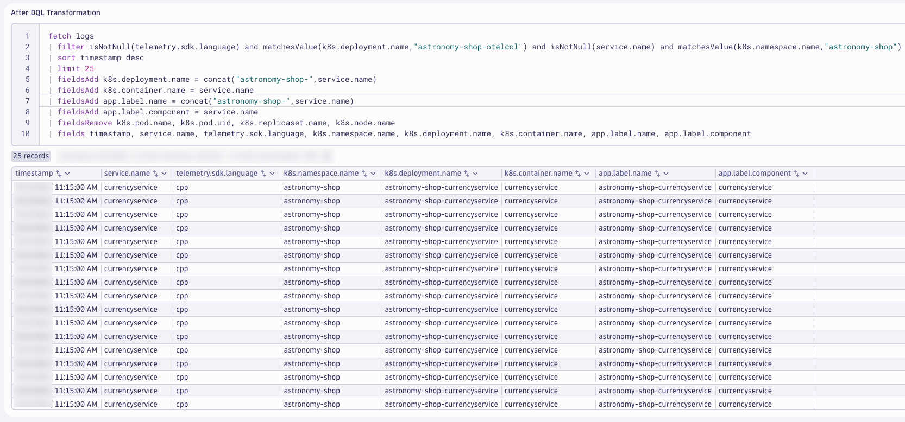

This modifies the log attributes at query time and helps us identify the processing rules for Dynatrace OpenPipeline.  We'll validate the results after OpenPipeline, later.

### Java Technology Bundle

Many applications written in a specific programming language will utilize known logging frameworks that have standard patterns, fields, and syntax for log messages.  For Java, these include frameworks such as Log4j, Logback, java.util.logging, etc.  Dynatrace OpenPipeline has a wide variety of Technology Processor Bundles, which can be easily added to a Pipeline to help format, clean up, and optimize logs for analysis.

The Java technology processor bundle can be applied to the `astronomy-shop` logs that we know are originating from Java applications.

Query the `astronomy-shop` logs filtered on `telemetry.sdk.language` or the `astronomy-shop-adservice` Java app.

DQL: Before OpenPipeline and DQL Transformation
```sql
fetch logs
| filter (matchesValue(telemetry.sdk.language,"java", caseSensitive: false) or matchesValue(k8s.deployment.name,"astronomy-shop-adservice", caseSensitive:false)) and matchesValue(k8s.namespace.name,"astronomy-shop")
| filter matchesValue(k8s.deployment.name,"astronomy-shop-adservice", caseSensitive:false) or matchesValue(k8s.deployment.name,"astronomy-shop-kafka", caseSensitive:false)
| sort timestamp desc
| limit 15
| append [fetch logs
          | filter matchesValue(telemetry.sdk.language,"java", caseSensitive: false)
          | fieldsAdd k8s.deployment.name = concat(k8s.namespace.name,"-",service.name)
          | sort timestamp desc
          | limit 15]
| sort timestamp desc
| fields timestamp, k8s.namespace.name, k8s.deployment.name, telemetry.sdk.language, content
```

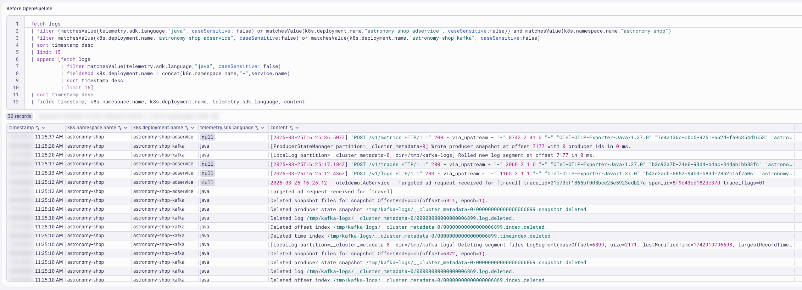

These are the logs that will be modified using the Java technology processor bundle within OpenPipeline.  We'll validate the results after OpenPipeline, later.

### PaymentService Transactions

Most (if not all) applications and microservices drive business processes and outcomes.  Details about the execution of these business processes is often written out to the logs by the application.  Dynatrace OpenPipeline is able to extract this business-relevant information as a business event (bizevent).

[Log to Business Event](https://docs.dynatrace.com/docs/shortlink/ba-business-events-capturing#logs)

DQL is fast and powerful, allowing us to query log files and summarize the data to generate timeseries for dashboards, alerts, AI-driven forecasting and more.  While it's handy to generate timeseries metric data from logs when we didn't know we would need it, it's better to generate timeseries metric data from logs at ingest for the use cases that we know ahead of time.  Dynatrace OpenPipeline is able to extract metric data from logs on ingest.

[Log to Metric](https://docs.dynatrace.com/docs/shortlink/openpipeline-log-processing)

The `paymentservice` component of `astronomy-shop` generates a log record every time it processes a payment transaction successfully.  This information is nested within a `JSON` structured log record, including the transactionId, amount, cardType, and currencyCode.  By parsing these relevant logs for the fields we need, Dynatrace OpenPipeline can be used to generate a payment transaction business event and a payment transaction amount metric on log record ingest.

Query the `astronomy-shop` logs filtered on the `paymentservice` logs with a `trace_id` attribute.

DQL: Before OpenPipeline and DQL Transformation
```sql
fetch logs
| filter matchesValue(k8s.namespace.name,"astronomy-shop") and matchesValue(k8s.container.name,"paymentservice") and isNotNull(trace_id)
| sort timestamp desc
| limit 25
| fields timestamp, content, k8s.container.name, trace_id
```

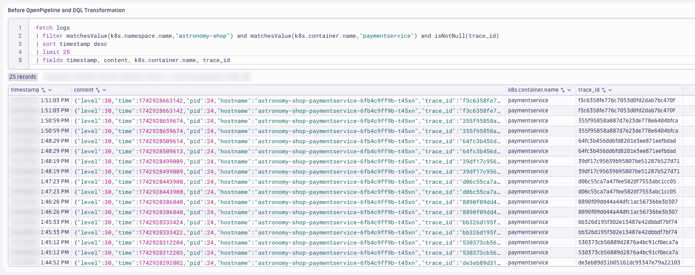

The `content` field is structured `JSON`.  The parse command can be used to parse the JSON content and add the fields we need for our use case.

```json
{
  "level": "30",
  "time": "1742928663142",
  "pid": "24",
  "hostname": "astronomy-shop-paymentservice-6fb4c9ff9b-t45xn",
  "trace_id": "f3c6358fe776c7053d0fd2dab7bc470f",
  "span_id": "880430306f41a648",
  "trace_flags": "01",
  "transactionId": "c54b6b4c-ebf1-4191-af21-5f583d0d0c87",
  "cardType": "visa",
  "lastFourDigits": "5647",
  "amount": {
    "units": {
      "low": "37548",
      "high": "0",
      "unsigned": false
    },
    "nanos": "749999995",
    "currencyCode": "USD"
  },
  "msg": "Transaction complete."
}
```

Use DQL to transform the logs and parse the payment fields from the JSON content.

DQL: After DQL Transformation
```sql
fetch logs
| filter matchesValue(k8s.namespace.name,"astronomy-shop") and matchesValue(k8s.container.name,"paymentservice") and isNotNull(trace_id)
| sort timestamp desc
| limit 25
| fields timestamp, content, k8s.container.name, trace_id
| parse content, "JSON:json_content"
| fieldsAdd app.payment.msg = json_content[`msg`]
| filter app.payment.msg == "Transaction complete."
| fieldsAdd app.payment.cardType = json_content[`cardType`]
| fieldsAdd app.payment.amount = json_content[`amount`][`units`][`low`]
| fieldsAdd app.payment.currencyCode = json_content[`amount`][`currencyCode`]
| fieldsAdd app.payment.transactionId = json_content[`transactionId`]
| fieldsRemove json_content
```

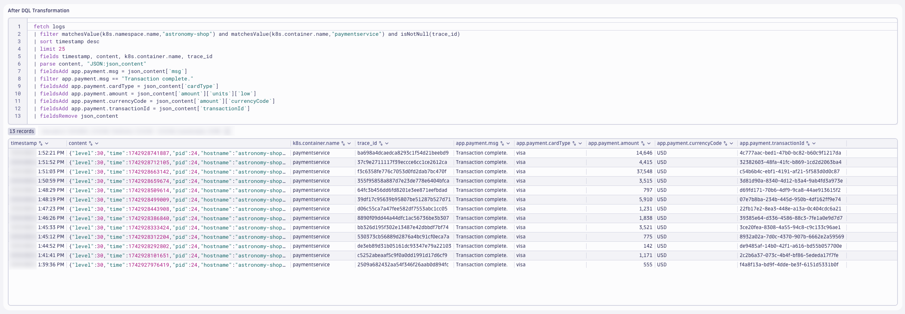

This modifies the log attributes at query time and helps us identify the processing rules for Dynatrace OpenPipeline.  We'll validate the results after OpenPipeline, *next*.

## Astronomy Shop Logs - OpenPipeline
Configure Dynatrace OpenPipeline for Astronomy Shop logs.

### Create and Configure Dynatrace OpenPipeline

> ⚠️ If the images are too small and the text is difficult to read, right-click and open the image in a new tab.

> ⚠️ Consider saving your pipeline configuration often to avoid losing any changes.

In your Dynatrace tenant, launch the OpenPipeline app.  Begin by selecting `Logs` from the left-hand menu of telemetry types.  Then choose `Pipelines`.  Click on `+ Pipeline` to add a new pipeline.

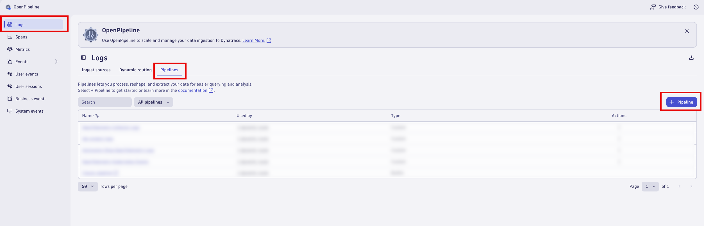

Name the new pipeline, `Astronomy Shop OpenTelemetry Logs`.  Click on the `Processing` tab to begin adding `Processor` rules.

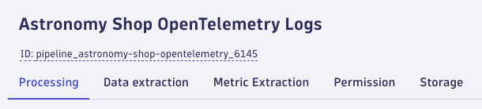

### OpenTelemetry Service Name

Add a processor to set the OpenTelemetry Service Name.  Click on `+ Processor` to add a new processor.

Type:
```text
DQL
```

Name:
```text
OpenTelemetry Service Name
```

Matching condition:
```text
isNull(service.name) and isNotNull(app.label.component) and matchesValue(k8s.namespace.name,"astronomy-shop")
```

Processor definition:
```text
fieldsAdd service.name = app.label.component
```

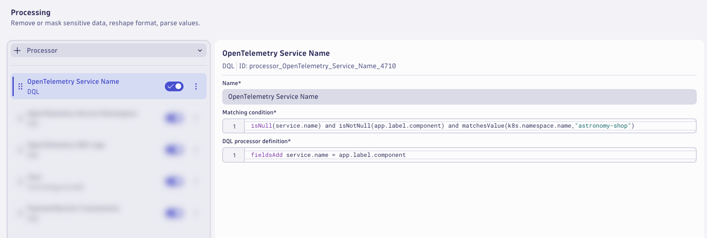

### OpenTelemetry Service Namespace

Add a processor to set the OpenTelemetry Service Namespace.  Click on `+ Processor` to add a new processor.

Type:
```text
DQL
```

Name:
```text
OpenTelemetry Service Namespace
```

Matching condition:
```text
isNull(service.namespace) and isNotNull(service.name) and isNotNull(app.annotation.service.namespace) and matchesValue(k8s.namespace.name,"astronomy-shop")
```

Processor definition:
```text
fieldsAdd service.namespace = app.annotation.service.namespace
```

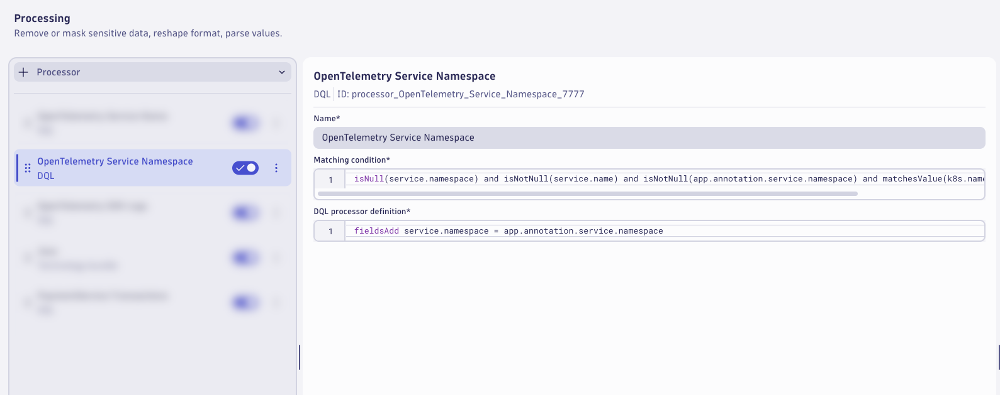

### OpenTelemetry SDK Logs

Add a processor to transform the OpenTelemetry SDK Logs.  Click on `+ Processor` to add a new processor.

Type:
```text
DQL
```

Name:
```text
OpenTelemetry SDK Logs
```

Matching condition:
```text
isNotNull(telemetry.sdk.language) and matchesValue(k8s.deployment.name,"astronomy-shop-otelcol") and isNotNull(service.name) and matchesValue(k8s.namespace.name,"astronomy-shop")
```

Processor definition:
```text
fieldsAdd k8s.deployment.name = concat("astronomy-shop-",service.name)
| fieldsAdd k8s.container.name = service.name
| fieldsAdd app.label.name = concat("astronomy-shop-",service.name)
| fieldsAdd app.label.component = service.name
| fieldsRemove k8s.pod.name, k8s.pod.uid, k8s.replicaset.name, k8s.node.name
```

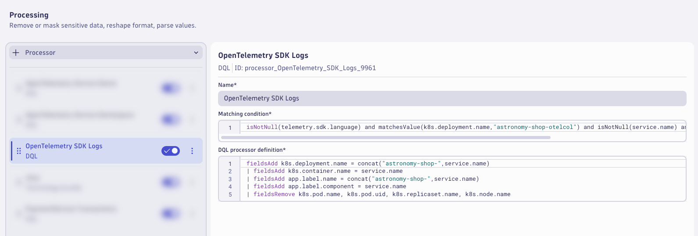

### Java Technology Bundle

Add a processor to enrich the Java logs using the Java Technology Bundle.  Click on `+ Processor` to add a new processor.

Type:
```text
Technology Bundle > Java
```

Matching condition:
```text
(matchesValue(telemetry.sdk.language,"java", caseSensitive: false) or matchesValue(k8s.deployment.name,"astronomy-shop-adservice", caseSensitive:false)) and matchesValue(k8s.namespace.name,"astronomy-shop")
```

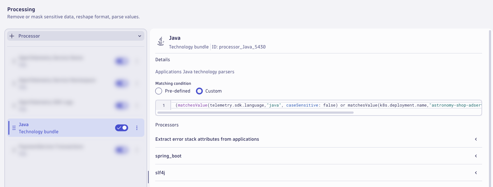

### PaymentService Transactions

Add a processor to parse the PaymentService Transaction logs.  Click on `+ Processor` to add a new processor.

Type:
```text
DQL
```

Name:
```text
PaymentService Transactions
```

Matching condition:
```text
matchesValue(service.name,"paymentservice") and matchesValue(k8s.container.name,"paymentservice") and isNotNull(trace_id)
```

Processor definition:
```text
parse content, "JSON:json_content"
| fieldsAdd app.payment.msg = json_content[`msg`]
| fieldsAdd app.payment.cardType = json_content[`cardType`]
| fieldsAdd app.payment.amount = json_content[`amount`][`units`][`low`]
| fieldsAdd app.payment.currencyCode = json_content[`amount`][`currencyCode`]
| fieldsAdd app.payment.transactionId = json_content[`transactionId`]
| fieldsRemove json_content
```

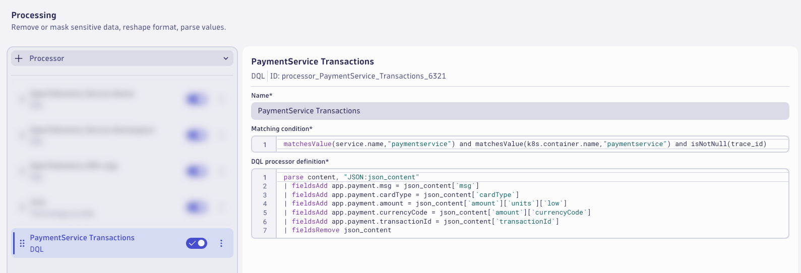

### PaymentService Transaction BizEvent

Switch to the `Data extraction` tab.

Add a processor to extract a `Business Event`.  Click on `+ Processor` to add a new processor.

Type:
```text
Business Event
```

Name:
```text
PaymentService Transaction
```

Matching condition:
```text
matchesValue(k8s.container.name,"paymentservice") and isNotNull(app.payment.cardType) and isNotNull(app.payment.amount) and isNotNull(app.payment.currencyCode) and isNotNull(app.payment.transactionId)
```

Event type:
```text
Static String : astronomy-shop.app.payment.complete
```

Event provider:
```text
Static String: astronomy-shop.opentelemetry
```

Field Extraction:
| Fields                   |
|--------------------------|
| app.payment.msg          |
| app.payment.cardType     |
| app.payment.amount       |
| app.payment.currencyCode |
| app.payment.transactionid|

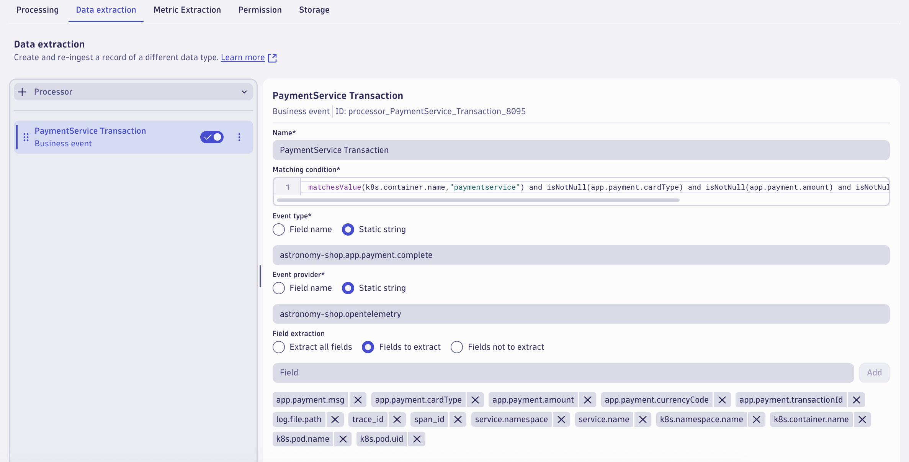

### PaymentService Transaction Metric

Switch to the `Metric Extraction` tab.

Add a processor to set extract a metric from the PaymentService Transaction logs.  Click on `+ Processor` to add a new processor.

Type:
```text
Value metric
```

Name:
```text
PaymentService Transaction
```

Matching condition:
```text
matchesValue(k8s.container.name,"paymentservice") and isNotNull(app.payment.cardType) and isNotNull(app.payment.amount) and isNotNull(app.payment.currencyCode) and isNotNull(app.payment.transactionId)
```

Field extraction:
```text
app.payment.amount
```

Metric key:
```text
otel.astronomy-shop.app.payment.amount
```

Dimensions:
| Field                    | Dimension     |
|------------------------------------------|
| app.payment.cardType     | cardType      |
| app.payment.currencyCode |  currencyCode |

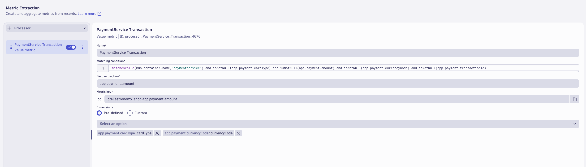

The pipeline is now configured, click on `Save` to save the pipeline configuration.

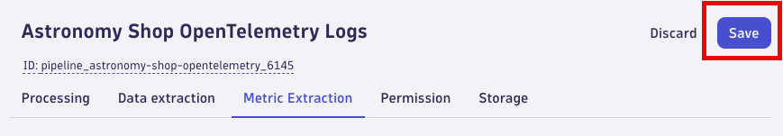

### Dynamic Route 

A pipeline will not have any effect unless logs are configured to be routed to the pipeline.  With dynamic routing, data is routed based on a matching condition. The matching condition is a DQL query that defines the data set you want to route.

Click on `Dynamic Routing` to configure a route to the target pipeline.  Click on `+ Dynamic Route` to add a new route.

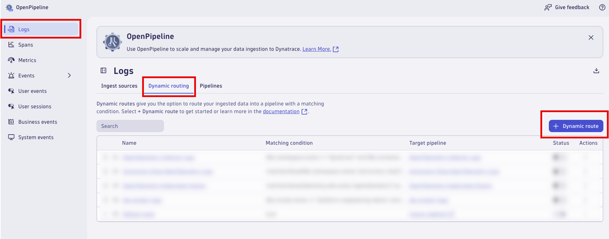

Configure the `Dynamic Route` to use the `Astronomy Shop OpenTelemetry Logs` pipeline.

Name:
```text
Astronomy Shop OpenTelemetry Logs
```

Matching condition:
```text
matchesValue(k8s.namespace.name,"astronomy-shop") and matchesValue(telemetry.sdk.name,"opentelemetry") and isNull(event.domain)
```

Pipeline:
```text
Astronomy Shop OpenTelemetry Logs
```

Click `Add` to add the route.

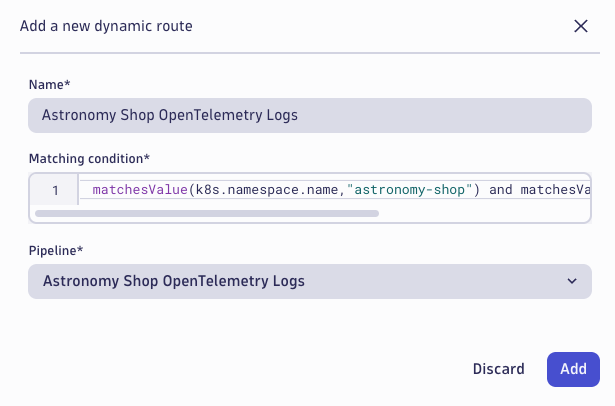

Validate that the route is enabled in the `Status` column.  Click on `Save` to save the dynamic route table configuration.

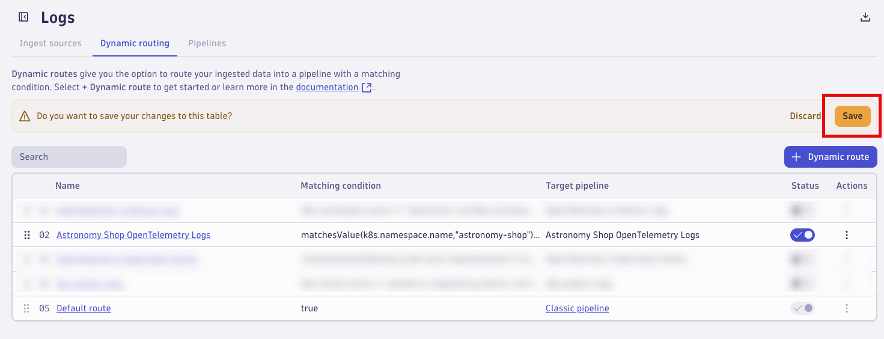

Allow `astronomy-shop` to generate new log data that will be routed through the new pipeline (3-5 minutes).

## Astronomy Shop Logs - Analyze
Analyze the Astronomy Shop logs after Dynatrace OpenPipeline processing.

### Analyze the results in Dynatrace (Notebook)

Use the Notebook from earlier to analyze the results.

### OpenTelemetry Service Name

Query the `astronomy-shop` logs fitered on `isNotNull(service.name)` to analyze with `OpenTelemetry Service Name`.

DQL: After OpenPipeline
```sql
fetch logs
| filter matchesValue(k8s.namespace.name,"astronomy-shop") and matchesValue(telemetry.sdk.name,"opentelemetry")
| filter isNotNull(service.name) and isNotNull(app.label.component) and matchesValue(k8s.namespace.name,"astronomy-shop")
| filterOut matchesValue(k8s.container.name,"istio-proxy")
| sort timestamp desc
| limit 25
| fields timestamp, k8s.namespace.name, k8s.deployment.name, k8s.container.name, app.label.component, service.name, service.namespace
```

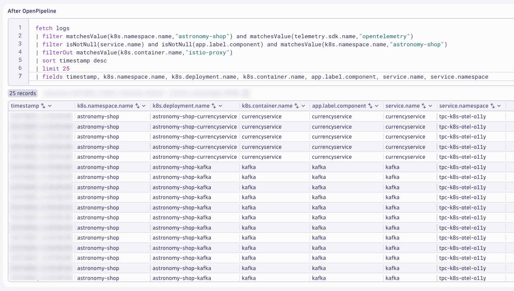

### OpenTelemetry Service Namespace

Query the `astronomy-shop` logs fitered on `isNotNull(service.namespace)` to analyze with `OpenTelemetry Service Namespace`.

DQL: After OpenPipeline
```sql
fetch logs
| filter isNotNull(service.namespace) and isNotNull(service.name) and isNotNull(app.annotation.service.namespace) and matchesValue(k8s.namespace.name,"astronomy-shop")
| filterOut matchesValue(k8s.container.name,"istio-proxy")
| sort timestamp desc
| limit 25
| fields timestamp, k8s.namespace.name, k8s.deployment.name, k8s.container.name, app.label.component, app.annotation.service.namespace, service.name, service.namespace
```

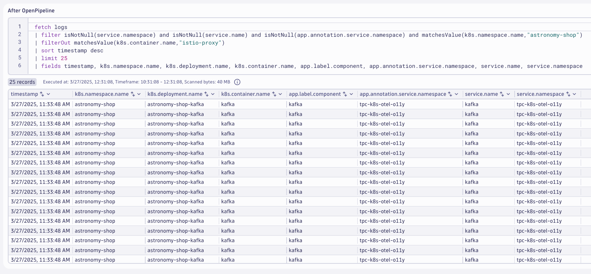

### OpenTelemetry SDK Logs

Query the `astronomy-shop` logs fitered on `telemetry.sdk.language` to analyze with `OpenTelemetry SDK Logs`.

DQL: After OpenPipeline
```sql
fetch logs
| filter isNotNull(telemetry.sdk.language) and isNotNull(service.name) and matchesValue(k8s.namespace.name,"astronomy-shop")
| sort timestamp desc
| limit 25
| fields timestamp, service.name, telemetry.sdk.language, k8s.namespace.name, k8s.deployment.name, k8s.container.name, app.label.name, app.label.component, k8s.pod.name, k8s.pod.uid, k8s.replicaset.name, k8s.node.name
```

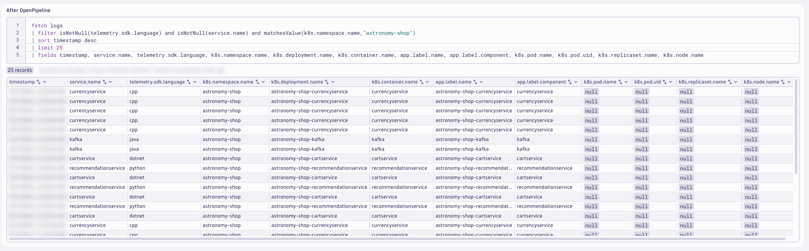

### Java Technology Bundle

Query the `astronomy-shop` logs fitered on `telemetry.sdk.language == "java"` to analyze with `Java Technology Bundle` logs.

DQL: After OpenPipeline
```sql
fetch logs
| filter (matchesValue(telemetry.sdk.language,"java", caseSensitive: false) or matchesValue(k8s.deployment.name,"astronomy-shop-adservice", caseSensitive:false)) and matchesValue(k8s.namespace.name,"astronomy-shop")
| filterOut matchesValue(k8s.container.name,"istio-proxy")
| sort timestamp desc
| limit 50
```

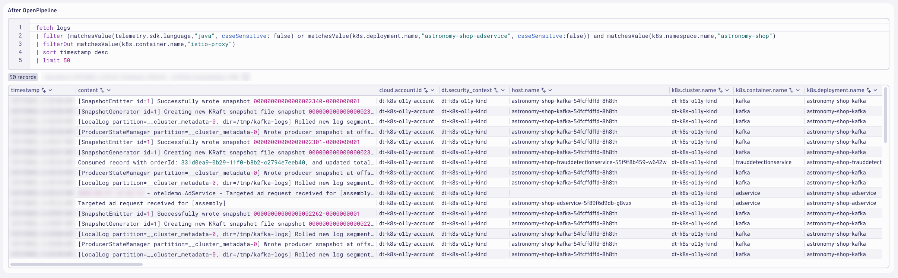

You likely won't notice anything different about these logs.  This exercise was meant to show you how to use the technology bundles.

### PaymentService Transactions

Query the `astronomy-shop` logs fitered on `service.name == "paymentservice"` to analyze with `PaymentService` logs.

DQL: After OpenPipeline
```sql
fetch logs
| filter matchesValue(k8s.namespace.name,"astronomy-shop") and isNotNull(service.name)
| filterOut event.domain == "k8s"
| filter matchesValue(service.name,"paymentservice") and matchesValue(k8s.container.name,"paymentservice") and isNotNull(trace_id)
| sort timestamp desc
| limit 25
| fields timestamp, content, k8s.container.name, trace_id, app.payment.msg, app.payment.cardType, app.payment.amount, app.payment.currencyCode, app.payment.transactionId
```

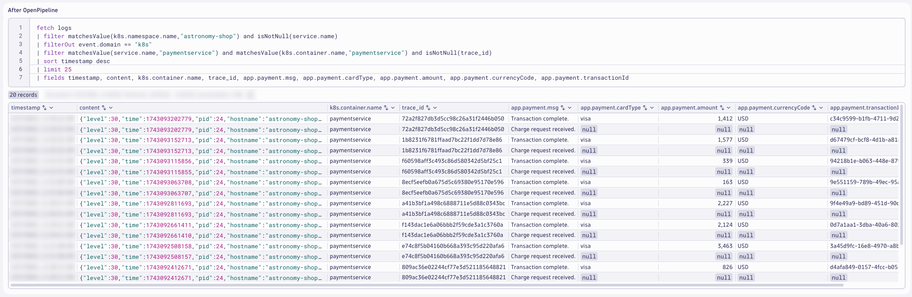

Query the `PaymentService` Business Events.

DQL: PaymentService Transaction Business Events
```sql
fetch bizevents
| filter matchesValue(event.type,"astronomy-shop.app.payment.complete")
| sort timestamp desc
| limit 10
```

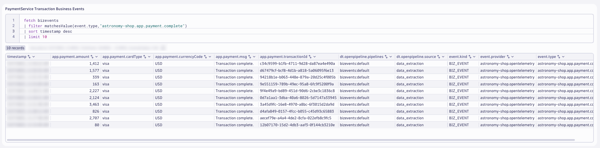

Query the `PaymentService` Metric.

DQL: PaymentService Transaction Extracted Metric
```sql
timeseries sum(`log.otel.astronomy-shop.app.payment.amount`), by: { currencyCode, cardType }
| fieldsAdd value.A = arrayAvg(`sum(\`log.otel.astronomy-shop.app.payment.amount\`)`)
```

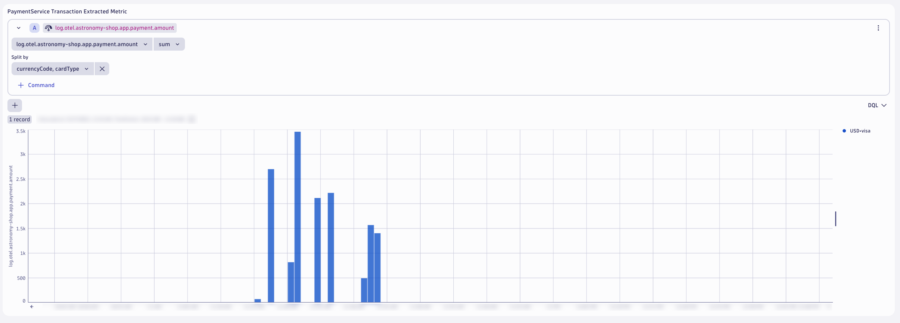

## Kubernetes Events Logs - Query
Query and discover the Kubernetes Events logs as they are ingested and stored in Dynatrace.  Use Dynatrace Query Language (DQL) to transform the logs at query time and prepare for Dynatrace OpenPipeline configuration.

### Import Notebook into Dynatrace
[Kubernetes Events Logs](https://github.com/dynatrace-wwse/enablement-kubernetes-opentelemetry-openpipeline/blob/main/assets/dynatrace/notebooks/opentelemetry-kubernetes-events.json)

### Kubernetes Events - Ondemand Processing at Query Time (Notebook)

The OpenTelemetry Collector, specifically the Contrib Distro running as a Deployment, is configured to capture Kubernetes Events using the `k8s_objects` receiver.  These events are shipped to Dynatrace as OpenTelemetry logs.  While these logs contain a lot of useful information, they are missing valuable fields/attributes that will make them easier to analyze in context.  These logs can be enriched at ingest, using OpenPipeline.  Additionally, OpenPipeline allows us to process fields, extract new data types, manage permissions, and modify storage retention.

### Goals:
* Enrich logs with additional Kubernetes metadata
* Enrich the log message, via the content field
* Set loglevel and status fields
* Remove unwanted fields/attributes
* Add OpenTelemetry service name and namespace
* Extract metrics: event count

### Generate Kubernetes Events

Kubernetes Events will only be generated when Kubernetes orchestration causes changes within the environment.  Generate new Kubernetes Events for analysis prior to continuing.

Command:
```text
kubectl delete pods -n astronomy-shop --field-selector="status.phase=Running"
```

This will delete all running pods for `astronomy-shop` and schedule new ones, resulting in many new Kubernetes Events.

### Kubernetes Attributes

When the OpenTelemetry Collector captures Kubernetes Events using the `k8s_objects` receiver, most of the Kubernetes context information is stored in fields with the prefix `object.*` and `object.involvedObject.*`.  These fields aren't used in other logs related to Kubernetes observability.  Dynatrace OpenPipeline enables us to parse these object fields and use them to populate the normal Kubernetes (`k8s.*`) attributes.

> ⚠️ Lab Guide Warning:
In some cases, it has been observed that the fields that should start with `object.involvedObject.*` are instead starting with `object.involvedobject.*`.  When using field names with DQL, the proper case needs to be used.  If you encounter this, please match the casing you observe in your environment.
> ⚠️

Query the Kubernetes logs filtered on `event.domain == "k8s"` and `telemetry.sdk.name`.

DQL: Before OpenPipeline and DQL Transformation
```sql
fetch logs
| filter matchesValue(telemetry.sdk.name,"opentelemetry") and matchesValue(event.domain,"k8s") and matchesValue(k8s.resource.name,"events")
| filter isNotNull(object.involvedObject.namespace) and isNotNull(object.involvedObject.kind) and isNotNull(object.involvedObject.name)
| sort timestamp desc
| limit 25
```

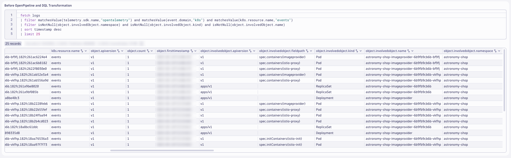

Notice the many fields with the `object.*` prefix that provide valuable context information about the Kubernetes component related to the event.  Use the `object.involvedObject.namespace`, `object.involvedObject.kind`, and `object.involvedObject.name` fields to set the Kubernetes (`k8s.*`) attributes.

Use DQL to transform the logs and apply the `k8s.*` attributes.

DQL: After DQL Transformation
```sql
fetch logs
| filter matchesValue(telemetry.sdk.name,"opentelemetry") and matchesValue(event.domain,"k8s") and matchesValue(k8s.resource.name,"events")
| filter isNotNull(object.involvedObject.namespace) and isNotNull(object.involvedObject.kind) and isNotNull(object.involvedObject.name)
| sort timestamp desc
| limit 25
| fieldsAdd k8s.namespace.name = object.involvedObject.namespace
| fieldsAdd k8s.pod.name = if(object.involvedObject.kind == "Pod",object.involvedObject.name)
| fieldsAdd k8s.deployment.name = if(object.involvedObject.kind == "Deployment",object.involvedObject.name)
| fieldsAdd k8s.replicaset.name = if(object.involvedObject.kind == "ReplicaSet",object.involvedObject.name)
| fields timestamp, k8s.namespace.name, k8s.deployment.name, k8s.replicaset.name, k8s.pod.name, object.involvedObject.kind, object.involvedObject.name
```


These changes with DQL allow us to populate the relevant Kubernetes attributes where we know the correct value.  For example, if the involved object is a Deployment, then we can set the `k8s.deployment.name` attribute.  In order to populate the missing fields, we can apply logic and DQL parsing commands.

### Kubernetes ReplicaSet

For the Kubernetes Events that impact a ReplicaSet, we need to set the `k8s.replicaset.name` and `k8s.deployment.name`.  Since the event doesn't directly impact a Pod and we don't know the Pod unique id, the `k8s.pod.name` attribute should remain `null`.

Query the Kubernetes logs filtered on `object.involvedObject.kind == "ReplicaSet"`.

DQL: Before OpenPipeline and DQL Transformation
```sql
fetch logs
| filter matchesValue(telemetry.sdk.name,"opentelemetry") and matchesValue(event.domain,"k8s") and matchesValue(k8s.resource.name,"events")
| filter isNotNull(object.involvedObject.namespace) and isNotNull(object.involvedObject.name) and matchesValue(object.involvedObject.kind,"ReplicaSet")
| sort timestamp desc
| limit 25
| fields timestamp, k8s.namespace.name, k8s.deployment.name, k8s.replicaset.name, k8s.pod.name, object.involvedObject.kind, object.involvedObject.name
```

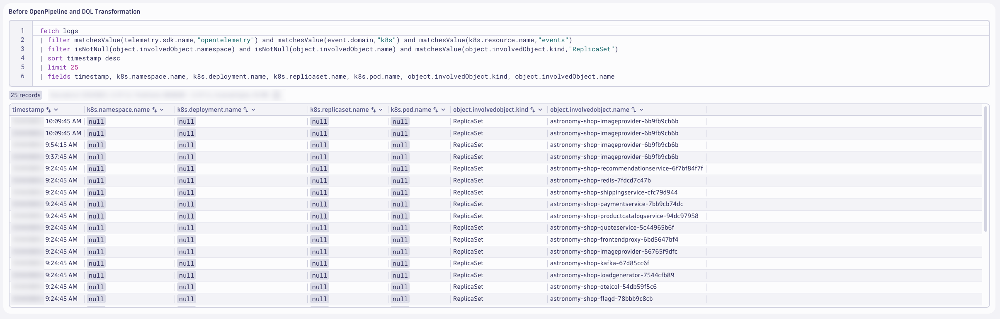

The ReplicaSet name follows the naming convention `<deployment-name>-<replicaset-hash>`.  Use DQL to transform the logs, parse the ReplicaSet name, and apply the value ot the `k8s.deployment.name` attribute.

DQL: After DQL Transformation
```sql
fetch logs
| filter matchesValue(telemetry.sdk.name,"opentelemetry") and matchesValue(event.domain,"k8s") and matchesValue(k8s.resource.name,"events")
| filter isNotNull(object.involvedObject.namespace) and isNotNull(object.involvedObject.name) and matchesValue(object.involvedObject.kind,"ReplicaSet")
| sort timestamp desc
| limit 25
| parse object.involvedObject.name, "LD:deployment ('-' ALNUM:hash EOS)"
| fieldsAdd k8s.deployment.name = deployment
| fields timestamp, k8s.namespace.name, k8s.deployment.name, k8s.replicaset.name, k8s.pod.name, object.involvedObject.kind, object.involvedObject.name
```

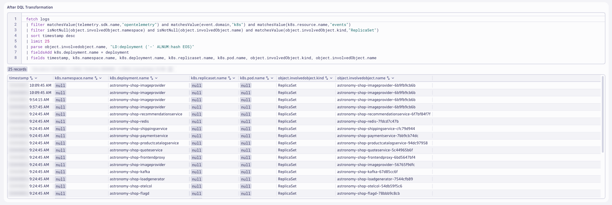

This modifies the log attributes at query time and helps us identify the processing rules for Dynatrace OpenPipeline.  We'll validate the results after OpenPipeline, later.

### Kubernetes Pod

For the Kubernetes Events that impact a Pod, we need to set the `k8s.pod.name`, `k8s.replicaset.name` and `k8s.deployment.name` since we know all (3).

Query the Kubernetes logs filtered on `object.involvedObject.kind == "Pod"`.

DQL: Before OpenPipeline and DQL Transformation
```sql
fetch logs
| filter matchesValue(telemetry.sdk.name,"opentelemetry") and matchesValue(event.domain,"k8s") and matchesValue(k8s.resource.name,"events")
| filter isNotNull(object.involvedObject.namespace) and isNotNull(object.involvedObject.name) and matchesValue(object.involvedObject.kind,"Pod")
| sort timestamp desc
| limit 25
| fields timestamp, k8s.namespace.name, k8s.deployment.name, k8s.replicaset.name, k8s.pod.name, object.involvedObject.kind, object.involvedObject.name
```

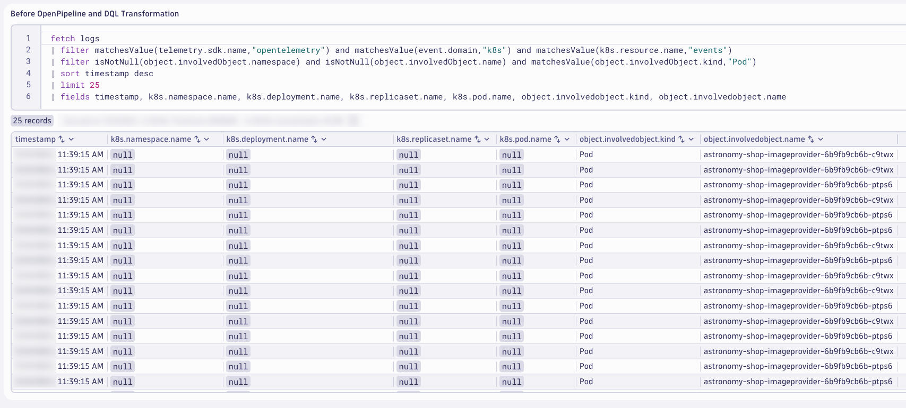

The Pod name follows the naming convention `<deployment-name>-<replicaset-hash>-<pod-hash>`.  Use DQL to transform the logs, parse the Pod name, and apply the value ot the `k8s.deployment.name` and `k8s.replicaset.name` attributes.

DQL: After DQL Transformation
```sql
fetch logs
| filter matchesValue(telemetry.sdk.name,"opentelemetry") and matchesValue(event.domain,"k8s") and matchesValue(k8s.resource.name,"events")
| filter isNotNull(object.involvedObject.namespace) and isNotNull(object.involvedObject.name) and matchesValue(object.involvedObject.kind,"Pod")
| sort timestamp desc
| limit 25
| parse object.involvedObject.name, "LD:deployment ('-' ALNUM:hash '-' ALNUM:unique EOS)"
| fieldsAdd k8s.deployment.name = deployment
| fieldsAdd k8s.replicaset.name = concat(deployment,"-",hash)
| fields timestamp, k8s.namespace.name, k8s.deployment.name, k8s.replicaset.name, k8s.pod.name, object.involvedObject.kind, object.involvedObject.name
```

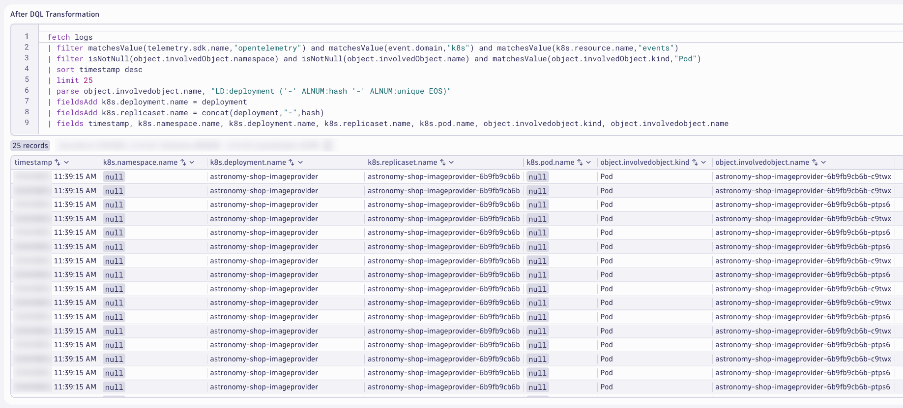

This modifies the log attributes at query time and helps us identify the processing rules for Dynatrace OpenPipeline.  We'll validate the results after OpenPipeline, later.

### Content Field and Drop Fields

The `content` field is a standard semantic attribute/field for log data.  Best practice is to have a populated content field, as the minimum fields necessary log analysis are timestamp and content.  For the Kubernetes Events, the content field is null.  There are other fields on the logs that can be used to populate the content field, `object.reason` and `object.message` are the best candidates.

Additionally, there are several fields with the `object.metadata.*` prefix which provide little to no value.  These fields add log bloat, consuming unnecessary storage and increasing query response times (albeit negligbly).

Query the Kubernetes logs focused on these attributes.

DQL: Before OpenPipeline and DQL Transformation
```sql
fetch logs
| filter matchesValue(telemetry.sdk.name,"opentelemetry") and matchesValue(event.domain,"k8s") and matchesValue(k8s.resource.name,"events")
| filter isNotNull(object.involvedObject.namespace) and isNotNull(object.involvedObject.kind) and isNotNull(object.involvedObject.name)
| sort timestamp desc
| limit 25
| fields timestamp, content, object.reason, object.message, object.metadata.managedfields, object.metadata.name, object.metadata.uid
```

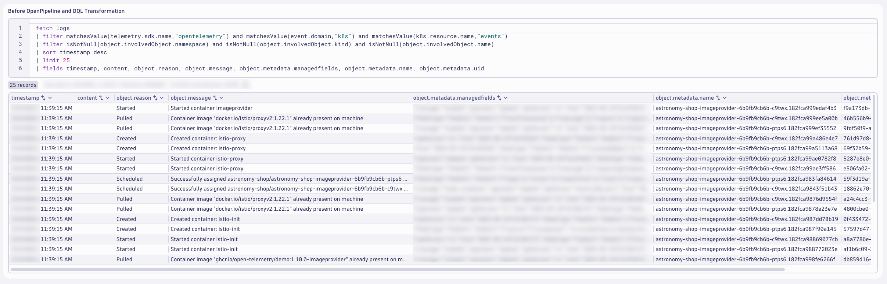

We can use the `object.reason` and `object.message` fields together to create a valuable `content` field.  The `object.metadata.managedfields`, `object.metadata.name`, and `object.metadata.uid` fields are redudant or useless, they can be removed.

Use DQL to transform the logs, set the `content` field and remove the useless fields.

DQL: After DQL Transformation
```sql
fetch logs
| filter matchesValue(telemetry.sdk.name,"opentelemetry") and matchesValue(event.domain,"k8s") and matchesValue(k8s.resource.name,"events")
| filter isNotNull(object.involvedObject.namespace) and isNotNull(object.involvedObject.kind) and isNotNull(object.involvedObject.name)
| filter matchesValue(content,"") or matchesValue(content," ") or isNull(content)
| sort timestamp desc
| limit 25
| fieldsAdd content = if(isNull(object.reason), object.message, else:concat(object.reason,": ", object.message))
| fieldsAdd object.metadata.uid = null, object.metadata.name = null, object.metadata.managedfields = null
| fields timestamp, content, object.reason, object.message, object.metadata.managedfields, object.metadata.name, object.metadata.uid
```

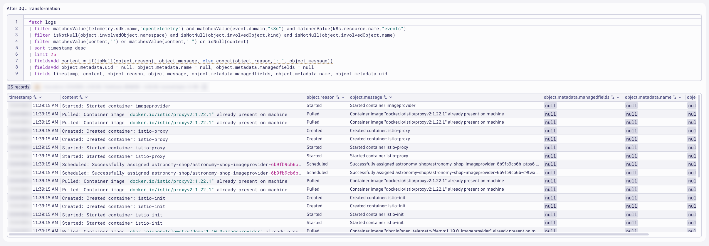

This modifies the log attributes at query time and helps us identify the processing rules for Dynatrace OpenPipeline.  We'll validate the results after OpenPipeline, later.

### OpenTelemetry Service Name and Namespace

In OpenTelemetry, `service.name` and `service.namespace` are used to provide meaningful context about the services generating telemetry data:

`service.name`: This is the logical name of the service. It should be the same for all instances of a horizontally scaled service. For example, if you have a shopping cart service, you might name it shoppingcart.

`service.namespace`: This is used to group related services together. It helps distinguish a group of services that logically belong to the same system or team. For example, you might use Shop as the namespace for all services related to an online store.

These attributes help in organizing and identifying telemetry data, making it easier to monitor and troubleshoot services within a complex system.

The logs for the Kubernetes Events do not include these fields.   In order to make it easier to analyze the log files and unify the telemetry, the `service.name` and `service.namespace` attributes should be added with Dynatrace OpenPipeline.

Query the Kubernetes logs for `astronomy-shop`.

DQL: Before OpenPipeline and DQL Transformation
```sql
fetch logs
| filter matchesValue(telemetry.sdk.name,"opentelemetry") and matchesValue(event.domain,"k8s") and matchesValue(k8s.resource.name,"events")
| filter isNotNull(object.involvedObject.namespace) and isNotNull(object.involvedObject.kind) and isNotNull(object.involvedObject.name)
| filter matchesValue(k8s.namespace.name,"astronomy-shop")
| sort timestamp desc
| limit 25
| fields timestamp, k8s.namespace.name, k8s.deployment.name, service.name, service.namespace, object.involvedObject.name
```

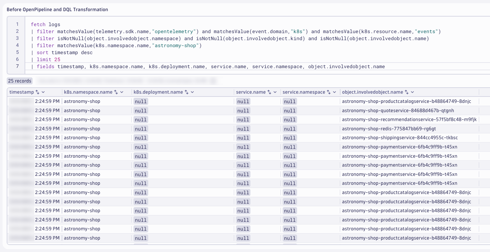

The `k8s.deployment.name` can be split to obtain the `service.name` field.  Unfortunately, the `service.namespace` value does not exist anywhere on the event.  This value will need to be set as a static string.  Use the value that you set in the `$NAME` variable earlier, in the form `<INITIALS>-k8s-otel-o11y`.

Use DQL to transform the logs, set the `service.name` and `service.namespace` fields.

DQL: After DQL Transformation
```sql
fetch logs
| filter matchesValue(telemetry.sdk.name,"opentelemetry") and matchesValue(event.domain,"k8s") and matchesValue(k8s.resource.name,"events")
| filter isNotNull(object.involvedObject.namespace) and isNotNull(object.involvedObject.kind) and isNotNull(object.involvedObject.name)
| filter matchesValue(k8s.namespace.name,"astronomy-shop") and matchesValue(object.involvedObject.kind,"Deployment")
| sort timestamp desc
| limit 25
| fieldsAdd k8s.deployment.name = object.involvedObject.name
| fieldsAdd split_deployment_name = splitString(k8s.deployment.name,k8s.namespace.name)
| parse split_deployment_name[1], "(PUNCT?) WORD:service.name"
| fieldsRemove split_deployment_name
| fieldsAdd service.namespace = "<INITIALS>-k8s-otel-o11y"
| fields timestamp, k8s.namespace.name, k8s.deployment.name, service.name, service.namespace
```
*Be sure to replace `<INITIALS>` with the correct value in your query!*


This modifies the log attributes at query time and helps us identify the processing rules for Dynatrace OpenPipeline.  We'll validate the results after OpenPipeline, *next*.

## Kubernetes Events Logs - OpenPipeline
Configure Dynatrace OpenPipeline for Kubernetes Events logs.

### Create and Configure Dynatrace OpenPipeline

> ⚠️ If the images are too small and the text is difficult to read, right-click and open the image in a new tab.

> ⚠️ Consider saving your pipeline configuration often to avoid losing any changes.

In your Dynatrace tenant, launch the OpenPipeline app.  Begin by selecting `Logs` from the left-hand menu of telemetry types.  Then choose `Pipelines`.  Click on `+ Pipeline` to add a new pipeline.

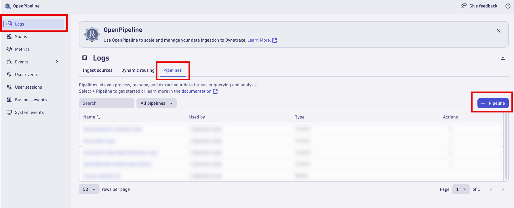

Name the new pipeline, `OpenTelemetry Kubernetes Events`.  Click on the `Processing` tab to begin adding `Processor` rules.

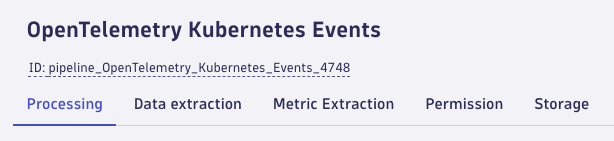

### Kubernetes Attributes

Add a processor to set the Kubernetes Attributes.  Click on `+ Processor` to add a new processor.

Type:
```text
DQL
```

Name:
```text
Kubernetes Attributes
```

Matching condition:
```text
isNotNull(object.involvedObject.namespace) and isNotNull(object.involvedObject.kind) and isNotNull(object.involvedObject.name)
```

Processor definition:
```text
fieldsAdd k8s.namespace.name = object.involvedObject.namespace
| fieldsAdd k8s.pod.name = if(object.involvedObject.kind == "Pod",object.involvedObject.name)
| fieldsAdd k8s.deployment.name = if(object.involvedObject.kind == "Deployment",object.involvedObject.name)
| fieldsAdd k8s.replicaset.name = if(object.involvedObject.kind == "ReplicaSet",object.involvedObject.name)
```

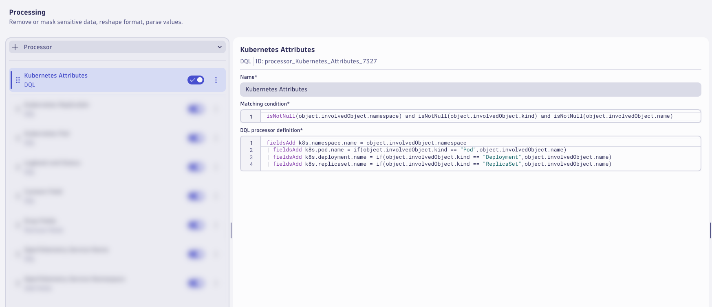

### Kubernetes ReplicaSet

Add a processor to set the values for Kubernetes ReplicaSet.  Click on `+ Processor` to add a new processor.

Type:
```text
DQL
```

Name:
```text
Kubernetes ReplicaSet
```

Matching condition:
```text
isNotNull(object.involvedObject.namespace) and isNotNull(object.involvedObject.name) and matchesValue(object.involvedObject.kind,"ReplicaSet")
```

Processor definition:
```text
parse object.involvedObject.name, "LD:deployment ('-' ALNUM:hash EOS)"
| fieldsAdd k8s.deployment.name = deployment
| fieldsRemove deployment, hash
```

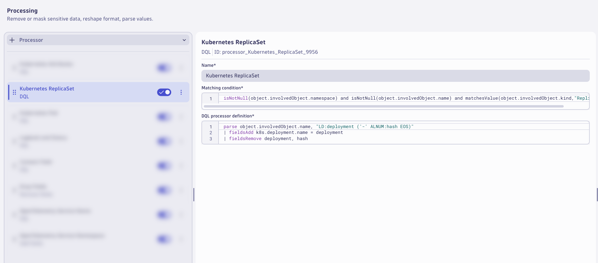

### Kubernetes Pod

Add a processor to set the values for Kubernetes Pod.  Click on `+ Processor` to add a new processor.

Type:
```text
DQL
```

Name:
```text
Kubernetes Pod
```

Matching condition:
```text
isNotNull(object.involvedObject.namespace) and isNotNull(object.involvedObject.name) and matchesValue(object.involvedObject.kind,"Pod")
```

Processor definition:
```text
parse object.involvedObject.name, "LD:deployment ('-' ALNUM:hash '-' ALNUM:unique EOS)"
| fieldsAdd k8s.deployment.name = deployment
| fieldsAdd k8s.replicaset.name = concat(deployment,"-",hash)
| fieldsRemove deployment, hash, unique
```

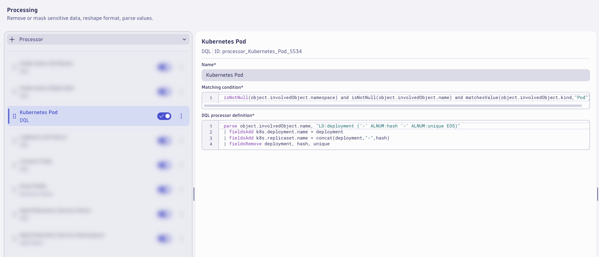

### Loglevel and Status

Add a processor to set the Loglevel and Status fields.  Click on `+ Processor` to add a new processor.

Type:
```text
DQL
```

Name:
```text
Loglevel and Status
```

Matching condition:
```text
isNotNull(object.type) and (isNull(loglevel) or matchesValue(loglevel,"NONE")) and (isNull(status) or matchesValue(status,"NONE"))
```

Processor definition:
```text
fieldsAdd loglevel = if(matchesValue(object.type,"Normal"),"INFO", else: if(matchesValue(object.type,"Warning"),"WARN", else: "NONE"))
| fieldsAdd status = if(matchesValue(object.type,"Normal"),"INFO", else: if(matchesValue(object.type,"Warning"),"WARN", else: "NONE"))
```

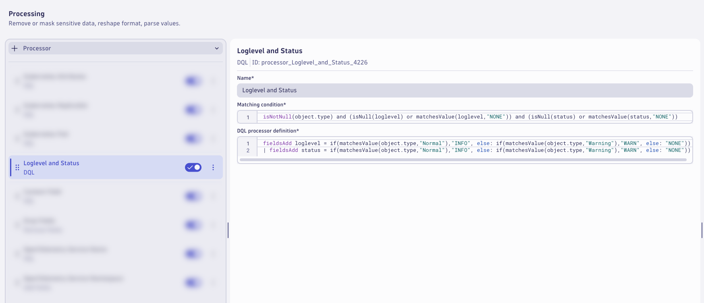

### Content Field

Add a processor to set the content field.  Click on `+ Processor` to add a new processor.

Type:
```text
DQL
```

Name:
```text
Content Field
```

Matching condition:
```text
(matchesValue(content,"") or matchesValue(content," ") or isNull(content)) and isNotNull(object.message)
```

Processor definition:
```text
fieldsAdd content = if(isNull(object.reason), object.message, else:concat(object.reason,": ", object.message))
```

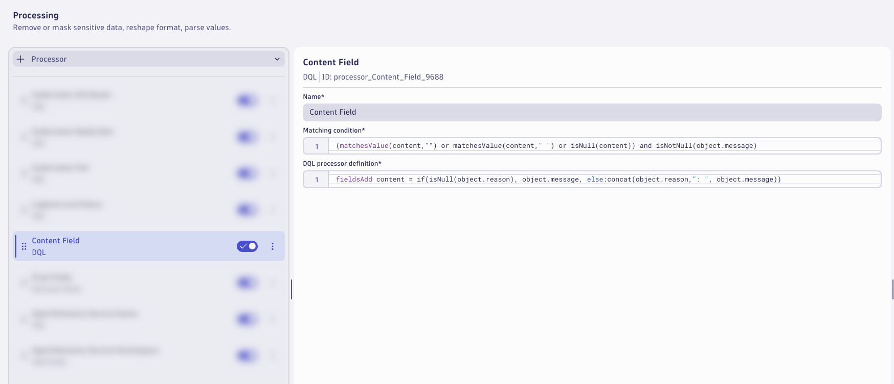

### Remove Fields

Add a processor to drop the redudant and unnecessary.  Click on `+ Processor` to add a new processor.

Type:
```text
Remove Fields
```

Name:
```text
Drop Fields
```

Matching condition:
```text
isNotNull(object.involvedObject.namespace) and isNotNull(object.involvedObject.kind) and isNotNull(object.involvedObject.name)
```

Remove fields:
| Fields                         |
|--------------------------------|
| object.metadata.name           |
| object.metadata.uid            |
| object.metadata.managedFields  |

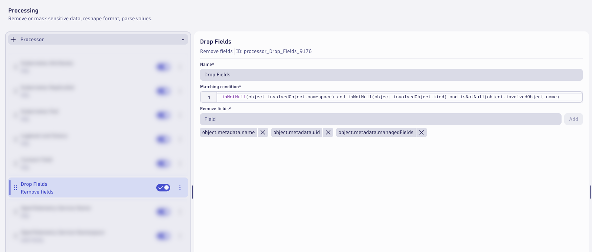

### OpenTelemetry Service Name

Add a processor to set the OpenTelemetry Service Name.  Click on `+ Processor` to add a new processor.

Type:
```text
DQL
```

Name:
```text
OpenTelemetry Service Name
```

Matching condition:
```text
matchesValue(k8s.namespace.name,"astronomy-shop") and isNotNull(k8s.deployment.name) and isNull(service.name)
```

Processor definition:
```text
fieldsAdd split_deployment_name = splitString(k8s.deployment.name,k8s.namespace.name)
| parse split_deployment_name[1], "(PUNCT?) WORD:service.name"
| fieldsRemove split_deployment_name
```

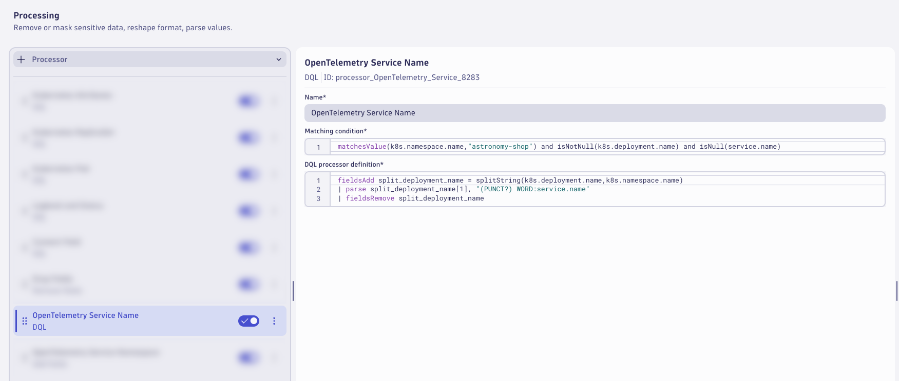

### OpenTelemetry Service Namespace

Add a processor to set the OpenTelemetry Service Namespace.  Click on `+ Processor` to add a new processor.

Type:
```text
Add Fields
```

Name:
```text
OpenTelemetry Service Namespace
```

Matching condition:
```text
matchesValue(k8s.namespace.name,"astronomy-shop") and isNotNull(k8s.deployment.name) and isNotNull(service.name) and isNull(service.namespace)
```

Add fields:
| Field                | Value                         |
|------------------------------------------------------|
| service.namespace    | INITIALS-k8s-otel-o11y        |

*Be sure to use the same `service.namespace` value that you have used elsewhere in this lab!*

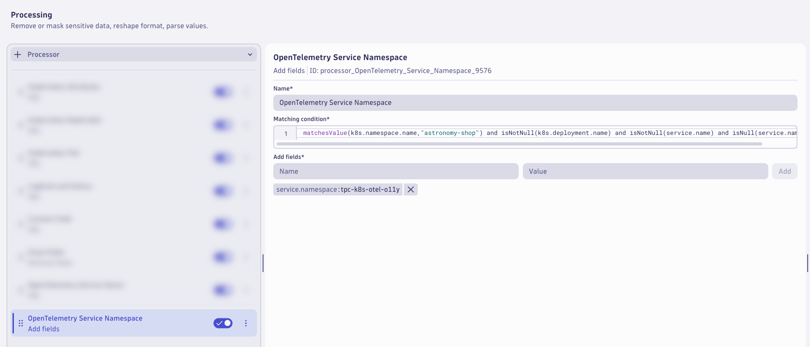

### Kubernetes Event Count

Switch to the `Metric Extraction` tab.

Add a processor to set extract a metric from the Kubernetes event logs.  Click on `+ Processor` to add a new processor.

Type:
```text
Counter metric
```

Name:
```text
Kubernetes Event Count
```

Matching condition:
```text
isNotNull(k8s.cluster.name) and isNotNull(k8s.namespace.name) and isNotNull(status)
```

Metric key:
```text
otel.k8s.event_count
```

Dimensions:
| Fields                         |
|--------------------------------|
| k8s.namespace.name             |
| k8s.cluster.name               |
| status                         |
| service.name                   |

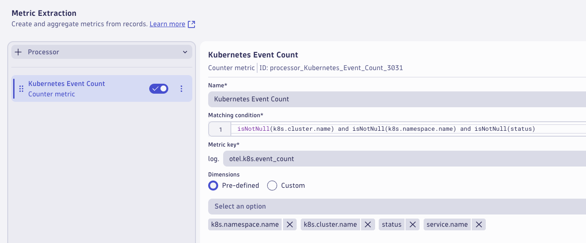

The pipeline is now configured, click on `Save` to save the pipeline configuration.


### Dynamic Route

A pipeline will not have any effect unless logs are configured to be routed to the pipeline.  With dynamic routing, data is routed based on a matching condition. The matching condition is a DQL query that defines the data set you want to route.

Click on `Dynamic Routing` to configure a route to the target pipeline.  Click on `+ Dynamic Route` to add a new route.

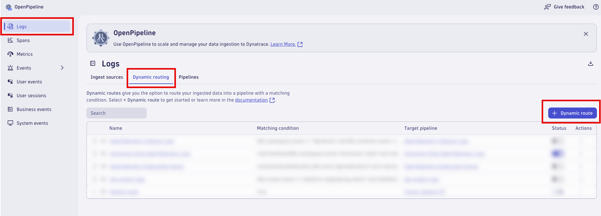

Configure the `Dynamic Route` to use the `OpenTelemetry Kubernetes Events` pipeline.

Name:
```text
OpenTelemetry Kubernetes Events
```

Matching condition:
```text
matchesValue(telemetry.sdk.name,"opentelemetry") and matchesValue(event.domain,"k8s") and matchesValue(k8s.resource.name,"events")
```

Pipeline:
```text
OpenTelemetry Kubernetes Events
```

Click `Add` to add the route.

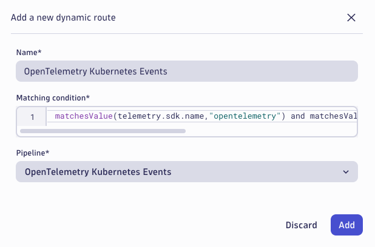

Validate that the route is enabled in the `Status` column.  Click on `Save` to save the dynamic route table configuration.

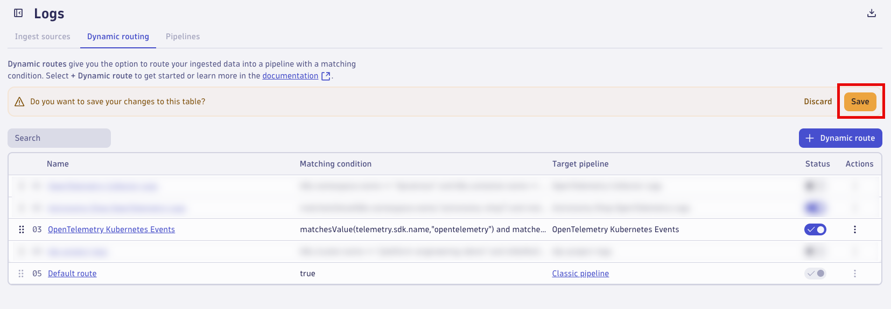

Changes will typically take effect within a couple of minutes.

### Generate Kubernetes Events

Kubernetes Events will only be generated when Kubernetes orchestration causes changes within the environment.  Generate new Kubernetes Events for analysis prior to continuing.

Command:
```text
kubectl delete pods -n astronomy-shop --field-selector="status.phase=Running"
```

This will delete all running pods for `astronomy-shop` and schedule new ones, resulting in many new Kubernetes Events.

## Kubernetes Events Logs - Analyze
Analyze the Kubernetes Events logs after Dynatrace OpenPipeline processing.

### Analyze the results in Dynatrace (Notebook)

Use the Notebook from earlier to analyze the results.

### Kubernetes Attributes

Query the Kubernetes Events logs fitered on `event.domain == "k8s"` to analyze with `Kubernetes Attributes`.

DQL: After OpenPipeline
```sql
fetch logs
| filter matchesValue(telemetry.sdk.name,"opentelemetry") and matchesValue(event.domain,"k8s") and matchesValue(k8s.resource.name,"events")
| filter isNotNull(object.involvedObject.namespace) and isNotNull(object.involvedObject.kind) and isNotNull(object.involvedObject.name)
| sort timestamp desc
| limit 25
| fields timestamp, k8s.namespace.name, k8s.deployment.name, k8s.replicaset.name, k8s.pod.name, object.involvedObject.kind, object.involvedObject.name
```

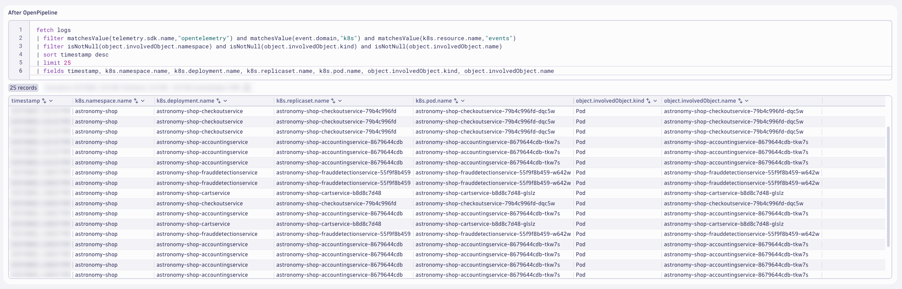

### Kubernetes ReplicaSet

Query the Kubernetes Events logs fitered on `object.involvedObject.kind == "ReplicaSet"`.

DQL: After OpenPipeline
```sql
fetch logs
| filter matchesValue(telemetry.sdk.name,"opentelemetry") and matchesValue(event.domain,"k8s") and matchesValue(k8s.resource.name,"events")
| filter isNotNull(object.involvedObject.namespace) and isNotNull(object.involvedObject.name) and matchesValue(object.involvedObject.kind,"ReplicaSet")
| sort timestamp desc
| limit 25
| fields timestamp, k8s.namespace.name, k8s.deployment.name, k8s.replicaset.name, k8s.pod.name, object.involvedObject.kind, object.involvedObject.name
```

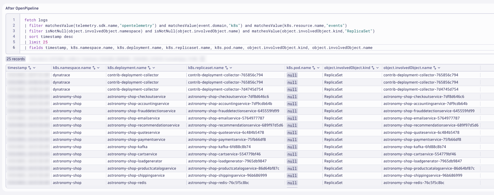

### Kubernetes Pod

Query the Kubernetes Events logs fitered on `object.involvedObject.kind == "Pod"`.

DQL: After OpenPipeline
```sql
fetch logs
| filter matchesValue(telemetry.sdk.name,"opentelemetry") and matchesValue(event.domain,"k8s") and matchesValue(k8s.resource.name,"events")
| filter isNotNull(object.involvedObject.namespace) and isNotNull(object.involvedObject.name) and matchesValue(object.involvedObject.kind,"Pod")
| sort timestamp desc
| limit 25
| fields timestamp, k8s.namespace.name, k8s.deployment.name, k8s.replicaset.name, k8s.pod.name, object.involvedObject.kind, object.involvedObject.name
```

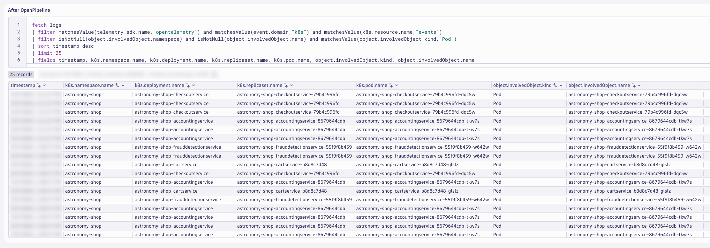

### Content Field and Drop Fields

Query the Kubernetes Events logs to view the new `content` field.

DQL: After OpenPipeline
```sql
fetch logs
| filter matchesValue(telemetry.sdk.name,"opentelemetry") and matchesValue(event.domain,"k8s") and matchesValue(k8s.resource.name,"events")
| filter isNotNull(object.involvedObject.namespace) and isNotNull(object.involvedObject.kind) and isNotNull(object.involvedObject.name)
| sort timestamp desc
| limit 25
| fields timestamp, content, object.reason, object.message, object.metadata.managedfields, object.metadata.name, object.metadata.uid
```

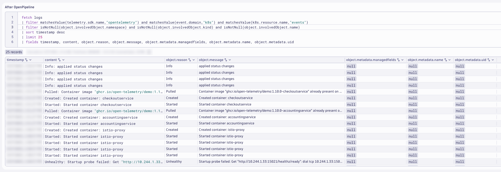

### OpenTelemetry Service Name and Namespace

Query the Kubernetes Events logs filtered on `service.name` and `service.namespace`.

DQL: After OpenPipeline
```sql
fetch logs
| filter matchesValue(telemetry.sdk.name,"opentelemetry") and matchesValue(event.domain,"k8s") and matchesValue(k8s.resource.name,"events")
| filter isNotNull(object.involvedObject.namespace) and isNotNull(object.involvedObject.kind) and isNotNull(object.involvedObject.name)
| filter matchesValue(k8s.namespace.name,"astronomy-shop") and isNotNull(k8s.deployment.name) and isNotNull(service.name)
| sort timestamp desc
| limit 25
| fields timestamp, k8s.namespace.name, k8s.deployment.name, service.name, service.namespace, content
```

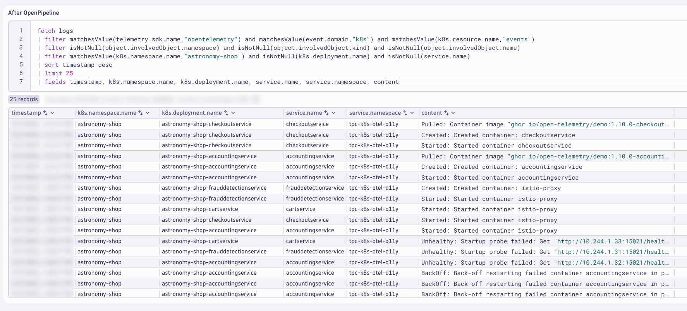

## Wrap Up

### What You Learned Today

By completing this lab, you've successfully set up Dynatrace OpenPipeline pipelines to process the OpenTelemetry logs at ingest.

- OpenTelemetry Collector logs
    * Parse JSON structured content field to easily filter, aggregate, and analyze on nested fields
    * Set loglevel and status fields to easily identify errors with the OpenTelemetry Collector
    * Remove unwanted fields/attributes to reduce log bloat and optimize queries
    * Extract metrics: successful data points to track OpenTelemetry Collector health and reduce heavy log queries
    * Extract metrics: dropped data points to track OpenTelemetry Collector health and reduce heavy log queries
    * Alert: zero data points to be alerted on OpenTelemetry Collector health issues
- Astronomy Shop logs
    * Add OpenTelemetry service name and namespace fields to unify telemetry signals and enable out-of-the-box analysis
    * Enrich SDK logs with additional Kubernetes metadata to unify telemetry signals and analyze Kubernetes context
    * Apply Dynatrace technology bundle (Java) to transform logs based on known Java standards and frameworks
    * Extract data: Payment transaction business event to measure business outcomes and link them to system health
    * Extract metrics: Payment transaction amount to measure business KPIs and link them to system health
- Kubernetes Events logs
    * Enrich logs with additional Kubernetes metadata to unify telemetry signals and analyze Kubernetes context
    * Enrich the content field to fit logging standards and semantics
    * Set loglevel and status fields to easily identify errors with Kubernetes context
    * Remove unwanted fields/attributes to reduce log bloat and optimize queries
    * Add OpenTelemetry service name and namespace to unify telemetry signals and enable out-of-the-box analysis
    * Extract metrics: event count to track Kubernetes health and reduce heavy log queries


## Continue

<div class="grid cards" markdown>
- [Continue to :octicons-arrow-right-24:](cleanup.md)
</div>
