# Dynatrace OpenPipeline
--8<-- "snippets/send-bizevent/9-dynatrace-openpipeline-kubernetes-events.js"

In this module we'll utilize Dynatrace OpenPipeline to process Kubernetes Events at ingest, in order to make them easier to analyze and leverage.  The events will be ingested by OpenTelemetry Collector as logs, deployed on Kubernetes as part of the previous module.  With OpenPipeline, the logs will be processed at ingest, to manipulate fields, extract metrics, and raise alert events in case of any issues.

The OpenTelemetry Collector, specifically the Contrib Distro running as a Deployment, is configured to capture Kubernetes Events using the `k8s_objects` receiver.  These events are shipped to Dynatrace as OpenTelemetry logs.  While these logs contain a lot of useful information, they are missing valuable fields/attributes that will make them easier to analyze in context.  These logs can be enriched at ingest, using OpenPipeline.  Additionally, OpenPipeline allows us to process fields, extract new data types, manage permissions, and modify storage retention.

**Goals:**

* Enrich logs with additional Kubernetes metadata
* Enrich the log message, via the content field
* Set loglevel and status fields
* Remove unwanted fields/attributes
* Add OpenTelemetry service name and namespace
* Extract metrics: event count


OpenPipeline is an architectural component of Dynatrace SaaS.  It resides between the Dynatrace SaaS tenant and [Grail](https://docs.dynatrace.com/docs/discover-dynatrace/platform/grail/dynatrace-grail) data lakehouse.  Logs (,traces, metrics, events, and more) are sent to the Dynatrace SaaS tenant and route through OpenPipeline where they are enriched, transformed, and contextualized prior to being stored in Grail.

<div class="grid cards" markdown>
- [Learn More:octicons-arrow-right-24:](https://docs.dynatrace.com/docs/discover-dynatrace/platform/openpipeline/concepts/data-flow){target=_blank}
</div>

## Generate Kubernetes Events

Kubernetes Events will only be generated when Kubernetes orchestration causes changes within the environment.  Generate new Kubernetes Events for analysis prior to continuing.

Command:
```text
kubectl delete pods -n astronomy-shop --field-selector="status.phase=Running"
```

This will delete all running pods for `astronomy-shop` and schedule new ones, resulting in many new Kubernetes Events.

## Query Logs

Query and discover the Kubernetes Events logs as they are ingested and stored in Dynatrace.  Use Dynatrace Query Language (DQL) to transform the logs at query time and prepare for Dynatrace OpenPipeline configuration.

**Import Notebook into Dynatrace**

[Download Kubernetes Events Logs Notebook](https://github.com/dynatrace-wwse/enablement-kubernetes-opentelemetry-openpipeline/blob/main/assets/dynatrace/notebooks/opentelemetry-kubernetes-events.json){target=_blank}

**Kubernetes Events - Ondemand Processing at Query Time (Notebook)**

### Kubernetes Attributes

When the OpenTelemetry Collector captures Kubernetes Events using the `k8s_objects` receiver, most of the Kubernetes context information is stored in fields with the prefix `object.*` and `object.involvedObject.*`.  These fields aren't used in other logs related to Kubernetes observability.  Dynatrace OpenPipeline enables us to parse these object fields and use them to populate the normal Kubernetes (`k8s.*`) attributes.

!!! warning "Field Name Casing"
    In some cases, it has been observed that the fields that should start with `object.involvedObject.*` are instead starting with `object.involvedobject.*`.  When using field names with DQL, the proper case needs to be used.  If you encounter this, please match the casing you observe in your environment.

Query the Kubernetes logs filtered on `event.domain == "k8s"` and `telemetry.sdk.name`.

DQL: Before OpenPipeline and DQL Transformation
```sql
fetch logs
| filter matchesValue(telemetry.sdk.name,"opentelemetry") and matchesValue(event.domain,"k8s") and matchesValue(k8s.resource.name,"events")
| filter isNotNull(object.involvedObject.namespace) and isNotNull(object.involvedObject.kind) and isNotNull(object.involvedObject.name)
| sort timestamp desc
| limit 25
```


Notice the many fields with the `object.*` prefix that provide valuable context information about the Kubernetes component related to the event.  Use the `object.involvedObject.namespace`, `object.involvedObject.kind`, and `object.involvedObject.name` fields to set the Kubernetes (`k8s.*`) attributes.

Use DQL to transform the logs and apply the `k8s.*` attributes.

DQL: After DQL Transformation
```sql
fetch logs
| filter matchesValue(telemetry.sdk.name,"opentelemetry") and matchesValue(event.domain,"k8s") and matchesValue(k8s.resource.name,"events")
| filter isNotNull(object.involvedObject.namespace) and isNotNull(object.involvedObject.kind) and isNotNull(object.involvedObject.name)
| sort timestamp desc
| limit 25
| fieldsAdd k8s.namespace.name = object.involvedObject.namespace
| fieldsAdd k8s.pod.name = if(object.involvedObject.kind == "Pod",object.involvedObject.name)
| fieldsAdd k8s.deployment.name = if(object.involvedObject.kind == "Deployment",object.involvedObject.name)
| fieldsAdd k8s.replicaset.name = if(object.involvedObject.kind == "ReplicaSet",object.involvedObject.name)
| fields timestamp, k8s.namespace.name, k8s.deployment.name, k8s.replicaset.name, k8s.pod.name, object.involvedObject.kind, object.involvedObject.name
```


These changes with DQL allow us to populate the relevant Kubernetes attributes where we know the correct value.  For example, if the involved object is a Deployment, then we can set the `k8s.deployment.name` attribute.  In order to populate the missing fields, we can apply logic and DQL parsing commands.

### Kubernetes ReplicaSet

For the Kubernetes Events that impact a ReplicaSet, we need to set the `k8s.replicaset.name` and `k8s.deployment.name`.  Since the event doesn't directly impact a Pod and we don't know the Pod unique id, the `k8s.pod.name` attribute should remain `null`.

Query the Kubernetes logs filtered on `object.involvedObject.kind == "ReplicaSet"`.

DQL: Before OpenPipeline and DQL Transformation
```sql
fetch logs
| filter matchesValue(telemetry.sdk.name,"opentelemetry") and matchesValue(event.domain,"k8s") and matchesValue(k8s.resource.name,"events")
| filter isNotNull(object.involvedObject.namespace) and isNotNull(object.involvedObject.name) and matchesValue(object.involvedObject.kind,"ReplicaSet")
| sort timestamp desc
| limit 25
| fields timestamp, k8s.namespace.name, k8s.deployment.name, k8s.replicaset.name, k8s.pod.name, object.involvedObject.kind, object.involvedObject.name
```

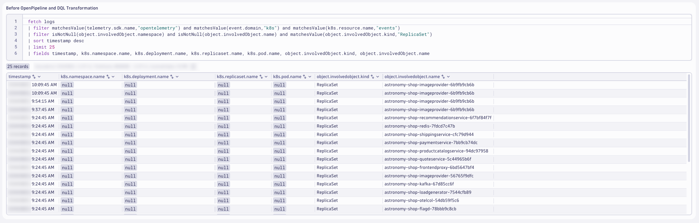

The ReplicaSet name follows the naming convention `<deployment-name>-<replicaset-hash>`.  Use DQL to transform the logs, parse the ReplicaSet name, and apply the value ot the `k8s.deployment.name` attribute.

DQL: After DQL Transformation
```sql
fetch logs
| filter matchesValue(telemetry.sdk.name,"opentelemetry") and matchesValue(event.domain,"k8s") and matchesValue(k8s.resource.name,"events")
| filter isNotNull(object.involvedObject.namespace) and isNotNull(object.involvedObject.name) and matchesValue(object.involvedObject.kind,"ReplicaSet")
| sort timestamp desc
| limit 25
| parse object.involvedObject.name, "LD:deployment ('-' ALNUM:hash EOS)"
| fieldsAdd k8s.deployment.name = deployment
| fields timestamp, k8s.namespace.name, k8s.deployment.name, k8s.replicaset.name, k8s.pod.name, object.involvedObject.kind, object.involvedObject.name
```

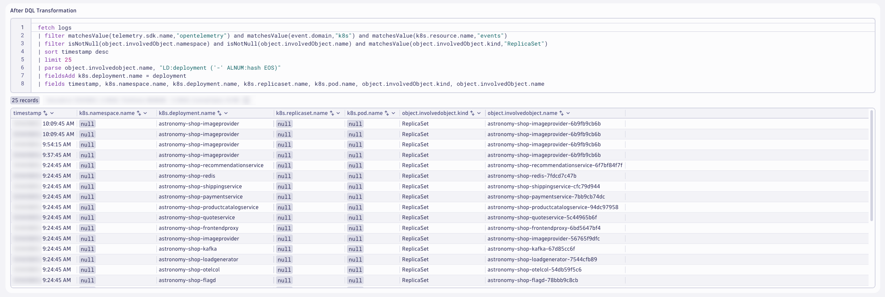

This modifies the log attributes at query time and helps us identify the processing rules for Dynatrace OpenPipeline.  We'll validate the results after OpenPipeline, later.

### Kubernetes Pod

For the Kubernetes Events that impact a Pod, we need to set the `k8s.pod.name`, `k8s.replicaset.name` and `k8s.deployment.name` since we know all (3).

Query the Kubernetes logs filtered on `object.involvedObject.kind == "Pod"`.

DQL: Before OpenPipeline and DQL Transformation
```sql
fetch logs
| filter matchesValue(telemetry.sdk.name,"opentelemetry") and matchesValue(event.domain,"k8s") and matchesValue(k8s.resource.name,"events")
| filter isNotNull(object.involvedObject.namespace) and isNotNull(object.involvedObject.name) and matchesValue(object.involvedObject.kind,"Pod")
| sort timestamp desc
| limit 25
| fields timestamp, k8s.namespace.name, k8s.deployment.name, k8s.replicaset.name, k8s.pod.name, object.involvedObject.kind, object.involvedObject.name
```

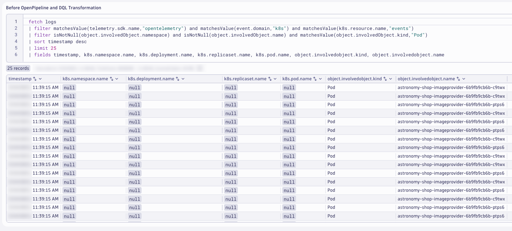

The Pod name follows the naming convention `<deployment-name>-<replicaset-hash>-<pod-hash>`.  Use DQL to transform the logs, parse the Pod name, and apply the value ot the `k8s.deployment.name` and `k8s.replicaset.name` attributes.

DQL: After DQL Transformation
```sql
fetch logs
| filter matchesValue(telemetry.sdk.name,"opentelemetry") and matchesValue(event.domain,"k8s") and matchesValue(k8s.resource.name,"events")
| filter isNotNull(object.involvedObject.namespace) and isNotNull(object.involvedObject.name) and matchesValue(object.involvedObject.kind,"Pod")
| sort timestamp desc
| limit 25
| parse object.involvedObject.name, "LD:deployment ('-' ALNUM:hash '-' ALNUM:unique EOS)"
| fieldsAdd k8s.deployment.name = deployment
| fieldsAdd k8s.replicaset.name = concat(deployment,"-",hash)
| fields timestamp, k8s.namespace.name, k8s.deployment.name, k8s.replicaset.name, k8s.pod.name, object.involvedObject.kind, object.involvedObject.name
```

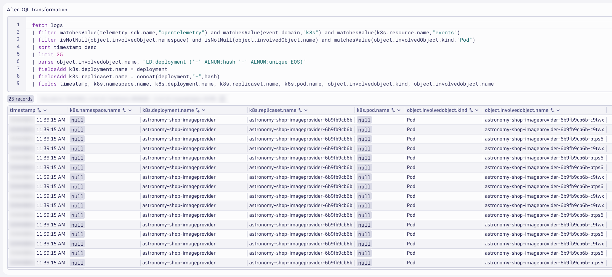

This modifies the log attributes at query time and helps us identify the processing rules for Dynatrace OpenPipeline.  We'll validate the results after OpenPipeline, later.

### Content Field and Drop Fields

The `content` field is a standard semantic attribute/field for log data.  Best practice is to have a populated content field, as the minimum fields necessary for log analysis are timestamp and content.  For the Kubernetes Events, the content field is null.  There are other fields on the logs that can be used to populate the content field, `object.reason` and `object.message` are the best candidates.

Additionally, there are several fields with the `object.metadata.*` prefix which provide little to no value.  These fields add log bloat, consuming unnecessary storage and increasing query response times (albeit negligbly).

Query the Kubernetes logs focused on these attributes.

DQL: Before OpenPipeline and DQL Transformation
```sql
fetch logs
| filter matchesValue(telemetry.sdk.name,"opentelemetry") and matchesValue(event.domain,"k8s") and matchesValue(k8s.resource.name,"events")
| filter isNotNull(object.involvedObject.namespace) and isNotNull(object.involvedObject.kind) and isNotNull(object.involvedObject.name)
| sort timestamp desc
| limit 25
| fields timestamp, content, object.reason, object.message, object.metadata.managedfields, object.metadata.name, object.metadata.uid
```


We can use the `object.reason` and `object.message` fields together to create a valuable `content` field.  The `object.metadata.managedfields`, `object.metadata.name`, and `object.metadata.uid` fields are redudant or useless, they can be removed.

Use DQL to transform the logs, set the `content` field and remove the useless fields.

DQL: After DQL Transformation
```sql
fetch logs
| filter matchesValue(telemetry.sdk.name,"opentelemetry") and matchesValue(event.domain,"k8s") and matchesValue(k8s.resource.name,"events")
| filter isNotNull(object.involvedObject.namespace) and isNotNull(object.involvedObject.kind) and isNotNull(object.involvedObject.name)
| filter matchesValue(content,"") or matchesValue(content," ") or isNull(content)
| sort timestamp desc
| limit 25
| fieldsAdd content = if(isNull(object.reason), object.message, else:concat(object.reason,": ", object.message))
| fieldsAdd object.metadata.uid = null, object.metadata.name = null, object.metadata.managedfields = null
| fields timestamp, content, object.reason, object.message, object.metadata.managedfields, object.metadata.name, object.metadata.uid
```

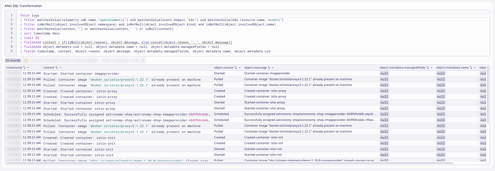

This modifies the log attributes at query time and helps us identify the processing rules for Dynatrace OpenPipeline.  We'll validate the results after OpenPipeline, later.

### OpenTelemetry Service Name and Namespace

In OpenTelemetry, `service.name` and `service.namespace` are used to provide meaningful context about the services generating telemetry data:

`service.name`: This is the logical name of the service. It should be the same for all instances of a horizontally scaled service. For example, if you have a shopping cart service, you might name it shoppingcart.

`service.namespace`: This is used to group related services together. It helps distinguish a group of services that logically belong to the same system or team. For example, you might use Shop as the namespace for all services related to an online store.

These attributes help in organizing and identifying telemetry data, making it easier to monitor and troubleshoot services within a complex system.

The logs for the Kubernetes Events do not include these fields.   In order to make it easier to analyze the log files and unify the telemetry, the `service.name` and `service.namespace` attributes should be added with Dynatrace OpenPipeline.

Query the Kubernetes logs for `astronomy-shop`.

DQL: Before OpenPipeline and DQL Transformation
```sql
fetch logs
| filter matchesValue(telemetry.sdk.name,"opentelemetry") and matchesValue(event.domain,"k8s") and matchesValue(k8s.resource.name,"events")
| filter isNotNull(object.involvedObject.namespace) and isNotNull(object.involvedObject.kind) and isNotNull(object.involvedObject.name)
| filter matchesValue(k8s.namespace.name,"astronomy-shop")
| sort timestamp desc
| limit 25
| fields timestamp, k8s.namespace.name, k8s.deployment.name, service.name, service.namespace, object.involvedObject.name
```

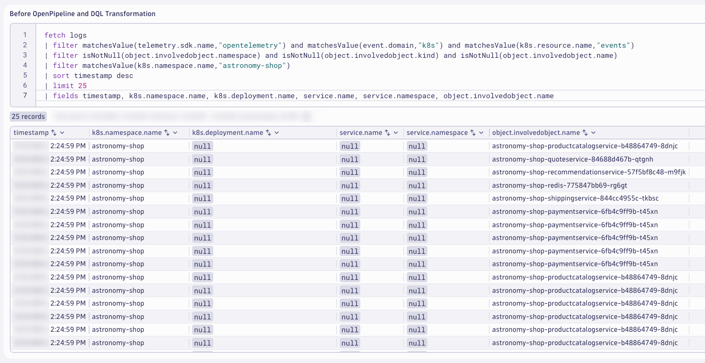

The `k8s.deployment.name` can be split to obtain the `service.name` field.  Unfortunately, the `service.namespace` value does not exist anywhere on the event.  This value will need to be set as a static string.  Use the value that you set in the `$NAME` variable earlier, in the form `<INITIALS>-k8s-otel-o11y`.

Use DQL to transform the logs, set the `service.name` and `service.namespace` fields.

DQL: After DQL Transformation
```sql
fetch logs
| filter matchesValue(telemetry.sdk.name,"opentelemetry") and matchesValue(event.domain,"k8s") and matchesValue(k8s.resource.name,"events")
| filter isNotNull(object.involvedObject.namespace) and isNotNull(object.involvedObject.kind) and isNotNull(object.involvedObject.name)
| filter matchesValue(k8s.namespace.name,"astronomy-shop") and matchesValue(object.involvedObject.kind,"Deployment")
| sort timestamp desc
| limit 25
| fieldsAdd k8s.deployment.name = object.involvedObject.name
| fieldsAdd split_deployment_name = splitString(k8s.deployment.name,k8s.namespace.name)
| parse split_deployment_name[1], "(PUNCT?) WORD:service.name"
| fieldsRemove split_deployment_name
| fieldsAdd service.namespace = "<INITIALS>-k8s-otel-o11y"
| fields timestamp, k8s.namespace.name, k8s.deployment.name, service.name, service.namespace
```
*Be sure to replace `<INITIALS>` with the correct value in your query!*


This modifies the log attributes at query time and helps us identify the processing rules for Dynatrace OpenPipeline.  We'll validate the results after OpenPipeline, *next*.

## Configure OpenPipeline

Configure Dynatrace OpenPipeline for Kubernetes Events logs.

!!! tip "View Images"
    If the images are too small and the text is difficult to read, right-click and open the image in a new tab.

!!! tip "Save Often"
    Consider saving your pipeline configuration often to avoid losing any changes.

In your Dynatrace tenant, launch the OpenPipeline app.  Begin by selecting `Logs` from the left-hand menu of telemetry types.  Then choose `Pipelines`.  Click on `+ Pipeline` to add a new pipeline.


Name the new pipeline, `OpenTelemetry Kubernetes Events`.  Click on the `Processing` tab to begin adding `Processor` rules.


### Kubernetes Attributes

Add a processor to set the Kubernetes Attributes.  Click on `+ Processor` to add a new processor.

Type:
```text
DQL
```

Name:
```text
Kubernetes Attributes
```

Matching condition:
```text
isNotNull(object.involvedObject.namespace) and isNotNull(object.involvedObject.kind) and isNotNull(object.involvedObject.name)
```

Processor definition:
```text
fieldsAdd k8s.namespace.name = object.involvedObject.namespace
| fieldsAdd k8s.pod.name = if(object.involvedObject.kind == "Pod",object.involvedObject.name)
| fieldsAdd k8s.deployment.name = if(object.involvedObject.kind == "Deployment",object.involvedObject.name)
| fieldsAdd k8s.replicaset.name = if(object.involvedObject.kind == "ReplicaSet",object.involvedObject.name)
```

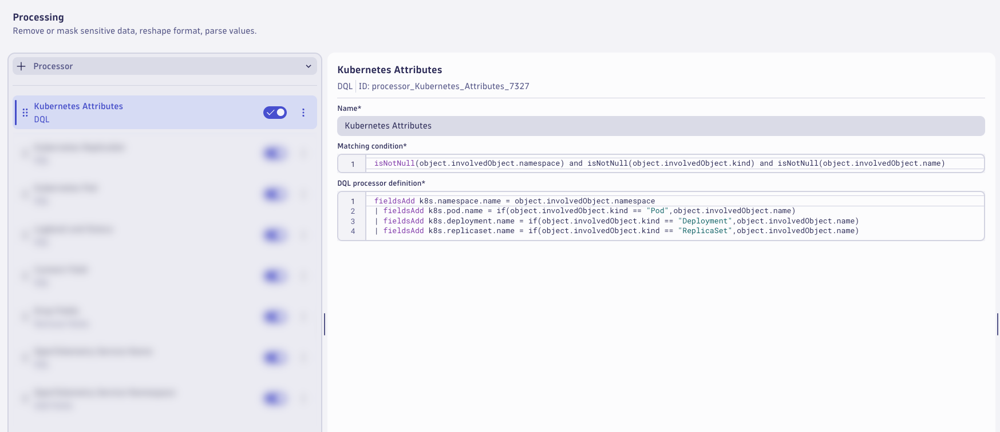

### Kubernetes ReplicaSet

Add a processor to set the values for Kubernetes ReplicaSet.  Click on `+ Processor` to add a new processor.

Type:
```text
DQL
```

Name:
```text
Kubernetes ReplicaSet
```

Matching condition:
```text
isNotNull(object.involvedObject.namespace) and isNotNull(object.involvedObject.name) and matchesValue(object.involvedObject.kind,"ReplicaSet")
```

Processor definition:
```text
parse object.involvedObject.name, "LD:deployment ('-' ALNUM:hash EOS)"
| fieldsAdd k8s.deployment.name = deployment
| fieldsRemove deployment, hash
```


### Kubernetes Pod

Add a processor to set the values for Kubernetes Pod.  Click on `+ Processor` to add a new processor.

Type:
```text
DQL
```

Name:
```text
Kubernetes Pod
```

Matching condition:
```text
isNotNull(object.involvedObject.namespace) and isNotNull(object.involvedObject.name) and matchesValue(object.involvedObject.kind,"Pod")
```

Processor definition:
```text
parse object.involvedObject.name, "LD:deployment ('-' ALNUM:hash '-' ALNUM:unique EOS)"
| fieldsAdd k8s.deployment.name = deployment
| fieldsAdd k8s.replicaset.name = concat(deployment,"-",hash)
| fieldsRemove deployment, hash, unique
```


### Loglevel and Status

Add a processor to set the Loglevel and Status fields.  Click on `+ Processor` to add a new processor.

Type:
```text
DQL
```

Name:
```text
Loglevel and Status
```

Matching condition:
```text
isNotNull(object.type) and (isNull(loglevel) or matchesValue(loglevel,"NONE")) and (isNull(status) or matchesValue(status,"NONE"))
```

Processor definition:
```text
fieldsAdd loglevel = if(matchesValue(object.type,"Normal"),"INFO", else: if(matchesValue(object.type,"Warning"),"WARN", else: "NONE"))
| fieldsAdd status = if(matchesValue(object.type,"Normal"),"INFO", else: if(matchesValue(object.type,"Warning"),"WARN", else: "NONE"))
```

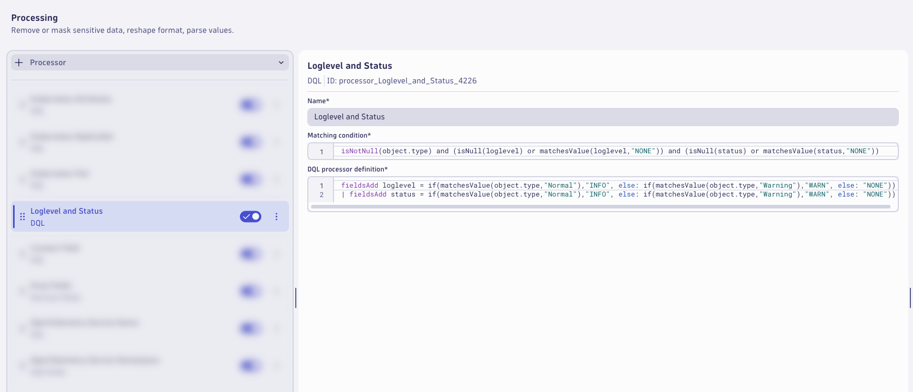

### Content Field

Add a processor to set the content field.  Click on `+ Processor` to add a new processor.

Type:
```text
DQL
```

Name:
```text
Content Field
```

Matching condition:
```text
(matchesValue(content,"") or matchesValue(content," ") or isNull(content)) and isNotNull(object.message)
```

Processor definition:
```text
fieldsAdd content = if(isNull(object.reason), object.message, else:concat(object.reason,": ", object.message))
```


### Remove Fields

Add a processor to drop the redudant and unnecessary.  Click on `+ Processor` to add a new processor.

Type:
```text
Remove Fields
```

Name:
```text
Drop Fields
```

Matching condition:
```text
isNotNull(object.involvedObject.namespace) and isNotNull(object.involvedObject.kind) and isNotNull(object.involvedObject.name)
```

Remove fields:

| Fields                         |
|--------------------------------|
| object.metadata.name           |
| object.metadata.uid            |
| object.metadata.managedFields  |

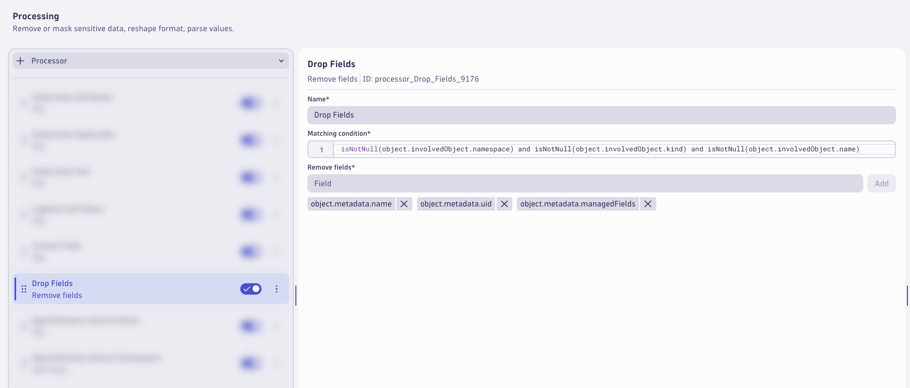

### OpenTelemetry Service Name

Add a processor to set the OpenTelemetry Service Name.  Click on `+ Processor` to add a new processor.

Type:
```text
DQL
```

Name:
```text
OpenTelemetry Service Name
```

Matching condition:
```text
matchesValue(k8s.namespace.name,"astronomy-shop") and isNotNull(k8s.deployment.name) and isNull(service.name)
```

Processor definition:
```text
fieldsAdd split_deployment_name = splitString(k8s.deployment.name,k8s.namespace.name)
| parse split_deployment_name[1], "(PUNCT?) WORD:service.name"
| fieldsRemove split_deployment_name
```

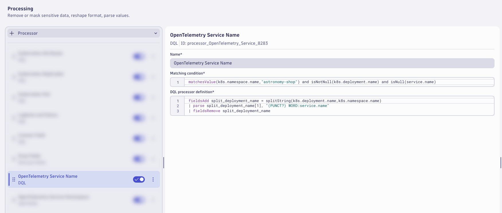

### OpenTelemetry Service Namespace

Add a processor to set the OpenTelemetry Service Namespace.  Click on `+ Processor` to add a new processor.

Type:
```text
Add Fields
```

Name:
```text
OpenTelemetry Service Namespace
```

Matching condition:
```text
matchesValue(k8s.namespace.name,"astronomy-shop") and isNotNull(k8s.deployment.name) and isNotNull(service.name) and isNull(service.namespace)
```

Add fields:

| Field                | Value                         |
|----------------------|-------------------------------|
| service.namespace    | INITIALS-k8s-otel-o11y        |

*Be sure to use the same `service.namespace` value that you have used elsewhere in this lab!*

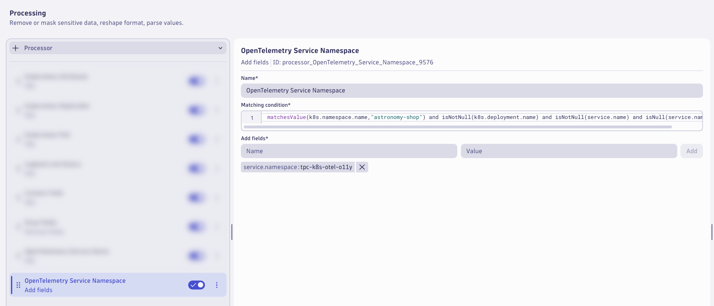

!!! tip "Save Often"
    Consider saving your pipeline configuration often to avoid losing any changes.

### Kubernetes Event Count

Switch to the `Metric Extraction` tab.

Add a processor to set extract a metric from the Kubernetes event logs.  Click on `+ Processor` to add a new processor.

Type:
```text
Counter metric
```

Name:
```text
Kubernetes Event Count
```

Matching condition:
```text
isNotNull(k8s.cluster.name) and isNotNull(k8s.namespace.name) and isNotNull(status)
```

Metric key:
```text
otel.k8s.event_count
```

Dimensions:

| Fields                         |
|--------------------------------|
| k8s.namespace.name             |
| k8s.cluster.name               |
| status                         |
| service.name                   |

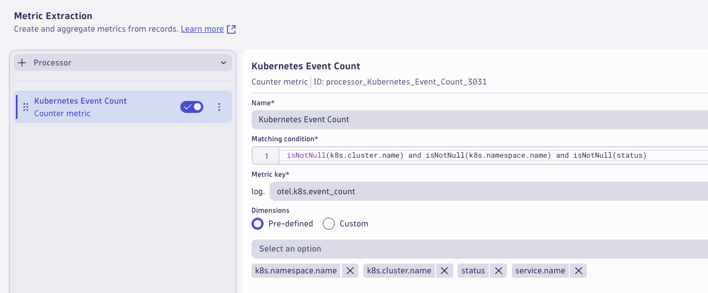

The pipeline is now configured, click on `Save` to save the pipeline configuration.


### Dynamic Route

A pipeline will not have any effect unless logs are configured to be routed to the pipeline.  With dynamic routing, data is routed based on a matching condition. The matching condition is a DQL query that defines the data set you want to route.

Click on `Dynamic Routing` to configure a route to the target pipeline.  Click on `+ Dynamic Route` to add a new route.

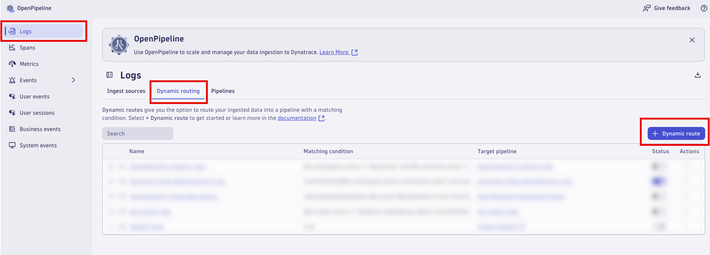

Configure the `Dynamic Route` to use the `OpenTelemetry Kubernetes Events` pipeline.

Name:
```text
OpenTelemetry Kubernetes Events
```

Matching condition:
```text
matchesValue(telemetry.sdk.name,"opentelemetry") and matchesValue(event.domain,"k8s") and matchesValue(k8s.resource.name,"events")
```

Pipeline:
```text
OpenTelemetry Kubernetes Events
```

Click `Add` to add the route.


Validate that the route is enabled in the `Status` column.  Click on `Save` to save the dynamic route table configuration.

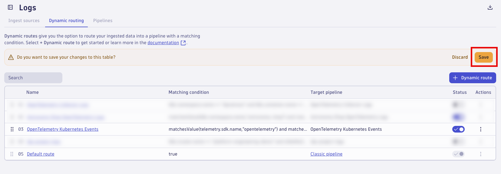

Changes will typically take effect within a couple of minutes.

## Analyze Results

Analyze the Kubernetes Events logs after Dynatrace OpenPipeline processing.

### Generate Kubernetes Events

Kubernetes Events will only be generated when Kubernetes orchestration causes changes within the environment.  Generate new Kubernetes Events for analysis prior to continuing.

Command:
```text
kubectl delete pods -n astronomy-shop --field-selector="status.phase=Running"
```

This will delete all running pods for `astronomy-shop` and schedule new ones, resulting in many new Kubernetes Events.

### Analyze the results in Dynatrace (Notebook)

Use the Notebook from earlier to analyze the results.

**Kubernetes Attributes**

Query the Kubernetes Events logs fitered on `event.domain == "k8s"` to analyze with `Kubernetes Attributes`.

DQL: After OpenPipeline
```sql
fetch logs
| filter matchesValue(telemetry.sdk.name,"opentelemetry") and matchesValue(event.domain,"k8s") and matchesValue(k8s.resource.name,"events")
| filter isNotNull(object.involvedObject.namespace) and isNotNull(object.involvedObject.kind) and isNotNull(object.involvedObject.name)
| sort timestamp desc
| limit 25
| fields timestamp, k8s.namespace.name, k8s.deployment.name, k8s.replicaset.name, k8s.pod.name, object.involvedObject.kind, object.involvedObject.name
```

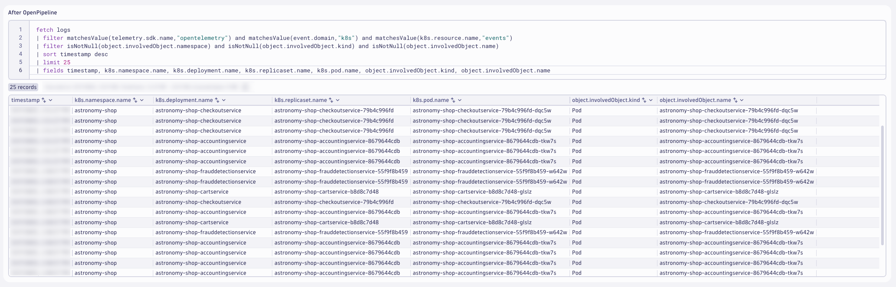

**Kubernetes ReplicaSet**

Query the Kubernetes Events logs fitered on `object.involvedObject.kind == "ReplicaSet"`.

DQL: After OpenPipeline
```sql
fetch logs
| filter matchesValue(telemetry.sdk.name,"opentelemetry") and matchesValue(event.domain,"k8s") and matchesValue(k8s.resource.name,"events")
| filter isNotNull(object.involvedObject.namespace) and isNotNull(object.involvedObject.name) and matchesValue(object.involvedObject.kind,"ReplicaSet")
| sort timestamp desc
| limit 25
| fields timestamp, k8s.namespace.name, k8s.deployment.name, k8s.replicaset.name, k8s.pod.name, object.involvedObject.kind, object.involvedObject.name
```

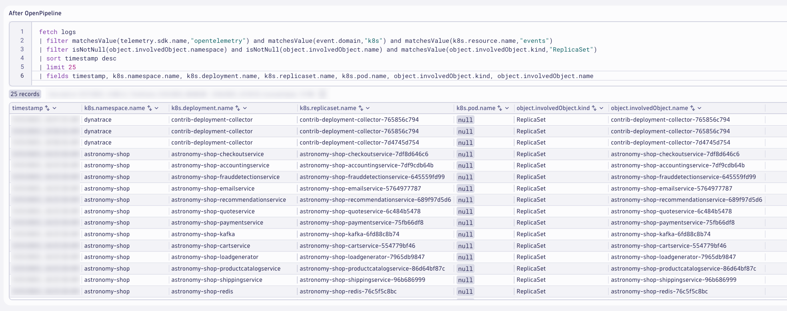

**Kubernetes Pod**

Query the Kubernetes Events logs fitered on `object.involvedObject.kind == "Pod"`.

DQL: After OpenPipeline
```sql
fetch logs
| filter matchesValue(telemetry.sdk.name,"opentelemetry") and matchesValue(event.domain,"k8s") and matchesValue(k8s.resource.name,"events")
| filter isNotNull(object.involvedObject.namespace) and isNotNull(object.involvedObject.name) and matchesValue(object.involvedObject.kind,"Pod")
| sort timestamp desc
| limit 25
| fields timestamp, k8s.namespace.name, k8s.deployment.name, k8s.replicaset.name, k8s.pod.name, object.involvedObject.kind, object.involvedObject.name
```

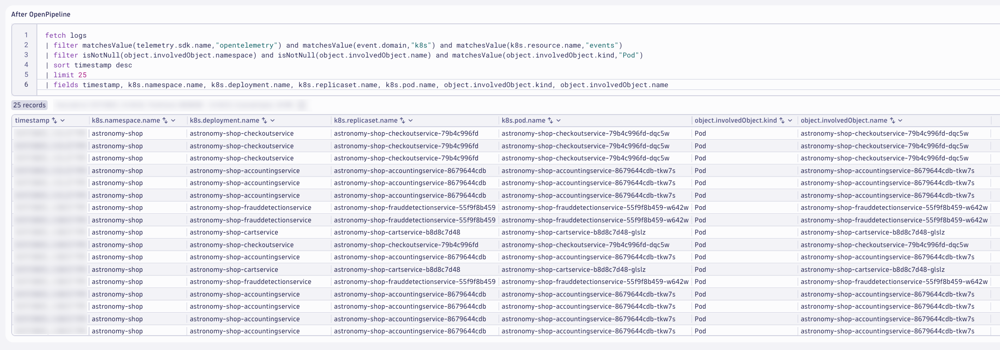

**Content Field and Drop Fields**

Query the Kubernetes Events logs to view the new `content` field.

DQL: After OpenPipeline
```sql
fetch logs
| filter matchesValue(telemetry.sdk.name,"opentelemetry") and matchesValue(event.domain,"k8s") and matchesValue(k8s.resource.name,"events")
| filter isNotNull(object.involvedObject.namespace) and isNotNull(object.involvedObject.kind) and isNotNull(object.involvedObject.name)
| sort timestamp desc
| limit 25
| fields timestamp, content, object.reason, object.message, object.metadata.managedfields, object.metadata.name, object.metadata.uid
```

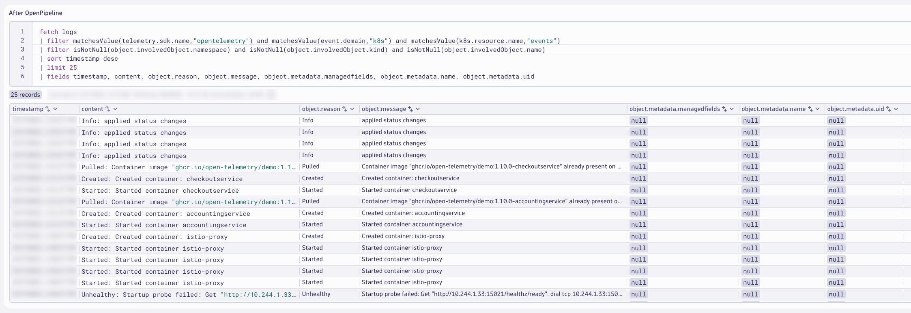

**OpenTelemetry Service Name and Namespace**

Query the Kubernetes Events logs filtered on `service.name` and `service.namespace`.

DQL: After OpenPipeline
```sql
fetch logs
| filter matchesValue(telemetry.sdk.name,"opentelemetry") and matchesValue(event.domain,"k8s") and matchesValue(k8s.resource.name,"events")
| filter isNotNull(object.involvedObject.namespace) and isNotNull(object.involvedObject.kind) and isNotNull(object.involvedObject.name)
| filter matchesValue(k8s.namespace.name,"astronomy-shop") and isNotNull(k8s.deployment.name) and isNotNull(service.name)
| sort timestamp desc
| limit 25
| fields timestamp, k8s.namespace.name, k8s.deployment.name, service.name, service.namespace, content
```

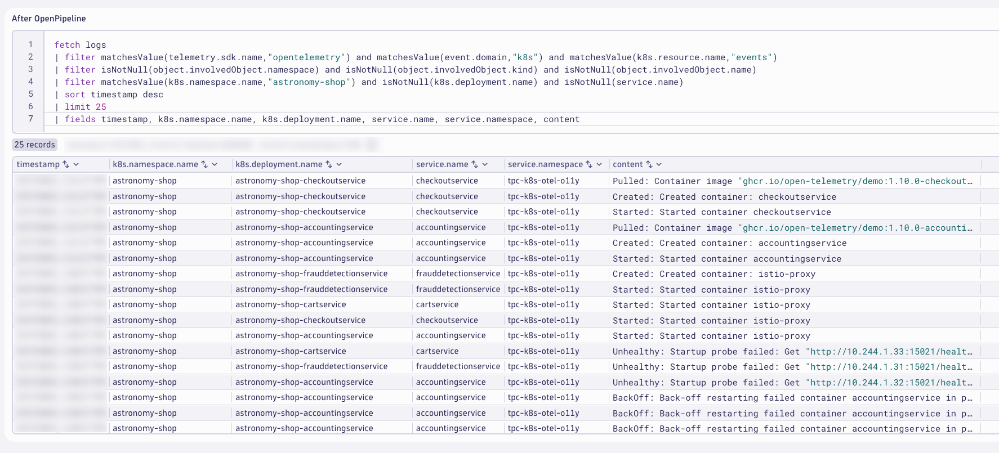

## Wrap Up

**What You Learned Today**

By completing this module, you've successfully set up Dynatrace OpenPipeline pipelines to process the Kubernetes Events logs at ingest.

- Kubernetes Events logs
    * Enrich logs with additional Kubernetes metadata to unify telemetry signals and analyze Kubernetes context
    * Enrich the content field to fit logging standards and semantics
    * Set loglevel and status fields to easily identify errors with Kubernetes context
    * Remove unwanted fields/attributes to reduce log bloat and optimize queries
    * Add OpenTelemetry service name and namespace to unify telemetry signals and enable out-of-the-box analysis
    * Extract metrics: event count to track Kubernetes health and reduce heavy log queries

## Continue

<div class="grid cards" markdown>
- [Continue to Clean Up:octicons-arrow-right-24:](cleanup.md)
</div>
