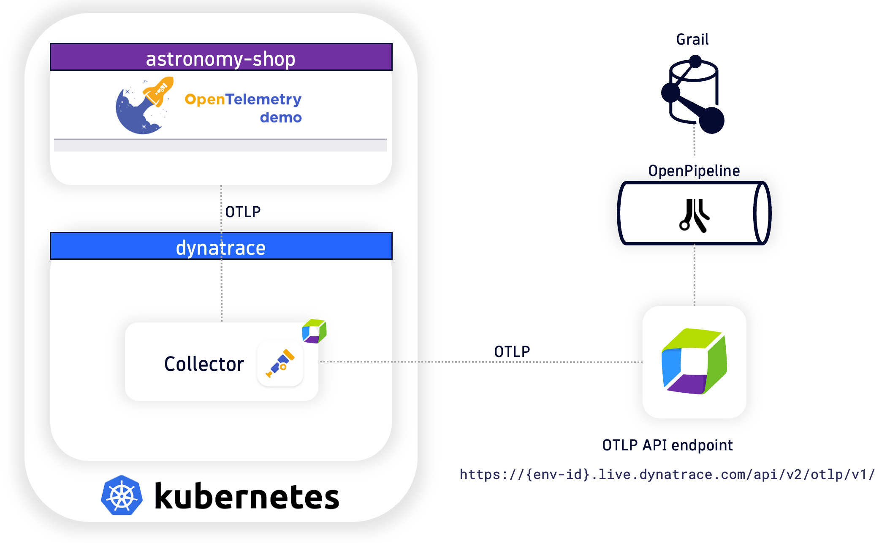

--8<-- "snippets/send-bizevent/index.js"

--8<-- "snippets/disclaimer.md"

!!! warning "Under Construction"
    This lab and lab guide are currently a work-in-progress and are not ready at this time!

## Lab Overview

During this hands-on training, we’ll learn how to capture logs from Kubernetes using OpenTelemetry and ship them to Dynatrace for analysis.  This will demonstrate how to use Dynatrace with OpenTelemetry; without any Dynatrace native components installed on the Kubernetes cluster (Operator, OneAgent, ActiveGate, etc.).  We'll then utilize Dynatrace OpenPipeline to process OpenTelemetry logs at ingest, to manipulate fields, extract metrics, raise alert events, and manage retention periods, in order to make them easier to analyze and leverage.

**Lab tasks:**

1. Ingest Kubernetes logs using OpenTelemetry Collector
1. Deploy OpenTelemetry Collector for logs, traces, and metrics
1. Create custom Buckets for Grail storage management
1. Process OpenTelemetry Collector logs with Dynatrace OpenPipeline
1. Process Astronomy Shop logs with Dynatrace OpenPipeline
1. Process Kubernetes Events logs with Dynatrace OpenPipeline
1. Query and visualize logs and metrics in Dynatrace using DQL

## Technical Specification

### Technologies Used

- [Dynatrace](https://www.dynatrace.com/trial){target=_blank}
- [Kubernetes Kind](https://kind.sigs.k8s.io/){target=_blank}
    - tested on Kind tag 0.27.0
- [Cert Manager](https://cert-manager.io/){target=_blank} - *prerequisite for OpenTelemetry Operator
    - tested on cert-manager v1.14.4
- [OpenTelemetry Operator](https://opentelemetry.io/docs/platforms/kubernetes/operator/){target=_blank}
    - tested on v0.103.0 (June 2024)
- [OpenTelemetry Collector - Dynatrace Distro](https://docs.dynatrace.com/docs/extend-dynatrace/opentelemetry/collector/deployment){target=_blank}
    - tested on v0.25.0 (March 2025)
- [OpenTelemetry Collector - Contrib Distro](https://github.com/open-telemetry/opentelemetry-collector-contrib/releases/tag/v0.103.0){target=_blank}
    - tested on v0.121.0 (March 2025)
- [OpenTelemetry AstronomyShop Helm Chart](https://opentelemetry.io/docs/platforms/kubernetes/helm/demo/){target=_blank}
    - tested on v0.31.0 (June 2024)

### Reference Architecture

[OpenTelemetry Astronomy Shop Demo Architecture](https://opentelemetry.io/docs/demo/architecture/){target=_blank}

## Continue

- [Continue to Getting Started (Prerequisites):octicons-arrow-right-24:](2-getting-started.md)