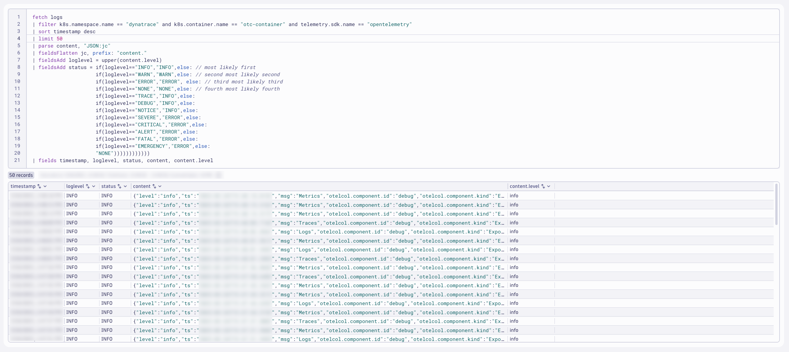
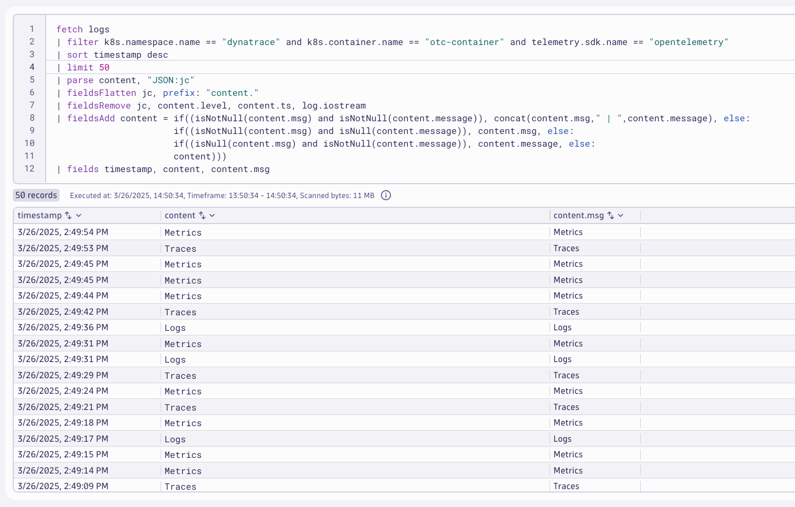
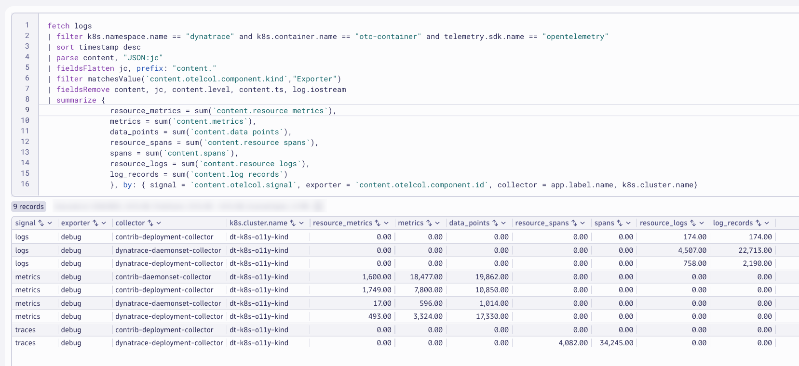
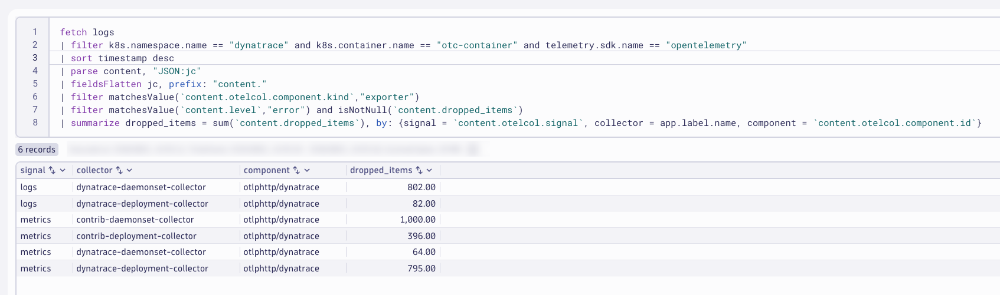

## OpenTelemetry Collector Logs - Query
Query and discover the OpenTelemetry Collector logs as they are ingested and stored in Dynatrace.  Use Dynatrace Query Language (DQL) to transform the logs at query time and prepare for Dynatrace OpenPipeline configuration.

### Import Notebook into Dynatrace
[OpenTelemetry Collector Logs](https://github.com/dynatrace-wwse/enablement-kubernetes-opentelemetry-openpipeline/blob/main/assets/dynatrace/notebooks/opentelemetry-collector-logs.json)

### OpenTelemetry Collector Logs - Ondemand Processing at Query Time (Notebook)

The OpenTelemetry Collector can be configured to output JSON structured logs as internal telemetry.  Dynatrace DQL can be used to filter, process, and analyze this log data to ensure reliability of the OpenTelemetry data pipeline.

By default, OpenTelemetry Collector logs are output mixed JSON/console format, making them difficult to use.

### Goals:
* Parse JSON content
* Set loglevel and status
* Remove unwanted fields/attributes
* Extract metrics: successful data points
* Extract metrics: dropped data points
* Alert: zero data points

### Query logs in Dynatrace
DQL:
```sql
fetch logs
| filter k8s.namespace.name == "dynatrace" and k8s.container.name == "otc-container" and telemetry.sdk.name == "opentelemetry"
| sort timestamp desc
| limit 50
```
Result:


### Parse JSON Content
[Parse Command](https://docs.dynatrace.com/docs/platform/grail/dynatrace-query-language/commands/extraction-and-parsing-commands#parse)

Parses a record field and puts the result(s) into one or more fields as specified in the pattern.  The parse command works in combination with the Dynatrace Pattern Language for parsing strings.

[Parse JSON Object](https://docs.dynatrace.com/docs/platform/grail/dynatrace-pattern-language/log-processing-json-object)

There are several ways how to control parsing elements from a JSON object. The easiest is to use the JSON matcher without any parameters. It will enumerate all elements, transform them into Log processing data type from their defined type in JSON and returns a variant_object with parsed elements.

The `content` field contains JSON structured details that can be parsed to better analyze relevant fields. The structured content can then be flattened for easier analysis.

[FieldsFlatten Command](https://docs.dynatrace.com/docs/platform/grail/dynatrace-query-language/commands/structuring-commands#fieldsFlatten)

Sample:
```json
{
  "level": "info",
  "ts": "2025-12-31T19:36:45.773Z",
  "msg": "Logs",
  "otelcol.component.id": "debug",
  "otelcol.component.kind": "Exporter",
  "otelcol.signal": "logs",
  "resource logs": "131",
  "log records": "800"
}
```

### Query logs in Dynatrace
DQL:
```sql
fetch logs
| filter k8s.namespace.name == "dynatrace" and k8s.container.name == "otc-container" and telemetry.sdk.name == "opentelemetry"
| sort timestamp desc
| limit 50
| parse content, "JSON:jc"
| fieldsFlatten jc, prefix: "content."
| fieldsKeep timestamp, app.label.name, content, jc, "content.*"
```
Result:


### Set `loglevel` and `status` fields
[Selection and Modification](https://docs.dynatrace.com/docs/platform/grail/dynatrace-query-language/commands/selection-and-modification-commands)

The `fieldsAdd` command evaluates an expression and appends or replaces a field.

The JSON structure contains a field `level` that can be used to set the `loglevel` field.  It must be uppercase.

* loglevel possible values are: NONE, TRACE, DEBUG, NOTICE, INFO, WARN, SEVERE, ERROR, CRITICAL, ALERT, FATAL, EMERGENCY
* status field possible values are: ERROR, WARN, INFO, NONE

The `if` conditional function allows you to set a value based on a conditional expression.  Since the `status` field depends on the `loglevel` field, a nested `if` expression can be used.

[If Function](https://docs.dynatrace.com/docs/platform/grail/dynatrace-query-language/functions/conditional-functions#if)

### Query logs in Dynatrace
DQL:
```sql
fetch logs
| filter k8s.namespace.name == "dynatrace" and k8s.container.name == "otc-container" and telemetry.sdk.name == "opentelemetry"
| sort timestamp desc
| limit 50
| parse content, "JSON:jc"
| fieldsFlatten jc, prefix: "content."
| fieldsAdd loglevel = upper(content.level)
| fieldsAdd status = if(loglevel=="INFO","INFO",else: // most likely first
                     if(loglevel=="WARN","WARN",else: // second most likely second
                     if(loglevel=="ERROR","ERROR", else: // third most likely third
                     if(loglevel=="NONE","NONE",else: // fourth most likely fourth
                     if(loglevel=="TRACE","INFO",else:
                     if(loglevel=="DEBUG","INFO",else:
                     if(loglevel=="NOTICE","INFO",else:
                     if(loglevel=="SEVERE","ERROR",else:
                     if(loglevel=="CRITICAL","ERROR",else:
                     if(loglevel=="ALERT","ERROR",else:
                     if(loglevel=="FATAL","ERROR",else:
                     if(loglevel=="EMERGENCY","ERROR",else:
                     "NONE"))))))))))))
| fields timestamp, loglevel, status, content, content.level
```
Result:



### Remove unwanted fields/attributes

The `fieldsRemove` command will remove selected fields.

[FieldsRemove Command](https://docs.dynatrace.com/docs/platform/grail/dynatrace-query-language/commands/selection-and-modification-commands#fieldsRemove)

After parsing and flattening the JSON structured content, the original fields should be removed.  Fields that don't add value should be removed at the source, but if they are not, they can be removed with DQL.

Every log record should ideally have a content field, as it is expected.  The `content` field can be updated with values from other fields, such as `content.msg` and `content.message`.

### Query logs in Dynatrace
DQL:
```sql
fetch logs
| filter k8s.namespace.name == "dynatrace" and k8s.container.name == "otc-container" and telemetry.sdk.name == "opentelemetry"
| sort timestamp desc
| limit 50
| parse content, "JSON:jc"
| fieldsFlatten jc, prefix: "content."
| fieldsRemove jc, content.level, content.ts, log.iostream
| fieldsAdd content = if((isNotNull(content.msg) and isNotNull(content.message)), concat(content.msg," | ",content.message), else:
                      if((isNotNull(content.msg) and isNull(content.message)), content.msg, else:
                      if((isNull(content.msg) and isNotNull(content.message)), content.message, else:
                      content)))
| fields timestamp, content, content.msg
```
Result:



### Extract metrics: successful data points / signals

The `summarize` command enables you to aggregate records to compute results based on counts, attribute values, and more.

[Summarize Command](https://docs.dynatrace.com/docs/platform/grail/dynatrace-query-language/commands/aggregation-commands#summarize)

The JSON structured content contains several fields that indicate the number of successful data points / signals sent by the exporter.
* logs: resource logs, log records
* metrics: resource metrics, metrics, data points
* traces: resource spans, spans

### Query logs in Dynatrace
DQL:
```sql
fetch logs
| filter k8s.namespace.name == "dynatrace" and k8s.container.name == "otc-container" and telemetry.sdk.name == "opentelemetry"
| sort timestamp desc
| parse content, "JSON:jc"
| fieldsFlatten jc, prefix: "content."
| filter matchesValue(`content.otelcol.component.kind`,"Exporter")
| fieldsRemove content, jc, content.level, content.ts, log.iostream
| summarize {
              resource_metrics = sum(`content.resource metrics`),
              metrics = sum(`content.metrics`),
              data_points = sum(`content.data points`),
              resource_spans = sum(`content.resource spans`),
              spans = sum(`content.spans`),
              resource_logs = sum(`content.resource logs`),
              log_records = sum(`content.log records`)
              }, by: { signal = `content.otelcol.signal`, exporter = `content.otelcol.component.id`, collector = app.label.name, k8s.cluster.name}
```
Result:



### Extract metrics: dropped data points / signals

The JSON structured content contains several fields that indicate the number of dropped data points / signals sent by the exporter.
* dropped items
* signal
* (exporter) name
* collector

### Query logs in Dynatrace
DQL:
```sql
fetch logs
| filter k8s.namespace.name == "dynatrace" and k8s.container.name == "otc-container" and telemetry.sdk.name == "opentelemetry"
| sort timestamp desc
| parse content, "JSON:jc"
| fieldsFlatten jc, prefix: "content."
| filter matchesValue(`content.otelcol.component.kind`,"exporter")
| filter matchesValue(`content.level`,"error") and isNotNull(`content.dropped_items`)
| summarize dropped_items = sum(`content.dropped_items`), by: {signal = `content.otelcol.signal`, collector = app.label.name, component = `content.otelcol.component.id`}
```
Result:



You likely won't have any data matching your query as you shouldn't have data drops.  You can force data drops by toggling your Dynatrace API Access Token off for a couple minutes and then turning it back on.


### Alert: zero data points / signals

It would be unexpected that the collector exporter doesn't send any data points or signals.  We could alert on this unexpected behavior.

The field `content.otelcol.signal` will indicate the type of data point or signal.  The fields `content.log records`, `content.data points`, and `content.spans` will indicate the number of signals sent.  If the value is `0`, that is unexpected.

### Query logs in Dynatrace
DQL:
```sql
fetch logs
| filter k8s.namespace.name == "dynatrace" and k8s.container.name == "otc-container" and telemetry.sdk.name == "opentelemetry"
| sort timestamp desc
| limit 100
| parse content, "JSON:jc"
| fieldsFlatten jc, prefix: "content."
| filter matchesValue(`content.otelcol.component.kind`,"exporter")
| summarize {
              logs = countIf(matchesValue(`content.otelcol.signal`,"logs") and matchesValue(toString(`content.log records`),"0")),
              metrics = countIf(matchesValue(`content.otelcol.signal`,"metrics") and matchesValue(toString(`content.data points`),"0")),
              traces = countIf(matchesValue(`content.otelcol.signal`,"traces") and matchesValue(toString(`content.spans`),"0"))
            }, by: {signal = `content.otelcol.signal`, collector = app.label.name}
```
Result:


### DQL in Notebooks Summary

DQL gives you the power to filter, parse, summarize, and analyze log data quickly and on the fly.  This is great for use cases where the format of your log data is unexpected.  However, when you know the format of your log data and you know how you will want to use that log data in the future, you'll want that data to be parsed and presented a certain way during ingest.  OpenPipeline provides the capabilites needed to accomplish this.
