## OpenTelemetry Collector Logs - OpenPipeline
Configure Dynatrace OpenPipeline for OpenTelemetry Collector logs.

### Create and Configure Dynatrace OpenPipeline

> ⚠️ If the images are too small and the text is difficult to read, right-click and open the image in a new tab.

> ⚠️ Consider saving your pipeline configuration often to avoid losing any changes.

In your Dynatrace tenant, launch the OpenPipeline app.  Begin by selecting `Logs` from the left-hand menu of telemetry types.  Then choose `Pipelines`.  Click on `+ Pipeline` to add a new pipeline.

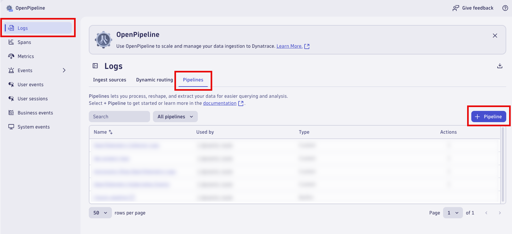

Name the new pipeline, `OpenTelemetry Collector Logs`.  Click on the `Processing` tab to begin adding `Processor` rules.


### Parse JSON Content

Add a processor to parse the JSON structured content field.  Click on `+ Processor` to add a new processor.

Name:
```text
Parse JSON Content
```

Matching condition:
```text
k8s.namespace.name == "dynatrace" and k8s.container.name == "otc-container" and telemetry.sdk.name == "opentelemetry"
```

Processor definition:
```text
parse content, "JSON:jc"
| fieldsFlatten jc, prefix: "content."
```

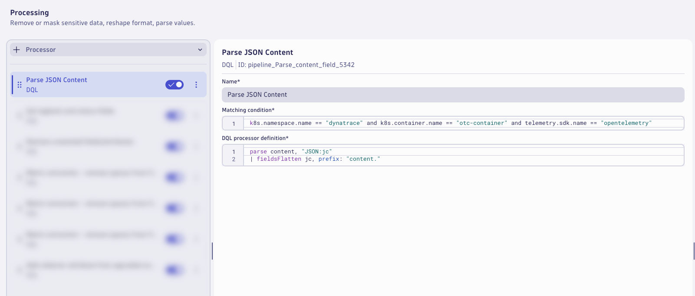

### Loglevel and Status

Add a processor to set the loglevel and status fields.  Click on `+ Processor` to add a new processor.

Name:
```text
Set loglevel and status fields
```

Matching condition:
```text
isNotNull(`content.level`)
```

Processor definition:
```text
fieldsAdd loglevel = upper(content.level)
| fieldsAdd status = if(loglevel=="INFO","INFO",else: // most likely first
                     if(loglevel=="WARN","WARN",else: // second most likely second
                     if(loglevel=="ERROR","ERROR", else: // third most likely third
                     if(loglevel=="NONE","NONE",else: // fourth most likely fourth
                     if(loglevel=="TRACE","INFO",else:
                     if(loglevel=="DEBUG","INFO",else:
                     if(loglevel=="NOTICE","INFO",else:
                     if(loglevel=="SEVERE","ERROR",else:
                     if(loglevel=="CRITICAL","ERROR",else:
                     if(loglevel=="ALERT","ERROR",else:
                     if(loglevel=="FATAL","ERROR",else:
                     if(loglevel=="EMERGENCY","ERROR",else:
                     "NONE"))))))))))))
```

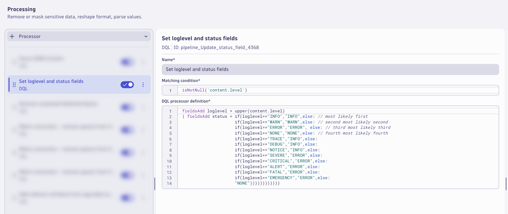

### Remove Fields

Add a processor to remove the extra and unwanted fields.  Click on `+ Processor` to add a new processor.

Name:
```text
Remove unwanted fields/attributes
```

Matching condition:
```text
isNotNull(jc) and isNotNull(loglevel) and isNotNull(status) and loglevel!="NONE"
```

DQL processor definition
```text
fieldsRemove jc, content.level, content.ts, log.iostream
| fieldsAdd content = if((isNotNull(content.msg) and isNotNull(content.message)), concat(content.msg," | ",content.message), else:
                      if((isNotNull(content.msg) and isNull(content.message)), content.msg, else:
                      if((isNull(content.msg) and isNotNull(content.message)), content.message, else:
                      content)))
```

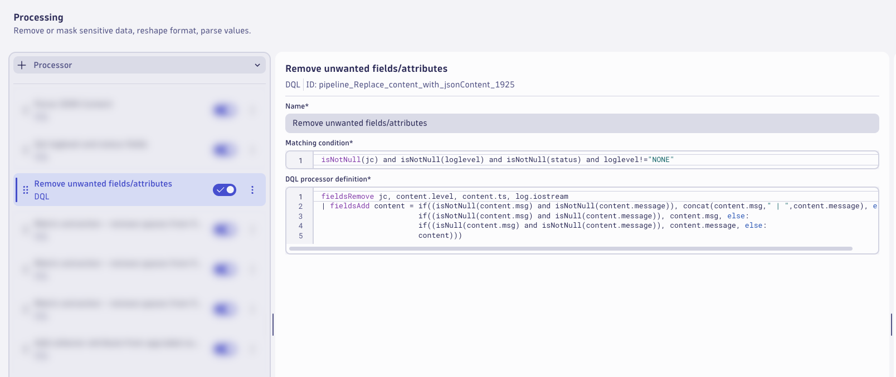

### Remove Spaces from Metrics Fields

Add a processor to remove the spaces from the metrics fields.  Click on `+ Processor` to add a new processor.

Name:
```text
Metric extraction - remove spaces from fields - metrics
```

Matching condition:
```text
matchesValue(`content.otelcol.component.kind`,"exporter") and matchesValue(`content.otelcol.signal`,"metrics")
```

DQL processor definition
```text
fieldsAdd content.resource_metrics = `content.resource metrics`
| fieldsAdd content.data_points = `content.data points`
| fieldsRemove `content.resource metrics`, `content.data points`
```

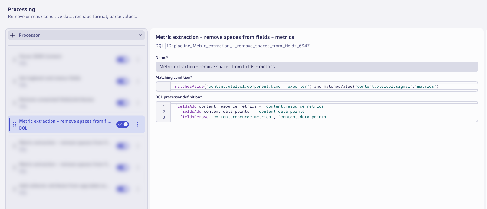

### Remove Spaces from Logs Fields

Add a processor to remove the spaces from the logs fields.  Click on `+ Processor` to add a new processor.

Name:
```text
Metric extraction - remove spaces from fields - logs
```

Matching condition:
```text
matchesValue(`content.otelcol.component.kind`,"exporter") and matchesValue(`content.otelcol.signal`,"logs")
```

DQL processor definition
```text
fieldsAdd content.resource_logs = `content.resource logs`
| fieldsAdd content.log_records = `content.log records`
| fieldsRemove `content.resource logs`, `content.log records`
```

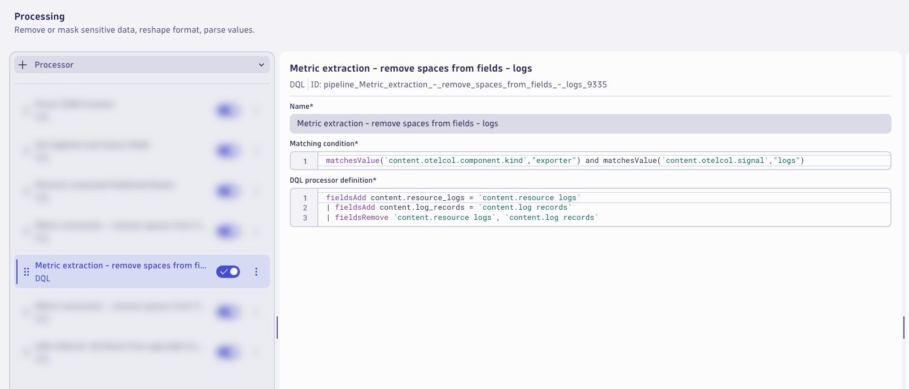

### Remove Spaces from Traces Fields

Add a processor to remove the spaces from the traces fields.  Click on `+ Processor` to add a new processor.

Name:
```text
Metric extraction - remove spaces from fields - traces
```

Matching condition:
```text
matchesValue(`content.otelcol.component.kind`,"exporter") and matchesValue(`content.otelcol.signal`,"traces")
```

DQL processor definition
```text
fieldsAdd content.resource_spans = `content.resource spans`
| fieldsRemove `content.resource spans`
```

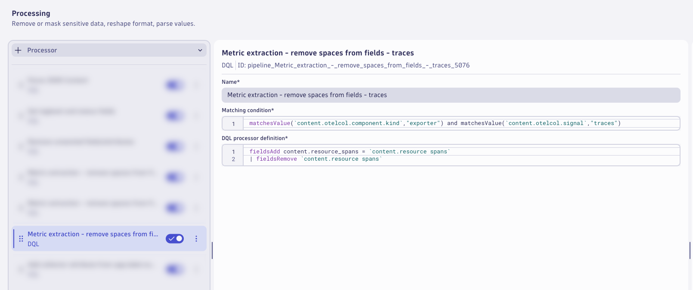

### Collector Attribute

Add a processor to add the collector attribute from the app.label.name field.  Click on `+ Processor` to add a new processor.

Name:
```text
Add collector attribute from app.label.name
```

Matching condition:
```text
isNotNull(app.label.name)
```

DQL processor definition
```text
fieldsAdd collector = app.label.name
```

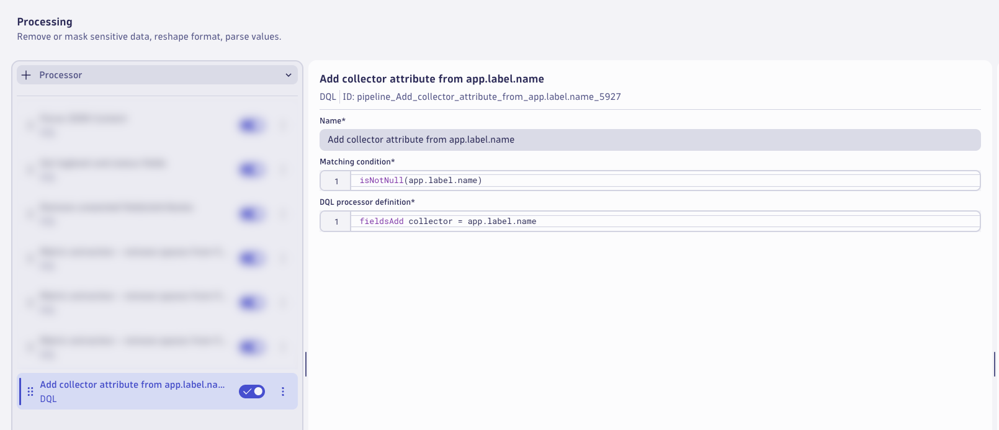

> ⚠️ Consider saving your pipeline configuration often to avoid losing any changes.

### Zero Data Points for Metrics

Switch to the `Data extraction` tab.

Add a processor to extract a `Davis Event`.  Click on `+ Processor` to add a new processor.

Name:
```text
Zero data points / signals - metrics
```

Matching condition:
```text
matchesValue(`content.otelcol.signal`,"metrics") and `content.data_points` == 0
```

Event Name:
```text
OpenTelemetry Collector - Zero Data Points - Metrics
```

Event description:
```text
The OpenTelemetry Collector has sent zero data points for metrics.
```

Additional event properties:
| Property             | Value               |
|----------------------|---------------------|
| collector            | {collector}         |
| k8s.cluster.name     | {k8s.cluster.name}  |
| k8s.pod.name         | {k8s.pod.name}      |

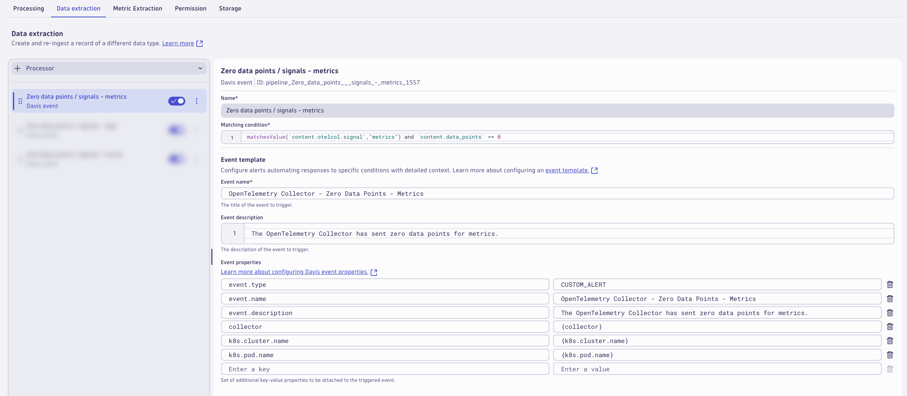

### Zero Data Points for Logs

Add a processor to extract a `Davis Event`.  Click on `+ Processor` to add a new processor.

Name:
```text
Zero data points / signals - logs
```

Matching condition:
```text
matchesValue(`content.otelcol.signal`,"logs") and `content.log_records` == 0
```

Event Name:
```text
OpenTelemetry Collector - Zero Data Points - Logs
```

Event description:
```text
The OpenTelemetry Collector has sent zero data points for logs.
```

Additional event properties:
| Property             | Value               |
|----------------------|---------------------|
| collector            | {collector}         |
| k8s.cluster.name     | {k8s.cluster.name}  |
| k8s.pod.name         | {k8s.pod.name}      |

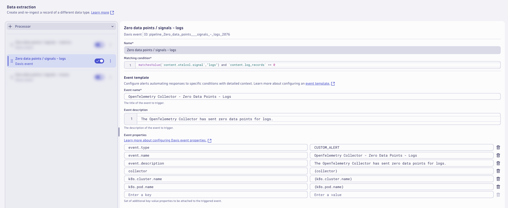

### Zero Data Points for Traces

Add a processor to extract a `Davis Event`.  Click on `+ Processor` to add a new processor.

Name:
```text
Zero data points / signals - traces
```

Matching condition:
```text
matchesValue(`content.otelcol.signal`,"traces") and `content.spans` == 0
```

Event Name:
```text
OpenTelemetry Collector - Zero Data Points - Traces
```

Event description:
```text
The OpenTelemetry Collector has sent zero data points for traces.
```

Additional event properties:
| Property             | Value               |
|----------------------|---------------------|
| collector            | {collector}         |
| k8s.cluster.name     | {k8s.cluster.name}  |
| k8s.pod.name         | {k8s.pod.name}      |

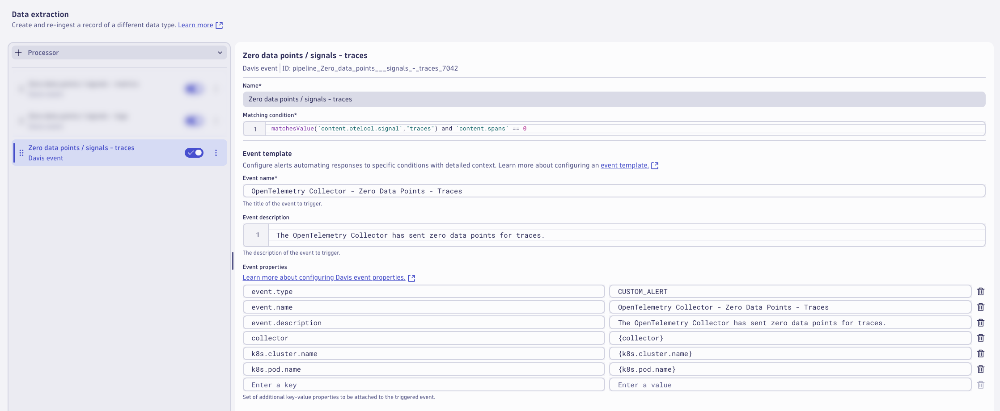

### Successful Data Points for Metrics 

Switch to the `Metric Extraction` tab.

Add a processor to extract a metric for successful metric data points from the exporter logs.  Click on `+ Processor` to add a new processor.

Name:
```text
Successful data points - metrics
```

Matching condition:
```text
matchesValue(`content.otelcol.component.kind`,"exporter") and matchesValue(`content.otelcol.signal`,"metrics")
```

Field Extraction:
```text
content.data_points
```

Metric Key:
```text
otelcol_exporter_sent_metric_data_points
```

Dimensions:
| Dimension            |
|----------------------|
| collector            |
| k8s.cluster.name     |
| k8s.pod.name         |

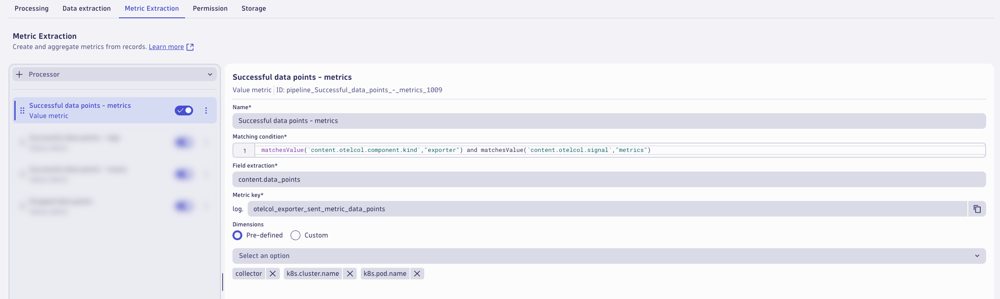

### Successful Data Points for Logs

Add a processor to extract a metric for successful log data points from the exporter logs.  Click on `+ Processor` to add a new processor.

Name:
```text
Successful data points - logs
```

Matching condition:
```text
matchesValue(`content.otelcol.component.kind`,"exporter") and matchesValue(`content.otelcol.signal`,"logs")
```

Field Extraction:
```text
content.log_records
```

Metric Key:
```text
otelcol_exporter_sent_log_records
```

Dimensions:
| Dimension            |
|----------------------|
| collector            |
| k8s.cluster.name     |
| k8s.pod.name         |


### Successful Data Points for Traces

Add a processor to extract a metric for successful trace data points from the exporter logs.  Click on `+ Processor` to add a new processor.

Name:
```text
Successful data points - traces
```

Matching condition:
```text
matchesValue(`content.otelcol.component.kind`,"exporter") and matchesValue(`content.otelcol.signal`,"traces")
```

Field Extraction:
```text
content.spans
```

Metric Key:
```text
otelcol_exporter_sent_trace_spans
```

Dimensions:
| Dimension            |
|----------------------|
| collector            |
| k8s.cluster.name     |
| k8s.pod.name         |

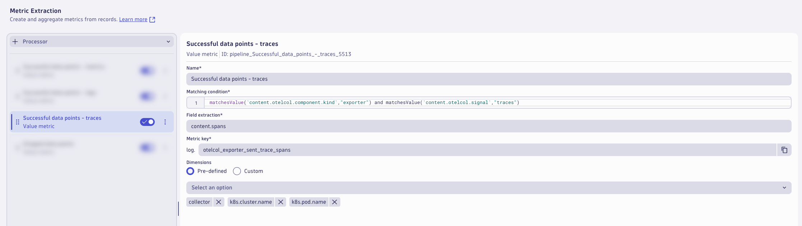

### Dropped Data Points

Add a processor to extract a metric for dropped data points from the exporter logs.  Click on `+ Processor` to add a new processor.

Name:
```text
Dropped data points
```

Matching condition:
```text
matchesValue(`content.otelcol.component.kind`,"exporter") and isNotNull(`content.dropped_items`) and isNotNull(`content.otelcol.signal`)
```

Field Extraction:
```text
content.dropped_data_points
```

Metric Key:
```text
otelcol_exporter_dropped_data_points_by_data_type
```

Dimensions:
| Dimension            |
|----------------------|
| collector            |
| k8s.cluster.name     |
| k8s.pod.name         |

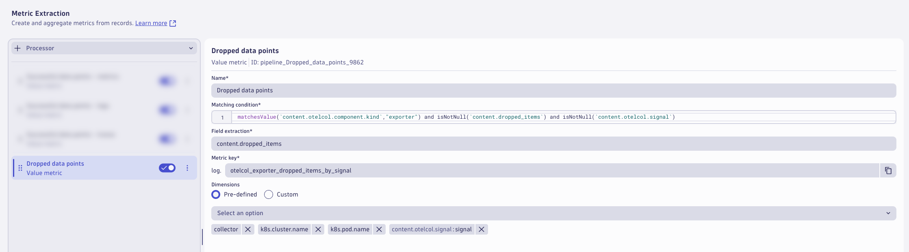

The pipeline is now configured, click on `Save` to save the pipeline configuration.

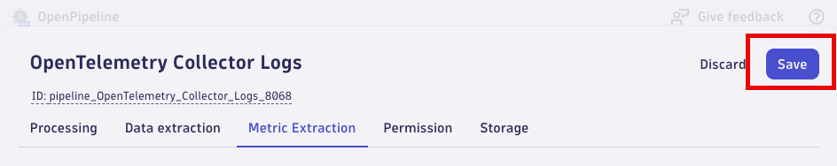

### Dynamic Route

A pipeline will not have any effect unless logs are configured to be routed to the pipeline.  With dynamic routing, data is routed based on a matching condition. The matching condition is a DQL query that defines the data set you want to route.

Click on `Dynamic Routing` to configure a route to the target pipeline.  Click on `+ Dynamic Route` to add a new route.

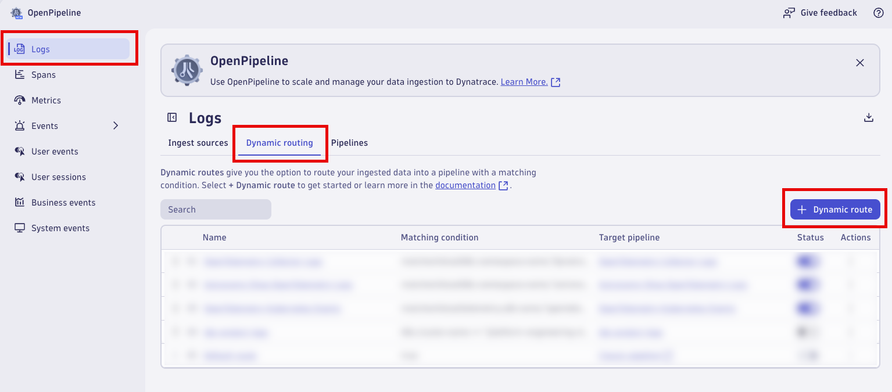

Configure the `Dynamic Route` to use the `OpenTelemetry Collector Logs` pipeline.

Name:
```text
OpenTelemetry Collector Logs
```

Matching condition:
```text
matchesValue(k8s.namespace.name,"dynatrace") and matchesValue(k8s.container.name,"otc-container") and matchesValue(telemetry.sdk.name,"opentelemetry")
```

Pipeline:
```text
OpenTelemetry Collector Logs
```

Click `Add` to add the route.

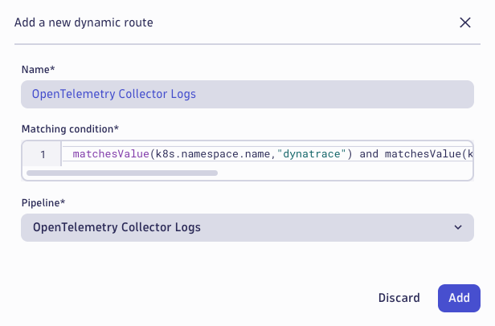

Validate that the route is enabled in the `Status` column.  Click on `Save` to save the dynamic route table configuration.

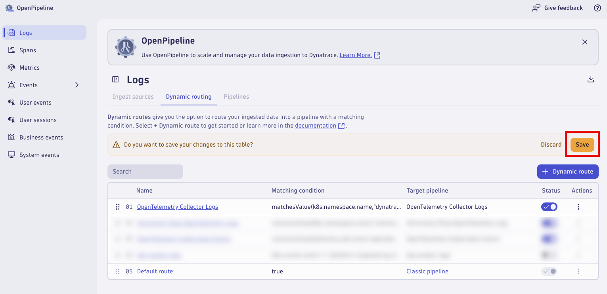

Allow `dynatrace` OpenTelemetry Collectors to generate new log data that will be routed through the new pipeline (3-5 minutes).