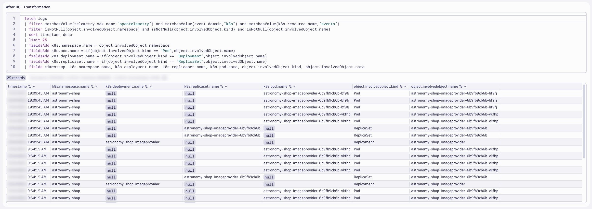
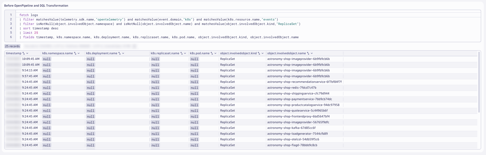
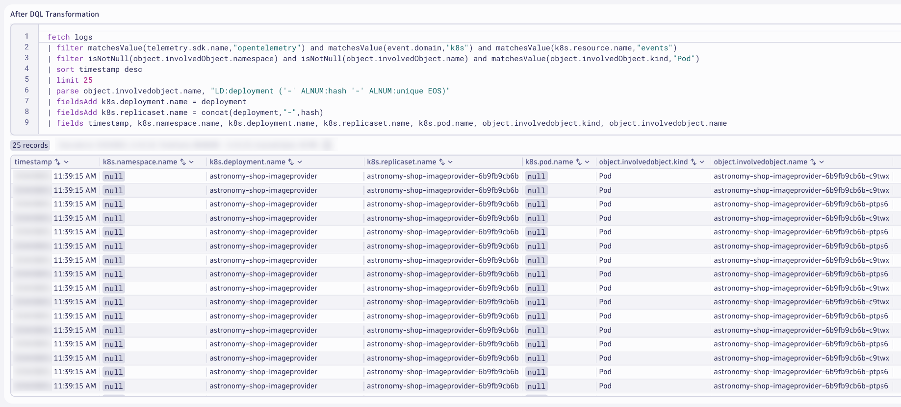
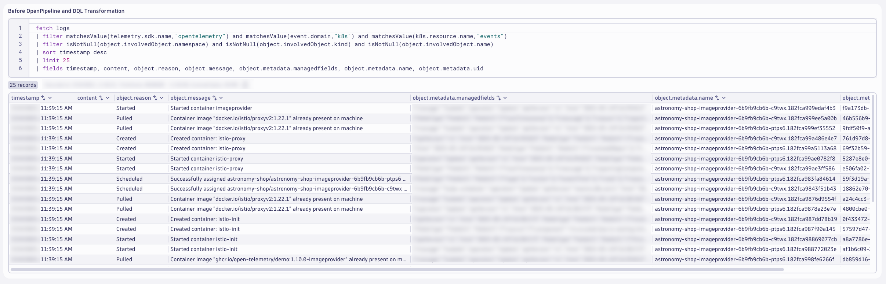
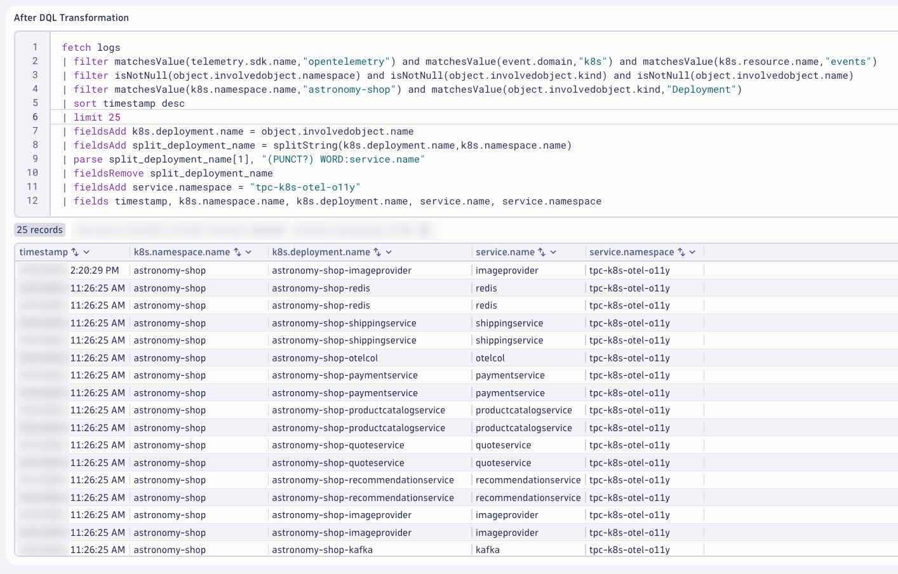
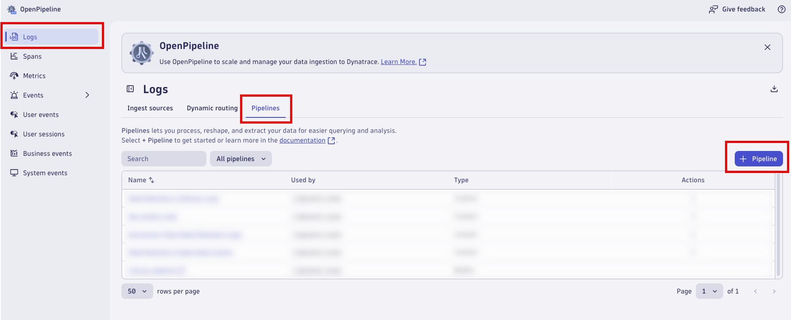
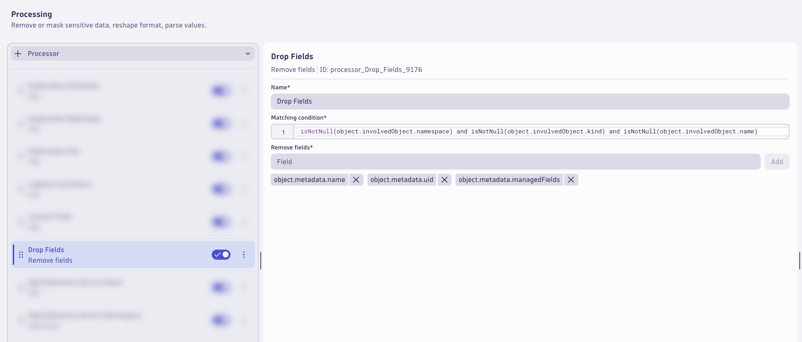
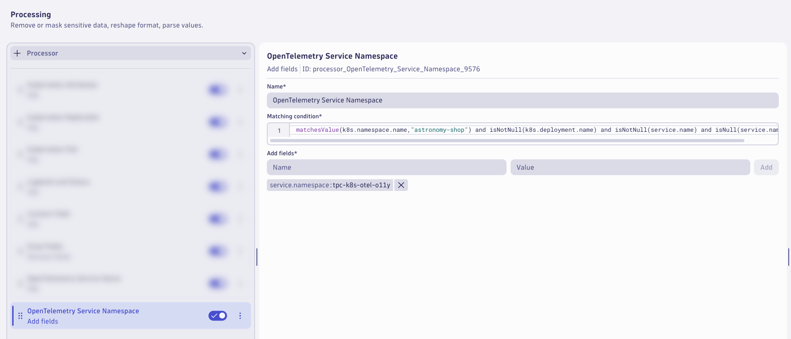
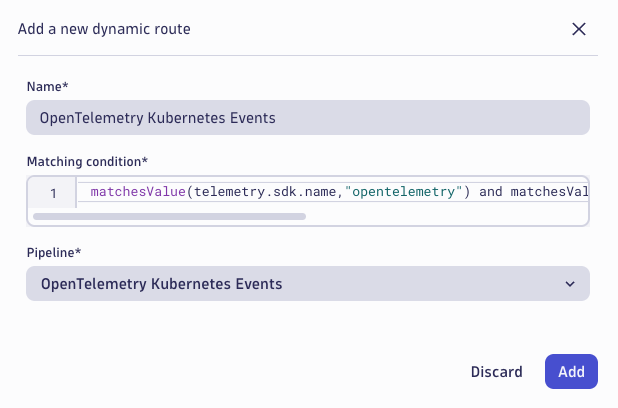
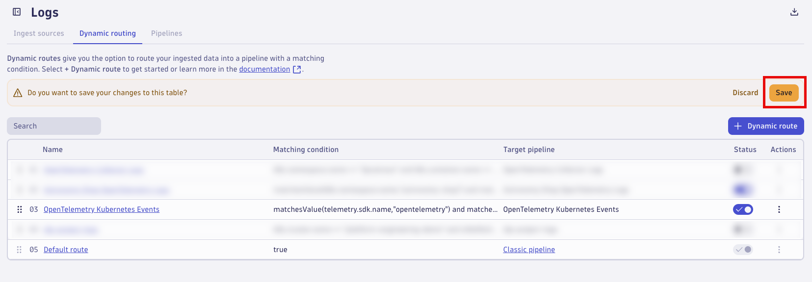

## Kubernetes Events Logs

### Import Notebook into Dynatrace

### Import Dashboard into Dynatrace

### Kubernetes Events - Ondemand Processing at Query Time (Notebook)

The OpenTelemetry Collector, specifically the Contrib Distro running as a Deployment, is configured to capture Kubernetes Events using the `k8s_objects` receiver.  These events are shipped to Dynatrace as OpenTelemetry logs.  While these logs contain a lot of useful information, they are missing valuable fields/attributes that will make them easier to analyze in context.  These logs can be enriched at ingest, using OpenPipeline.  Additionally, OpenPipeline allows us to process fields, extract new data types, manage permissions, and modify storage retention.

### Goals:
* Enrich logs with additional Kubernetes metadata
* Enrich the log message, via the content field
* Set loglevel and status fields
* Remove unwanted fields/attributes
* Add OpenTelemetry service name and namespace
* Extract metrics: event count

### Generate Kubernetes Events

Kubernetes Events will only be generated when Kubernetes orchestration causes changes within the environment.  Generate new Kubernetes Events for analysis prior to continuing.

Command:
```text
kubectl delete pods -n astronomy-shop --field-selector="status.phase=Running"
```

This will delete all running pods for `astronomy-shop` and schedule new ones, resulting in many new Kubernetes Events.

### Kubernetes Attributes

When the OpenTelemetry Collector captures Kubernetes Events using the `k8s_objects` receiver, most of the Kubernetes context information is stored in fields with the prefix `object.*` and `object.involvedObject.*`.  These fields aren't used in other logs related to Kubernetes observability.  Dynatrace OpenPipeline enables us to parse these object fields and use them to populate the normal Kubernetes (`k8s.*`) attributes.

Query the Kubernetes logs filtered on `event.domain == "k8s"` and `telemetry.sdk.name`.

DQL: Before OpenPipeline and DQL Transformation
```sql
fetch logs
| filter matchesValue(telemetry.sdk.name,"opentelemetry") and matchesValue(event.domain,"k8s") and matchesValue(k8s.resource.name,"events")
| filter isNotNull(object.involvedObject.namespace) and isNotNull(object.involvedObject.kind) and isNotNull(object.involvedObject.name)
| sort timestamp desc
| limit 25
```


Notice the many fields with the `object.*` prefix that provide valuable context information about the Kubernetes component related to the event.  Use the `object.involvedObject.namespace`, `object.involvedObject.kind`, and `object.involvedObject.name` fields to set the Kubernetes (`k8s.*`) attributes.

Use DQL to transform the logs and apply the `k8s.*` attributes.

DQL: After DQL Transformation
```sql
fetch logs
| filter matchesValue(telemetry.sdk.name,"opentelemetry") and matchesValue(event.domain,"k8s") and matchesValue(k8s.resource.name,"events")
| filter isNotNull(object.involvedObject.namespace) and isNotNull(object.involvedObject.kind) and isNotNull(object.involvedObject.name)
| sort timestamp desc
| limit 25
| fieldsAdd k8s.namespace.name = object.involvedObject.namespace
| fieldsAdd k8s.pod.name = if(object.involvedObject.kind == "Pod",object.involvedObject.name)
| fieldsAdd k8s.deployment.name = if(object.involvedObject.kind == "Deployment",object.involvedObject.name)
| fieldsAdd k8s.replicaset.name = if(object.involvedObject.kind == "ReplicaSet",object.involvedObject.name)
| fields timestamp, k8s.namespace.name, k8s.deployment.name, k8s.replicaset.name, k8s.pod.name, object.involvedObject.kind, object.involvedObject.name
```



These changes with DQL allow us to populate the relevant Kubernetes attributes where we know the correct value.  For example, if the involved object is a Deployment, then we can set the `k8s.deployment.name` attribute.  In order to populate the missing fields, we can apply logic and DQL parsing commands.

### Kubernetes ReplicaSet

For the Kubernetes Events that impact a ReplicaSet, we need to set the `k8s.replicaset.name` and `k8s.deployment.name`.  Since the event doesn't directly impact a Pod and we don't know the Pod unique id, the `k8s.pod.name` attribute should remain `null`.

Query the Kubernetes logs filtered on `object.involvedObject.kind == "ReplicaSet"`.

DQL: Before OpenPipeline and DQL Transformation
```sql
fetch logs
| filter matchesValue(telemetry.sdk.name,"opentelemetry") and matchesValue(event.domain,"k8s") and matchesValue(k8s.resource.name,"events")
| filter isNotNull(object.involvedObject.namespace) and isNotNull(object.involvedObject.name) and matchesValue(object.involvedObject.kind,"ReplicaSet")
| sort timestamp desc
| limit 25
| fields timestamp, k8s.namespace.name, k8s.deployment.name, k8s.replicaset.name, k8s.pod.name, object.involvedObject.kind, object.involvedObject.name
```



The ReplicaSet name follows the naming convention `<deployment-name>-<replicaset-hash>`.  Use DQL to transform the logs, parse the ReplicaSet name, and apply the value ot the `k8s.deployment.name` attribute.

DQL: After DQL Transformation
```sql
fetch logs
| filter matchesValue(telemetry.sdk.name,"opentelemetry") and matchesValue(event.domain,"k8s") and matchesValue(k8s.resource.name,"events")
| filter isNotNull(object.involvedObject.namespace) and isNotNull(object.involvedObject.name) and matchesValue(object.involvedObject.kind,"ReplicaSet")
| sort timestamp desc
| limit 25
| parse object.involvedObject.name, "LD:deployment ('-' ALNUM:hash EOS)"
| fieldsAdd k8s.deployment.name = deployment
| fields timestamp, k8s.namespace.name, k8s.deployment.name, k8s.replicaset.name, k8s.pod.name, object.involvedObject.kind, object.involvedObject.name
```


This modifies the log attributes at query time and helps us identify the processing rules for Dynatrace OpenPipeline.  We'll validate the results after OpenPipeline, later.

### Kubernetes Pod

For the Kubernetes Events that impact a Pod, we need to set the `k8s.pod.name`, `k8s.replicaset.name` and `k8s.deployment.name` since we know all (3).

Query the Kubernetes logs filtered on `object.involvedObject.kind == "Pod"`.

DQL: Before OpenPipeline and DQL Transformation
```sql
fetch logs
| filter matchesValue(telemetry.sdk.name,"opentelemetry") and matchesValue(event.domain,"k8s") and matchesValue(k8s.resource.name,"events")
| filter isNotNull(object.involvedObject.namespace) and isNotNull(object.involvedObject.name) and matchesValue(object.involvedObject.kind,"Pod")
| sort timestamp desc
| limit 25
| fields timestamp, k8s.namespace.name, k8s.deployment.name, k8s.replicaset.name, k8s.pod.name, object.involvedObject.kind, object.involvedObject.name
```


The Pod name follows the naming convention `<deployment-name>-<replicaset-hash>-<pod-hash>`.  Use DQL to transform the logs, parse the Pod name, and apply the value ot the `k8s.deployment.name` and `k8s.replicaset.name` attributes.

DQL: After DQL Transformation
```sql
fetch logs
| filter matchesValue(telemetry.sdk.name,"opentelemetry") and matchesValue(event.domain,"k8s") and matchesValue(k8s.resource.name,"events")
| filter isNotNull(object.involvedObject.namespace) and isNotNull(object.involvedObject.name) and matchesValue(object.involvedObject.kind,"Pod")
| sort timestamp desc
| limit 25
| parse object.involvedObject.name, "LD:deployment ('-' ALNUM:hash '-' ALNUM:unique EOS)"
| fieldsAdd k8s.deployment.name = deployment
| fieldsAdd k8s.replicaset.name = concat(deployment,"-",hash)
| fields timestamp, k8s.namespace.name, k8s.deployment.name, k8s.replicaset.name, k8s.pod.name, object.involvedObject.kind, object.involvedObject.name
```



This modifies the log attributes at query time and helps us identify the processing rules for Dynatrace OpenPipeline.  We'll validate the results after OpenPipeline, later.

### Content Field and Drop Fields

The `content` field is a standard semantic attribute/field for log data.  Best practice is to have a populated content field, as the minimum fields necessary log analysis are timestamp and content.  For the Kubernetes Events, the content field is null.  There are other fields on the logs that can be used to populate the content field, `object.reason` and `object.message` are the best candidates.

Additionally, there are several fields with the `object.metadata.*` prefix which provide little to no value.  These fields add log bloat, consuming unnecessary storage and increasing query response times (albeit negligbly).

Query the Kubernetes logs focused on these attributes.

DQL: Before OpenPipeline and DQL Transformation
```sql
fetch logs
| filter matchesValue(telemetry.sdk.name,"opentelemetry") and matchesValue(event.domain,"k8s") and matchesValue(k8s.resource.name,"events")
| filter isNotNull(object.involvedObject.namespace) and isNotNull(object.involvedObject.kind) and isNotNull(object.involvedObject.name)
| sort timestamp desc
| limit 25
| fields timestamp, content, object.reason, object.message, object.metadata.managedfields, object.metadata.name, object.metadata.uid
```



We can use the `object.reason` and `object.message` fields together to create a valuable `content` field.  The `object.metadata.managedfields`, `object.metadata.name`, and `object.metadata.uid` fields are redudant or useless, they can be removed.

Use DQL to transform the logs, set the `content` field and remove the useless fields.

DQL: After DQL Transformation
```sql
fetch logs
| filter matchesValue(telemetry.sdk.name,"opentelemetry") and matchesValue(event.domain,"k8s") and matchesValue(k8s.resource.name,"events")
| filter isNotNull(object.involvedObject.namespace) and isNotNull(object.involvedObject.kind) and isNotNull(object.involvedObject.name)
| filter matchesValue(content,"") or matchesValue(content," ") or isNull(content)
| sort timestamp desc
| limit 25
| fieldsAdd content = if(isNull(object.reason), object.message, else:concat(object.reason,": ", object.message))
| fieldsAdd object.metadata.uid = null, object.metadata.name = null, object.metadata.managedfields = null
| fields timestamp, content, object.reason, object.message, object.metadata.managedfields, object.metadata.name, object.metadata.uid
```


This modifies the log attributes at query time and helps us identify the processing rules for Dynatrace OpenPipeline.  We'll validate the results after OpenPipeline, later.

### OpenTelemetry Service Name and Namespace

In OpenTelemetry, `service.name` and `service.namespace` are used to provide meaningful context about the services generating telemetry data:

`service.name`: This is the logical name of the service. It should be the same for all instances of a horizontally scaled service. For example, if you have a shopping cart service, you might name it shoppingcart.

`service.namespace`: This is used to group related services together. It helps distinguish a group of services that logically belong to the same system or team. For example, you might use Shop as the namespace for all services related to an online store.

These attributes help in organizing and identifying telemetry data, making it easier to monitor and troubleshoot services within a complex system.

The logs for the Kubernetes Events do not include these fields.   In order to make it easier to analyze the log files and unify the telemetry, the `service.name` and `service.namespace` attributes should be added with Dynatrace OpenPipeline.

Query the Kubernetes logs for `astronomy-shop`.

DQL: Before OpenPipeline and DQL Transformation
```sql
fetch logs
| filter matchesValue(telemetry.sdk.name,"opentelemetry") and matchesValue(event.domain,"k8s") and matchesValue(k8s.resource.name,"events")
| filter isNotNull(object.involvedobject.namespace) and isNotNull(object.involvedobject.kind) and isNotNull(object.involvedobject.name)
| filter matchesValue(k8s.namespace.name,"astronomy-shop")
| sort timestamp desc
| limit 25
| fields timestamp, k8s.namespace.name, k8s.deployment.name, service.name, service.namespace, object.involvedobject.name
```


The `k8s.deployment.name` can be split to obtain the `service.name` field.  Unfortunately, the `service.namespace` value does not exist anywhere on the event.  This value will need to be set as a static string.  Use the value that you set in the `$NAME` variable earlier, in the form `<INITIALS>-k8s-otel-o11y`.

Use DQL to transform the logs, set the `service.name` and `service.namespace` fields.

DQL: After DQL Transformation
```sql
fetch logs
| filter matchesValue(telemetry.sdk.name,"opentelemetry") and matchesValue(event.domain,"k8s") and matchesValue(k8s.resource.name,"events")
| filter isNotNull(object.involvedobject.namespace) and isNotNull(object.involvedobject.kind) and isNotNull(object.involvedobject.name)
| filter matchesValue(k8s.namespace.name,"astronomy-shop") and matchesValue(object.involvedobject.kind,"Deployment")
| sort timestamp desc
| limit 25
| fieldsAdd k8s.deployment.name = object.involvedobject.name
| fieldsAdd split_deployment_name = splitString(k8s.deployment.name,k8s.namespace.name)
| parse split_deployment_name[1], "(PUNCT?) WORD:service.name"
| fieldsRemove split_deployment_name
| fieldsAdd service.namespace = "<INITIALS>-k8s-otel-o11y"
| fields timestamp, k8s.namespace.name, k8s.deployment.name, service.name, service.namespace
```
*Be sure to replace `<INITIALS>` with the correct value in your query!*



This modifies the log attributes at query time and helps us identify the processing rules for Dynatrace OpenPipeline.  We'll validate the results after OpenPipeline, *next*.

### Create and Configure Dynatrace OpenPipeline












