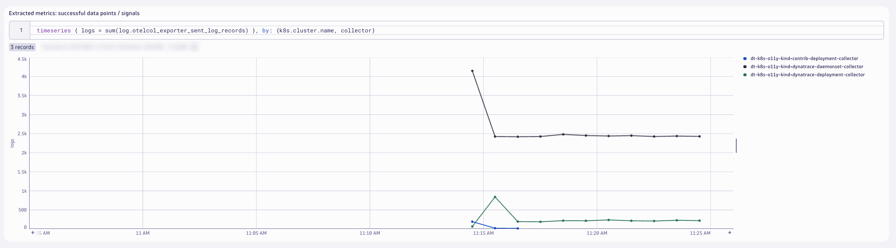
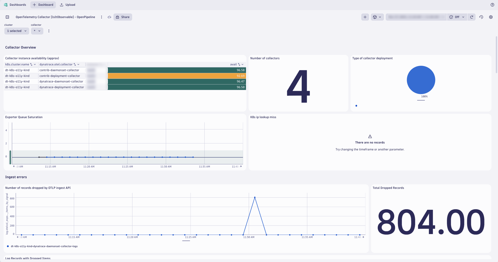

## OpenTelemetry Collector Logs - Analyze
Analyze the OpenTelemetry Collector logs after Dynatrace OpenPipeline processing.

### Analyze the results in Dynatrace (Notebook)

Query the OpenTelemetry Collector logs that have been processed by Dynatrace OpenPipeline.

DQL: OpenPipeline Processing Results
```sql
fetch logs
| filter k8s.namespace.name == "dynatrace" and k8s.container.name == "otc-container" and telemetry.sdk.name == "opentelemetry"
| fieldsRemove cloud.account.id // removed for data privacy and security reasons only
| sort timestamp desc
| limit 50
| fieldsKeep timestamp, collector, k8s.cluster.name, loglevel, status, "content.*", content
```

Result:


The logs are now parsed at ingest into a format that simplifies our queries and makes them easier to use, especially for users that don't work with these log sources or Dynatrace DQL on a regular basis.

Query the new log metric extracted by Dynatrace OpenPipeline, using the `timeseries` command.

DQL: Extracted metrics: successful data points / signals
```sql
timeseries { logs = sum(log.otelcol_exporter_sent_log_records) }, by: {k8s.cluster.name, collector}
```

Result:



By extracting the metric(s) at ingest time, the data points are stored long term and can easily be used in dashboards, anomaly detection, and automations.

[Metric Extraction](https://docs.dynatrace.com/docs/platform/openpipeline/use-cases/tutorial-log-processing-pipeline)

Query the new dropped data points / signals metric extracted by Dynatrace OpenPipeline, using the `timeseries` command.

DQL: Extracted metrics: dropped data points / signals
```sql
timeseries { dropped_items = sum(log.otelcol_exporter_dropped_items_by_signal, default: 0) }, by: {k8s.cluster.name, collector, signal}
```

Result:


You likely won't have any data matching your query as you shouldn't have data drops.  You can force data drops by toggling your Dynatrace API Access Token off for a couple minutes and then turning it back on.


### Import Dashboard into Dynatrace
[OpenTelemetry Collector Dashboard](https://github.com/dynatrace-wwse/enablement-kubernetes-opentelemetry-openpipeline/blob/main/assets/dynatrace/dashboards/opentelemetry-collector-health-openpipeline.json)

### OpenTelemetry Collector Dashboard

Explore the OpenTelemetry Collector [IsItObservable] - OpenPipeline Dashboard that you imported earlier.


