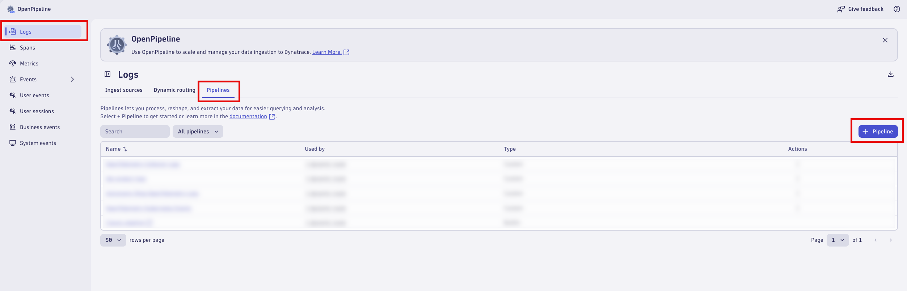
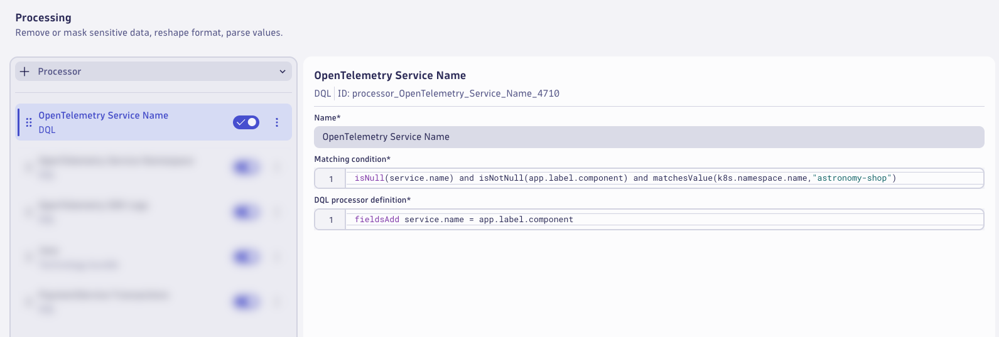
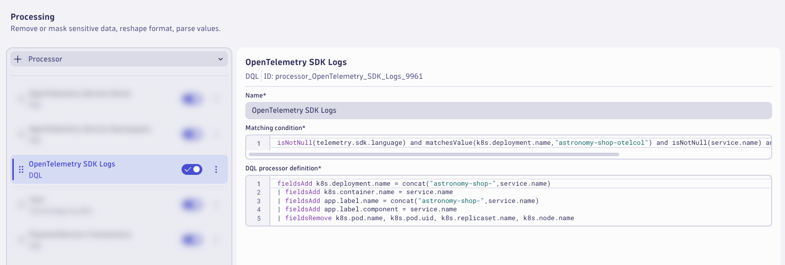
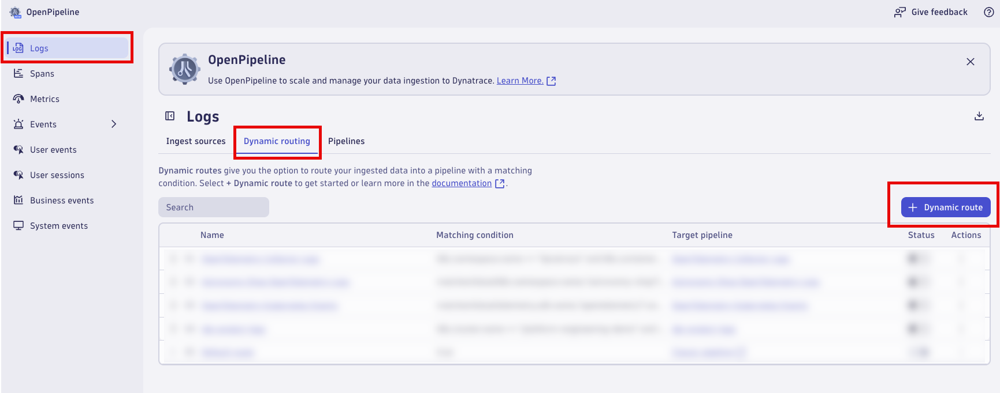
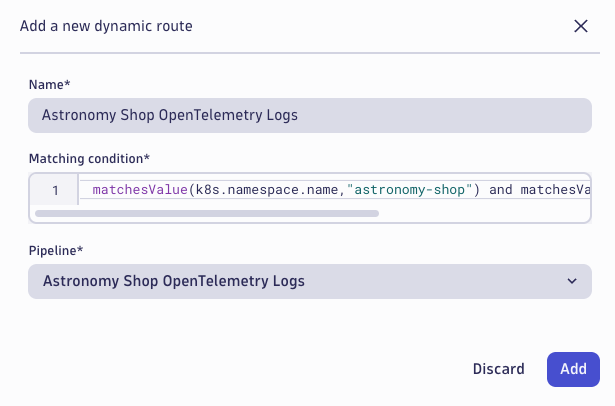

## Astronomy Shop Logs - OpenPipeline
Configure Dynatrace OpenPipeline for Astronomy Shop logs.

### Create and Configure Dynatrace OpenPipeline

> ⚠️ If the images are too small and the text is difficult to read, right-click and open the image in a new tab.

> ⚠️ Consider saving your pipeline configuration often to avoid losing any changes.

In your Dynatrace tenant, launch the OpenPipeline app.  Begin by selecting `Logs` from the left-hand menu of telemetry types.  Then choose `Pipelines`.  Click on `+ Pipeline` to add a new pipeline.



Name the new pipeline, `Astronomy Shop OpenTelemetry Logs`.  Click on the `Processing` tab to begin adding `Processor` rules.


### OpenTelemetry Service Name

Add a processor to set the OpenTelemetry Service Name.  Click on `+ Processor` to add a new processor.

Type:
```text
DQL
```

Name:
```text
OpenTelemetry Service Name
```

Matching condition:
```text
isNull(service.name) and isNotNull(app.label.component) and matchesValue(k8s.namespace.name,"astronomy-shop")
```

Processor definition:
```text
fieldsAdd service.name = app.label.component
```



### OpenTelemetry Service Namespace

Add a processor to set the OpenTelemetry Service Namespace.  Click on `+ Processor` to add a new processor.

Type:
```text
DQL
```

Name:
```text
OpenTelemetry Service Namespace
```

Matching condition:
```text
isNull(service.namespace) and isNotNull(service.name) and isNotNull(app.annotation.service.namespace) and matchesValue(k8s.namespace.name,"astronomy-shop")
```

Processor definition:
```text
fieldsAdd service.namespace = app.annotation.service.namespace
```


### OpenTelemetry SDK Logs

Add a processor to transform the OpenTelemetry SDK Logs.  Click on `+ Processor` to add a new processor.

Type:
```text
DQL
```

Name:
```text
OpenTelemetry SDK Logs
```

Matching condition:
```text
isNotNull(telemetry.sdk.language) and matchesValue(k8s.deployment.name,"astronomy-shop-otelcol") and isNotNull(service.name) and matchesValue(k8s.namespace.name,"astronomy-shop")
```

Processor definition:
```text
fieldsAdd k8s.deployment.name = concat("astronomy-shop-",service.name)
| fieldsAdd k8s.container.name = service.name
| fieldsAdd app.label.name = concat("astronomy-shop-",service.name)
| fieldsAdd app.label.component = service.name
| fieldsRemove k8s.pod.name, k8s.pod.uid, k8s.replicaset.name, k8s.node.name
```



### Java Technology Bundle

Add a processor to enrich the Java logs using the Java Technology Bundle.  Click on `+ Processor` to add a new processor.

Type:
```text
Technology Bundle > Java
```

Matching condition:
```text
(matchesValue(telemetry.sdk.language,"java", caseSensitive: false) or matchesValue(k8s.deployment.name,"astronomy-shop-adservice", caseSensitive:false)) and matchesValue(k8s.namespace.name,"astronomy-shop")
```


### PaymentService Transactions

Add a processor to parse the PaymentService Transaction logs.  Click on `+ Processor` to add a new processor.

Type:
```text
DQL
```

Name:
```text
PaymentService Transactions
```

Matching condition:
```text
matchesValue(service.name,"paymentservice") and matchesValue(k8s.container.name,"paymentservice") and isNotNull(trace_id)
```

Processor definition:
```text
parse content, "JSON:json_content"
| fieldsAdd app.payment.msg = json_content[`msg`]
| fieldsAdd app.payment.cardType = json_content[`cardType`]
| fieldsAdd app.payment.amount = json_content[`amount`][`units`][`low`]
| fieldsAdd app.payment.currencyCode = json_content[`amount`][`currencyCode`]
| fieldsAdd app.payment.transactionId = json_content[`transactionId`]
| fieldsRemove json_content
```


### PaymentService Transaction BizEvent

Switch to the `Data extraction` tab.

Add a processor to extract a `Business Event`.  Click on `+ Processor` to add a new processor.

Type:
```text
Business Event
```

Name:
```text
PaymentService Transaction
```

Matching condition:
```text
matchesValue(k8s.container.name,"paymentservice") and isNotNull(app.payment.cardType) and isNotNull(app.payment.amount) and isNotNull(app.payment.currencyCode) and isNotNull(app.payment.transactionId)
```

Event type:
```text
Static String : astronomy-shop.app.payment.complete
```

Event provider:
```text
Static String: astronomy-shop.opentelemetry
```

Field Extraction:
| Fields                   |
|--------------------------|
| app.payment.msg          |
| app.payment.cardType     |
| app.payment.amount       |
| app.payment.currencyCode |
| app.payment.transactionid|


### PaymentService Transaction Metric

Switch to the `Metric Extraction` tab.

Add a processor to set extract a metric from the PaymentService Transaction logs.  Click on `+ Processor` to add a new processor.

Type:
```text
Value metric
```

Name:
```text
PaymentService Transaction
```

Matching condition:
```text
matchesValue(k8s.container.name,"paymentservice") and isNotNull(app.payment.cardType) and isNotNull(app.payment.amount) and isNotNull(app.payment.currencyCode) and isNotNull(app.payment.transactionId)
```

Field extraction:
```text
app.payment.amount
```

Metric key:
```text
otel.astronomy-shop.app.payment.amount
```

Dimensions:
| Field                    | Dimension     |
|------------------------------------------|
| app.payment.cardType     | cardType      |
| app.payment.currencyCode |  currencyCode |


The pipeline is now configured, click on `Save` to save the pipeline configuration.


### Dynamic Route 

A pipeline will not have any effect unless logs are configured to be routed to the pipeline.  With dynamic routing, data is routed based on a matching condition. The matching condition is a DQL query that defines the data set you want to route.

Click on `Dynamic Routing` to configure a route to the target pipeline.  Click on `+ Dynamic Route` to add a new route.



Configure the `Dynamic Route` to use the `Astronomy Shop OpenTelemetry Logs` pipeline.

Name:
```text
Astronomy Shop OpenTelemetry Logs
```

Matching condition:
```text
matchesValue(k8s.namespace.name,"astronomy-shop") and matchesValue(telemetry.sdk.name,"opentelemetry")
```

Pipeline:
```text
Astronomy Shop OpenTelemetry Logs
```

Click `Add` to add the route.



Validate that the route is enabled in the `Status` column.  Click on `Save` to save the dynamic route table configuration.


Allow `astronomy-shop` to generate new log data that will be routed through the new pipeline (3-5 minutes).