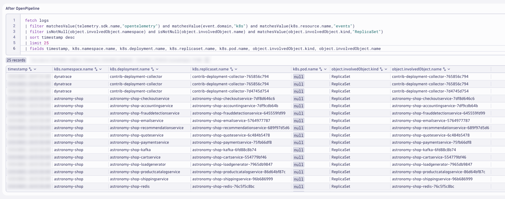
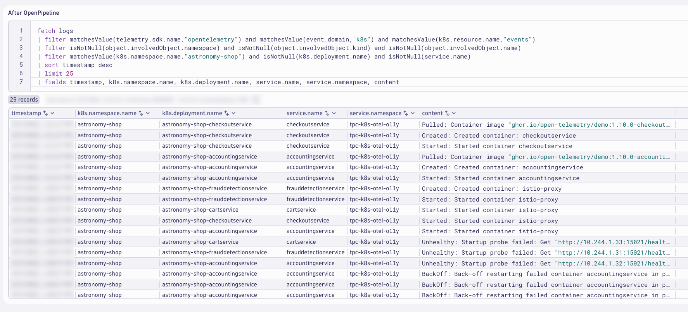

## Kubernetes Events Logs - Analyze
Analyze the Kubernetes Events logs after Dynatrace OpenPipeline processing.

### Analyze the results in Dynatrace (Notebook)

Use the Notebook from earlier to analyze the results.

### Kubernetes Attributes

Query the Kubernetes Events logs fitered on `event.domain == "k8s"` to analyze with `Kubernetes Attributes`.

DQL: After OpenPipeline
```sql
fetch logs
| filter matchesValue(telemetry.sdk.name,"opentelemetry") and matchesValue(event.domain,"k8s") and matchesValue(k8s.resource.name,"events")
| filter isNotNull(object.involvedObject.namespace) and isNotNull(object.involvedObject.kind) and isNotNull(object.involvedObject.name)
| sort timestamp desc
| limit 25
| fields timestamp, k8s.namespace.name, k8s.deployment.name, k8s.replicaset.name, k8s.pod.name, object.involvedObject.kind, object.involvedObject.name
```


### Kubernetes ReplicaSet

Query the Kubernetes Events logs fitered on `object.involvedObject.kind == "ReplicaSet"`.

DQL: After OpenPipeline
```sql
fetch logs
| filter matchesValue(telemetry.sdk.name,"opentelemetry") and matchesValue(event.domain,"k8s") and matchesValue(k8s.resource.name,"events")
| filter isNotNull(object.involvedObject.namespace) and isNotNull(object.involvedObject.name) and matchesValue(object.involvedObject.kind,"ReplicaSet")
| sort timestamp desc
| limit 25
| fields timestamp, k8s.namespace.name, k8s.deployment.name, k8s.replicaset.name, k8s.pod.name, object.involvedObject.kind, object.involvedObject.name
```



### Kubernetes Pod

Query the Kubernetes Events logs fitered on `object.involvedObject.kind == "Pod"`.

DQL: After OpenPipeline
```sql
fetch logs
| filter matchesValue(telemetry.sdk.name,"opentelemetry") and matchesValue(event.domain,"k8s") and matchesValue(k8s.resource.name,"events")
| filter isNotNull(object.involvedObject.namespace) and isNotNull(object.involvedObject.name) and matchesValue(object.involvedObject.kind,"Pod")
| sort timestamp desc
| limit 25
| fields timestamp, k8s.namespace.name, k8s.deployment.name, k8s.replicaset.name, k8s.pod.name, object.involvedObject.kind, object.involvedObject.name
```


### Content Field and Drop Fields

Query the Kubernetes Events logs to view the new `content` field.

DQL: After OpenPipeline
```sql
fetch logs
| filter matchesValue(telemetry.sdk.name,"opentelemetry") and matchesValue(event.domain,"k8s") and matchesValue(k8s.resource.name,"events")
| filter isNotNull(object.involvedObject.namespace) and isNotNull(object.involvedObject.kind) and isNotNull(object.involvedObject.name)
| sort timestamp desc
| limit 25
| fields timestamp, content, object.reason, object.message, object.metadata.managedfields, object.metadata.name, object.metadata.uid
```


### OpenTelemetry Service Name and Namespace

Query the Kubernetes Events logs filtered on `service.name` and `service.namespace`.

DQL: After OpenPipeline
```sql
fetch logs
| filter matchesValue(telemetry.sdk.name,"opentelemetry") and matchesValue(event.domain,"k8s") and matchesValue(k8s.resource.name,"events")
| filter isNotNull(object.involvedObject.namespace) and isNotNull(object.involvedObject.kind) and isNotNull(object.involvedObject.name)
| filter matchesValue(k8s.namespace.name,"astronomy-shop") and isNotNull(k8s.deployment.name) and isNotNull(service.name)
| sort timestamp desc
| limit 25
| fields timestamp, k8s.namespace.name, k8s.deployment.name, service.name, service.namespace, content
```



### Import Dashboard into Dynatrace